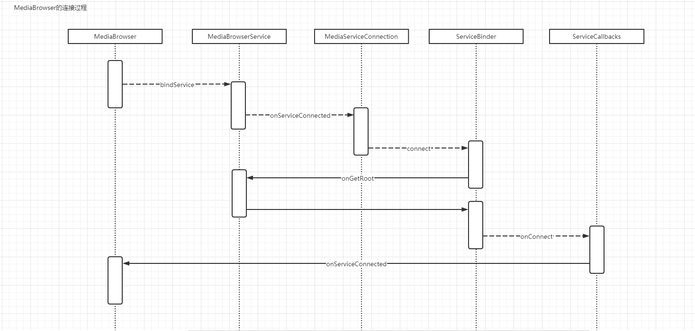
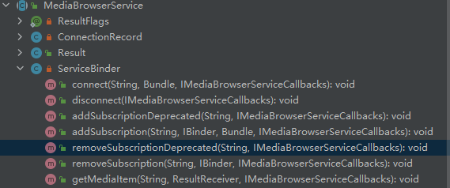
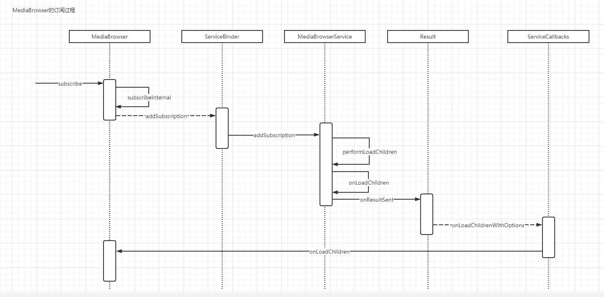
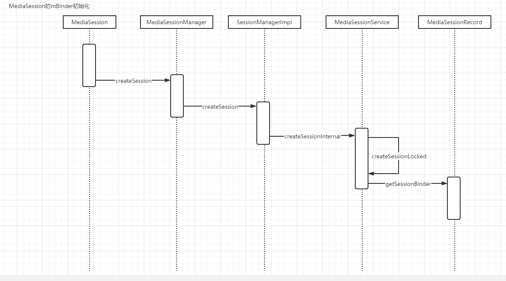
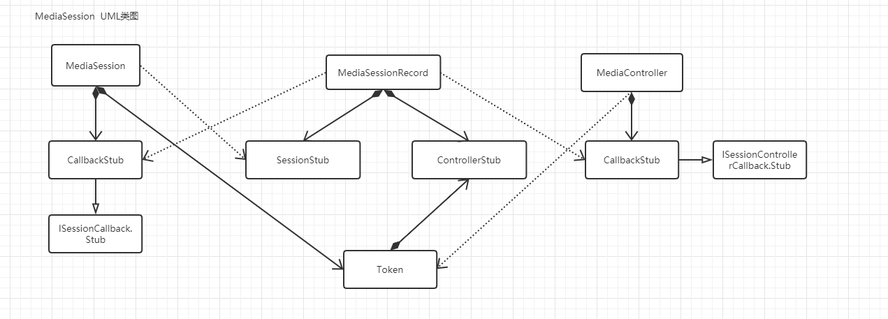

Android多媒体服务架构主要涉及到下面几个关键类

MediaBrowser:多媒体浏览客户端

MediaBrowserService:多媒体浏览服务

MediaSession:多媒体会话与播放器连接，响应播控操作

MediaController:多媒体控制器

# MeidaBrowser的工作过程

MeidaBrowser用于多媒体信息的浏览，这里详细分析其连接和订阅的过程。

## MediaBrowser与服务端进行连接




### MediaBrowser的构造

```java
 public MediaBrowser(Context context, ComponentName serviceComponent,
            ConnectionCallback callback, Bundle rootHints) {
        //... 省略代码
        mContext = context;
        mServiceComponent = serviceComponent;
        mCallback = callback;
        mRootHints = rootHints == null ? null : new Bundle(rootHints);
    }
```

构造方法有4个参数serviceComponent 是要连接的MediaBroswerService组件，callback 是连接状态回调。rootHints是我们要传递的一些其它初始化参数。

### MediaBrowser#connect  发起连接

```java
 public void connect() {
        if (mState != CONNECT_STATE_DISCONNECTING && mState != CONNECT_STATE_DISCONNECTED) {
            throw new IllegalStateException("connect() called while neither disconnecting nor "
                    + "disconnected (state=" + getStateLabel(mState) + ")");
        }

        mState = CONNECT_STATE_CONNECTING;
        mHandler.post(new Runnable() {
            @Override
            public void run() {
                //一些其它的连接检查
                //... 省略连接检查的代码
                final Intent intent = new Intent(MediaBrowserService.SERVICE_INTERFACE);
                intent.setComponent(mServiceComponent);

                mServiceConnection = new MediaServiceConnection();

                boolean bound = false;
                try {
                //通过绑定服务的方式连接Service端
                    bound = mContext.bindService(intent, mServiceConnection,
                            Context.BIND_AUTO_CREATE);
                } catch (Exception ex) {
                    Log.e(TAG, "Failed binding to service " + mServiceComponent);
                }

                if (!bound) {
                    // Tell them that it didn't work.
                    forceCloseConnection();
                    mCallback.onConnectionFailed();
                }
//...
            }
        });
    }
```

### MediaBrowserService接受绑定

当服务端接收到绑定服务的请求之后，会调用其onBind并返回一个binder对象

```java
@Override
    public IBinder onBind(Intent intent) {
        if (SERVICE_INTERFACE.equals(intent.getAction())) {
            return mBinder;
        }
        return null;
    }
```

mBinder的实现类是MediaBroswerService#ServiceBinder它有下面的一些api



### MediaBrowser绑定服务成功回调

当绑定服务成功的时候会回调MediaBrowser#MediaServiceConnection#onServiceConnected

```java
@Override
        public void onServiceConnected(final ComponentName name, final IBinder binder) {
            //postOrRun 确保当前代码运行在主线程
            postOrRun(new Runnable() {
                @Override
                public void run() {
                    //...
                    // Save their binder
                    //这个是服务端返回的ServiceBinder
                    mServiceBinder = IMediaBrowserService.Stub.asInterface(binder);

                    // We make a new mServiceCallbacks each time we connect so that we can drop
                    // responses from previous connections.
                    //mServiceCallbacks的实现类是ServiceCallbacks  继承IMediaBrowserServiceCallbacks.Stub
                    mServiceCallbacks = getNewServiceCallbacks();
                    //将当前连接状态标记为连接中
                    mState = CONNECT_STATE_CONNECTING;

                    // Call connect, which is async. When we get a response from that we will
                    // say that we're connected.
                    try {
                        if (DBG) {
                            Log.d(TAG, "ServiceCallbacks.onConnect...");
                            dump();
                        }
                        //请求连接  此处的mRootHints 是构造方法传递过来的初始化参数
                        mServiceBinder.connect(mContext.getPackageName(), mRootHints,
                                mServiceCallbacks);
                    } catch (RemoteException ex) {
                        // Connect failed, which isn't good. But the auto-reconnect on the service
                        // will take over and we will come back. We will also get the
                        // onServiceDisconnected, which has all the cleanup code. So let that do
                        // it.
                        Log.w(TAG, "RemoteException during connect for " + mServiceComponent);
                        if (DBG) {
                            Log.d(TAG, "ServiceCallbacks.onConnect...");
                            dump();
                        }
                    }
                }
            });
        }
```

### MediaBrowserService#ServiceBinder接收请求连接

```java
 @Override
        public void connect(final String pkg, final Bundle rootHints,
                final IMediaBrowserServiceCallbacks callbacks) {

            //...
            //切换到主线程
            mHandler.post(new Runnable() {
                    @Override
                    public void run() {
                        final IBinder b = callbacks.asBinder();

                        // Clear out the old subscriptions. We are getting new ones.
                        mConnections.remove(b);

                        final ConnectionRecord connection = new ConnectionRecord();
                        connection.pkg = pkg;
                        connection.pid = pid;
                        connection.uid = uid;
                        connection.rootHints = rootHints;
                        connection.callbacks = callbacks;

                        mCurConnection = connection;
                        connection.root = MediaBrowserService.this.onGetRoot(pkg, uid, rootHints);
                        mCurConnection = null;

                        // If they didn't return something, don't allow this client.
                        //当onGetRoot 返回空的时候，不允许客户端进行连接，调用onConnectFailed
                        if (connection.root == null) {
                            Log.i(TAG, "No root for client " + pkg + " from service "
                                    + getClass().getName());
                            try {
                                callbacks.onConnectFailed();
                            } catch (RemoteException ex) {
                                Log.w(TAG, "Calling onConnectFailed() failed. Ignoring. "
                                        + "pkg=" + pkg);
                            }
                        } else {
                            try {
                                mConnections.put(b, connection);
                                b.linkToDeath(connection, 0);
                                if (mSession != null) {
                                    //连接成功回调
                                    callbacks.onConnect(connection.root.getRootId(),
                                            mSession, connection.root.getExtras());
                                }
                            } catch (RemoteException ex) {
                                Log.w(TAG, "Calling onConnect() failed. Dropping client. "
                                        + "pkg=" + pkg);
                                mConnections.remove(b);
                            }
                        }
                    }
                });
        }
```

### MediaBrowser接收连接成功回调

成功的回调并不会直接到MediaBrowser，而是调用其连接时传递过来的ServiceCallbacks对象。在通过ServiceCallbacks间接调用MediaBrowser#onServiceConnected

```java
private void onServiceConnected(final IMediaBrowserServiceCallbacks callback,
            final String root, final MediaSession.Token session, final Bundle extra) {
        mHandler.post(new Runnable() {
            @Override
            public void run() {
                //保存服务端传递过来的信息
                mRootId = root;
                mMediaSessionToken = session;
                mExtras = extra;
                mState = CONNECT_STATE_CONNECTED;
                  //通知客户端连接成功
                mCallback.onConnected();
				//如果在连接成功之前调用过订阅方法，再次订阅
                for (Entry<String, Subscription> subscriptionEntry : mSubscriptions.entrySet()) {
                    String id = subscriptionEntry.getKey();
                    Subscription sub = subscriptionEntry.getValue();
                    List<SubscriptionCallback> callbackList = sub.getCallbacks();
                    List<Bundle> optionsList = sub.getOptionsList();
                    for (int i = 0; i < callbackList.size(); ++i) {
                        try {
                            mServiceBinder.addSubscription(id, callbackList.get(i).mToken,
                                    optionsList.get(i), mServiceCallbacks);
                        } catch (RemoteException ex) {
                            // Process is crashing. We will disconnect, and upon reconnect we will
                            // automatically reregister. So nothing to do here.
                            Log.d(TAG, "addSubscription failed with RemoteException parentId="
                                    + id);
                        }
                    }
                }
            }
        });
    }
```

## 连接过程小结

MediaBrowser通过绑定服务的方式获取MediaBrowserService的内部类ServiceBinder，在通过ServiceBinder发起连接，并将ServiceCallbacks传递给ServiceBinder, 当ServiceBinder判断能够正常连接的时候 通过onConnect 将对应的数据回传。

MediaBrowser#getRoot 和MediaBrowser#getExtras 返回的是MediaBrowserService#onGetRoot 返回对象BrowserRoot 中的参数

```java
 public static final class BrowserRoot {
 	private final String mRootId;
    private final Bundle mExtras;
 }
```

## MediaBrowser订阅




### MediaBrowser发起订阅

MediaBrowser有多个subscribe方法重载方法，但是其最终都会调用subscribeInternal

```java
private void subscribeInternal(String parentId, Bundle options, SubscriptionCallback callback) {
        // Check arguments.
        if (TextUtils.isEmpty(parentId)) {
            throw new IllegalArgumentException("parentId cannot be empty.");
        }
        if (callback == null) {
            throw new IllegalArgumentException("callback cannot be null");
        }
        // Update or create the subscription.
        Subscription sub = mSubscriptions.get(parentId);
        if (sub == null) {
            sub = new Subscription();
            mSubscriptions.put(parentId, sub);
        }
        sub.putCallback(mContext, options, callback);

        // If we are connected, tell the service that we are watching. If we aren't connected,
        // the service will be told when we connect.
        if (isConnected()) {
            try {
                          if (options == null) {
                    mServiceBinder.addSubscriptionDeprecated(parentId, mServiceCallbacks);
                }
                //发起订阅  需要注意的是这里没有把SubscriptionCallback 对象传递过去，而是传递了它的token和mServiceCallbacks
                mServiceBinder.addSubscription(parentId, callback.mToken, options,
                        mServiceCallbacks);
            } catch (RemoteException ex) {
                // Process is crashing. We will disconnect, and upon reconnect we will
                // automatically reregister. So nothing to do here.
                Log.d(TAG, "addSubscription failed with RemoteException parentId=" + parentId);
            }
        }
    }
```

### ServiceBinder接收订阅消息

在客户端发起订阅的时候，会调用ServiceBinder#addSubscription

```java
@Override
public void addSubscription(final String id, final IBinder token, final Bundle options,
        final IMediaBrowserServiceCallbacks callbacks) {
    mHandler.post(new Runnable() {
            @Override
            public void run() {
                final IBinder b = callbacks.asBinder();

                // Get the record for the connection
                //因为在绑定服务的时候return 的binder 对象不一样，获取的ConnectionRecord 也就不一样，这样保证能够回调到对应的客户端
                final ConnectionRecord connection = mConnections.get(b);
                if (connection == null) {
                    Log.w(TAG, "addSubscription for callback that isn't registered id="
                            + id);
                    return;
                }

                MediaBrowserService.this.addSubscription(id, connection, token, options);
            }
        });
}
```

MediaBrowserService#addSubscription

```java
private void addSubscription(String id, ConnectionRecord connection, IBinder token,
            Bundle options) {
        // Save the subscription
        List<Pair<IBinder, Bundle>> callbackList = connection.subscriptions.get(id);
        if (callbackList == null) {
            callbackList = new ArrayList<>();
        }
        for (Pair<IBinder, Bundle> callback : callbackList) {
            if (token == callback.first
                    && MediaBrowserUtils.areSameOptions(options, callback.second)) {
                return;
            }
        }
        callbackList.add(new Pair<>(token, options));
    	//将对应的订阅保存起来，方便当数据发生改变的时候进行回调
        connection.subscriptions.put(id, callbackList);
        // send the results
        performLoadChildren(id, connection, options);
    }
```

MediaBrowserService#performLoadChildren 用于通知MediaBrowserService进行数据加载

MediaBrowserService#performLoadChildren

```java
private void performLoadChildren(final String parentId, final ConnectionRecord connection,
            final Bundle options) {
        final Result<List<MediaBrowser.MediaItem>> result =
                new Result<List<MediaBrowser.MediaItem>>(parentId) {
            @Override
            void onResultSent(List<MediaBrowser.MediaItem> list, @ResultFlags int flag) {
                if (mConnections.get(connection.callbacks.asBinder()) != connection) {
                    if (DBG) {
                        Log.d(TAG, "Not sending onLoadChildren result for connection that has"
                                + " been disconnected. pkg=" + connection.pkg + " id=" + parentId);
                    }
                    return;
                }

                //applyOptions 用于支持数据分页，也就是说 MediaBrowser天生就支持数据分页查询
                List<MediaBrowser.MediaItem> filteredList =
                        (flag & RESULT_FLAG_OPTION_NOT_HANDLED) != 0
                                ? applyOptions(list, options) : list;
                final ParceledListSlice<MediaBrowser.MediaItem> pls =
                        filteredList == null ? null : new ParceledListSlice<>(filteredList);
                try {
                    //发起数据回调 callbacks 对象是MediaBrowser#ServiceCallbacks
                    connection.callbacks.onLoadChildrenWithOptions(parentId, pls, options);
                } catch (RemoteException ex) {
                    // The other side is in the process of crashing.
                    Log.w(TAG, "Calling onLoadChildren() failed for id=" + parentId
                            + " package=" + connection.pkg);
                }
            }
        };

        mCurConnection = connection;
        if (options == null) {
            onLoadChildren(parentId, result);
        } else {
            onLoadChildren(parentId, result, options);
        }
        mCurConnection = null;
		
    	//这个检测非常明显：Service端onLoadChildren 必须调用detach() 或者sendResult() 发送结果
        if (!result.isDone()) {
            throw new IllegalStateException("onLoadChildren must call detach() or sendResult()"
                    + " before returning for package=" + connection.pkg + " id=" + parentId);
        }
    }
```

performLoadChildren 方法主要用于通知客户端对应的数据改变，该方法不仅在发起订阅的时候会调用，也可以在数据发生改变的时候通过notifyChildrenChanged间接调用。因此对于客户端而言针对每一个parentId发起的订阅，在不使用的时候都应该调用unsubscribe解除订阅。

同时在发起订阅的时候如果需要进行分页查询可以通过传递：

```java
MediaBrowser.EXTRA_PAGE
MediaBrowser.EXTRA_PAGE_SIZE
```

来进行数据分页查询

### MediaBrowser接收数据回调

数据回调的对象是MediaBrowser#ServiceCallbacks，它的onLoadChildrenWithOptions实现逻辑非常简单， 在MediaBrowser存在的情况下调用它的onLoadChildren

```java
 private void onLoadChildren(final IMediaBrowserServiceCallbacks callback,
            final String parentId, final ParceledListSlice list, final Bundle options) {
        mHandler.post(new Runnable() {
            @Override
            public void run() {
                // Check that there hasn't been a disconnect or a different
                // ServiceConnection.
                if (!isCurrent(callback, "onLoadChildren")) {
                    return;
                }

                if (DBG) {
                    Log.d(TAG, "onLoadChildren for " + mServiceComponent + " id=" + parentId);
                }

                // Check that the subscription is still subscribed.
                final Subscription subscription = mSubscriptions.get(parentId);
                if (subscription != null) {
                    // Tell the app.
                    SubscriptionCallback subscriptionCallback =
                            subscription.getCallback(mContext, options);
                    if (subscriptionCallback != null) {
                        List<MediaItem> data = list == null ? null : list.getList();
                        if (options == null) {
                            if (data == null) {
                                subscriptionCallback.onError(parentId);
                            } else {
                                subscriptionCallback.onChildrenLoaded(parentId, data);
                            }
                        } else {
                            if (data == null) {
                                subscriptionCallback.onError(parentId, options);
                            } else {
                                subscriptionCallback.onChildrenLoaded(parentId, data, options);
                            }
                        }
                        return;
                    }
                }
                if (DBG) {
                    Log.d(TAG, "onLoadChildren for id that isn't subscribed id=" + parentId);
                }
            }
        });
    }
```

逻辑也非常简单：检测当前的连接，并且获取对应的SubscriptionCallback 通知app数据回调。

## 订阅过程小结

MediaBrowser 天生支持分页查询的功能，在subscribe中的bundle中可以传递查询参数，订阅的时候会以传递的parentId作为存储key 将对应的callback保存起来，在对应的数据发生改变的时候会进行相应的回调。同时subscribe和unsubscribe应该成对出现。

# MediaSession的创建

```java

//MediaSession 的几个关键类
private final MediaSession.Token mSessionToken;
    private final MediaController mController;
    private final ISession mBinder;
    private final CallbackStub mCbStub;


public MediaSession(@NonNull Context context, @NonNull String tag, int userId) {
        if (context == null) {
            throw new IllegalArgumentException("context cannot be null.");
        }
        if (TextUtils.isEmpty(tag)) {
            throw new IllegalArgumentException("tag cannot be null or empty");
        }
        mMaxBitmapSize = context.getResources().getDimensionPixelSize(
                com.android.internal.R.dimen.config_mediaMetadataBitmapMaxSize);
        mCbStub = new CallbackStub(this);
        MediaSessionManager manager = (MediaSessionManager) context
                .getSystemService(Context.MEDIA_SESSION_SERVICE);
        try {
            //通过 MediaSessionManager 来创建一个跨进程的 Session
            mBinder = manager.createSession(mCbStub, tag, userId);
            mSessionToken = new Token(mBinder.getController());
            mController = new MediaController(context, mSessionToken);
        } catch (RemoteException e) {
            throw new RuntimeException("Remote error creating session.", e);
        }
    }
```

## MediaSessionManager创建ISession 对象

```java
private final ISessionManager mService;

public @NonNull ISession createSession(@NonNull MediaSession.CallbackStub cbStub,
            @NonNull String tag, int userId) throws RemoteException {
        return mService.createSession(mContext.getPackageName(), cbStub, tag, userId);
    }
```

mService 类型是ISessionManager 他的初始化在MediaSessionManager 的构造方法中  其中cbStub在构造方法中初始化，类型是CallbackStub

```java
public MediaSessionManager(Context context) {
        // Consider rewriting like DisplayManagerGlobal
        // Decide if we need context
        mContext = context;
        IBinder b = ServiceManager.getService(Context.MEDIA_SESSION_SERVICE);
        mService = ISessionManager.Stub.asInterface(b);
    }
```

在MediaSessionService 有这样发布了MEDIA_SESSION_SERVICE 对应的服务

```
publishBinderService(Context.MEDIA_SESSION_SERVICE, mSessionManagerImpl);
```

因此MediaSessionManager的createSession最终是调用的MediaSessionService内部类SessionManagerImpl 

### SessionManagerImpl 创建ISession

```java
@Override
        public ISession createSession(String packageName, ISessionCallback cb, String tag,
                int userId) throws RemoteException {
            final int pid = Binder.getCallingPid();
            final int uid = Binder.getCallingUid();
            final long token = Binder.clearCallingIdentity();
            try {
                enforcePackageName(packageName, uid);
                int resolvedUserId = ActivityManager.handleIncomingUser(pid, uid, userId,
                        false /* allowAll */, true /* requireFull */, "createSession", packageName);
                if (cb == null) {
                    throw new IllegalArgumentException("Controller callback cannot be null");
                }
                return createSessionInternal(pid, uid, resolvedUserId, packageName, cb, tag)
                        .getSessionBinder();
            } finally {
                Binder.restoreCallingIdentity(token);
            }
        }
```

createSessionInternal会调用createSessionLocked

### MediaSessionService创建MediaSessionRecord

```java
private MediaSessionRecord createSessionLocked(int callerPid, int callerUid, int userId,
            String callerPackageName, ISessionCallback cb, String tag) {
        FullUserRecord user = getFullUserRecordLocked(userId);
        if (user == null) {
            Log.wtf(TAG, "Request from invalid user: " +  userId);
            throw new RuntimeException("Session request from invalid user.");
        }

        final MediaSessionRecord session = new MediaSessionRecord(callerPid, callerUid, userId,
                callerPackageName, cb, tag, this, mHandler.getLooper());
        try {
            cb.asBinder().linkToDeath(session, 0);
        } catch (RemoteException e) {
            throw new RuntimeException("Media Session owner died prematurely.", e);
        }

        user.mPriorityStack.addSession(session);
        mHandler.postSessionsChanged(userId);

        if (DEBUG) {
            Log.d(TAG, "Created session for " + callerPackageName + " with tag " + tag);
        }
        return session;
    }
```

可以看到最后会调用MediaSessionRecord#getSessionBinder

```java
public MediaSessionRecord(int ownerPid, int ownerUid, int userId, String ownerPackageName,
            ISessionCallback cb, String tag, MediaSessionService service, Looper handlerLooper) {
        mOwnerPid = ownerPid;
        mOwnerUid = ownerUid;
        mUserId = userId;
        mPackageName = ownerPackageName;
        mTag = tag;
        mController = new ControllerStub();
        mSession = new SessionStub();
        mSessionCb = new SessionCb(cb);
        mService = service;
        mContext = mService.getContext();
        mHandler = new MessageHandler(handlerLooper);
        mAudioManager = (AudioManager) mContext.getSystemService(Context.AUDIO_SERVICE);
        mAudioManagerInternal = LocalServices.getService(AudioManagerInternal.class);
        mAudioAttrs = new AudioAttributes.Builder().setUsage(AudioAttributes.USAGE_MEDIA).build();
    }

    /**
     * Get the binder for the {@link MediaSession}.
     *
     * @return The session binder apps talk to.
     */
    public ISession getSessionBinder() {
        return mSession;
    }
```

这样MediaSession 持有跨进程的代理对象SessionStub 同时MediaSessionRecord 持有MeidaSession一路传递过来的CallbackStub对象，这样MediaSession 和 MediaSessionRecord就可以通过binder跨进程相互调用了。

## MediaSession#Token的创建

```java
 mSessionToken = new Token(mBinder.getController());
```

mBinder的实现类为MediaSessionRecord#SessionStub 

```java
@Override
public ISessionController getController() {
    return mController;
}
```

mController 是ControllerStub的实例，也就是说token 持有了ControllerStub 的跨进程代理。

## MediaController的创建

```java
public static final class Token implements Parcelable {

    private ISessionController mBinder;

    /**
     * @hide
     */
    public Token(ISessionController binder) {
        mBinder = binder;
    }

    ISessionController getBinder() {
        return mBinder;
    }
}
```

再创建MediaController的时候，直接将Token传递了过去

```java
    public MediaController(@NonNull Context context, @NonNull MediaSession.Token token) {
        //注意这个Binder是MediaSessionRecord#ControllerStub
        this(context, token.getBinder());
    }

public MediaController(Context context, ISessionController sessionBinder) {
        if (sessionBinder == null) {
            throw new IllegalArgumentException("Session token cannot be null");
        }
        if (context == null) {
            throw new IllegalArgumentException("Context cannot be null");
        }
        mSessionBinder = sessionBinder;
        mTransportControls = new TransportControls();
        mToken = new MediaSession.Token(sessionBinder);
        mContext = context;
    }
```

这样MediaController就具备了与MediaSessionRecord的交互能力。

## MediaSession小结：

MediaSession#ISession对象初始化流程




MediaSession UML 类图关系




MediaSession包含内部类CallbackStub  其中CallbakStub继承自ISessionCallback.Stub  MediaSession 在构造的时候会将CallbackStub对象传递到MediaSessionRecord以便MediaSessionRecord跨进程回调通知MediaSession。

MediaSession构造的时候会通过MediaSessionManager初始化  ISession mBinder ,  ISession  的实例就是SessionStub  这样 MediaSession 就可以跨进程和MediaSessionRecord进行交互。

MediaSession内部类Token初始化需要依赖ISessionController 而它的实现类是ControllerStub

```java
mSessionToken = new Token(mBinder.getController());
```

这样Token会持有ControllerStub  也就是说拥有了token就可以通过Token的成员变量  ISessionController mBinder  进行播放控制。这个也正是MediaController在初始化的时候需要使用MediaSession#Token 的原因。

对于MediaController#CallbackStub实现与MediaSession 一致，通过将其注册到MediaSessionRecord 就可以监听对应的回调。
