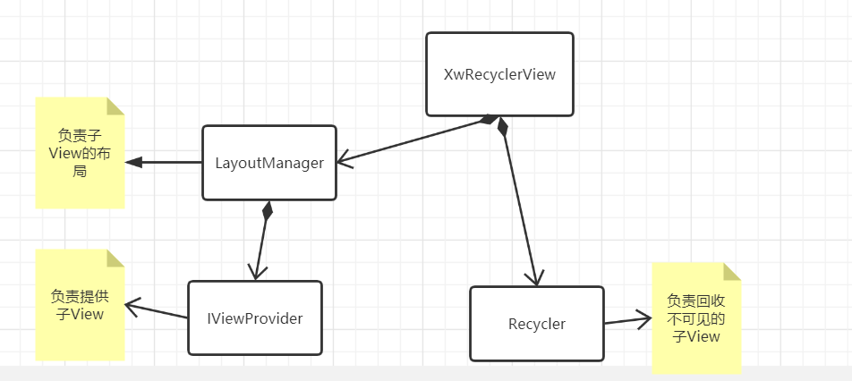

# 以终为始：拆解分析RecyclerView的设计与实现

通过这篇文章的阅读您可以了解

1. RecyclerView整体设计
2. RecyclerView的使用进阶
   1. 原生的灭霸效果
   2. 时间轴效果
   3. 鸿洋小飞机效果？

效果图：

RecyclerView是我们日常开发中非常重要的一个控件，小王所开发的项目非常多列表都是通过它来实现。小王平时关注的都是RecyclerView的使用,但是对于它的底层实现却知之甚少。为了加深对RecyclerView的理解，小王决定从RecyclerView的现有功能来反向分析RecyclerView的整体设计与实现。

# 如何自己实现一个RecyclerView?

想象这样的一个场景，如果你是一位Google工程师，需要你实现一个满足下面的特性RecyclerView提供给别的开发者使用，你会如何做呢？

1. 布局灵活多变，能够满足不同的布局特性
2. 能够显示大量的ui显示，不会因为布局过多导致崩溃

## 1.0版本

根据上面的特性，小王自定义了XwRecyclerView

我们知道，一个View的显示会经过三大流程：测量，摆放，绘制。而要提供灵活的布局我们可以通过策略模式针对不同的策略使用不同的布局方式。于是设计了LayoutManager，来负责子View的摆放

为了能够显示大量的ui我们需要对不在屏幕内的View进行回收，这样才不会因为加载的子View过多而导致oom。使用Recycler来进行View的回收

因为这个RecyclerView是提供给别的开发者使用的，小王并不知道XwRecyclerViewd的子View会摆放那些。于是通过一个IViewProvider来为XwRecyclerView提供需要摆放的子View

这样XwRecyclerView的1.0版本的整体结构如下

## 2.0版本

在上面的设计中明显存在有个问题，每次获取View都是重新创建，每次销毁的View都不在使用，等待GC来进行垃圾回收，明显是不合理的。那么该如何实现缓存呢？

很明显我们不能直接对View进行缓存，因为不知道每个位置需要显示什么样式。于是增加了一个ViewHolder作为缓存对象，既然使用ViewHolde作为缓存，那么IViewProvide所提供的View如何转换成ViewHolder呢？很常见的我们想到了适配器模式，可以通过Adapter将其转换成合适的ViewHolder。

整体设计图如下：

XwRecyclerView通过LayoutManager布局，LayoutManager通过Recycler进行View的回收和获取。而Recycler通过Adapter创建新的ViewHolder。Adapter将数据转换成对应的ViewHolder。

## 3.0版本（谷歌版）

这个版本是来分析谷歌实现的RecyclerView,谷歌实现的RecyclerView比我们考虑到了更多的东西。它还提供了ItemAnimator为子View变化的时候提供动画。ItemDecoration 为每个Item之间的分隔样式。它的整体结构大致如下。

# RecyclerView功能详解

RecyclerView内部有许多的类，他们拥有不同的职责和功能。

## ViewHolder

ViewHolder描述了项目视图以及有关其在RecyclerView中的位置的元数据，ViewHolder是Recycler进行数据回收的基本结构。

ViewHolder有几个关键的字段：

- mItemViewType  表示ViewHolder的类型
- itemView  要显示的View
- mFlags  标记当前ViewHolder状态

## Adapter

负责将dada数据转换成对应的ViewHolder,并且当数据更新的时候通知RecyclerView，使之重新布局。

## Recycler

## ItemDecoration 

## ItemAnimator

## LayoutManager