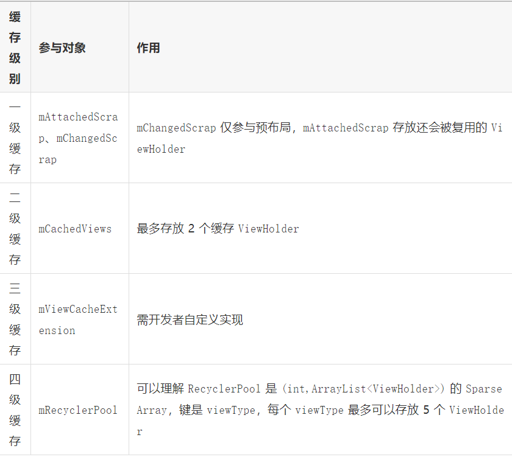

# Recycler的作用

Recycler是RecyclerView的一个内部类，通过源代码注释我们知道它 的主要职责是：负责管理报废或分离的项目视图以供重复使用。

# Recycler内部数据结构



图片来自：https://mp.weixin.qq.com/s/08LpubdLTUdYW10yAzomZg

# ViewHolder的获取过程

Recycler的ViewHolder的创建时通过tryGetViewHolderForPositionByDeadline方法。

```java
/**
 * Attempts to get the ViewHolder for the given position, either from the Recycler scrap,
 * cache, the RecycledViewPool, or creating it directly.
 * 根据这段代码注释我们可以知道这个方法的作用，尝试从缓存取出或者直接创建一个ViewHolder
 */
@Nullable
ViewHolder tryGetViewHolderForPositionByDeadline(int position,
        boolean dryRun, long deadlineNs) {
    ...
    boolean fromScrapOrHiddenOrCache = false;
    ViewHolder holder = null;
    // step1: 从mChangedScrap中读取
    if (mState.isPreLayout()) {
        holder = getChangedScrapViewForPosition(position);
        fromScrapOrHiddenOrCache = holder != null;
    }
    // 1) Find by position from scrap/hidden list/
    // step2 从mAttachedScrap、 被hideden的列表或者mCachedViews中读取
    if (holder == null) {
        holder = getScrapOrHiddenOrCachedHolderForPosition(position, dryRun);
        ...
    }
    if (holder == null) {
        ...
        // 2) Find from scrap/cache via stable ids, if exists
        //step3 从 mAttachedScrap 或者 mCachedViews中进行查找 
        if (mAdapter.hasStableIds()) {
            holder = getScrapOrCachedViewForId(mAdapter.getItemId(offsetPosition),
                    type, dryRun);
           ...
        }
        //step4 从 mViewCacheExtension 读取
        if (holder == null && mViewCacheExtension != null) {
            final View view = mViewCacheExtension
                    .getViewForPositionAndType(this, position, type);
            ...
        }
        if (holder == null) { // fallback to pool
           //step5 从mRecyclerPool中读取
            holder = getRecycledViewPool().getRecycledView(type);
            ...
        }
        if (holder == null) {
            //step5 通过adapter进行创建
            holder = mAdapter.createViewHolder(RecyclerView.this, type);
            ...
        }
    }

    ...
}
```

# ViewHolder的回收过程

当RecyclerView的Item被移除或者划出屏幕时会被回收。在RecyclerView的onTouchEvent中滚动的处理转交给了LayoutManager。最后LayoutManager会调用Recycler的recycleView来进行回收

```java
/**
 * Recycle a detached view. The specified view will be added to a pool of views
 * for later rebinding and reuse.
 *
 * <p>A view must be fully detached (removed from parent) before it may be recycled. If the
 * View is scrapped, it will be removed from scrap list.</p>
 *
 * @param view Removed view for recycling
 * @see LayoutManager#removeAndRecycleView(View, Recycler)
 */
public void recycleView(@NonNull View view) {
    ...
    recycleViewHolderInternal(holder);
    ...
}

/**
         * internal implementation checks if view is scrapped or attached and throws an exception
         * if so.
         * Public version un-scraps before calling recycle.
         */
        void recycleViewHolderInternal(ViewHolder holder) {
            ...
            if (forceRecycle || holder.isRecyclable()) {
                if (mViewCacheMax > 0
                        && !holder.hasAnyOfTheFlags(ViewHolder.FLAG_INVALID
                        | ViewHolder.FLAG_REMOVED
                        | ViewHolder.FLAG_UPDATE
                        | ViewHolder.FLAG_ADAPTER_POSITION_UNKNOWN)) {
                    // Retire oldest cached view
                    int cachedViewSize = mCachedViews.size();
                    if (cachedViewSize >= mViewCacheMax && cachedViewSize > 0) {
                        //如果mCachedViews满了，就将第一个移除，并放在mRecyclerPool里面。
                        recycleCachedViewAt(0);
                        cachedViewSize--;
                    }
                   ...
                    mCachedViews.add(targetCacheIndex, holder);
                    cached = true;
                }
                if (!cached) {
                    addViewHolderToRecycledViewPool(holder, true);
                    recycled = true;
                }
            } else {
              ...
            }
            ...
        }
```

可以看到，在滑动回收的时候先往mCachedViews添加数据，在向mRecyclerPool添加。可以看到在滑动回收的时候，只有mCachedViews和mRecyclerPool参与。那么mChangedScrap和mAttachedScrap什么时候添加数据呢？


我们知道Recycler的子View的布局发生在onLayoutChildren方法。LinearLayoutManager的onLayoutChildren.

在onLayoutChildren与Recycler的回收相关的有：detachAndScrapAttachedViews和fill

**detachAndScrapAttachedViews：**主要是将当前界面的还没有与RecyclerView分离的 ViewHolder放入mAttachedScrap或者mCachedViews中

```java
/**
 * Temporarily detach and scrap all currently attached child views. Views will be scrapped
 * into the given Recycler. The Recycler may prefer to reuse scrap views before
 * other views that were previously recycled.
 *
 * @param recycler Recycler to scrap views into
 */
public void detachAndScrapAttachedViews(@NonNull Recycler recycler) {
    final int childCount = getChildCount();
    for (int i = childCount - 1; i >= 0; i--) {
        final View v = getChildAt(i);
        scrapOrRecycleView(recycler, i, v);
    }
}

private void scrapOrRecycleView(Recycler recycler, int index, View view) {
            final ViewHolder viewHolder = getChildViewHolderInt(view);
            if (viewHolder.shouldIgnore()) {
                if (DEBUG) {
                    Log.d(TAG, "ignoring view " + viewHolder);
                }
                return;
            }
            if (viewHolder.isInvalid() && !viewHolder.isRemoved()
                    && !mRecyclerView.mAdapter.hasStableIds()) {
                removeViewAt(index);
                recycler.recycleViewHolderInternal(viewHolder);
            } else {
                detachViewAt(index);
                recycler.scrapView(view);
                mRecyclerView.mViewInfoStore.onViewDetached(viewHolder);
            }
        }

void scrapView(View view) {
            final ViewHolder holder = getChildViewHolderInt(view);
            if (holder.hasAnyOfTheFlags(ViewHolder.FLAG_REMOVED | ViewHolder.FLAG_INVALID)
                    || !holder.isUpdated() || canReuseUpdatedViewHolder(holder)) {
                if (holder.isInvalid() && !holder.isRemoved() && !mAdapter.hasStableIds()) {
                    throw new IllegalArgumentException("Called scrap view with an invalid view."
                            + " Invalid views cannot be reused from scrap, they should rebound from"
                            + " recycler pool." + exceptionLabel());
                }
                holder.setScrapContainer(this, false);
                mAttachedScrap.add(holder);
            } else {
                if (mChangedScrap == null) {
                    mChangedScrap = new ArrayList<ViewHolder>();
                }
                holder.setScrapContainer(this, true);
                mChangedScrap.add(holder);
            }
        }
```

小结：

- 每次进行重新布局scrap缓存的是屏幕中的View