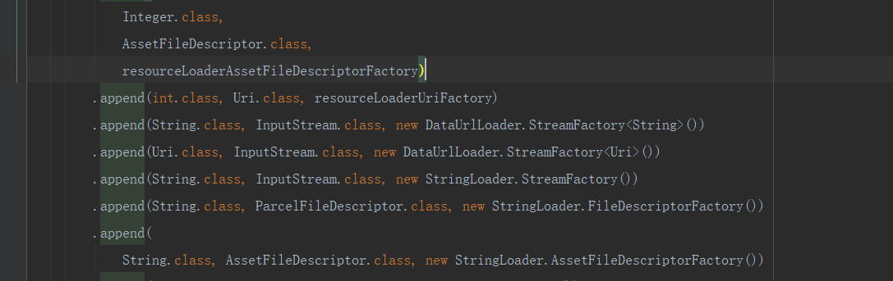

# 常见的使用Okhttp替换HttpUrlConnection

我们知道Glide底层网络加载是用HttpUrlConnect实现的。如果我们要用okhttp替换原来的网络加载方式，只需要实现下面的代码。并在Manifest中进行注册说明即可。那么它的底层实现原理是怎么样的呢？

```java
public class HttpGlideModule extends OkHttpGlideModule {
    @Override
    public void registerComponents(@NonNull Context context, @NonNull Glide glide, @NonNull Registry registry) {
        AndroidLogWrapperUtil.d("HttpGlideModule","registerComponents");
        registry.replace(GlideUrl.class, InputStream.class, new OkHttpUrlLoader.Factory(OkHttpUtils.getOkHttpClient()));
    }
}
```

# Glide的初始化过程

我们使用Glide的过程中。很少会去注意Glide是如何进行初始化的。其实上面使用Okhttp替换HttpUrlConnect的原理就藏在Glide 的初始化过程中。

在每次调用Glide#with的时候会先调用Glide#get进行初始化，

```java
 public static Glide get(@NonNull Context context) {
    if (glide == null) {
      synchronized (Glide.class) {
        if (glide == null) {
          checkAndInitializeGlide(context);
        }
      }
    }

    return glide;
  }
```

这里使用单例来创建Glide.并初始化。初始化的流程最后会调用到Glide#initializeGlide方法。

```java
  private static void initializeGlide(@NonNull Context context, @NonNull GlideBuilder builder) {
    Context applicationContext = context.getApplicationContext();
    GeneratedAppGlideModule annotationGeneratedModule = getAnnotationGeneratedGlideModules();
    List<com.bumptech.glide.module.GlideModule> manifestModules = Collections.emptyList();
    if (annotationGeneratedModule == null || annotationGeneratedModule.isManifestParsingEnabled()) {
      manifestModules = new ManifestParser(applicationContext).parse();
    }

    if (annotationGeneratedModule != null
        && !annotationGeneratedModule.getExcludedModuleClasses().isEmpty()) {
      Set<Class<?>> excludedModuleClasses =
          annotationGeneratedModule.getExcludedModuleClasses();
      Iterator<com.bumptech.glide.module.GlideModule> iterator = manifestModules.iterator();
      while (iterator.hasNext()) {
        com.bumptech.glide.module.GlideModule current = iterator.next();
        if (!excludedModuleClasses.contains(current.getClass())) {
          continue;
        }
        if (Log.isLoggable(TAG, Log.DEBUG)) {
          Log.d(TAG, "AppGlideModule excludes manifest GlideModule: " + current);
        }
        iterator.remove();
      }
    }

    if (Log.isLoggable(TAG, Log.DEBUG)) {
      for (com.bumptech.glide.module.GlideModule glideModule : manifestModules) {
        Log.d(TAG, "Discovered GlideModule from manifest: " + glideModule.getClass());
      }
    }

    RequestManagerRetriever.RequestManagerFactory factory =
        annotationGeneratedModule != null
            ? annotationGeneratedModule.getRequestManagerFactory() : null;
    builder.setRequestManagerFactory(factory);
    for (com.bumptech.glide.module.GlideModule module : manifestModules) {//获取Manifest中声明的属性，
      module.applyOptions(applicationContext, builder);
    }
    if (annotationGeneratedModule != null) {
      annotationGeneratedModule.applyOptions(applicationContext, builder);
    }
     //创建Glide对象
    Glide glide = builder.build(applicationContext);
    for (com.bumptech.glide.module.GlideModule module : manifestModules) {//注册Manifest中声明的组件
      module.registerComponents(applicationContext, glide, glide.registry);
    }
    if (annotationGeneratedModule != null) {
      annotationGeneratedModule.registerComponents(applicationContext, glide, glide.registry);
    }
    applicationContext.registerComponentCallbacks(glide);
    Glide.glide = glide;
  }

```

在构建Glide对象的时候框架将已经写好的modelLoader组件注册进Glide对象，后续需要更改或者添加可以通过

Registry提供了三种类型的方法，在最前面添加prepend，在最后面添加append，替换replace。来进行相应的处理。

使用Okhttp替换原来的HttpUrlConnection这个逻辑还是比较简单，继承OkHttpGlideModule重写registerComponents方法。然后调用replace替换掉原来的组件。

# ModelLoader的组合流转

前面我们知道如何替换Glide原来的组件，但是一个string是 如何传递到GlideUrl的呢？通过源码我们来一探究竟。在上一篇学习笔记中我们知道。网络数据的加载发生在SourceGenerator的startNext。

```java
@Override
  public boolean startNext() {
    ///...
    boolean started = false;
    while (!started && hasNextModelLoader()) {
      loadData = helper.getLoadData().get(loadDataListIndex++);
      if (loadData != null
          && (helper.getDiskCacheStrategy().isDataCacheable(loadData.fetcher.getDataSource())
          || helper.hasLoadPath(loadData.fetcher.getDataClass()))) {
        started = true;
        loadData.fetcher.loadData(helper.getPriority(), this);
      }
    }
    return started;
  }
```

代码执行的关键是helper.getLoadData()返回一些列适合处理当前Model的LoadData。

DecodeHelper#getLoadData

```java
  List<LoadData<?>> getLoadData() {
    if (!isLoadDataSet) {
      isLoadDataSet = true;
      loadData.clear();
      List<ModelLoader<Object, ?>> modelLoaders = glideContext.getRegistry().getModelLoaders(model);
      //noinspection ForLoopReplaceableByForEach to improve perf
      for (int i = 0, size = modelLoaders.size(); i < size; i++) {
        ModelLoader<Object, ?> modelLoader = modelLoaders.get(i);
        LoadData<?> current =
            modelLoader.buildLoadData(model, width, height, options);
        if (current != null) {
          loadData.add(current);
        }
      }
    }
    return loadData;
  }
```

需要注意的是这里的model是我们在加载图片时通过load方法传递进来的。传递进来是什么类型这里就是什么。这里以String为例进行说明。

在Glide类初始化的时候注册了4个ModelLoader为String的对象，

