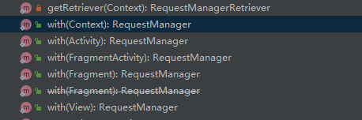
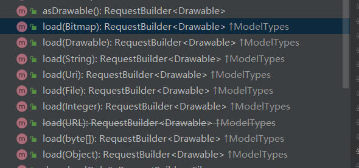
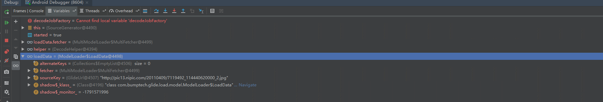
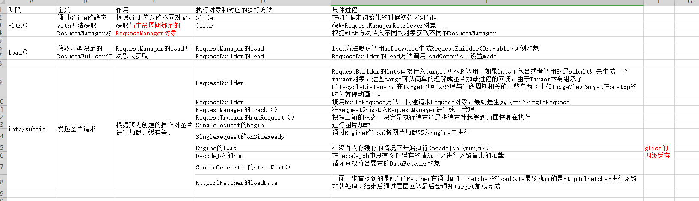

再开始写文章之前非常感谢这篇博客的作者。是他的这篇文章给了我glide源码阅读的一些灵感。在这之前几次阅读都没有搞明白的glide加载流程在阅读了他的这篇文章后参考类似的方法对glide的源码结构有了一个比较清晰的认识。下面是他的这篇文章的地址：

https://blog.csdn.net/carson_ho/article/details/79212841


# 前言

glide是我们项目开发中非常常见的一个三方框架，它的功能极其强大它为我们出来好了图片的加载缓存等功能。使用起来非常方便。那么我们应该如何来进行使用呢？它的实现原来又是什么呢？

Glide地址： https://github.com/bumptech/glide

Glide官方使用文档： https://muyangmin.github.io/glide-docs-cn/doc/options.html

文章glide的使用版本：4.9.0


本篇文章主要对glide的加载流程进行分析。


# 基本使用

1. 简单的加载

   ```kotlin
   //context可以使activity,application,fragment
   //imageUrl为图片地址
//image 需要显示的图片
   Glide.with(context).load(imageUrl).into(image);
   ```
   
2. 设置占位图以及加载出错的图片

   ```kotlin
   Glide.with(context)
   .load(imageUrl)
   .placeholder(R.drawable.coordinator_demo)
   .error(R.drawable.coordinator_demo)
   .into(image);
   ```

   上面是我们为单个图片的加载设置配置，但是常见的的情况下我们许多图片的加载除了加载地址和需要显示的ImageView不同其他的都是相同的。难道我们要为每一个图片的加载都进行设置吗？答案是否定的，glide为我们提供了一个对象：RequestOptions方便我们共享不同模块的图片加载项。

   ```kotlin
   val requestOptions = RequestOptions()
               requestOptions
                       .placeholder(R.drawable.coordinator_demo)
                       .error(R.drawable.coordinator_demo)
    Glide.with(context).load(imageUrl).apply(requestOptions).into(image);
   ```

   RequestOptions对象的创建非常简单，可以直接new一个对象或者通过它的任意一个静态方法的调用返回RequestOptions对象。

# Glide源码分析

通过给glide的使用我们发现Glide的图片加载主要使用了三个方法：

- with()
- load()
- into()

## with方法



可以看到抛开废弃的方法Glide有5个重载的with.它们的返回对象都是RequestManager对象的实例。

通过阅读源码我们发现最终返回的RequestManager对象是由RequestManagerRetriever的get方法返回的。get()有5个重载方法分别对应Glide的5个重载。我们来一个一个进行分析。

1. 传递的Context是Application的context.最终调用的是getApplicationManager方法。其实现如下：

   ```
   @NonNull
     private RequestManager getApplicationManager(@NonNull Context context) {
       // Either an application context or we're on a background thread.
       if (applicationManager == null) {
         synchronized (this) {
           if (applicationManager == null) {
             // Normally pause/resume is taken care of by the fragment we add to the fragment or
             // activity. However, in this case since the manager attached to the application will not
             // receive lifecycle events, we must force the manager to start resumed using
             // ApplicationLifecycle.
   
             // TODO(b/27524013): Factor out this Glide.get() call.
             Glide glide = Glide.get(context.getApplicationContext());
             applicationManager =
                 factory.build(
                     glide,
                     new ApplicationLifecycle(),
                     new EmptyRequestManagerTreeNode(),
                     context.getApplicationContext());
           }
         }
       }
   
       return applicationManager;
     }
   ```

   这里通过双重锁的单例来保证针对Application的Context只有一个RequestManager.

2. 传入对象是FragmentActivity

   ```java
    @NonNull
     public RequestManager get(@NonNull FragmentActivity activity) {
       if (Util.isOnBackgroundThread()) {
         return get(activity.getApplicationContext());
       } else {
         assertNotDestroyed(activity);
         FragmentManager fm = activity.getSupportFragmentManager();
         return supportFragmentGet(
             activity, fm, /*parentHint=*/ null, isActivityVisible(activity));
       }
     }
   ```

   可以看到上面的代码最终会调用到supportFragmentGet方法，这里才是真正返回RequestManager的位置。

   ```java
   @NonNull
     private RequestManager supportFragmentGet(
         @NonNull Context context,
         @NonNull FragmentManager fm,
         @Nullable Fragment parentHint,
         boolean isParentVisible) {
       SupportRequestManagerFragment current =
           getSupportRequestManagerFragment(fm, parentHint, isParentVisible);
       RequestManager requestManager = current.getRequestManager();
       if (requestManager == null) {
         // TODO(b/27524013): Factor out this Glide.get() call.
         Glide glide = Glide.get(context);
         requestManager =
             factory.build(
                 glide, current.getGlideLifecycle(), current.getRequestManagerTreeNode(), context);
         current.setRequestManager(requestManager);
       }
       return requestManager;
     }
   ```

   因为这篇文章知识粗略的了解Glide的加载我们先不去深入分析这个RequestManager是如何生成的。

3. 传入对象是Fragment

   ```java
   @NonNull
     public RequestManager get(@NonNull Fragment fragment) {
       Preconditions.checkNotNull(fragment.getActivity(),
             "You cannot start a load on a fragment before it is attached or after it is destroyed");
       if (Util.isOnBackgroundThread()) {
         return get(fragment.getActivity().getApplicationContext());
       } else {
         FragmentManager fm = fragment.getChildFragmentManager();
         return supportFragmentGet(fragment.getActivity(), fm, fragment, fragment.isVisible());
       }
     }
   ```

   同样的这里也是调用的supportFragmentGet来获取RequestManager对象。

   这里我们不需要太过关注细节只需要知道Glide会根据传入的不同的activity或者Fragment来创建对应的requestManager。并与其生命周期进行绑定

## load

Glide的with方法返回的是RequestManager接着我们看看RequestManager的load方法。



每一个load都会默认调用asDrawable方法。我们来看看它的实现：

```java
 public RequestBuilder<Drawable> asDrawable() {
    return as(Drawable.class);
  }
  
   public <ResourceType> RequestBuilder<ResourceType> as(
      @NonNull Class<ResourceType> resourceClass) {
    return new RequestBuilder<>(glide, this, resourceClass, context);
  }
```

可以看到最后返回了泛型类为Drawable的RequestBuilder。在获取到RequestBuilder对象后调用了它的load方法。

```java
public RequestBuilder<TranscodeType> load(@Nullable String string) {
    return loadGeneric(string);
  }
```

```java
private RequestBuilder<TranscodeType> loadGeneric(@Nullable Object model) {
    this.model = model;
    isModelSet = true;
    return this;
  }
```

可以看到最终requestManager返回了一个RequestBuilder<Drawable>实例对象。除了主动调用requestManager的as方法调用load默认生成的都是RequestBuilder<Drawable>实例对象。

RequestManager和RequestBuilder都实现了ModelTypes<T>接口，RequestManager的作用是生成限定泛型的RequestBuilder对象。RequestBuilder的作用是配置请求图片需要的参数。

## into

RequestBuilder的into有多个重载方法，但是他们最终都调用了如下的方法：该方法接收四个参数 

Target ：目标对象；

RequestListener：图片加载监听

BaseRequestOptions：加载图片的配置项

Executor：执行加载图片的线程池

这里我们做流程分析，就不对每个参数的来源做详细的解释了。

```java
private <Y extends Target<TranscodeType>> Y into(
      @NonNull Y target,
      @Nullable RequestListener<TranscodeType> targetListener,
      BaseRequestOptions<?> options,
      Executor callbackExecutor) {
    Preconditions.checkNotNull(target);
    if (!isModelSet) {
      throw new IllegalArgumentException("You must call #load() before calling #into()");
    }
//构建Request对象
    Request request = buildRequest(target, targetListener, options, callbackExecutor);

    Request previous = target.getRequest();
    if (request.isEquivalentTo(previous)
        && !isSkipMemoryCacheWithCompletePreviousRequest(options, previous)) {
      request.recycle();
      // If the request is completed, beginning again will ensure the result is re-delivered,
      // triggering RequestListeners and Targets. If the request is failed, beginning again will
      // restart the request, giving it another chance to complete. If the request is already
      // running, we can let it continue running without interruption.
      if (!Preconditions.checkNotNull(previous).isRunning()) {
        // Use the previous request rather than the new one to allow for optimizations like skipping
        // setting placeholders, tracking and un-tracking Targets, and obtaining View dimensions
        // that are done in the individual Request.
        previous.begin();
      }
      return target;
    }

    requestManager.clear(target);
    target.setRequest(request);
    //发起图片加载请求
    requestManager.track(target, request);

    return target;
  }
 
```

上面的代码主要做了两件事：构建Request对象；发起图片加载请求。

在忽略缩略图的情况下最终会使用obtainRequest方法构建Request对象

```java
 private Request obtainRequest(
      Target<TranscodeType> target,
      RequestListener<TranscodeType> targetListener,
      BaseRequestOptions<?> requestOptions,
      RequestCoordinator requestCoordinator,
      TransitionOptions<?, ? super TranscodeType> transitionOptions,
      Priority priority,
      int overrideWidth,
      int overrideHeight,
      Executor callbackExecutor) {
    return SingleRequest.obtain(
        context,
        glideContext,
        model,
        transcodeClass,
        requestOptions,
        overrideWidth,
        overrideHeight,
        priority,
        target,
        targetListener,
        requestListeners,
        requestCoordinator,
        glideContext.getEngine(),
        transitionOptions.getTransitionFactory(),
        callbackExecutor);
  }
```

也就是说最终的request是SingleRequest的实例,需要注意的是SingleRequest<R>是一个带泛型的类。这里的R同RequestBuilder的泛型是相同的。即RequestBuilder<Drawable> 对应SingleRequest<Drawable>。

网络请求的发起：requsetManager的track方法：

```java
 synchronized void track(@NonNull Target<?> target, @NonNull Request request) {
    targetTracker.track(target);
    requestTracker.runRequest(request);
  }
```

从Glide中我们知道每个requestManager都有与其绑定生命周期的activity或者fragment: 然后RequestManager又将对应请求的生命周期交给RequestTracker来进行处理。

我来来看看RequestTracker的runRequest方法：

```java
/**
   * Starts tracking the given request.
   */
  public void runRequest(@NonNull Request request) {
    requests.add(request);
    if (!isPaused) {
      request.begin();
    } else {
      request.clear();
      if (Log.isLoggable(TAG, Log.VERBOSE)) {
        Log.v(TAG, "Paused, delaying request");
      }
      pendingRequests.add(request);
    }
  }
```

可以看到在这里如果当前状态是暂停的那么将request加入到一个待执行的列表中，等待下次可以执行的时候进行加载，处于非暂停状态调用request的begin()直接进行加载。

由前面的知识我们知道这个request是一个SingleRequest对象。我们来看看它的begin方法：

```java
@Override
  public synchronized void begin() {
    assertNotCallingCallbacks();
    stateVerifier.throwIfRecycled();
    startTime = LogTime.getLogTime();
    if (model == null) {
      if (Util.isValidDimensions(overrideWidth, overrideHeight)) {
        width = overrideWidth;
        height = overrideHeight;
      }
      int logLevel = getFallbackDrawable() == null ? Log.WARN : Log.DEBUG;
      onLoadFailed(new GlideException("Received null model"), logLevel);
      return;
    }

    if (status == Status.RUNNING) {
      throw new IllegalArgumentException("Cannot restart a running request");
    }
    if (status == Status.COMPLETE) {
      onResourceReady(resource, DataSource.MEMORY_CACHE);
      return;
    }
    status = Status.WAITING_FOR_SIZE;
    if (Util.isValidDimensions(overrideWidth, overrideHeight)) {
      onSizeReady(overrideWidth, overrideHeight);
    } else {
      target.getSize(this);
    }

    if ((status == Status.RUNNING || status == Status.WAITING_FOR_SIZE)
        && canNotifyStatusChanged()) {
      target.onLoadStarted(getPlaceholderDrawable());
    }
    if (IS_VERBOSE_LOGGABLE) {
      logV("finished run method in " + LogTime.getElapsedMillis(startTime));
    }
  }
```

这个方法有点长，但是逻辑分厂简单。需要注意的有下面几点：

1. 如果model为空那么直接回调加载失败，这里的model是我们在调用RequestManager的 load方法时传递的对象。
2. 如果当前的宽高可用那么直接调用onSizeReady进行加载，否则通过targetgetSize(SizeReadyCallback cb)注册监听，等到target的宽高可用的时候在回调onSizeReady。进行加载。
3. 如果当前状态是运行或者等待size准备则会调用target.onLoadStarted（），这里我们会设置占位图进行显示。

我们来看看onSizeReady的加载的实现：其核心就只有一句：调用engine的load方法进行加载。

我们来看看engine的load实现：

```java
public synchronized <R> LoadStatus load(
      GlideContext glideContext,
      Object model,
      Key signature,
      int width,
      int height,
      Class<?> resourceClass,
      Class<R> transcodeClass,
      Priority priority,
      DiskCacheStrategy diskCacheStrategy,
      Map<Class<?>, Transformation<?>> transformations,
      boolean isTransformationRequired,
      boolean isScaleOnlyOrNoTransform,
      Options options,
      boolean isMemoryCacheable,
      boolean useUnlimitedSourceExecutorPool,
      boolean useAnimationPool,
      boolean onlyRetrieveFromCache,
      ResourceCallback cb,
      Executor callbackExecutor) {
    long startTime = VERBOSE_IS_LOGGABLE ? LogTime.getLogTime() : 0;

    EngineKey key = keyFactory.buildKey(model, signature, width, height, transformations,
        resourceClass, transcodeClass, options);
//从活动资源中进行加载
    EngineResource<?> active = loadFromActiveResources(key, isMemoryCacheable);
    if (active != null) {
      cb.onResourceReady(active, DataSource.MEMORY_CACHE);
      if (VERBOSE_IS_LOGGABLE) {
        logWithTimeAndKey("Loaded resource from active resources", startTime, key);
      }
      return null;
    }
//从缓存中进行加载
    EngineResource<?> cached = loadFromCache(key, isMemoryCacheable);
    if (cached != null) {
      cb.onResourceReady(cached, DataSource.MEMORY_CACHE);
      if (VERBOSE_IS_LOGGABLE) {
        logWithTimeAndKey("Loaded resource from cache", startTime, key);
      }
      return null;
    }

    EngineJob<?> current = jobs.get(key, onlyRetrieveFromCache);
    //如果存在异步加载的key说明已经有同样的加载正在进行中
    if (current != null) {
      current.addCallback(cb, callbackExecutor);
      if (VERBOSE_IS_LOGGABLE) {
        logWithTimeAndKey("Added to existing load", startTime, key);
      }
      return new LoadStatus(cb, current);
    }
//开启线程进行异步加载
    EngineJob<R> engineJob =
        engineJobFactory.build(
            key,
            isMemoryCacheable,
            useUnlimitedSourceExecutorPool,
            useAnimationPool,
            onlyRetrieveFromCache);

    //注意下这个R它是根据transcodeClass来进行决定的，这个值是SingleRequest<R>的R进行限定，从前面我们
    //知道SingleRequest<R>同RequestBuilder<TranscodeType>的TranscodeType相同。
    //即它也是一个Drawable对象
    DecodeJob<R> decodeJob =
        decodeJobFactory.build(
            glideContext,
            model,
            key,
            signature,
            width,
            height,
            resourceClass,
            transcodeClass,
            priority,
            diskCacheStrategy,
            transformations,
            isTransformationRequired,
            isScaleOnlyOrNoTransform,
            onlyRetrieveFromCache,
            options,
            engineJob);

    jobs.put(key, engineJob);

    engineJob.addCallback(cb, callbackExecutor);
    engineJob.start(decodeJob);

    if (VERBOSE_IS_LOGGABLE) {
      logWithTimeAndKey("Started new load", startTime, key);
    }
    return new LoadStatus(cb, engineJob);
  }
```

从上面的流程可以看出Glide的图片加载有三个来源：

1. 活动资源
2. 内存缓存
3. 文件中进行加载

由上面的代码我们可以看出，最后engineJob.start(decodeJob)实现图片加载，decodeJob是一个runnable对象我们直接去看看它的run方法。它的核心代码就只有一句：调用runWrapped（）。我们来看看runWrapped的及其相关的实现

```java
 private void runWrapped() {
     //根据runReason获取状态
    switch (runReason) {
      case INITIALIZE:
        stage = getNextStage(Stage.INITIALIZE);
        currentGenerator = getNextGenerator();
        runGenerators();
        break;
      case SWITCH_TO_SOURCE_SERVICE:
        runGenerators();
        break;
      case DECODE_DATA:
        decodeFromRetrievedData();
        break;
      default:
        throw new IllegalStateException("Unrecognized run reason: " + runReason);
    }
  }


private Stage getNextStage(Stage current) {
    switch (current) {
      case INITIALIZE:
        return diskCacheStrategy.decodeCachedResource()
            ? Stage.RESOURCE_CACHE : getNextStage(Stage.RESOURCE_CACHE);
      case RESOURCE_CACHE:
        return diskCacheStrategy.decodeCachedData()
            ? Stage.DATA_CACHE : getNextStage(Stage.DATA_CACHE);
      case DATA_CACHE:
        // Skip loading from source if the user opted to only retrieve the resource from cache.
        return onlyRetrieveFromCache ? Stage.FINISHED : Stage.SOURCE;
      case SOURCE:
      case FINISHED:
        return Stage.FINISHED;
      default:
        throw new IllegalArgumentException("Unrecognized stage: " + current);
    }
  }

private DataFetcherGenerator getNextGenerator() {
    switch (stage) {
      case RESOURCE_CACHE:
        return new ResourceCacheGenerator(decodeHelper, this);
      case DATA_CACHE:
        return new DataCacheGenerator(decodeHelper, this);
      case SOURCE:
        return new SourceGenerator(decodeHelper, this);
      case FINISHED:
        return null;
      default:
        throw new IllegalStateException("Unrecognized stage: " + stage);
    }
  }

private void runGenerators() {
    currentThread = Thread.currentThread();
    startFetchTime = LogTime.getLogTime();
    boolean isStarted = false;
    while (!isCancelled && currentGenerator != null
        && !(isStarted = currentGenerator.startNext())) {
      stage = getNextStage(stage);
      currentGenerator = getNextGenerator();

      if (stage == Stage.SOURCE) {
        reschedule();
        return;
      }
    }
    // We've run out of stages and generators, give up.
    if ((stage == Stage.FINISHED || isCancelled) && !isStarted) {
      notifyFailed();
    }

    // Otherwise a generator started a new load and we expect to be called back in
    // onDataFetcherReady.
  }
```

上面的代码逻辑比较复杂，这里不做详细的说明，但是它的大概意思就是，在runGenerators方法中通过调用DataFetcherGenerator的startNext（）方法先从文件中读取图片资源(分别是资源类型和数据来源)，如果不存在我们在从网络进行加载。再根据官方文档的介绍glide的缓存分为4级

1. 活动资源 (Active Resources) - 现在是否有另一个 View 正在展示这张图片？
2. 内存缓存 (Memory cache) - 该图片是否最近被加载过并仍存在于内存中？
3. 资源类型（Resource） - 该图片是否之前曾被解码、转换并写入过磁盘缓存？对应ResourceCacheGenerator
4. 数据来源 (Data) - 构建这个图片的资源是否之前曾被写入过文件缓存？对应DataCacheGenerator

由前面的流程分析我们知道1、2级缓存在Engine类的load中调用，3、4级缓存在DecodeJob中进行调用。这里我们不对缓存的调用进行分析。直接进入网络在在的分析。

在runGenerators()方法中当stage == Stage.SOURCE会退出循环并且调用reschedule()执行DecodeJob的run方法

```java
@Override
  public void reschedule() {
    runReason = RunReason.SWITCH_TO_SOURCE_SERVICE;
    callback.reschedule(this);
  }
```

由前面的知识我们知道这个时候会在runGenerators方法中执行SourceGenerator的startNext()方法。其实现如下

```java
public boolean startNext() {
    if (dataToCache != null) {
      Object data = dataToCache;
      dataToCache = null;
      cacheData(data);
    }

    if (sourceCacheGenerator != null && sourceCacheGenerator.startNext()) {
      return true;
    }
    sourceCacheGenerator = null;

    loadData = null;
    boolean started = false;
    while (!started && hasNextModelLoader()) {
      loadData = helper.getLoadData().get(loadDataListIndex++);
      if (loadData != null
          && (helper.getDiskCacheStrategy().isDataCacheable(loadData.fetcher.getDataSource())
          || helper.hasLoadPath(loadData.fetcher.getDataClass()))) {
        started = true;
        loadData.fetcher.loadData(helper.getPriority(), this);
      }
    }
    return started;
  }
```

通过debug我们发现loadData的fetcher对象在model是图片网络地址时是MultiModelLoader的内部类。



在传入图片网络地址的情况下最终调用的HttpUrlFetcher进行图片加载。当数据准备完成后回调到SourceGenerator的onDataReady方法，如果不需要进行缓存则直接通知数据准备完成，否则先进行缓存在通知数据准备完成。

```java
@Override
  public void onDataReady(Object data) {
    DiskCacheStrategy diskCacheStrategy = helper.getDiskCacheStrategy();
    if (data != null && diskCacheStrategy.isDataCacheable(loadData.fetcher.getDataSource())) {
      dataToCache = data;
      // We might be being called back on someone else's thread. Before doing anything, we should
      // reschedule to get back onto Glide's thread.
      cb.reschedule();
    } else {
      cb.onDataFetcherReady(loadData.sourceKey, data, loadData.fetcher,
          loadData.fetcher.getDataSource(), originalKey);
    }
  }
```

最终它们都会调用DecodeJob的onDataFetcherReady（）这个方法又会调用decodeFromRetrievedData（）而

decodeFromRetrievedData当资源准备好的时候会调用notifyEncodeAndRelease()来通知数据准备完成。

```java
@Override
  public void onDataFetcherReady(Key sourceKey, Object data, DataFetcher<?> fetcher,
      DataSource dataSource, Key attemptedKey) {
    this.currentSourceKey = sourceKey;
    this.currentData = data;
    this.currentFetcher = fetcher;
    this.currentDataSource = dataSource;
    this.currentAttemptingKey = attemptedKey;
    if (Thread.currentThread() != currentThread) {
      runReason = RunReason.DECODE_DATA;
      callback.reschedule(this);
    } else {
      GlideTrace.beginSection("DecodeJob.decodeFromRetrievedData");
      try {
        decodeFromRetrievedData();
      } finally {
        GlideTrace.endSection();
      }
    }
  }

private void notifyEncodeAndRelease(Resource<R> resource, DataSource dataSource) {
    if (resource instanceof Initializable) {
      ((Initializable) resource).initialize();
    }

    Resource<R> result = resource;
    LockedResource<R> lockedResource = null;
    if (deferredEncodeManager.hasResourceToEncode()) {
      lockedResource = LockedResource.obtain(resource);
      result = lockedResource;
    }

    notifyComplete(result, dataSource);

    stage = Stage.ENCODE;
    try {
      if (deferredEncodeManager.hasResourceToEncode()) {
        deferredEncodeManager.encode(diskCacheProvider, options);
      }
    } finally {
      if (lockedResource != null) {
        lockedResource.unlock();
      }
    }
    // Call onEncodeComplete outside the finally block so that it's not called if the encode process
    // throws.
    onEncodeComplete();
  }
```

```java
private void notifyComplete(Resource<R> resource, DataSource dataSource) {
    setNotifiedOrThrow();
    callback.onResourceReady(resource, dataSource);
  }
```

我们需要注意notifyComplete方法里这个callback是创建DecodeJob对象传入的EngineJob，因此调用的是EngineJob的onResourceReady（）。我们看看他的onResourceReady方法实现

```java
@Override
  public void onResourceReady(Resource<R> resource, DataSource dataSource) {
    synchronized (this) {
      this.resource = resource;
      this.dataSource = dataSource;
    }
    notifyCallbacksOfResult();
  }
  
   @Synthetic
  void notifyCallbacksOfResult() {
    ResourceCallbacksAndExecutors copy;
    Key localKey;
    EngineResource<?> localResource;
    synchronized (this) {
      stateVerifier.throwIfRecycled();
      if (isCancelled) {
        // TODO: Seems like we might as well put this in the memory cache instead of just recycling
        // it since we've gotten this far...
        resource.recycle();
        release();
        return;
      } else if (cbs.isEmpty()) {
        throw new IllegalStateException("Received a resource without any callbacks to notify");
      } else if (hasResource) {
        throw new IllegalStateException("Already have resource");
      }
      engineResource = engineResourceFactory.build(resource, isCacheable);
      // Hold on to resource for duration of our callbacks below so we don't recycle it in the
      // middle of notifying if it synchronously released by one of the callbacks. Acquire it under
      // a lock here so that any newly added callback that executes before the next locked section
      // below can't recycle the resource before we call the callbacks.
      hasResource = true;
      copy = cbs.copy();
      incrementPendingCallbacks(copy.size() + 1);

      localKey = key;
      localResource = engineResource;
    }
//这里会将图片信息加入活动资源，
    listener.onEngineJobComplete(this, localKey, localResource);

      //for循环最终执行SingleRequest的onResourceReady方法
    for (final ResourceCallbackAndExecutor entry : copy) {
      entry.executor.execute(new CallResourceReady(entry.cb));
    }
    decrementPendingCallbacks();
  }
```

在忽略其他条件的情况下SingleRequest的onResourceReady()最终会执行一句代码：

```java
target.onResourceReady(result, animation);
```

我们假设图片加载的时候into传入的是一个ImageView。前面的时候没有分析这个target是如何进行构建的这里我们补充说明一下：

```java
 public ViewTarget<ImageView, TranscodeType> into(@NonNull ImageView view) {
    ///省略其它代码
    return into(
        /** 构建target对象 */
        glideContext.buildImageViewTarget(view, transcodeClass),
        /*targetListener=*/ null,
        requestOptions,
        Executors.mainThreadExecutor());
  }
```

target对象通过glideContext.buildImageViewTarget(view, transcodeClass)来进行构建：我们看看GlideContext对应的实现：

```java
 @NonNull
  public <X> ViewTarget<ImageView, X> buildImageViewTarget(
      @NonNull ImageView imageView, @NonNull Class<X> transcodeClass) {
    return imageViewTargetFactory.buildTarget(imageView, transcodeClass);
  }
```

```java
public class ImageViewTargetFactory {
  @NonNull
  @SuppressWarnings("unchecked")
  public <Z> ViewTarget<ImageView, Z> buildTarget(@NonNull ImageView view,
      @NonNull Class<Z> clazz) {
    if (Bitmap.class.equals(clazz)) {
      return (ViewTarget<ImageView, Z>) new BitmapImageViewTarget(view);
    } else if (Drawable.class.isAssignableFrom(clazz)) {
      return (ViewTarget<ImageView, Z>) new DrawableImageViewTarget(view);
    } else {
      throw new IllegalArgumentException(
          "Unhandled class: " + clazz + ", try .as*(Class).transcode(ResourceTranscoder)");
    }
  }
}
```

由上面的代码我们知道如果RequestBuilder的transcodeClass是Bitmap那么target就是BitmapImageViewTarget，如果是Drawable的子类那么target就是DrawableImageViewTarget。

我们选择DrawableImageViewTarget进行查看:由于DrawableImageViewTarget没有onResourceReady方法我们在它的父类ImageViewTarget中进行查看

```java
@Override
  public void onResourceReady(@NonNull Z resource, @Nullable Transition<? super Z> transition) {
    if (transition == null || !transition.transition(resource, this)) {
      setResourceInternal(resource);
    } else {
      maybeUpdateAnimatable(resource);
    }
  }
```

DrawableImageViewTarget的实现：可以看到它的setResource方法给ImageView设置了加载图片

```java
public class DrawableImageViewTarget extends ImageViewTarget<Drawable> {

  public DrawableImageViewTarget(ImageView view) {
    super(view);
  }

  /**
   * @deprecated Use {@link #waitForLayout()} instead.
   */
  // Public API.
  @SuppressWarnings({"unused", "deprecation"})
  @Deprecated
  public DrawableImageViewTarget(ImageView view, boolean waitForLayout) {
    super(view, waitForLayout);
  }

  @Override
  protected void setResource(@Nullable Drawable resource) {
    view.setImageDrawable(resource);
  }
}
```

# 小结：

到这里glide的图片加载流程就分析完了。由于篇幅较长我们对glide的加载流程进行一个简单的回顾。




Glide时序图：


