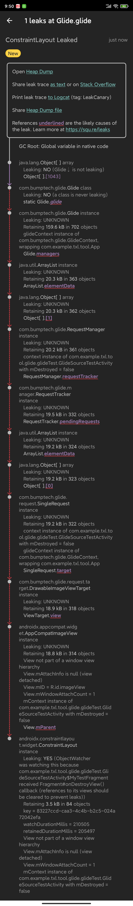

# Glide 请求管理（RequestManager）


# Glide生命周期

作为一个android开发者，说到生命周期，最先想到的应该是activity的生命周期了吧。activity的生命周期是android系统开发者给我们设定的一些模板方法，我们只需要在对应的方法中实现对应的业务逻辑即可。那么Glide的生命周期是怎么来的呢？

Glide生命生命周期主要分为两个：

1. activity/fragment  生命周期方法调用，影响到整个页面所有请求。
2. 网络状态变化引起整个requestManager  所管理的所有请求发生改变。

## 页面管理

Glide#with方法返回的是一个RequestManager对象，而RequestManager的获取实际上都调用了RequestManagerRetriever#get来获取RequestManager对象的。

RequestManagerRetriever用于创建新的 RequestManager 或从Activity和Fragment中检索现有的。

### RequestManagerRetriever的构建

```java
public RequestManagerRetriever(@Nullable RequestManagerFactory factory) {
  this.factory = factory != null ? factory : DEFAULT_FACTORY;
  handler = new Handler(Looper.getMainLooper(), this /* Callback */);
}
```

它的factory由Glide传递过来，如果我们不进行配置默认为空。就是使用DEFAULT_FACTORY进行创建

```java
private static final RequestManagerFactory DEFAULT_FACTORY = new RequestManagerFactory() {
  @NonNull
  @Override
  public RequestManager build(@NonNull Glide glide, @NonNull Lifecycle lifecycle,
      @NonNull RequestManagerTreeNode requestManagerTreeNode, @NonNull Context context) {
    return new RequestManager(glide, lifecycle, requestManagerTreeNode, context);
  }
};
```

### RequestManagerRetriever获取对应的RequestManager

RequestManagerRetriever#get传递的参数有下面几类。

1. Context  会尝试将其转换成对应的activity否则获取的是Application 级别的RequestManager
2. Activity/fragment  RequestManagerRetriever会尝试通过他们的FragmentManager获取一个不可见的子fragment，如果没有获取成功则新建一个。并添加到activity/fragment中。
3. View  当传递一个View进来的时候，会先获取对应的activity。如果获取不到则直接使用Application级别的RequestManager，如果获取到了activity，会查看当前View是否在某一个activity中，如果在使用fragment获取对应的ReauestManager 如果不在则使用Activity的RequestManager。

需要特别注意的是：不论传递什么参数，在子线程进行图片加载都会统一使用Application级别的RequestManager。


这里以RequestManagerRetriever#get(View view)来说明其流程

```java
@NonNull
public RequestManager get(@NonNull View view) {
    //如果在子线程，使用Application级别的RequestManager
  if (Util.isOnBackgroundThread()) {
    return get(view.getContext().getApplicationContext());
  }
	//进行非空判断
  Preconditions.checkNotNull(view);
  Preconditions.checkNotNull(view.getContext(),
      "Unable to obtain a request manager for a view without a Context");
  //查找对应的Activity
  Activity activity = findActivity(view.getContext());
 //如果activity为空则直接使用
  if (activity == null) {
    return get(view.getContext().getApplicationContext());
  }

  //查找到view所属的fragment,则使用fragment  查找不到则使用activity。
  if (activity instanceof FragmentActivity) {
    Fragment fragment = findSupportFragment(view, (FragmentActivity) activity);
    return fragment != null ? get(fragment) : get(activity);
  }

  // Standard Fragments.
  android.app.Fragment fragment = findFragment(view, activity);
  if (fragment == null) {
    return get(activity);
  }
  return get(fragment);
}
```

#### 通过activity查找当前View所属的fragment

```java
private android.app.Fragment findFragment(@NonNull View target, @NonNull Activity activity) {
    //是以View作为key Fragment作为value的ArrayMap
  tempViewToFragment.clear();
    //将所有的fragment  包含activity下的fragment和fragment中的子Fragment
    //通过递归的方式全部添加到 tempViewToFragment
  findAllFragmentsWithViews(activity.getFragmentManager(), tempViewToFragment);

  android.app.Fragment result = null;

  View activityRoot = activity.findViewById(android.R.id.content);
  View current = target;
  //不断对比直到当前的view为contentView 则停止查找fragment
  while (!current.equals(activityRoot)) {
    result = tempViewToFragment.get(current);
      //查找到了对应的fragment,退出当前循环
    if (result != null) {
      break;
    }
    if (current.getParent() instanceof View) {
      current = (View) current.getParent();
    } else {
      break;
    }
  }
  tempViewToFragment.clear();
  return result;
}
```

#### 通过fragment获取RequestManager

RequestManagerRetriever#get(Fragment fragment)  会调用supportFragmentGet来获取RequestManager。

```java
 @NonNull
  private RequestManager supportFragmentGet(
      @NonNull Context context,
      @NonNull FragmentManager fm,
      @Nullable Fragment parentHint,
      boolean isParentVisible) {
      //获取当前FragmentManager 下的SupportRequestManagerFragment  在getSupportRequestManagerFragment内部，如果没有对应的fragment,会为其添加。
    SupportRequestManagerFragment current =
        getSupportRequestManagerFragment(fm, parentHint, isParentVisible);
    RequestManager requestManager = current.getRequestManager();
     //当前SupportRequestManagerFragment  没有RequestManager 则创建一个RequestManager与其生命周期绑定。
    if (requestManager == null) {
           Glide glide = Glide.get(context);
      requestManager =
          factory.build(
              glide, current.getGlideLifecycle(), current.getRequestManagerTreeNode(), context);
      current.setRequestManager(requestManager);
    }
    return requestManager;
  }
```

### RequestManager的构建过程

RequestManager有两个构造方法，但是最终都会执行下面这个。

```java
RequestManager(
    Glide glide,
    Lifecycle lifecycle,
    RequestManagerTreeNode treeNode,
    RequestTracker requestTracker,
    ConnectivityMonitorFactory factory,
    Context context) {
  this.glide = glide;
  this.lifecycle = lifecycle;
  this.treeNode = treeNode;
  this.requestTracker = requestTracker;
  this.context = context;
//创建一个网咯变化的监听  网络监听是Glide默认实现的，我们也可以通过指定factory实现其它的一些业务逻辑。
//当网络连接上后会将所有请求失败的重新尝试。
  connectivityMonitor =
      factory.build(
          context.getApplicationContext(),
          new RequestManagerConnectivityListener(requestTracker));

  //实现
  if (Util.isOnBackgroundThread()) {
    mainHandler.post(addSelfToLifecycle);
  } else {
    lifecycle.addListener(this);
  }
  //将网络变化的监听与生命周期进行绑定
  lifecycle.addListener(connectivityMonitor);

  defaultRequestListeners =
      new CopyOnWriteArrayList<>(glide.getGlideContext().getDefaultRequestListeners());
  setRequestOptions(glide.getGlideContext().getDefaultRequestOptions());
//将当前RequestManager添加到Glide方便统一进行管理
  glide.registerRequestManager(this);
}
```

## 网络监听

在构造方法中，创建connectivityMonitor的时候，将requestTracker传递给了RequestManagerConnectivityListener。他的实现如下：

```java
private class RequestManagerConnectivityListener
    implements ConnectivityMonitor.ConnectivityListener {
  @GuardedBy("RequestManager.this")
  private final RequestTracker requestTracker;

  RequestManagerConnectivityListener(@NonNull RequestTracker requestTracker) {
    this.requestTracker = requestTracker;
  }

  @Override
  public void onConnectivityChanged(boolean isConnected) {
    if (isConnected) {//网络连接上会重新开始请求。
      synchronized (RequestManager.this) {
        requestTracker.restartRequests();
      }
    }
  }
}
```

## RequestManager#onDestory

```java
@Override
public synchronized void onDestroy() {
    //通知所有target调用onDestory  
  targetTracker.onDestroy();
    //通知每一个target 进行清除
  for (Target<?> target : targetTracker.getAll()) {
    clear(target);
  }
    //清除集合
  targetTracker.clear();
    //清除当前requestManager管理的request
  requestTracker.clearRequests();
  lifecycle.removeListener(this);
  lifecycle.removeListener(connectivityMonitor);
  mainHandler.removeCallbacks(addSelfToLifecycle);
  glide.unregisterRequestManager(this);
}
```

### target的清除过程

RequestManger的clear(Target<?> target)会内用untrackOrDelegate

```java
private void untrackOrDelegate(@NonNull Target<?> target) {
  //清除对应的request,并对request进行重置，放进对象重用池。
  boolean isOwnedByUs = untrack(target);
//如果当前的target不归自己管理，会遍历所有的requestManager查找到合适的requestManager进行处理。
  if (!isOwnedByUs && !glide.removeFromManagers(target) && target.getRequest() != null) {
    Request request = target.getRequest();
    target.setRequest(null);
    request.clear();
  }
}
```

### request清除过程

```java
synchronized boolean untrack(@NonNull Target<?> target) {
  Request request = target.getRequest();
  // If the Target doesn't have a request, it's already been cleared.
  if (request == null) {
    return true;
  }

  if (requestTracker.clearRemoveAndRecycle(request)) {
    //从对应的集合中移除
    targetTracker.untrack(target);
    target.setRequest(null);
    return true;
  } else {
    return false;
  }
}

public boolean clearRemoveAndRecycle(@Nullable Request request) {
    return clearRemoveAndMaybeRecycle(request, /*isSafeToRecycle=*/ true);
  }

  private boolean clearRemoveAndMaybeRecycle(@Nullable Request request, boolean isSafeToRecycle) {
     if (request == null) {
      return true;
    }
    //如果能够从集合中移除成功，那么这个request归属当前的RequestManager管理
    boolean isOwnedByUs = requests.remove(request);
    // Avoid short circuiting.
    isOwnedByUs = pendingRequests.remove(request) || isOwnedByUs;
    if (isOwnedByUs) {
      //执行request.clear  对request状态进行转变，和做相应的通知
      request.clear();
      if (isSafeToRecycle) {
        //这个是不会进行内存泄漏的关键，将request对应的引用回调置空，切断引用关系。
        //对应代码可以参考SingleRequest
        request.recycle();
      }
    }
    return isOwnedByUs;
  }
```

# Glide真的不会发生内存泄漏吗？

前面我们梳理了Glide的生命周期，知道在生命相关的activity/Fragment销毁的时候会暂停和回收相关的请求，并且切断网络请求回调的引用。那么Glide是不是真的能够完全避免内存内泄漏呢？

这个直接给出我的结论：**正常情况下使用Glide不会造成内Activity、Fragment、View内存泄漏。但是如果Glide使用不当是可能造成内存泄漏的。比如在Fragment使用Glide#with传递activity对象。**原因是Fragment结束的时候，Activity几倍RequestManager并没有接收到相应的生命周期方法。

## 实验证明：

改造我们在[Glide数据输入输出](https://juejin.cn/post/7036389645168410655#heading-11)编写的加载音频封面的ModelLoader,当遇到特定该音频的时候线程休眠300秒

```java
@Override
public void loadData(@NonNull Priority priority, @NonNull DataCallback<? super ByteBuffer> callback) {
    try {
        Log.d(TAG,"loadData assetPath "+assetPath);
        AssetFileDescriptor fileDescriptor = assetManager.openFd(assetPath);
        //特定路径 休眠300s  模拟网络加载缓慢
        if(assetPath.contains("DuiMianDeNvHaiKanGuoLai--RenXianQi.mp3")){
            SystemClock.sleep(10*30*1000);//休眠300s
        }
        mediaMetadataRetriever.setDataSource(fileDescriptor.getFileDescriptor(),fileDescriptor.getStartOffset(),fileDescriptor.getDeclaredLength());
        byte[] bytes = mediaMetadataRetriever.getEmbeddedPicture();
        if(bytes == null){
            callback.onLoadFailed(new FileNotFoundException("the file not pic"));
            return;
        }
        ByteBuffer buf = ByteBuffer.wrap(bytes);
        Log.d(TAG,"loadData assetPath "+assetPath +" success");
        callback.onDataReady(buf);
    } catch (IOException e) {
        e.printStackTrace();
        callback.onLoadFailed(e);
    }
}
```

在Activity中添加一个Fragment，当页面创建成功后，使用Glide#with传递activity/context对象，并在activity中移除该Fragment。

将fragment的根View与fragment强制关联。方便利用LeakCanary进行内存泄漏检测。

```java
public static class MyTestFragment extends Fragment {
    ImageView imageView;
    @Nullable
    @Override
    public View onCreateView(@NonNull LayoutInflater inflater, @Nullable ViewGroup container, @Nullable Bundle savedInstanceState) {
        View root = inflater.inflate(R.layout.fragment_glide_source_test,container,false);
        imageView = root.findViewById(R.id.imageView);
        //强制保留引用关系  方便进行检测
        root.setTag(this);
        Log.d(TAG,"onCreateView finish");
        return root;
    }

    @Override
    public void onCreate(@Nullable Bundle savedInstanceState) {
        super.onCreate(savedInstanceState);
    }

    @Override
    public void onActivityCreated(@Nullable Bundle savedInstanceState) {
        super.onActivityCreated(savedInstanceState);
        Glide.with(getActivity()).load(Uri.parse("file:///android_asset/DuiMianDeNvHaiKanGuoLai--RenXianQi.mp3")).diskCacheStrategy(DiskCacheStrategy.NONE).into(imageView);
        Log.d(TAG,"onActivityCreated load ");
        imageView.postDelayed(new Runnable() {
            @Override
            public void run() {
                Log.d(TAG,"onActivityCreated remove ");
                getActivity().getSupportFragmentManager().beginTransaction().remove(MyTestFragment.this).commit();
            }
        },300);

    }

    @Override
    public void onViewCreated(@NonNull View view, @Nullable Bundle savedInstanceState) {
        super.onViewCreated(view, savedInstanceState);
    }
}
```

实验结果：



可以看这里因为Fragment被View持有导致了Fragment内存泄漏。这个也就反应了当Glide使用不当，会导致View的内存泄漏。

# 小结Glide使用注意事项

Glide#with方法在参数使用优先级

fragment > view > activity > application  

其中view和activity  在明确知道当前使用的页面是activity优先传递activity  因为view会通过多次循环遍历查找fragment、activity。正确的使用Glide可以避免因为Glide造成内存泄漏。

Glide RequestOptions 可以分为三个级别：

1. 应用级 可以进行全局配置
2. 页面级别  activty/fragment  可以为每一个特殊的页面进行定制化处理，作用于RequestManager
3. 单个请求  作用于RequestBuilder  为每一个请求构建请求配置项

# Glide如何保证图片的加载不会出现错乱

ViewTarget#setRequest会调用View的setTag 将request请求对象放在View中。

```java
@Override
public void setRequest(@Nullable Request request) {
  setTag(request);
}

private void setTag(@Nullable Object tag) {
    if (tagId == null) {
      isTagUsedAtLeastOnce = true;
      view.setTag(tag);
    } else {
      view.setTag(tagId, tag);
    }
  }
```

回收原来的request

```java
private <Y extends Target<TranscodeType>> Y into(
    @NonNull Y target,
    @Nullable RequestListener<TranscodeType> targetListener,
    BaseRequestOptions<?> options,
    Executor callbackExecutor) {
  Preconditions.checkNotNull(target);
  if (!isModelSet) {
    throw new IllegalArgumentException("You must call #load() before calling #into()");
  }

  Request request = buildRequest(target, targetListener, options, callbackExecutor);

  Request previous = target.getRequest();
    //如果与前一个请求一致，复用原来的
  if (request.isEquivalentTo(previous)
      && !isSkipMemoryCacheWithCompletePreviousRequest(options, previous)) {
    request.recycle();
    if (!Preconditions.checkNotNull(previous).isRunning()) {
      // Use the previous request rather than the new one to allow for optimizations like skipping
      // setting placeholders, tracking and un-tracking Targets, and obtaining View dimensions
      // that are done in the individual Request.
      previous.begin();
    }
    return target;
  }
//清除上一个请求  获取对应的request 是通过getTag完成的。
  requestManager.clear(target);
  target.setRequest(request);
  requestManager.track(target, request);

  return target;
}
```