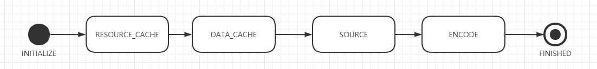
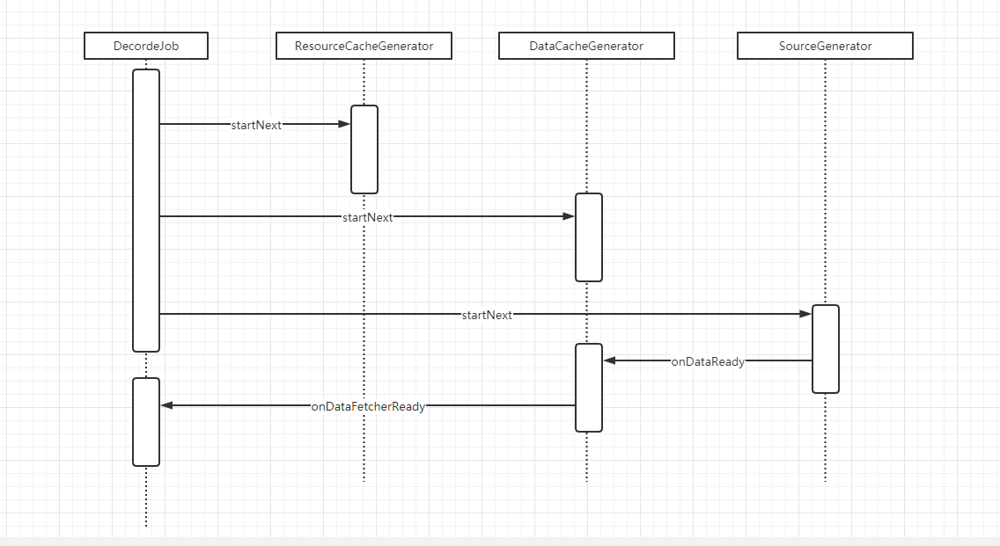

# Glide DecodeJob 的工作过程


# DecodeJob的工作

在Glide进行数据加载的过程中当发现活动资源和内存缓存都没有想要的数据时，会从文件以及网络当前请求数据。我们把这个过程称之为加载引擎的工作过程。

在数据的加载过程中会涉及到几个关键类

Engine:  加载引擎的入口，数据加载在这个位置开始

EngineJob: 负责对每一次的加载进行管理。

DecodeJob:实际数据加载的位置。本次分析的重点。


EngineJob调用start后，会通过线程池执行DecodeJob#run方法，而run会调用runWrapped

```java
public void run() {
//  ... 省略代码
  runWrapped();
//  ...
}

 private void runWrapped() {
    switch (runReason) {
      case INITIALIZE:
        stage = getNextStage(Stage.INITIALIZE);
        currentGenerator = getNextGenerator();
        runGenerators();
        break;
      case SWITCH_TO_SOURCE_SERVICE:
        runGenerators();
        break;
      case DECODE_DATA:
        decodeFromRetrievedData();
        break;
      default:
        throw new IllegalStateException("Unrecognized run reason: " + runReason);
    }
  }
```


## DecodeJob#getNextStage

在最开始的时候runReason会在构造方法中初始化为INITIALIZE。

```java
private Stage getNextStage(Stage current) {
  switch (current) {
    case INITIALIZE:
      return diskCacheStrategy.decodeCachedResource()
          ? Stage.RESOURCE_CACHE : getNextStage(Stage.RESOURCE_CACHE);
    case RESOURCE_CACHE:
      return diskCacheStrategy.decodeCachedData()
          ? Stage.DATA_CACHE : getNextStage(Stage.DATA_CACHE);
    case DATA_CACHE:
      // Skip loading from source if the user opted to only retrieve the resource from cache.
      return onlyRetrieveFromCache ? Stage.FINISHED : Stage.SOURCE;
    case SOURCE:
    case FINISHED:
      return Stage.FINISHED;
    default:
      throw new IllegalArgumentException("Unrecognized stage: " + current);
  }
}
```

getNextStage的作用是获取下一个状态，diskCacheStrategy在不配置的情况下默认使用的是DiskCacheStrategy#AUTOMATIC  diskCacheStrategy.decodeCachedResource()和diskCacheStrategy.decodeCachedData()返回都是true。即状态流转如下。



## DecodeJob#getNextGenerator

```java
private DataFetcherGenerator getNextGenerator() {
  switch (stage) {
    case RESOURCE_CACHE:
      return new ResourceCacheGenerator(decodeHelper, this);
    case DATA_CACHE:
      return new DataCacheGenerator(decodeHelper, this);
    case SOURCE:
      return new SourceGenerator(decodeHelper, this);
    case FINISHED:
      return null;
    default:
      throw new IllegalStateException("Unrecognized stage: " + stage);
  }
}
```

上一步getNextStage返回的state为RESOURCE_CACHE  即此时currentGenerator 为ResourceCacheGenerator。

## DecodeJob#runGenerators

```java
private void runGenerators() {
  currentThread = Thread.currentThread();
  startFetchTime = LogTime.getLogTime();
  boolean isStarted = false;
  while (!isCancelled && currentGenerator != null
      && !(isStarted = currentGenerator.startNext())) {
    stage = getNextStage(stage);
    currentGenerator = getNextGenerator();

    if (stage == Stage.SOURCE) {
      reschedule();
      return;
    }
  }
  // We've run out of stages and generators, give up.
  if ((stage == Stage.FINISHED || isCancelled) && !isStarted) {
    notifyFailed();
  }

  // Otherwise a generator started a new load and we expect to be called back in
  // onDataFetcherReady.
}
```

runGenerators代码逻辑非常简单，如果currentGenerator #startNext返回true结束当前运转流程，否则一直获取下一个状态和Generator直到startNext()返回fasle或者当前stage是Stage.SOURCE。

# ResourceCacheGenerator的工作过程

```java
public boolean startNext() {
  List<Key> sourceIds = helper.getCacheKeys();
  if (sourceIds.isEmpty()) {
    return false;
  }
  List<Class<?>> resourceClasses = helper.getRegisteredResourceClasses();
  if (resourceClasses.isEmpty()) {
    if (File.class.equals(helper.getTranscodeClass())) {
      return false;
    }
    throw new IllegalStateException(
       "Failed to find any load path from " + helper.getModelClass() + " to "
           + helper.getTranscodeClass());
  }
  while (modelLoaders == null || !hasNextModelLoader()) {
    resourceClassIndex++;
    if (resourceClassIndex >= resourceClasses.size()) {
      sourceIdIndex++;
      if (sourceIdIndex >= sourceIds.size()) {
        return false;
      }
      resourceClassIndex = 0;
    }

    Key sourceId = sourceIds.get(sourceIdIndex);
    Class<?> resourceClass = resourceClasses.get(resourceClassIndex);
    Transformation<?> transformation = helper.getTransformation(resourceClass);
    // PMD.AvoidInstantiatingObjectsInLoops Each iteration is comparatively expensive anyway,
    // we only run until the first one succeeds, the loop runs for only a limited
    // number of iterations on the order of 10-20 in the worst case.
    currentKey =
        new ResourceCacheKey(// NOPMD AvoidInstantiatingObjectsInLoops
            helper.getArrayPool(),
            sourceId,
            helper.getSignature(),
            helper.getWidth(),
            helper.getHeight(),
            transformation,
            resourceClass,
            helper.getOptions());
    cacheFile = helper.getDiskCache().get(currentKey);
    if (cacheFile != null) {
      sourceKey = sourceId;
      modelLoaders = helper.getModelLoaders(cacheFile);
      modelLoaderIndex = 0;
    }
  }

  loadData = null;
  boolean started = false;
  while (!started && hasNextModelLoader()) {
    ModelLoader<File, ?> modelLoader = modelLoaders.get(modelLoaderIndex++);
    loadData = modelLoader.buildLoadData(cacheFile,
        helper.getWidth(), helper.getHeight(), helper.getOptions());
    if (loadData != null && helper.hasLoadPath(loadData.fetcher.getDataClass())) {
      started = true;
      loadData.fetcher.loadData(helper.getPriority(), this);
    }
  }

  return started;
}
```

整个流程就是通过

1. DecodeHelper#getRegisteredResourceClasses获取能够处理本次请求的资源。
2. 根据当前的资源resourceClass 构建缓存key  ,根据缓存key获取对应的缓存文件（如果有的话），在遍历所有的RegisteredResourceClasses任然不能获取对应的缓存文件，直接换回false。
3. 从缓存文件中读取数据


# DataCacheGenerator的工作过程。

我们假设第一次加载某个资源的数据，是没有缓存的。此时getNextStage返回的是Stage.DATA_CACHE 。getNextGenerator返回的是DataCacheGenerator

```java
public boolean startNext() {
  while (modelLoaders == null || !hasNextModelLoader()) {
    sourceIdIndex++;
    if (sourceIdIndex >= cacheKeys.size()) {
      return false;
    }

    Key sourceId = cacheKeys.get(sourceIdIndex);
    // PMD.AvoidInstantiatingObjectsInLoops The loop iterates a limited number of times
    // and the actions it performs are much more expensive than a single allocation.
    @SuppressWarnings("PMD.AvoidInstantiatingObjectsInLoops")
    Key originalKey = new DataCacheKey(sourceId, helper.getSignature());
    cacheFile = helper.getDiskCache().get(originalKey);
    if (cacheFile != null) {
      this.sourceKey = sourceId;
      modelLoaders = helper.getModelLoaders(cacheFile);
      modelLoaderIndex = 0;
    }
  }

  loadData = null;
  boolean started = false;
  while (!started && hasNextModelLoader()) {
    ModelLoader<File, ?> modelLoader = modelLoaders.get(modelLoaderIndex++);
    loadData =
        modelLoader.buildLoadData(cacheFile, helper.getWidth(), helper.getHeight(),
            helper.getOptions());
    if (loadData != null && helper.hasLoadPath(loadData.fetcher.getDataClass())) {
      started = true;
      loadData.fetcher.loadData(helper.getPriority(), this);
    }
  }
  return started;
}
```

DataCacheGenerator的工作过程与ResourceCacheGenerator工作过程非常类似，都是先拼装缓存key，然后根据key取出对应的缓存文件，如果文件存在则取出对应的数据，如果不存在则返回false。

# SourceGenerator的工作过程

当DataCacheGenerator#startNext返回false的时候此时getNextStage返回的是Stage.SOURCE。getNextGenerator返回的是SourceGenerator

```java
private void cacheData(Object dataToCache) {
    long startTime = LogTime.getLogTime();
    try {
      Encoder<Object> encoder = helper.getSourceEncoder(dataToCache);
      DataCacheWriter<Object> writer =
          new DataCacheWriter<>(encoder, dataToCache, helper.getOptions());
      originalKey = new DataCacheKey(loadData.sourceKey, helper.getSignature());
      helper.getDiskCache().put(originalKey, writer);
      if (Log.isLoggable(TAG, Log.VERBOSE)) {
        Log.v(TAG, "Finished encoding source to cache"
            + ", key: " + originalKey
            + ", data: " + dataToCache
            + ", encoder: " + encoder
            + ", duration: " + LogTime.getElapsedMillis(startTime));
      }
    } finally {
      loadData.fetcher.cleanup();
    }
	//创建DataCacheGenerator  缓存数据之后，从缓存中读取数据而不是 远程下载的数据
    sourceCacheGenerator =
        new DataCacheGenerator(Collections.singletonList(loadData.sourceKey), helper, this);
  }


public boolean startNext() {
    //如果存在缓存的数据，先将数据进行缓存
  if (dataToCache != null) {
    Object data = dataToCache;
    dataToCache = null;
    cacheData(data);
  }

  if (sourceCacheGenerator != null && sourceCacheGenerator.startNext()) {
    return true;
  }
  sourceCacheGenerator = null;

  loadData = null;
  boolean started = false;
  while (!started && hasNextModelLoader()) {
    loadData = helper.getLoadData().get(loadDataListIndex++);
    if (loadData != null
        && (helper.getDiskCacheStrategy().isDataCacheable(loadData.fetcher.getDataSource())
        || helper.hasLoadPath(loadData.fetcher.getDataClass()))) {
      started = true;
      loadData.fetcher.loadData(helper.getPriority(), this);
    }
  }
  return started;
}
```

SourceGenerator的工作过程如下：

1. 从远程获取数据
2. 数据加载成功后重新执行startNext将远程获取的数据进行缓存。
3. 通过DataCacheGenerator进行数据加载。

# DecodeJob数据回调

当数据加载成功后会回调onDataFetcherReady而它又会调用decodeFromRetrievedData

```java
private void decodeFromRetrievedData() {
  if (Log.isLoggable(TAG, Log.VERBOSE)) {
    logWithTimeAndKey("Retrieved data", startFetchTime,
        "data: " + currentData
            + ", cache key: " + currentSourceKey
            + ", fetcher: " + currentFetcher);
  }
  Resource<R> resource = null;
  try {
      //将数据进行解码
    resource = decodeFromData(currentFetcher, currentData, currentDataSource);
  } catch (GlideException e) {
    e.setLoggingDetails(currentAttemptingKey, currentDataSource);
    throwables.add(e);
  }
  if (resource != null) {
      //将解码好的数据进行保存，下次可以直接使用（这里保存的是ResourceCacheGenerator从文件中获取的数据）并通知数据加载完成。
    notifyEncodeAndRelease(resource, currentDataSource);
  } else {
    runGenerators();
  }
}
```



