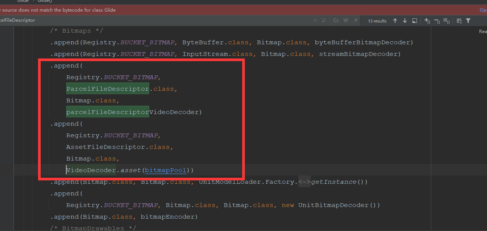

在我们日常使用Glide需要三部，with 、load、into  Glide就会自动把图片数据进行加载，然后显示出来。那么它底层是如何实现的呢？

在[Glide DecodeJob 的工作过程](https://juejin.cn/post/7035932291536797727)我们总结了，Glide数据加载会先从资源缓存中获取数据，再从datacache中获取数据，最后才是从远程服务器获取。当时并没有对数据的获取做详细的说明。现在我们来一探究竟。

# 基础概念

在正式开始之前先明确一些概念

**Glide输入：**我们日常在使用Glide的时候，通过load可以加载不同的资源类型例如文件，字符串等待。


我们把load的不同类型称为不同的输入。

**Glide输出：**Glide  RequestManager提供了许多的as重载方法，


通过不同的as我们可以指定不同的输出类型。

**ModelLoader:**  是一个泛型接口，最直观的翻译是模型加载器。ModelLoader标记了它能够加载什么类型的数据，以及加载后返回什么样的数据类型。注意这里说说的返回的数据类型并不是我们想要的输出。ModelLoader定义如下

```java
public interface ModelLoader<Model, Data> {
  class LoadData<Data> {
      //数据加载的key
    public final Key sourceKey;
    public final List<Key> alternateKeys;
      //获取数据的接口，对应获取不同类型的数据实现
    public final DataFetcher<Data> fetcher;

    public LoadData(@NonNull Key sourceKey, @NonNull DataFetcher<Data> fetcher) {
      this(sourceKey, Collections.<Key>emptyList(), fetcher);
    }

    public LoadData(@NonNull Key sourceKey, @NonNull List<Key> alternateKeys,
        @NonNull DataFetcher<Data> fetcher) {
      this.sourceKey = Preconditions.checkNotNull(sourceKey);
      this.alternateKeys = Preconditions.checkNotNull(alternateKeys);
      this.fetcher = Preconditions.checkNotNull(fetcher);
    }
  }

    //创建LoadData 对象
  @Nullable
  LoadData<Data> buildLoadData(@NonNull Model model, int width, int height,
      @NonNull Options options);
    //判断当前的ModelLoader是否能够处理这个model
  boolean handles(@NonNull Model model);
}
```

**DataFetcher：**用于进行数据加载，不同的类型有不同的DataFetcher


# SourceGenerator远程数据加载过程

```java
@Override
public boolean startNext() {
  //...
  boolean started = false;
  while (!started && hasNextModelLoader()) {
    loadData = helper.getLoadData().get(loadDataListIndex++);
    if (loadData != null
        && (helper.getDiskCacheStrategy().isDataCacheable(loadData.fetcher.getDataSource())
        || helper.hasLoadPath(loadData.fetcher.getDataClass()))) {
      started = true;
      loadData.fetcher.loadData(helper.getPriority(), this);
    }
  }
  return started;
}
```

代码流程：

通过DecodeHelper获取LoadData，遍历每一个LoadData;

查看当前LoadData加载出来的数据能不能，转换成我们想要的输出数据，如果可以的话就是用当前loadData进行数据加载。

## DecodeHelpe#getLoadData()

```java
List<LoadData<?>> getLoadData() {
  if (!isLoadDataSet) {
    isLoadDataSet = true;
    loadData.clear();
      //此处的model就是我们  通过调用load传递进来的参数  即输入
    List<ModelLoader<Object, ?>> modelLoaders = glideContext.getRegistry().getModelLoaders(model);
    //noinspection ForLoopReplaceableByForEach to improve perf
    for (int i = 0, size = modelLoaders.size(); i < size; i++) {
      ModelLoader<Object, ?> modelLoader = modelLoaders.get(i);
      //通过modelLoader 构建loadData
      LoadData<?> current =
          modelLoader.buildLoadData(model, width, height, options);
      if (current != null) {
        loadData.add(current);
      }
    }
  }
  return loadData;
}
```

### ModelLoaderRegistry#getModelLoaders

getModelLoaders（）实现的位置在ModelLoaderRegistry#getModelLoaders

```java
public <A> List<ModelLoader<A, ?>> getModelLoaders(@NonNull A model) {
    //获取对应的modelLoader
  List<ModelLoader<A, ?>> modelLoaders = getModelLoadersForClass(getClass(model));
  int size = modelLoaders.size();
  boolean isEmpty = true;
  List<ModelLoader<A, ?>> filteredLoaders = Collections.emptyList();
  //noinspection ForLoopReplaceableByForEach to improve perf
  for (int i = 0; i < size; i++) {
    ModelLoader<A, ?> loader = modelLoaders.get(i);
      //判断对应的modelLoader是否有能力处理对应的model
    if (loader.handles(model)) {
      if (isEmpty) {
        filteredLoaders = new ArrayList<>(size - i);
        isEmpty = false;
      }
      filteredLoaders.add(loader);
    }
  }
  return filteredLoaders;
}
```

getModelLoadersForClass主要是通过MultiModelLoaderFactory#build。然后MultiModelLoaderFactory会遍历所有已经注册的ModelLoader，只要当前的model是已经注册model的子类或者对应的实现，那么就会把对应的ModelLoader添加到待返回的集合中。

## DecodeHelper#hasLoadPath

```java
boolean hasLoadPath(Class<?> dataClass) {
    return getLoadPath(dataClass) != null;
  }

<Data> LoadPath<Data, ?, Transcode> getLoadPath(Class<Data> dataClass) {
  return glideContext.getRegistry().getLoadPath(dataClass, resourceClass, transcodeClass);
}
```

可以看到hasLoadPath代码其实非常简单，就是获取一个LoadPath集合。获取的时候传递了三个参数  DataFetcher加载出来的数据类型dataClass，resourceClass  ，transcodeClass

### getLoadPath参数

对于resourceClass  ，transcodeClass在DecodeHelper定义如下：

```java
private Class<?> resourceClass;
private Class<Transcode> transcodeClass;
```

他们在init方法中进行初始化，经过层层代码的流转我们发现最终的参数初始化来自于RequestBuilder#obtainRequest

```java
private Request obtainRequest(
      Target<TranscodeType> target,
      RequestListener<TranscodeType> targetListener,
      BaseRequestOptions<?> requestOptions,
      RequestCoordinator requestCoordinator,
      TransitionOptions<?, ? super TranscodeType> transitionOptions,
      Priority priority,
      int overrideWidth,
      int overrideHeight,
      Executor callbackExecutor) {
    return SingleRequest.obtain(
        context,
        glideContext,
        model,
        //该参数会在调用as系列方法后初始化，指向的是我们想要的输出类型。
        transcodeClass,
        //指向的是RequestBuilder 自身
        requestOptions,
        overrideWidth,
        overrideHeight,
        priority,
        target,
        targetListener,
        requestListeners,
        requestCoordinator,
        glideContext.getEngine(),
        transitionOptions.getTransitionFactory(),
        callbackExecutor);
  }
```

而RequestOptions#getResourceClass返回的resourceClass默认情况下返回的是Object，而在asBitmap和asGifDrawable会做其它的转换。

```java
private static final RequestOptions DECODE_TYPE_BITMAP = decodeTypeOf(Bitmap.class).lock();
private static final RequestOptions DECODE_TYPE_GIF = decodeTypeOf(GifDrawable.class).lock();

@NonNull
  @CheckResult
  public RequestBuilder<Bitmap> asBitmap() {
    return as(Bitmap.class).apply(DECODE_TYPE_BITMAP);
  }
  public RequestBuilder<GifDrawable> asGif() {
    return as(GifDrawable.class).apply(DECODE_TYPE_GIF);
  }
```

### 	getLoadPath执行过程

getLoadPath最终会调用Registry#getLoadPath

```java
@Nullable
public <Data, TResource, Transcode> LoadPath<Data, TResource, Transcode> getLoadPath(
    @NonNull Class<Data> dataClass, @NonNull Class<TResource> resourceClass,
    @NonNull Class<Transcode> transcodeClass) {
    //先获取DecodePath  
  List<DecodePath<Data, TResource, Transcode>> decodePaths =
        getDecodePaths(dataClass, resourceClass, transcodeClass);
    if (decodePaths.isEmpty()) {
      result = null;
    } else {
      result =
          new LoadPath<>(
              dataClass, resourceClass, transcodeClass, decodePaths, throwableListPool);
    }
    loadPathCache.put(dataClass, resourceClass, transcodeClass, result);
  return result;
}

private <Data, TResource, Transcode> List<DecodePath<Data, TResource, Transcode>> getDecodePaths(
      @NonNull Class<Data> dataClass, @NonNull Class<TResource> resourceClass,
      @NonNull Class<Transcode> transcodeClass) {
    List<DecodePath<Data, TResource, Transcode>> decodePaths = new ArrayList<>();
    //遍历所有资源解码器，获取能够解析当前输入dataClass的解码器
    List<Class<TResource>> registeredResourceClasses =
        decoderRegistry.getResourceClasses(dataClass, resourceClass);
    for (Class<TResource> registeredResourceClass : registeredResourceClasses) {
        //获取能够解析当前输入dataClass且将数据转变成我们想要的transcodeClass类型的转换类
      List<Class<Transcode>> registeredTranscodeClasses =
          transcoderRegistry.getTranscodeClasses(registeredResourceClass, transcodeClass);

      for (Class<Transcode> registeredTranscodeClass : registeredTranscodeClasses) {
		//获取对应的所有解码器
        List<ResourceDecoder<Data, TResource>> decoders =
            decoderRegistry.getDecoders(dataClass, registeredResourceClass);
        //转换类
        ResourceTranscoder<TResource, Transcode> transcoder =
            transcoderRegistry.get(registeredResourceClass, registeredTranscodeClass);
        @SuppressWarnings("PMD.AvoidInstantiatingObjectsInLoops")
        DecodePath<Data, TResource, Transcode> path =
            new DecodePath<>(dataClass, registeredResourceClass, registeredTranscodeClass,
                decoders, transcoder, throwableListPool);
        decodePaths.add(path);
      }
    }
    return decodePaths;
  }
```

整个过程涉及到两个关键类LoadPath   DecodePath。

LoadPath   由数据类型datacalss 和 DecodePath组成

DecodePath  由数据类型dataclass  解码器 ResourceDecoder 集合 和资源转换  ResourceTranscoder 构成。总体上而言 一个LoadPath的存在代表着可能存在一条路径能够将ModelLoader加载出来的data解码转换成我们指定的数据类型。


# DocodeJob数据解码的过程

在 [Glide DecodeJob 的工作过程](https://juejin.cn/post/7035932291536797727)我们知道SourceGenerator在数据加载完成之后如果允许缓存原始数据会再次执行SourceGenerator#startNext将加载的数据进行缓存，然后通过DataCacheGenerator从缓存文件中获取。最终获取数据成功后会调用DocodeJob#onDataFetcherReady

```java
@Override
public void onDataFetcherReady(Key sourceKey, Object data, DataFetcher<?> fetcher,
    DataSource dataSource, Key attemptedKey) {
  this.currentSourceKey = sourceKey;
  this.currentData = data;
  this.currentFetcher = fetcher;
  this.currentDataSource = dataSource;
  this.currentAttemptingKey = attemptedKey;
  //做一个线程判断  因为不知道DataFetcher 是如何进行数据加载的。最终都会调用decodeFromRetrievedData
  if (Thread.currentThread() != currentThread) {
    runReason = RunReason.DECODE_DATA;
    callback.reschedule(this);
  } else {
    GlideTrace.beginSection("DecodeJob.decodeFromRetrievedData");
    try {
      decodeFromRetrievedData();
    } finally {
      GlideTrace.endSection();
    }
  }
}
```

最终解码的工作经过decodeFromRetrievedData层层调用会在获取到对应的LoadPath之后，调用runLoadPath

```java
private <Data, ResourceType> Resource<R> runLoadPath(Data data, DataSource dataSource,
    LoadPath<Data, ResourceType, R> path) throws GlideException {
    //获取硬件加速的一些选项
  Options options = getOptionsWithHardwareConfig(dataSource);
    //对加载出的数据做一些封装处理。
  DataRewinder<Data> rewinder = glideContext.getRegistry().getRewinder(data);
  try {
    // ResourceType in DecodeCallback below is required for compilation to work with gradle.
      
    return path.load(
        rewinder, options, width, height, new DecodeCallback<ResourceType>(dataSource));
  } finally {
    rewinder.cleanup();
  }
}
```

## LoadPath#load

可以看到最终的执行在LoadPath,前面我们说过LoadPath 包含一个DecodePath集合，在LoadPath的调用中会在loadWithExceptionList循环遍历每一个DecodePath#decode来进行数据解码与转换直到出现可用的结果。

```java
private Resource<Transcode> loadWithExceptionList(DataRewinder<Data> rewinder,
    @NonNull Options options,
    int width, int height, DecodePath.DecodeCallback<ResourceType> decodeCallback,
    List<Throwable> exceptions) throws GlideException {
  Resource<Transcode> result = null;
  //noinspection ForLoopReplaceableByForEach to improve perf
  for (int i = 0, size = decodePaths.size(); i < size; i++) {
    DecodePath<Data, ResourceType, Transcode> path = decodePaths.get(i);
    try {
      result = path.decode(rewinder, width, height, options, decodeCallback);
    } catch (GlideException e) {
      exceptions.add(e);
    }
    if (result != null) {
      break;
    }
  }

  if (result == null) {
    throw new GlideException(failureMessage, new ArrayList<>(exceptions));
  }

  return result;
}
```

### DecodePath#decode

```java
public Resource<Transcode> decode(DataRewinder<DataType> rewinder, int width, int height,
    @NonNull Options options, DecodeCallback<ResourceType> callback) throws GlideException {
  Resource<ResourceType> decoded = decodeResource(rewinder, width, height, options);
  Resource<ResourceType> transformed = callback.onResourceDecoded(decoded);
  return transcoder.transcode(transformed, options);
}
```

decodeResource会遍历当前所有合适的解码器，解析出对应的数据。在通过callback通知DecodeJob解码成功，此时DecodeJob可以做对应的一些变换。最后通过transcoder转变成我们想要的数据。

# 总结

Glide的数据加载可以大致分成三个阶段，两个分割点。

- 初始化准备工作

  以Engine#load为第一个分割点，在此之前主要的工作是一些图片请求配置项的准备。以RequestManager#as方法确定Glide想要的输出类型，RequestBuilder#load确定ModelLoader的输入类型。以及其它的一些缓存变化策略。

- 数据加载

  以DecodeJob#decodeFromRetrievedData作为第二个分割点，在Engine#load之后DecodeJob#decodeFromRetrievedData之前，此阶段的工作主要是进行数据加载。加载的顺序是，活动资源----> 内存缓存 ---->  资源的文件缓存 ---->  原始数据缓存  ---->  远程加载数据。

- 数据解码

  在DecodeJob#decodeFromRetrievedData之后，主要的工作是对DataFetcher加载出来的数据通过LoadPath进行解码，转换成我们想要的数据。


# 利用Glide加载asset目录下的音专辑封面图，视频首帧图。

想要利用Glide加载本地音视频中的图片，有下面的几种思路

思路一：利用现有的解码器，扩展ModelLoader 

思路二：增加解码器，利用现有的ModelLoader

思路三：ModelLoader和解码器都自己写。

这里以思路1为例进行分析。Glide能够加载本地Asset目录下的图片资源，并进行正常显示。原因是Glide在初始化的时候注册了对应的ModelLoader，


AssetUriLoader加载出来的数据可以是 InputStream和ParcelFileDescriptor。

## 视频首帧图的加载

Glide默认提供了VideoDecoder进行视频解码，并在初始化的时候对解码器进行了注册。



也就是说Glide的默认解码器能够解码ModelLoader加载出的dataClass为ParcelFileDescriptor和AssetFileDescriptor。并将其解码为bitmap。

而默认的可以处理asset目录的AssetUriLoader加载出的数据并不满足。因此对其扩展，而比较简单的方式是将Asset目录下的数据加载为AssetFileDescriptor 就可以利用现存的解码器。

代码实现：

```java
public class VideoAssetUriLoader implements ModelLoader<Uri, AssetFileDescriptor> {
    private static final String TAG = "VideoAssetUriLoader";
    private static final String ASSET_PATH_SEGMENT = "android_asset";
    private static final String ASSET_PREFIX =
            ContentResolver.SCHEME_FILE + ":///" + ASSET_PATH_SEGMENT + "/";
    private static final int ASSET_PREFIX_LENGTH = ASSET_PREFIX.length();

    private final AssetManager assetManager;

    //注意这个在Glide加载asset目录下的数据之前调用  
    public static void init(Context context) {
        Glide.get(context).getRegistry().prepend(Uri.class, AssetFileDescriptor.class, new VideoModelLoaderFactory(context.getAssets()));
    }

    public VideoAssetUriLoader(AssetManager assetManager) {
        this.assetManager = assetManager;
    }

    @Nullable
    @Override
    public LoadData<AssetFileDescriptor> buildLoadData(@NonNull Uri model, int width, int height, @NonNull Options options) {
        String assetPath = model.toString().substring(ASSET_PREFIX_LENGTH);
        Log.d(TAG,"buildLoadData");
        return new LoadData<AssetFileDescriptor>(new ObjectKey(model), new AudioFetcher(assetManager,assetPath));
    }

    @Override
    public boolean handles(@NonNull Uri model) {
        boolean result = ContentResolver.SCHEME_FILE.equals(model.getScheme()) && !model.getPathSegments()
                .isEmpty() && ASSET_PATH_SEGMENT.equals(model.getPathSegments().get(0)) && model.getPathSegments().get(1).endsWith(".mp4");
        Log.d(TAG,"handles  result  "+result + "  model "+model.toString());
        return result;
    }


    private static class VideoModelLoaderFactory implements ModelLoaderFactory<Uri,AssetFileDescriptor>{
        private final AssetManager assetManager;

        public VideoModelLoaderFactory(AssetManager assetManager) {
            this.assetManager = assetManager;
        }

        @NonNull
        @Override
        public ModelLoader<Uri, AssetFileDescriptor> build(@NonNull MultiModelLoaderFactory multiFactory) {
            return new VideoAssetUriLoader(assetManager);
        }

        @Override
        public void teardown() {

        }
    }

    private static class AudioFetcher implements DataFetcher<AssetFileDescriptor>{
        private final AssetManager assetManager;
        private final String assetPath;

        private AudioFetcher(AssetManager assetManager, String assetPath) {
            this.assetManager = assetManager;
            this.assetPath = assetPath;
        }


        @Override
        public void loadData(@NonNull Priority priority, @NonNull DataCallback<? super AssetFileDescriptor> callback) {
            try {
                Log.d(TAG,"loadData assetPath "+assetPath);
                AssetFileDescriptor fileDescriptor = assetManager.openFd(assetPath);
                callback.onDataReady(fileDescriptor);
            } catch (IOException e) {
                e.printStackTrace();
                callback.onLoadFailed(e);
            }
        }

        @Override
        public void cleanup() {

        }

        @Override
        public void cancel() {

        }

        @NonNull
        @Override
        public Class<AssetFileDescriptor> getDataClass() {
            return AssetFileDescriptor.class;
        }

        @NonNull
        @Override
        public DataSource getDataSource() {
            return DataSource.REMOTE;
        }
    }


}
```

Activity调用该代码：

```java
VideoAssetUriLoader.init(this)
    //因为缺少对用的编码器不能直接将AssetFileDescriptor进行缓存，因此使用DiskCacheStrategy.RESOURCE
Glide.with(this).asBitmap().load(Uri.parse("file:///android_asset/test_video.mp4")).apply(RequestOptions.diskCacheStrategyOf(DiskCacheStrategy.RESOURCE)).into(image_test_glide_mp4)
```

## 加载音频专辑图片

虽然Glide没有专门的音频解码器，但是MediaMetadataRetriever#getEmbeddedPicture返回的是一个byte数组，可以通过将byte数组装饰为ByteBuffer  从而利用Glide的ByteBuffer  解码器。

这里就不粘贴获取音频专辑图片的代码，有兴趣的可以自己实现。

