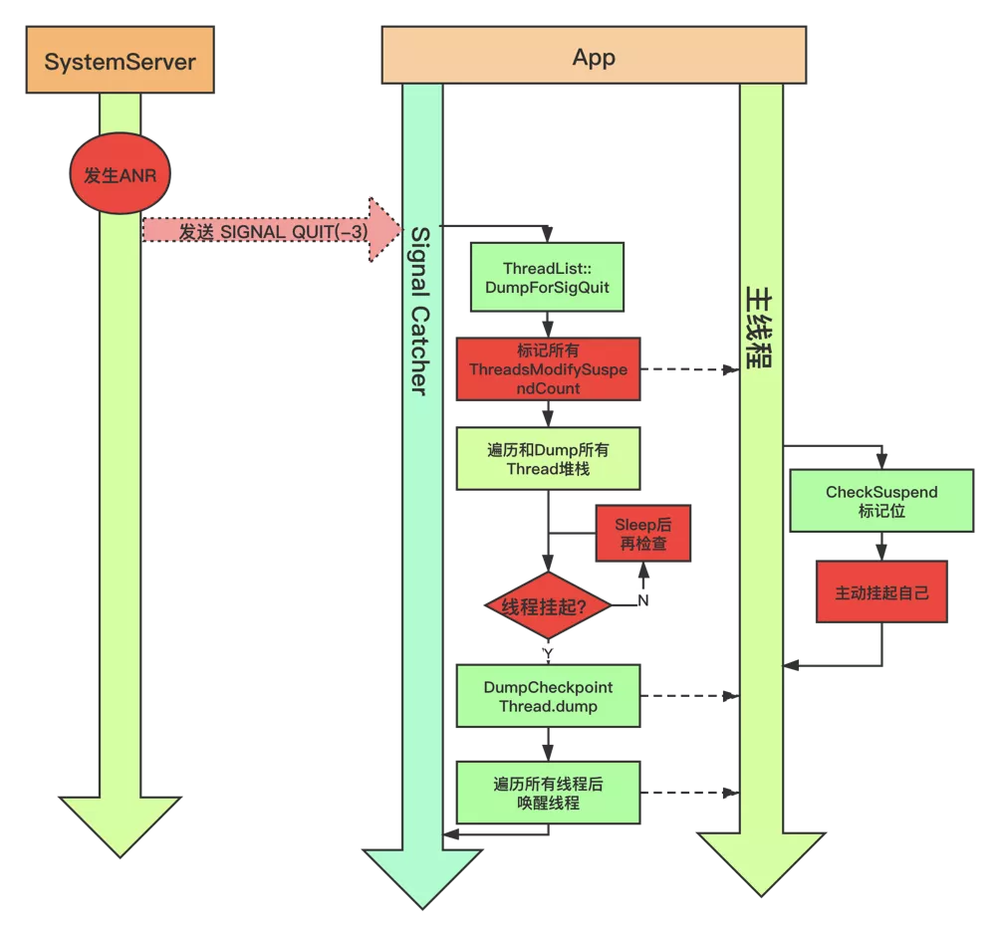

# ANR学习笔记

# 前言

对于开发者而言，我们肯定碰到过anr 全称 Applicatipon No Response  。那么我们遇到anr时该怎么处理呢？本文将从下面的几个方面总结anr 的监控与解决。

- ANR的设计目的
- ANR原理
- ANR相关日志分析
- ANR监控

文章作为学习笔记大量引用了 [今日头条 ANR 优化实践系列 - 设计原理及影响因素](https://mp.weixin.qq.com/s?__biz=MzI1MzYzMjE0MQ==&mid=2247488116&idx=1&sn=fdf80fa52c57a3360ad1999da2a9656b&chksm=e9d0d996dea750807aadc62d7ed442948ad197607afb9409dd5a296b16fb3d5243f9224b5763&token=569762407&lang=zh_CN#rd)  的内容。

# ANR设计目的

定义引用于 [今日头条 ANR 优化实践系列 - 设计原理及影响因素](https://mp.weixin.qq.com/s?__biz=MzI1MzYzMjE0MQ==&amp;mid=2247488116&amp;idx=1&amp;sn=fdf80fa52c57a3360ad1999da2a9656b&amp;chksm=e9d0d996dea750807aadc62d7ed442948ad197607afb9409dd5a296b16fb3d5243f9224b5763&amp;token=569762407&amp;lang=zh_CN#rd)

> ANR 全称 Applicatipon No Response；Android 设计 ANR 的用意，是系统通过与之交互的组件(Activity，Service，Receiver，Provider)以及用户交互(InputEvent)进行超时监控，以判断应用进程(主线程)是否存在卡死或响应过慢的问题，通俗来说就是很多系统中看门狗(watchdog)的设计思想。

# ANR原理

一般而言主线程有耗时操作会导致卡顿，卡顿超过系统设置的阈值，就会触发anr。而Android 主线程任务的执行是通过handler发送msg到消息队列，然后通过looper取出msg来进行处理。

```java
/**
     * Run the message queue in this thread. Be sure to call
     * {@link #quit()} to end the loop.
     */
    public static void loop() {
        ...

        for (;;) {
        //从消息队列取出消息
            Message msg = queue.next(); // might block
            ...
           //处理消息
                msg.target.dispatchMessage(msg);
            ...
    }
```

说明造成卡顿的有两个位置

1. queue.next()阻塞
2. dispatchMessage()耗时过久

那么是不是只要这两个方法执行不超过阈值，就不会发生ANR呢？

在 [今日头条 ANR 优化实践系列 - 设计原理及影响因素](https://mp.weixin.qq.com/s?__biz=MzI1MzYzMjE0MQ==&mid=2247488116&idx=1&sn=fdf80fa52c57a3360ad1999da2a9656b&chksm=e9d0d996dea750807aadc62d7ed442948ad197607afb9409dd5a296b16fb3d5243f9224b5763&token=569762407&lang=zh_CN#rd)   中以广播为例介绍了anr的监测过程，我们这里用service来进行举例说明

服务的启动最后会调用ActiveServices#realStartServiceLocked 

```java
private final void realStartServiceLocked(ServiceRecord r,
            ProcessRecord app, boolean execInFg) throws RemoteException {
        ...
        //发送消息 开机对创建服务进行计时
        bumpServiceExecutingLocked(r, execInFg, "create");
        ...
        //通过ApplicationThread 的代理调用到对应的应用程序 创建服务
        app.thread.scheduleCreateService(r, r.serviceInfo,
                    mAm.compatibilityInfoForPackageLocked(r.serviceInfo.applicationInfo),
                    app.repProcState);
    }
```

创建服务的过程最后会由ActivityThread#handleCreateService来进行处理。

```java
private void handleCreateService(CreateServiceData data) {
        // If we are getting ready to gc after going to the background, well
        // we are back active so skip it.
        unscheduleGcIdler();

        LoadedApk packageInfo = getPackageInfoNoCheck(
                data.info.applicationInfo, data.compatInfo);
        Service service = null;
        try {
            java.lang.ClassLoader cl = packageInfo.getClassLoader();
            //创建Service对象
            service = packageInfo.getAppFactory()
                    .instantiateService(cl, data.info.name, data.intent);
        } catch (Exception e) {
            if (!mInstrumentation.onException(service, e)) {
                throw new RuntimeException(
                    "Unable to instantiate service " + data.info.name
                    + ": " + e.toString(), e);
            }
        }

        try {
            if (localLOGV) Slog.v(TAG, "Creating service " + data.info.name);

            ContextImpl context = ContextImpl.createAppContext(this, packageInfo);
            context.setOuterContext(service);

            Application app = packageInfo.makeApplication(false, mInstrumentation);
            service.attach(context, this, data.info.name, data.token, app,
                    ActivityManager.getService());
            //调用Service 生命周期方法 onCreate
            service.onCreate();
            mServices.put(data.token, service);
            try {
                //通知 ActivityManagerService 解除本次anr 检测
                ActivityManager.getService().serviceDoneExecuting(
                        data.token, SERVICE_DONE_EXECUTING_ANON, 0, 0);
            } catch (RemoteException e) {
                throw e.rethrowFromSystemServer();
            }
        } catch (Exception e) {
            if (!mInstrumentation.onException(service, e)) {
                throw new RuntimeException(
                    "Unable to create service " + data.info.name
                    + ": " + e.toString(), e);
            }
        }
    }
```

ANR的检测与解除检测主要通过bumpServiceExecutingLocked 与serviceDoneExecuting 来完成，实现如下

```java
 private final void bumpServiceExecutingLocked(ServiceRecord r, boolean fg, String why) {
        ...
        scheduleServiceTimeoutLocked(r.app);
     	...
    }
```

```java
void scheduleServiceTimeoutLocked(ProcessRecord proc) {
        if (proc.executingServices.size() == 0 || proc.thread == null) {
            return;
        }
        Message msg = mAm.mHandler.obtainMessage(
                ActivityManagerService.SERVICE_TIMEOUT_MSG);
        msg.obj = proc;
        mAm.mHandler.sendMessageDelayed(msg,
                proc.execServicesFg ? SERVICE_TIMEOUT : SERVICE_BACKGROUND_TIMEOUT);
    }
```

可以看到服务的anr检测是通过ActivityManagerService的mHandler 发送延时消息来进行处理，如果到了固定时间没有移除消息就会爆ANR。而ActivityManagerService#serviceDoneExecuting 最终会调用ActiveServices#serviceDoneExecutingLocked 来移除对应的message消息。

由此我们可以知道Service的超时逻辑与广播类似：


图片来自：[今日头条 ANR 优化实践系列 - 设计原理及影响因素](https://mp.weixin.qq.com/s?__biz=MzI1MzYzMjE0MQ==&mid=2247488116&idx=1&sn=fdf80fa52c57a3360ad1999da2a9656b&chksm=e9d0d996dea750807aadc62d7ed442948ad197607afb9409dd5a296b16fb3d5243f9224b5763&token=569762407&lang=zh_CN#rd)

由此我们可以得出结论：

**ANR对于app的卡顿检测是一个黑盒，它关注的并不是app那个位置发生了卡顿，而是在规定的时间内是否有移除对应的ANR消息。**

## ANR Trace Dump 流程

当系统判定超时的时候，会调用AMS搜集本次ANR相关信息，并存档(data/anr/trace，data/system/dropbox) 在 [今日头条 ANR 优化实践系列 - 设计原理及影响因素](https://mp.weixin.qq.com/s?__biz=MzI1MzYzMjE0MQ==&mid=2247488116&idx=1&sn=fdf80fa52c57a3360ad1999da2a9656b&chksm=e9d0d996dea750807aadc62d7ed442948ad197607afb9409dd5a296b16fb3d5243f9224b5763&token=569762407&lang=zh_CN#rd)    对整个流程描述的非常清楚

1. 判断是不是真的anr
2. 判断当前ANR进程对用户是否可感知
3. 收集统计与该进程有关联的进程，或系统核心服务进程的信息
4. 始统计各进程本地的更多信息，如虚拟机相关信息、Java 线程状态及堆栈。以便于知道此刻这些进程乃至系统都发生了什么情况


在上述ANR信息获取完成后，会开始进行保存相关的信息，但是出于安全考虑，进程之间是相互隔离的，即使是系统进程也无法直接获取其它进程相关信息。因此需要借助 IPC 通信的方式，将指令发送到目标进程，目标进程接收到信号后，协助完成自身进程 Dump 信息并发送给系统进程，大致流程图如下：


应用中通过SignalCatcher 线程接收信号并处理ANR相关信息，

首先 Dump 当前虚拟机有关信息，如内存状态，对象，加载 Class，GC 等等，接下来设置各线程标记位(check_point)，以请求线程起态(suspend)。其它线程运行过程进行上下文切换时，会检查该标记，如果发现有挂起请求，会主动将自己挂起。等到所有线程挂起后，SignalCatcher 线程开始遍历 Dump 各线程的堆栈和线程数据，结束之后再唤醒线程。期间如果某些线程一直无法挂起直到超时，那么本次 Dump 流程则失败，并主动抛出超时异常。



从这些流程可以看出发生 ANR 时，系统进程除了发送信号给其它进程之外，自身也 Dump Trace，并获取系统整体及各进程 CPU 使用情况，且将其它进程 Dump 发送的数据写到文件中。因此这些开销将会导致系统进程在 ANR 过程承担很大的负载，这是为什么我们经常在 ANR Trace 中看到 SystemServer 进程 CPU 占比普遍较高的主要原因。


activity生命周期方法会发生anr吗？

界面卡顿和anr的关系。

# anr分析

1. 看trace(trace.txt)  文件
2. 看anr信息

anr原理

anr 卡顿监控


参考：

[今日头条 ANR 优化实践系列 - 监控工具与分析思路]: https://juejin.cn/post/6942665216781975582
[今日头条 ANR 优化实践系列 - 设计原理及影响因素]: https://mp.weixin.qq.com/s?__biz=MzI1MzYzMjE0MQ==&amp;mid=2247488116&amp;idx=1&amp;sn=fdf80fa52c57a3360ad1999da2a9656b&amp;chksm=e9d0d996dea750807aadc62d7ed442948ad197607afb9409dd5a296b16fb3d5243f9224b5763&amp;token=569762407&amp;lang=zh_CN#rd
[卡顿、ANR、死锁，线上如何监控？]: https://juejin.cn/post/6973564044351373326
[干货：ANR日志分析全面解析]: https://juejin.cn/post/6971327652468621326

