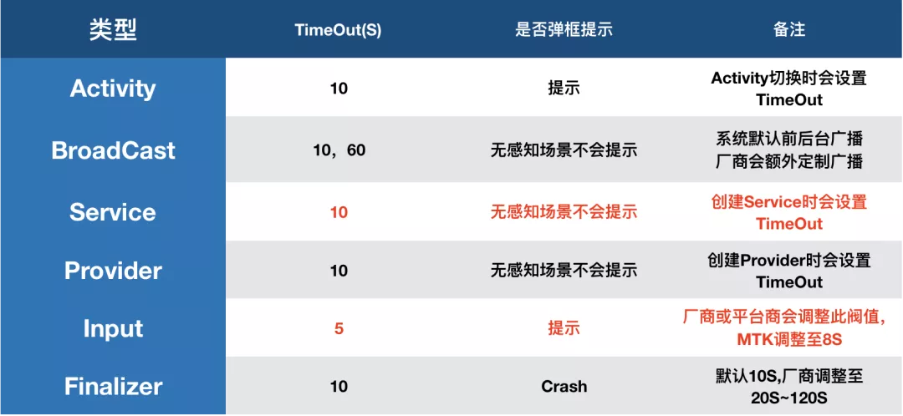
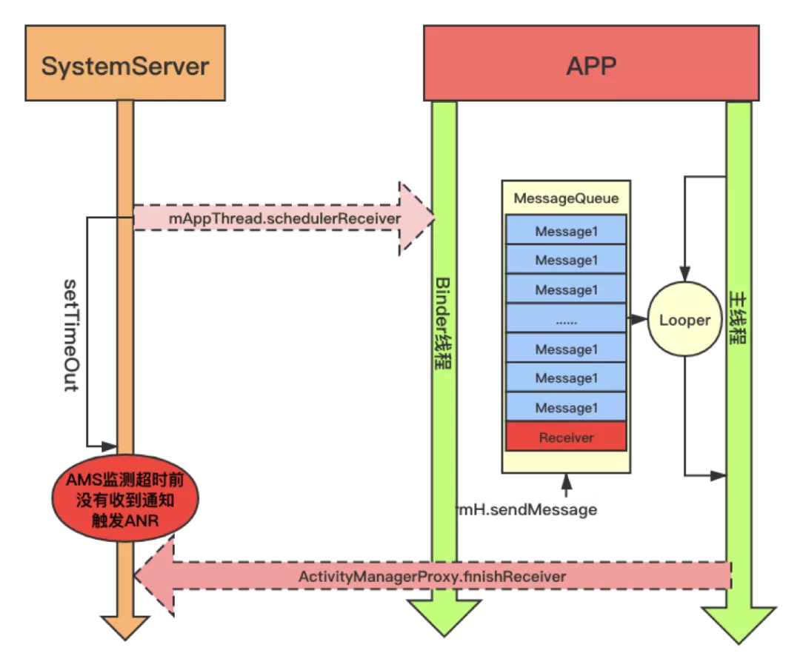

ANR全称 Applicatipon No Response指的是应用程序失去响应，对于ANR的处理很多人的第一反应是通过data/anr/trace.txt下的anr文件配合系统log来进行anr分析。但是有这些消息我们巨额能准确定位anr了吗？

# 什么情况会发生ANR



需要注意的是Activity的onCreate方法进行耗时操作并不会触发ANR(查看源码并没有找到对应的监测).

# 系统ANR的监控

在 [今日头条 ANR 优化实践系列 - 设计原理及影响因素](https://mp.weixin.qq.com/s?__biz=MzI1MzYzMjE0MQ==&mid=2247488116&idx=1&sn=fdf80fa52c57a3360ad1999da2a9656b&chksm=e9d0d996dea750807aadc62d7ed442948ad197607afb9409dd5a296b16fb3d5243f9224b5763&token=569762407&lang=zh_CN#rd)   中以广播为例介绍了anr的监测过程，我们这里用service来进行举例说明

服务的启动最后会调用ActiveServices#realStartServiceLocked 

```java
private final void realStartServiceLocked(ServiceRecord r,
            ProcessRecord app, boolean execInFg) throws RemoteException {
        ...
        //发送消息 开机对创建服务进行计时
        bumpServiceExecutingLocked(r, execInFg, "create");
        ...
        //通过ApplicationThread 的代理调用到对应的应用程序 创建服务
        app.thread.scheduleCreateService(r, r.serviceInfo,
                    mAm.compatibilityInfoForPackageLocked(r.serviceInfo.applicationInfo),
                    app.repProcState);
    }
```

ActivityThread#scheduleCreateService()

```java
public final void scheduleCreateService(IBinder token,
                ServiceInfo info, CompatibilityInfo compatInfo, int processState) {
            updateProcessState(processState, false);
            CreateServiceData s = new CreateServiceData();
            s.token = token;
            s.info = info;
            s.compatInfo = compatInfo;
            sendMessage(H.CREATE_SERVICE, s);
        }
        
        void sendMessage(int what, Object obj) {
        sendMessage(what, obj, 0, 0, false);
    }
     
private void sendMessage(int what, Object obj, int arg1, int arg2, boolean async) {
        if (DEBUG_MESSAGES) Slog.v(
            TAG, "SCHEDULE " + what + " " + mH.codeToString(what)
            + ": " + arg1 + " / " + obj);
        Message msg = Message.obtain();
        msg.what = what;
        msg.obj = obj;
        msg.arg1 = arg1;
        msg.arg2 = arg2;
        if (async) {
            msg.setAsynchronous(true);
        }
        mH.sendMessage(msg);
    }
```

根据[app卡顿系列一 ：Handler同步屏障](https://juejin.cn/post/7028215325627793439) 我们可以知道，此时使用的是同步消息如果当前消息队列存在耗时任务或者大量待处理的消息，有可能导致后续流程不能及时调度。

创建服务的过程最后会由ActivityThread#handleCreateService来进行处理。

```java
private void handleCreateService(CreateServiceData data) {
        // If we are getting ready to gc after going to the background, well
        // we are back active so skip it.
        unscheduleGcIdler();

        LoadedApk packageInfo = getPackageInfoNoCheck(
                data.info.applicationInfo, data.compatInfo);
        Service service = null;
        try {
            java.lang.ClassLoader cl = packageInfo.getClassLoader();
            //创建Service对象
            service = packageInfo.getAppFactory()
                    .instantiateService(cl, data.info.name, data.intent);
        } catch (Exception e) {
            if (!mInstrumentation.onException(service, e)) {
                throw new RuntimeException(
                    "Unable to instantiate service " + data.info.name
                    + ": " + e.toString(), e);
            }
        }

        try {
            if (localLOGV) Slog.v(TAG, "Creating service " + data.info.name);

            ContextImpl context = ContextImpl.createAppContext(this, packageInfo);
            context.setOuterContext(service);

            Application app = packageInfo.makeApplication(false, mInstrumentation);
            service.attach(context, this, data.info.name, data.token, app,
                    ActivityManager.getService());
            //调用Service 生命周期方法 onCreate
            service.onCreate();
            mServices.put(data.token, service);
            try {
                //通知 ActivityManagerService 解除本次anr 检测
                ActivityManager.getService().serviceDoneExecuting(
                        data.token, SERVICE_DONE_EXECUTING_ANON, 0, 0);
            } catch (RemoteException e) {
                throw e.rethrowFromSystemServer();
            }
        } catch (Exception e) {
            if (!mInstrumentation.onException(service, e)) {
                throw new RuntimeException(
                    "Unable to create service " + data.info.name
                    + ": " + e.toString(), e);
            }
        }
    }
```

ANR的检测与解除检测主要通过bumpServiceExecutingLocked 与serviceDoneExecuting 来完成，实现如下

```java
 private final void bumpServiceExecutingLocked(ServiceRecord r, boolean fg, String why) {
        ...
        scheduleServiceTimeoutLocked(r.app);
     	...
    }
```

```java
void scheduleServiceTimeoutLocked(ProcessRecord proc) {
        if (proc.executingServices.size() == 0 || proc.thread == null) {
            return;
        }
        Message msg = mAm.mHandler.obtainMessage(
                ActivityManagerService.SERVICE_TIMEOUT_MSG);
        msg.obj = proc;
        mAm.mHandler.sendMessageDelayed(msg,
                proc.execServicesFg ? SERVICE_TIMEOUT : SERVICE_BACKGROUND_TIMEOUT);
    }
```

可以看到服务的anr检测是通过ActivityManagerService的mHandler 发送延时消息来进行处理，如果到了固定时间没有移除消息就会爆ANR。而ActivityManagerService#serviceDoneExecuting 最终会调用ActiveServices#serviceDoneExecutingLocked 来移除对应的message消息。

由此我们可以知道Service的超时逻辑与广播类似：



图片来自：[今日头条 ANR 优化实践系列 - 设计原理及影响因素](https://mp.weixin.qq.com/s?__biz=MzI1MzYzMjE0MQ==&mid=2247488116&idx=1&sn=fdf80fa52c57a3360ad1999da2a9656b&chksm=e9d0d996dea750807aadc62d7ed442948ad197607afb9409dd5a296b16fb3d5243f9224b5763&token=569762407&lang=zh_CN#rd)

由此我们可以得出结论：

> 系统服务(AMS，InputService)在将具有超时属性的消息，如创建 Service，Receiver，Input 事件等，通过 Binder 或者其它 IPC 的方式发送到目标进程之后，便启动异步超时监测。而这种性质的监测完全是一种黑盒监测，并不是真的监控发送的消息在真实执行过程中是否超时，也就是说系统不管发送的这个消息有没有被执行，或者真实执行过程耗时有多久，只要在监控超时到来之前，服务端没有接收到通知，那么就判定为超时。

# ANR的捕获

