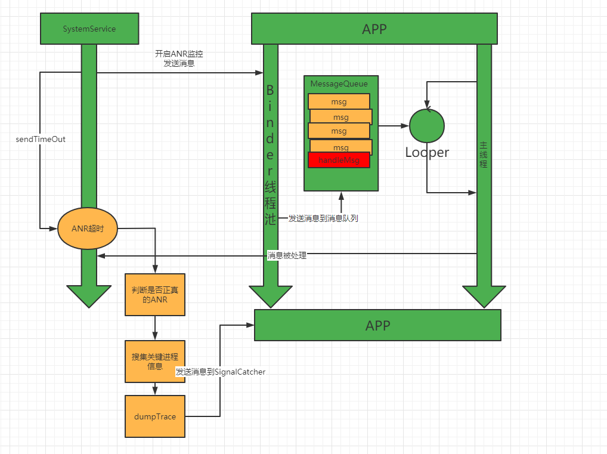
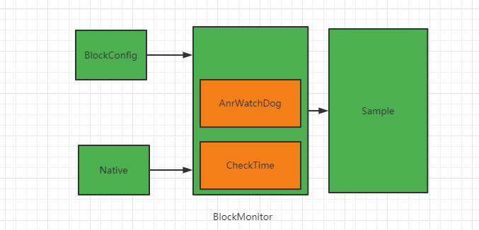

# 前言

在前面我们科普了关于app卡顿系统ANR原理的一些知识，其实都是先了解原理然后在落地实现方案。

[app卡顿系列一 ：Handler同步屏障](https://juejin.cn/post/7028215325627793439)

[app卡顿系列二 ：屏幕刷新机制学习](https://juejin.cn/post/7028580465388814349)

[app卡顿系列三 ：ANR原理](https://juejin.cn/post/7029332222540775437)

总结anr的监控流程如下：



从系统监控到anr到dumpTrace日志，有比较长的时间，所以系统抓取到的trace日志可能是正确的也有可能不正确。为了更好的分析anr发生时app的运行状况，需要对系统的anr采集消息进行不足。而这个就是头条所说的Raster方案。

# 方案落地：

在 [今日头条 ANR 优化实践系列 - 监控工具与分析思路](https://juejin.cn/post/6942665216781975582)中，raster主要是对主线程的调度过程进行监控。

1. 监控每一次消息分发处理的耗时情况，对消息进行聚合处理
2. 监控主线程的调度能力
3. 获取等待调度的堆栈

## 按照消息聚合的分内：

按照头条方案的描述我们将消息的聚合分成下面的几种类型

```java
//暂时没有使用
public static final int MSG_TYPE_NONE = 0x00;
//普通消息的聚合
    public static final int MSG_TYPE_INFO = 0x01;
//超过了指定消息需要发出警告
    public static final int MSG_TYPE_WARN = 0x02;
//发生ANR消息
    public static final int MSG_TYPE_ANR = 0x04;
    /**
     * 掉帧  
     * */
    public static final int MSG_TYPE_JANK = 0x08;
    /**
     * 连续两个消息之间的间隙
     * */
    public static final int MSG_TYPE_GAP = 0x10;
    /**
     * 通过ActivityThread$H handle 发送的消息
     * */
    public static final int MSG_TYPE_ACTIVITY_THREAD_H = 0x20;
```

## 耗时堆栈的获取

对于主线程的耗时监控采用给主线程的Looper设置Printer,每次开始处理消息的时候初始化开始时间，通过子线程watchDog，定时查询主线程消息处理是否超时，一旦发现超时，触发ANR消息。

这里有一个需要注意的点是：子线程发现主线程没在指定的时间内完成，触发了ANR消息的监控记录，但是此时我们在子线程无法获取到主线程的执行时间（或者我没有找到对应的api）。同时因为这个监控不是系统触发的后续会有下面的几个情况

1. 耗时消息很快结束，不会触发下一次ANR
2. 耗时消息非常长，又触发了下一次ANR监控
3. 触发了系统ANR的监控
4. 因为其它的一些原因app被杀死

为了更好的处理这些消息，在ANR触发的时候，会发送消息采集到ANR信息。并且在接收到消息被处理完成的时候会再次通知ANR消息采集完成。也就是说一个ANR消息，会有一次或者多次通知。

### 主线程堆栈的获取：

Thread提供了一个getStackTrace方法，这里面记录了每一个线程的函数调用栈情况。

```java
    public StackTraceElement[] getStackTrace() {
        StackTraceElement ste[] = VMStack.getThreadStackTrace(this);
        return ste != null ? ste : EmptyArray.STACK_TRACE_ELEMENT;
    }
```

## 获取penging消息

关于消息队列pengding消息的获取，主要有两种方式去获取

1. 通过反射拿到消息队列的每一个元素
2. 通过Looper#dump（）获取当前消息队列上的消息。

方式1的优点是通过反射我们可以拿到消息队列上的每一个消息的详细信息，但是反射比较损耗性能。

方式2通过使用系统提供API获取到的信息可以看做是一个字符串，处理不够灵活。

最终选用了方式2，虽然获取到的消息不够灵活，但是返回的消息基本上也能够达到我们想要的目的。

## 主线程调度能力检测

根据Checktime原理，我们会循环发送消息到主线程，通过判断消息的处理时间与预设时间的差值从侧面反应主线程的调度能力。

> ，**在每次调度前获取当前系统时间，然后减去我们设置延迟的时间，即可得到本次线程调度前的真实间隔时间，如设置线程每隔 300ms 调度一次，结果发现实际响应时间间隔有时会超过 300ms，如果偏差越大，则说明线程没有被及时调度，进一步反映系统响应能力变差。**


## 添加系统ANR监控

通过anr原理的学习可以知道如果只是监听主线程的每一次消息分发的耗时，是不能全部监控系统发生ANR的场景的。

比如因为消息队列有大量待处理的不耗时消息等待处理，导致系统的监控不能及时解除。那么系统发生ANR的时候，我们的监控工具却没有丝毫反应。

因此我们需要在系统监控到APP发生ANR的时候做出相应的响应。

而要实现这个功能可以通过监听 SIGNALQUIT 信号来完成。

## 关于jank的监控

根据前面的学习我们知道当系统打印

```java
Log.i(TAG, "Skipped " + skippedFrames + " frames!  "               + "The application may be doing too much work on its main thread.");
```

表示主线程因为执行其它耗时任务，导致更新ui的操作不能及时执行。因为同步屏障的存在，消息队列有较多待处理的消息并不会造成ui卡顿（异步消息除外）。

而我们的jank监控与系统打印主线程耗时有所不同，系统监控的是从发送消息到消息执行的时间间隔。而我们监控的是doFrame的整个执行时间。根据我们对屏幕刷新机制的学习。doFrame基本上从侧面反应了View的三大流程的耗时。

关于某条消息是不是在更新ui，我们通过阅读源码发现只有更新ui时才会有handler为android.view.Choreographer$FrameHandler 。callback为android.view.Choreographer$FrameDisplayEventReceiver

```java
 /**
     * 判断某条消息是不是在更新ui
     * */
    public static boolean isBoxMessageDoFrame(BoxMessage message){
        return message != null && "android.view.Choreographer$FrameHandler".equals(message.getHandleName()) && message.getCallbackName().contains("android.view.Choreographer$FrameDisplayEventReceiver");
    }
```

# 代码整体设计



代码的实现大致分成4个部分：

1. BlockConfig  负责配置监控参数
2. Native  native主要是负责监听SIGNAL   QUIT 信息，代码的实现借鉴了(ctrl c  + ctrl v)爱奇艺的 [xCrash](https://github.com/iqiyi/xCrash)  在将anr信号发送给BlockMonitor后又会将信号发送给signal Catcher线程，从而还原原来的anr处理流程。
3. BlockMonitor是整个监控的核心，内部实现了Looper对每一个消息的分发监听。同时通过watchDog思想监控anr的发生,通过给主线程发送消息监控主线程的调度能力。
4. sample部分作为收集日志信息的转出口。通过BlockConfig配置对应的监听，能够实现自定义的日志处理。

# 项目命名

头条是这样来进行说明的：

> ### 工具介绍：
>
> 该工具主要是在主线程消息调度过程进行监控，并按照一定策略聚合，以保证监控工具本身对应用性能和内存抖动影响降至最低。同时对应用四大组件消息执行过程进行监控，便于对这类消息的调度及耗时情况进行跟踪和记录。另外对当前正在调度的消息及消息队列中待调度消息进行统计，从而在发生问题时，可以回放主线程的整体调度情况。此外，我们将系统服务的 CheckTime 机制迁移到应用侧，应用为线程 CheckTime 机制，以便于系统信息不足时，从线程调度及时性推测过去一段时间系统负载和调度情况。
>
> 因此该工具用一句话来概括就是：由点到面，回放过去，现在和将来。
>
> 因其实现原理和消息聚合后的效果，直观展示主线程调度过程长短不一的耗时片段，犹如一道道光栅，故将该工具命名为 **Raster[ˈræstər]**。

虽然头条现在框架没有开源，但是为了有别于头条的方案，也根据该工具的概括----由点到面，回放过去，现在和将来。我将这个命名为 **月光宝盒**  

当我们口念 波诺波诺密 的时候，它能够回到过去，让我们知道anr发生之前，主线线程消息队列的调度情况。

# 代码地址：

https://github.com/xiaolutang/MoonlightTreasureBox

# 关于版本正式发布

现阶段主要的代码功能已经完成，还有一些文档和细节需要完善。同时也希望有经验的大佬能够在正式版本发布之前能够给予一些指导，和查看还有那些功能点需要完善。

文章参考：

[今日头条 ANR 优化实践系列 - 设计原理及影响因素](https://juejin.cn/post/6940061649348853796)

[今日头条 ANR 优化实践系列 - 监控工具与分析思路](https://juejin.cn/post/6942665216781975582#heading-16)

