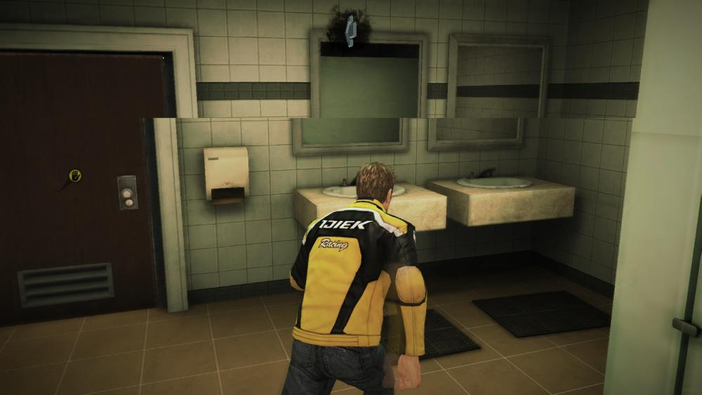

# 显示系统的基础知识

我们手机app内容的呈现会经过 CPU、GPU、DISPLAY 三个部分，CPU负责吧数据计算好交给GPU, GPU会对图形数据进行渲染，然后硬件负责把渲染后的内容呈现到屏幕上，GPU和DISPLAY会不停的协作，将GPU的数据渲染屏幕上。

## 画面撕裂

那么GPU和DISPLAY是如何进行协作的呢？我们需要了解这两个概念

 **刷新频率（Refresh Rate）：**代表了屏幕在一秒内刷新屏幕的次数，这取决于硬件的固定参数，例如60Hz。

**帧率（Frame Rate）：**代表了GPU在一秒内绘制操作的帧数，例如30fps，60fps。

当刷新频率和帧率不一致的时候非常容易出现画面撕裂（Tearing）现象。

图片来源于网络

### 造成画面撕裂的原因

> 显示器并不是一次性将画面显示到屏幕上，而是从左到右边，从上到下逐行扫描，顺序显示整屏的一个个像素点，不过这一过程快到人眼无法察觉到变化。

因爲