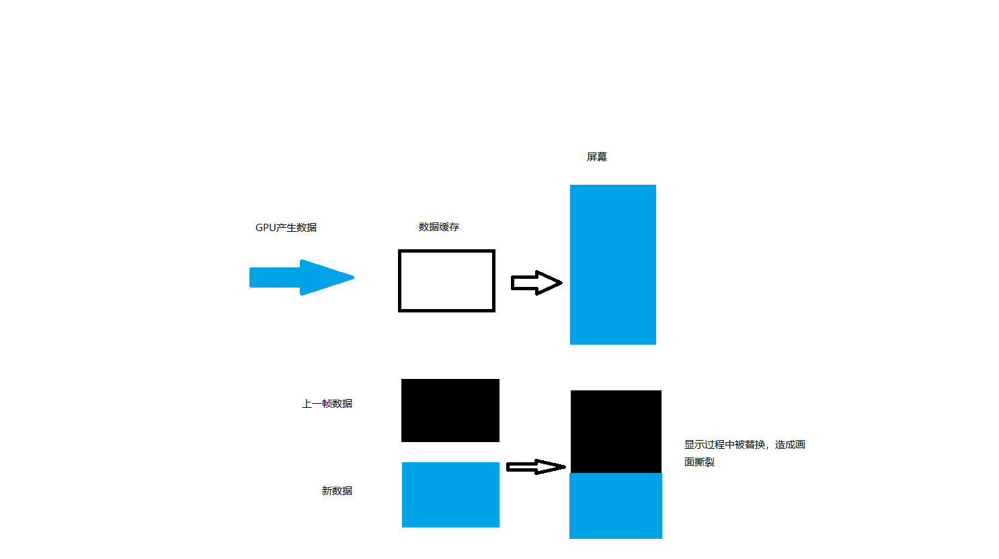

文章的来源主要有两个部分：

[“终于懂了” 系列：Android屏幕刷新机制—VSync、Choreographer 全面理解！](https://juejin.cn/post/6863756420380196877#heading-7)

Android系统源码阅读。

# 显示系统的基础知识

我们手机app内容的呈现会经过 CPU、GPU、DISPLAY 三个部分，CPU负责吧数据计算好交给GPU, GPU会对图形数据进行渲染，然后硬件负责把渲染后的内容呈现到屏幕上，GPU和DISPLAY会不停的协作，将GPU的数据渲染屏幕上。

## 画面撕裂

那么GPU和DISPLAY是如何进行协作的呢？我们需要了解这两个概念

 **刷新频率（Refresh Rate）：**代表了屏幕在一秒内刷新屏幕的次数，这取决于硬件的固定参数，例如60Hz。

**帧率（Frame Rate）：**代表了GPU在一秒内绘制操作的帧数，例如30fps，60fps。

当刷新频率和帧率不一致的时候非常容易出现画面撕裂（Tearing）现象。


图片来源于网络

造成画面撕裂的原因

> 显示器并不是一次性将画面显示到屏幕上，而是从左到右边，从上到下逐行扫描，顺序显示整屏的一个个像素点，不过这一过程快到人眼无法察觉到变化。

在这里可以把GPU/CPU看做生产者，DISPLAY看做消费者，GPU/CPU准备好数据，对缓存区域的替换在一瞬间完成，而此时DISPLAY正在显示的过程中，那么上半部分显示的是原来的内容，下半部分就是新替换的内容，这就造成了画面撕裂。



## 双缓冲&VSync

### 双缓冲

双缓冲就是GPU和DISPLAY各自拥有自己的缓冲区域，GPU始终将准备好的数据给到Back Buffer,DISPLAY使用Frame Buffer。在屏幕刷新的过程中Frame Buffer 并不会发生改变，当Back buffer准备好后，他们才能进行交换。

### VSync

使用双缓冲的时候什么时候进行Frame buffer 和 Back Buffer的数据交换呢？

> 当扫描完一个屏幕后，设备需要重新回到第一行以进入下一次的循环，此时有一段时间空隙，称为VerticalBlanking Interval(VBI)。那，这个时间点就是我们进行缓冲区交换的最佳时间。因为此时屏幕没有在刷新，也就避免了交换过程中出现 screen tearing的状况。
>
> **VSync**(垂直同步)是VerticalSynchronization的简写，它利用VBI时期出现的vertical sync pulse（垂直同步脉冲）来保证双缓冲在最佳时间点才进行交换。另外，交换是指各自的内存地址，可以认为该操作是瞬间完成。

# Android 屏幕刷新机制

## 4.1之前的问题

在4.1之前Android也是使用双缓冲+VSync 机制来进行显示


> 以时间的顺序来看下将会发生的过程：
>
> 1. Display显示第0帧数据，此时CPU和GPU渲染第1帧画面，且在Display显示下一帧前完成
> 2. 因为渲染及时，Display在第0帧显示完成后，也就是第1个VSync后，缓存进行交换，然后正常显示第1帧
> 3. 接着第2帧开始处理，是直到第2个VSync快来前才开始处理的。
> 4. 第2个VSync来时，由于第2帧数据还没有准备就绪，缓存没有交换，显示的还是第1帧。这种情况被Android开发组命名为“Jank”，即发生了**丢帧**。
> 5. 当第2帧数据准备完成后，它并不会马上被显示，而是要等待下一个VSync 进行缓存交换再显示。
>
> 双缓存的交换 是在Vsyn到来时进行，交换后屏幕会取Frame buffer内的新数据，而实际 此时的Back buffer 就可以供GPU准备下一帧数据了。 如果 Vsyn到来时  CPU/GPU就开始操作的话，是有完整的16.6ms的，这样应该会基本避免jank的出现了

## drawing with VSync

> 为了优化显示性能，Google在Android 4.1系统中对Android Display系统进行了重构，实现了Project Butter（黄油工程）：系统在收到VSync pulse后，将马上开始下一帧的渲染。即**一旦收到VSync通知（16ms触发一次），CPU和GPU 才立刻开始计算然后把数据写入buffer**。如下图： 
>
>  
>
> CPU/GPU根据VSYNC信号同步处理数据，可以让CPU/GPU有完整的16ms时间来处理数据，减少了jank。
>
> 一句话总结，**VSync同步使得CPU/GPU充分利用了16.6ms时间，减少jank。**

上面的总结不是特别准确 个人的理解应该是

VSync同步使得CPU+GPU充分利用了16.6ms时间，减少jank。

双缓冲的问题：当CPU/GPU的处理时间较长，超过了16.6ms


> 1. 在第二个时间段内，但却因 GPU 还在处理 B 帧，缓存没能交换，导致 A 帧被重复显示。
> 2. 而B完成后，又因为缺乏VSync pulse信号，它只能等待下一个signal的来临。于是在这一过程中，有一大段时间是被浪费的。
> 3. 当下一个VSync出现时，CPU/GPU马上执行操作（A帧），且缓存交换，相应的显示屏对应的就是B。这时看起来就是正常的。只不过由于执行时间仍然超过16ms，导致下一次应该执行的缓冲区交换又被推迟了——如此循环反复，便出现了越来越多的“Jank”。
>
> **为什么 CPU 不能在第二个 16ms 处理绘制工作呢？**
>
> 原因是只有两个 buffer，Back buffer正在被GPU用来处理B帧的数据， Frame buffer的内容用于Display的显示，这样两个buffer都被占用，CPU 则无法准备下一帧的数据。 那么，如果再提供一个buffer，CPU、GPU 和显示设备都能使用各自的buffer工作，互不影响。


## 三缓冲：

> **三缓存**就是在双缓冲机制基础上增加了一个 Graphic Buffer 缓冲区，这样可以最大限度的利用空闲时间，带来的坏处是多使用的一个 Graphic Buffer 所占用的内存。


> 1. 第一个Jank，是不可避免的。但是在第二个 16ms 时间段，CPU/GPU 使用 **第三个 Buffer** 完成C帧的计算，虽然还是会多显示一次 A 帧，但后续显示就比较顺畅了，有效避免 Jank 的进一步加剧。
> 2. 注意在第3段中，A帧的计算已完成，但是在第4个vsync来的时候才显示，如果是双缓冲，那在第三个vynsc就可以显示了。
>
> **三缓冲有效利用了等待vysnc的时间，减少了jank，但是带来了延迟。** 所以，是不是 Buffer 越多越好呢？这个是否定的，Buffer 正常还是两个，当出现 Jank 后三个足以。


# Choreographer的工作过程

谷歌在4.1之后引入了Choreographer，Choreographer的中文翻译是编舞，编导。对于屏幕刷新而言Choreographer的工作职责是发起并接受底层的VSync信号。工作流程如图


## ViewRootImpl#requestLayout

view的requestLayout最终会调用ViewRootImpl#requestLayout，DecorView的parent是ViewRootImpl

```java
 @Override
    public void requestLayout() {
        if (!mHandlingLayoutInLayoutRequest) {
            //检查是不是在主线程发起ui更新请求
            checkThread();
            mLayoutRequested = true;
            scheduleTraversals();
        }
    }


 void scheduleTraversals() {
        if (!mTraversalScheduled) {
            //这个标记防止多次重复调用该方法，在接收并处理VSync或者取消本次更新ui请求的时候会被重置
            mTraversalScheduled = true;
            //发起一个同步屏障消息
            mTraversalBarrier = mHandler.getLooper().getQueue().postSyncBarrier();
            //发送消息监听垂直同步信息
            mChoreographer.postCallback(
                    Choreographer.CALLBACK_TRAVERSAL, mTraversalRunnable, null);
            if (!mUnbufferedInputDispatch) {
                scheduleConsumeBatchedInput();
            }
            //发送一个消息通知
            notifyRendererOfFramePending();
            pokeDrawLockIfNeeded();
        }
    }
```

小结：ViewRootImpl在向Choreographer 请求更新ui的时候主要的工作是 

1. 检测当前发起更新ui的线程.
2. 给消息队列发送一个同步屏障。当消息队列中存在同步屏障的时候，会优先处理异步消息，而更新ui的消息就是异步消息。

## Choreographer


### Choreographer#postCallback

```java
 public void postCallback(int callbackType, Runnable action, Object token) {
        postCallbackDelayed(callbackType, action, token, 0);
    }
    
    
    public void postCallbackDelayed(int callbackType,
            Runnable action, Object token, long delayMillis) {
        if (action == null) {
            throw new IllegalArgumentException("action must not be null");
        }
        if (callbackType < 0 || callbackType > CALLBACK_LAST) {
            throw new IllegalArgumentException("callbackType is invalid");
        }

        postCallbackDelayedInternal(callbackType, action, token, delayMillis);
    }

private void postCallbackDelayedInternal(int callbackType,
            Object action, Object token, long delayMillis) {
        if (DEBUG_FRAMES) {
            Log.d(TAG, "PostCallback: type=" + callbackType
                    + ", action=" + action + ", token=" + token
                    + ", delayMillis=" + delayMillis);
        }

        synchronized (mLock) {
            final long now = SystemClock.uptimeMillis();
            final long dueTime = now + delayMillis;
            //将对应类型的callbackType 添加到队列中
            mCallbackQueues[callbackType].addCallbackLocked(dueTime, action, token);
			//一般而言都是走这个位置，但是在TextView中会发送延迟消息。
            if (dueTime <= now) {
                scheduleFrameLocked(now);
            } else {
                Message msg = mHandler.obtainMessage(MSG_DO_SCHEDULE_CALLBACK, action);
                msg.arg1 = callbackType;
                msg.setAsynchronous(true);
                mHandler.sendMessageAtTime(msg, dueTime);
            }
        }
    }
```

### Choreographer#scheduleFrameLocked

```java
 private void scheduleFrameLocked(long now) {
        if (!mFrameScheduled) {
            mFrameScheduled = true;
            if (USE_VSYNC) {//这个是一个配置项是否启用垂直同步，一般是启用的
                if (DEBUG_FRAMES) {
                    Log.d(TAG, "Scheduling next frame on vsync.");
                }

                // If running on the Looper thread, then schedule the vsync immediately,
                // otherwise post a message to schedule the vsync from the UI thread
                // as soon as possible.
                if (isRunningOnLooperThreadLocked()) {//如果是在主线程，直接调用不在主线程的话发送handler消息调用scheduleVsyncLocked
                    scheduleVsyncLocked();
                } else {
                    Message msg = mHandler.obtainMessage(MSG_DO_SCHEDULE_VSYNC);
                    msg.setAsynchronous(true);
                    mHandler.sendMessageAtFrontOfQueue(msg);
                }
            } else {
                final long nextFrameTime = Math.max(
                        mLastFrameTimeNanos / TimeUtils.NANOS_PER_MS + sFrameDelay, now);
                if (DEBUG_FRAMES) {
                    Log.d(TAG, "Scheduling next frame in " + (nextFrameTime - now) + " ms.");
                }
                Message msg = mHandler.obtainMessage(MSG_DO_FRAME);
                msg.setAsynchronous(true);
                mHandler.sendMessageAtTime(msg, nextFrameTime);
            }
        }
    }
```

Choreographer#scheduleVsyncLocked

```java
private void scheduleVsyncLocked() {
        mDisplayEventReceiver.scheduleVsync();
    }
```

## FrameDisplayEventReceiver

mDisplayEventReceiver是FrameDisplayEventReceiver的实例对象，它的scheduleVsync方法在FrameDisplayEventReceiver的父类DisplayEventReceiver

### DisplayEventReceiver#scheduleVsync

```java
 public void scheduleVsync() {
        if (mReceiverPtr == 0) {
            Log.w(TAG, "Attempted to schedule a vertical sync pulse but the display event "
                    + "receiver has already been disposed.");
        } else {
            nativeScheduleVsync(mReceiverPtr);
        }
    }
```

nativeScheduleVsync的底层实现主要是重置是否分发垂直同步信号的标记，等待接收下一次垂直同步信息，在垂直同步信息分发之后会重置该标记，因此VSync信息不会每次都被应用接收到，每一次接收都对应着一次请求，不请求就不接收。

### DisplayEventReceiver#dispatchVsync

```java
// Called from native code.
    @SuppressWarnings("unused")
    private void dispatchVsync(long timestampNanos, int builtInDisplayId, int frame) {
        onVsync(timestampNanos, builtInDisplayId, frame);
    }


```

DisplayEventReceiver#dispatchVsync负责接收底层调用的垂直同步信息然后调用onVsync 。

### FrameDisplayEventReceiver

 在DisplayEventReceiver中onVsync为空实现，具体的逻辑在它的子类FrameDisplayEventReceiver

```java
 private final class FrameDisplayEventReceiver extends DisplayEventReceiver
            implements Runnable {
        private boolean mHavePendingVsync;
        private long mTimestampNanos;
        private int mFrame;

        public FrameDisplayEventReceiver(Looper looper, int vsyncSource) {
            super(looper, vsyncSource);
        }

        @Override
        public void onVsync(long timestampNanos, int builtInDisplayId, int frame) {
            // Ignore vsync from secondary display.
            // This can be problematic because the call to scheduleVsync() is a one-shot.
            // We need to ensure that we will still receive the vsync from the primary
            // display which is the one we really care about.  Ideally we should schedule
            // vsync for a particular display.
            // At this time Surface Flinger won't send us vsyncs for secondary displays
            // but that could change in the future so let's log a message to help us remember
            // that we need to fix this.
            if (builtInDisplayId != SurfaceControl.BUILT_IN_DISPLAY_ID_MAIN) {
                Log.d(TAG, "Received vsync from secondary display, but we don't support "
                        + "this case yet.  Choreographer needs a way to explicitly request "
                        + "vsync for a specific display to ensure it doesn't lose track "
                        + "of its scheduled vsync.");
                scheduleVsync();
                return;
            }

            // Post the vsync event to the Handler.
            // The idea is to prevent incoming vsync events from completely starving
            // the message queue.  If there are no messages in the queue with timestamps
            // earlier than the frame time, then the vsync event will be processed immediately.
            // Otherwise, messages that predate the vsync event will be handled first.
            long now = System.nanoTime();
            if (timestampNanos > now) {//更正时间戳，并打印日志提醒开发者检测 图形系统的时间是否有问题
                Log.w(TAG, "Frame time is " + ((timestampNanos - now) * 0.000001f)
                        + " ms in the future!  Check that graphics HAL is generating vsync "
                        + "timestamps using the correct timebase.");
                timestampNanos = now;
            }

            if (mHavePendingVsync) {
                Log.w(TAG, "Already have a pending vsync event.  There should only be "
                        + "one at a time.");
            } else {
                mHavePendingVsync = true;
            }

            mTimestampNanos = timestampNanos;
            mFrame = frame;
            //第二个参数是this 最终会执行自身的run
            Message msg = Message.obtain(mHandler, this);
            msg.setAsynchronous(true);
            mHandler.sendMessageAtTime(msg, timestampNanos / TimeUtils.NANOS_PER_MS);
        }

        @Override
        public void run() {
            mHavePendingVsync = false;
            doFrame(mTimestampNanos, mFrame);
        }
    }
```

可以看到底层的垂直同步信号与doFrame会经过handler将消息的处理切换到主线程，如果此时主线程正在执行耗时操作，虽然有同步屏障保证，但是也有可能造成丢帧。


## Choreographer

doFrame是Choreographer的一个内部方法

### Choreographer#doFrame

```java
void doFrame(long frameTimeNanos, int frame) {
        final long startNanos;
        synchronized (mLock) {
            if (!mFrameScheduled) {
                return; // no work to do
            }

            if (DEBUG_JANK && mDebugPrintNextFrameTimeDelta) {
                mDebugPrintNextFrameTimeDelta = false;
                Log.d(TAG, "Frame time delta: "
                        + ((frameTimeNanos - mLastFrameTimeNanos) * 0.000001f) + " ms");
            }

            long intendedFrameTimeNanos = frameTimeNanos;
            startNanos = System.nanoTime();
            //doframe  调用过慢 虽然有同步屏障来保证异步消息先执行，发生丢帧
            final long jitterNanos = startNanos - frameTimeNanos;
            //mFrameIntervalNanos  是根据屏幕刷新频率计算出来的，Android 的屏幕刷新频率一般是60 但是也可能有其它的
            if (jitterNanos >= mFrameIntervalNanos) {
                final long skippedFrames = jitterNanos / mFrameIntervalNanos;
                //这个可以检测到发起ui更新之后的耗时操作，但是先由耗时操作在进行ui更新的话不一定能够检测   还有这个应该没办法检测三大流程的耗时
                if (skippedFrames >= SKIPPED_FRAME_WARNING_LIMIT) {
                    Log.i(TAG, "Skipped " + skippedFrames + " frames!  "
                            + "The application may be doing too much work on its main thread.");
                }
                final long lastFrameOffset = jitterNanos % mFrameIntervalNanos;
                if (DEBUG_JANK) {
                    Log.d(TAG, "Missed vsync by " + (jitterNanos * 0.000001f) + " ms "
                            + "which is more than the frame interval of "
                            + (mFrameIntervalNanos * 0.000001f) + " ms!  "
                            + "Skipping " + skippedFrames + " frames and setting frame "
                            + "time to " + (lastFrameOffset * 0.000001f) + " ms in the past.");
                }
                frameTimeNanos = startNanos - lastFrameOffset;
            }

            if (frameTimeNanos < mLastFrameTimeNanos) {
                if (DEBUG_JANK) {
                    Log.d(TAG, "Frame time appears to be going backwards.  May be due to a "
                            + "previously skipped frame.  Waiting for next vsync.");
                }
                scheduleVsyncLocked();
                return;
            }

            if (mFPSDivisor > 1) {
                long timeSinceVsync = frameTimeNanos - mLastFrameTimeNanos;
                if (timeSinceVsync < (mFrameIntervalNanos * mFPSDivisor) && timeSinceVsync > 0) {
                    scheduleVsyncLocked();
                    return;
                }
            }

            mFrameInfo.setVsync(intendedFrameTimeNanos, frameTimeNanos);
            mFrameScheduled = false;
            mLastFrameTimeNanos = frameTimeNanos;
        }

        try {
            Trace.traceBegin(Trace.TRACE_TAG_VIEW, "Choreographer#doFrame");
            AnimationUtils.lockAnimationClock(frameTimeNanos / TimeUtils.NANOS_PER_MS);

            mFrameInfo.markInputHandlingStart();
            doCallbacks(Choreographer.CALLBACK_INPUT, frameTimeNanos);

            mFrameInfo.markAnimationsStart();
            doCallbacks(Choreographer.CALLBACK_ANIMATION, frameTimeNanos);

            mFrameInfo.markPerformTraversalsStart();
            //requestLayout 传递的type
            doCallbacks(Choreographer.CALLBACK_TRAVERSAL, frameTimeNanos);

            doCallbacks(Choreographer.CALLBACK_COMMIT, frameTimeNanos);
        } finally {
            AnimationUtils.unlockAnimationClock();
            Trace.traceEnd(Trace.TRACE_TAG_VIEW);
        }

        if (DEBUG_FRAMES) {
            final long endNanos = System.nanoTime();
            Log.d(TAG, "Frame " + frame + ": Finished, took "
                    + (endNanos - startNanos) * 0.000001f + " ms, latency "
                    + (startNanos - frameTimeNanos) * 0.000001f + " ms.");
        }
    }
```

计算丢失多少帧的算法是：偏差时间/每帧时间   每帧的时间是根据屏幕刷新频率计算而来的，对于Android设备而言大不部分是60 但是也有其他的

### Choreographer#doCallbacks

```java
void doCallbacks(int callbackType, long frameTimeNanos) {
        CallbackRecord callbacks;
        synchronized (mLock) {
            // We use "now" to determine when callbacks become due because it's possible
            // for earlier processing phases in a frame to post callbacks that should run
            // in a following phase, such as an input event that causes an animation to start.
            final long now = System.nanoTime();
            callbacks = mCallbackQueues[callbackType].extractDueCallbacksLocked(
                    now / TimeUtils.NANOS_PER_MS);
            if (callbacks == null) {
                return;
            }
            mCallbacksRunning = true;
            if (callbackType == Choreographer.CALLBACK_COMMIT) {
                final long jitterNanos = now - frameTimeNanos;
                Trace.traceCounter(Trace.TRACE_TAG_VIEW, "jitterNanos", (int) jitterNanos);
                if (jitterNanos >= 2 * mFrameIntervalNanos) {
                    final long lastFrameOffset = jitterNanos % mFrameIntervalNanos
                            + mFrameIntervalNanos;
                    if (DEBUG_JANK) {
                        Log.d(TAG, "Commit callback delayed by " + (jitterNanos * 0.000001f)
                                + " ms which is more than twice the frame interval of "
                                + (mFrameIntervalNanos * 0.000001f) + " ms!  "
                                + "Setting frame time to " + (lastFrameOffset * 0.000001f)
                                + " ms in the past.");
                        mDebugPrintNextFrameTimeDelta = true;
                    }
                    frameTimeNanos = now - lastFrameOffset;
                    mLastFrameTimeNanos = frameTimeNanos;
                }
            }
        }
        try {
            Trace.traceBegin(Trace.TRACE_TAG_VIEW, CALLBACK_TRACE_TITLES[callbackType]);
            for (CallbackRecord c = callbacks; c != null; c = c.next) {
                if (DEBUG_FRAMES) {
                    Log.d(TAG, "RunCallback: type=" + callbackType
                            + ", action=" + c.action + ", token=" + c.token
                            + ", latencyMillis=" + (SystemClock.uptimeMillis() - c.dueTime));
                }
                c.run(frameTimeNanos);
            }
        } finally {
            synchronized (mLock) {
                mCallbacksRunning = false;
                do {
                    final CallbackRecord next = callbacks.next;
                    recycleCallbackLocked(callbacks);
                    callbacks = next;
                } while (callbacks != null);
            }
            Trace.traceEnd(Trace.TRACE_TAG_VIEW);
        }
    }
```

## ViewRootImpl$TraversalRunnable

在requestLayout的过程中分装的CallbackRecord最终会调用到ViewRootImpl$TraversalRunnable

```
final class TraversalRunnable implements Runnable {
        @Override
        public void run() {
            doTraversal();
        }
    }
```

## ViewRootImpl#doTraversal

```java
void doTraversal() {
    if (mTraversalScheduled) {
        mTraversalScheduled = false;
        //移除同步屏障
        mHandler.getLooper().getQueue().removeSyncBarrier(mTraversalBarrier);

        if (mProfile) {
            Debug.startMethodTracing("ViewAncestor");
        }
		//开始View布局流程
        performTraversals();

        if (mProfile) {
            Debug.stopMethodTracing();
            mProfile = false;
        }
    }
}
```

Choreographer对上承接ViewRootImpl 发起的屏幕刷新请求，对下监听垂直同步信号，调用ViewRootImpl 进行ui更新。

## 小结：app卡顿原因

外部：

内存紧张，频繁gc导致ui线程被暂停 

其它线程/进程 频繁抢占CPU app 因为得不到cpu而产生卡顿现象

内部：

消息队列中存在耗时的操作，导致doframe不能及时执行卡顿

view布局流程耗时导致cpu不能及时准备好GPU所需要的数据

消息队列中有其它的异步消息，导致doframe不能及时执行（我们在app开发中慎用异步消息）。

# 卡顿监控

对于应用的卡顿许多时候我们难以复现，并且如果在线上环境，用户上报卡顿如果没有对应的日志信息。针对卡段我们几乎难以下手。

## 利用UI线程的Looper

```java
public static void loop() {
        final Looper me = myLooper();
        if (me == null) {
            throw new RuntimeException("No Looper; Looper.prepare() wasn't called on this thread.");
        }
        final MessageQueue queue = me.mQueue;

        ...

        boolean slowDeliveryDetected = false;

        for (;;) {
            Message msg = queue.next(); // might block
            if (msg == null) {
                // No message indicates that the message queue is quitting.
                return;
            }

            // This must be in a local variable, in case a UI event sets the logger
            final Printer logging = me.mLogging;
            if (logging != null) {
                logging.println(">>>>> Dispatching to " + msg.target + " " +
                        msg.callback + ": " + msg.what);
            }

            final long traceTag = me.mTraceTag;
            long slowDispatchThresholdMs = me.mSlowDispatchThresholdMs;
            long slowDeliveryThresholdMs = me.mSlowDeliveryThresholdMs;
            if (thresholdOverride > 0) {
                slowDispatchThresholdMs = thresholdOverride;
                slowDeliveryThresholdMs = thresholdOverride;
            }
            final boolean logSlowDelivery = (slowDeliveryThresholdMs > 0) && (msg.when > 0);
            final boolean logSlowDispatch = (slowDispatchThresholdMs > 0);

            final boolean needStartTime = logSlowDelivery || logSlowDispatch;
            final boolean needEndTime = logSlowDispatch;

            if (traceTag != 0 && Trace.isTagEnabled(traceTag)) {
                Trace.traceBegin(traceTag, msg.target.getTraceName(msg));
            }

            final long dispatchStart = needStartTime ? SystemClock.uptimeMillis() : 0;
            final long dispatchEnd;
            try {
                msg.target.dispatchMessage(msg);
                dispatchEnd = needEndTime ? SystemClock.uptimeMillis() : 0;
            } finally {
                if (traceTag != 0) {
                    Trace.traceEnd(traceTag);
                }
            }
            if (logSlowDelivery) {
                if (slowDeliveryDetected) {
                    if ((dispatchStart - msg.when) <= 10) {
                        Slog.w(TAG, "Drained");
                        slowDeliveryDetected = false;
                    }
                } else {
                    if (showSlowLog(slowDeliveryThresholdMs, msg.when, dispatchStart, "delivery",
                            msg)) {
                        // Once we write a slow delivery log, suppress until the queue drains.
                        slowDeliveryDetected = true;
                    }
                }
            }
            //通过这个也可以设置当消息分发超过指定的时间就打印日志
            if (logSlowDispatch) {
                showSlowLog(slowDispatchThresholdMs, dispatchStart, dispatchEnd, "dispatch", msg);
            }

            if (logging != null) {
                logging.println("<<<<< Finished to " + msg.target + " " + msg.callback);
            }

           ...
        }
    }
```

Looper轮循的时候，每次从消息队列取出一条消息，如果logging不为空，就会调用 logging.println，我们可以通过设置Printer，计算Looper两次获取消息的时间差，如果时间太长就说明Handler处理时间过长，直接把堆栈信息打印出来，就可以定位到耗时代码

在生产环境我们可以通过设置looper的分发耗时检测来观察控制台的日志打印，查看是否有卡顿。在线上环境我们可以集成BlockCanary来采集卡顿日志。

```java
 /**
     * Set a thresholds for slow dispatch/delivery log.
     * {@hide}
     */
    public void setSlowLogThresholdMs(long slowDispatchThresholdMs, long slowDeliveryThresholdMs) {
        mSlowDispatchThresholdMs = slowDispatchThresholdMs;
        mSlowDeliveryThresholdMs = slowDeliveryThresholdMs;
    }
```

## 看门狗思想

通过指定间隔时间，不断的向主线程消息队列发消息，如果对应的消息在指定时间内没有被处理，那么认为发生了卡顿。

例如：

```java
 Handler handler = new Handler(getMainLooper());
        boolean handleFlag = true;
        int interval = 1000;//每隔1s检测一次
        //开启一个线程不断检测
        new Thread(new Runnable() {
            @Override
            public void run() {
                while (true){
                    if(!handleFlag){
                        Log.d(TAG,"app 卡顿");
                    }else {
                        //主线程handler 重置标记
                        handler.postDelayed(new Runnable() {
                            @Override
                            public void run() {
                                handleFlag = true;
                            }
                        },interval);//
                    }
                    handleFlag = false;
                    SystemClock.sleep(interval);
                }
            }
        }).start();
```

问题，不论是通过Looper打印还是看么狗思想都会存在一个问题


在某段时间内运行abc三个方法，如果使用LooperPrint 来检查，A:500ms  B: 400ms C:200ms  每隔1检测，那么很大概率每次检测耗时都发生在C方法

如果是看门狗思想，那么很可能每次检测的位置都不一样。因为不能确定发起的检查的时间点在哪个位置。

## 插桩

在编译的过程中在方法的出口和入口添加监控的代码。


tip:消息队列同步消息多，因为同步屏障的存在不会引起卡顿（排假设每个消息的处理都非常快），但是很有可能触发anr。