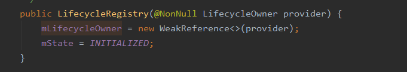

# Lifecycle概述

Lifecycle可以用来感知activity和Fragment的生命周期变化

举例：在 使用Lifecycle之前我们在进行视频播放的时候一般我们在相关的生命周期中对播放器进行下列处理。

- onResume:恢复播放
- onPause:暂停播放
- onDestory:销毁播放器 

这些与页面无关的逻辑放在activity或fragment中，我么在每一个使用的位置都需要不断的重复添加这些方法，十分不利于程序开发。我们可以抽取公共的部分实现这一部分逻辑，借助Lifecycle我们可以一句代码实现这些逻辑。

# Lifecycle的使用

如果要感知Activity或Fragmen的生命周期变化我们需要实现LifecycleObserver接口，然后在对应的方法上添加生命周期事件注解。代码示例如下：

```kotlin
class BasicLifecycleObserver() : LifecycleObserver {
    private var listener:ILifecycleListener?  = null

    constructor(listener: ILifecycleListener):this(){
        this.listener = listener
    }

    fun setLifecycleListener(listener: ILifecycleListener){
        this.listener = listener
    }

    @OnLifecycleEvent(Lifecycle.Event.ON_CREATE)
    fun onCreate() {
        listener?.lifecycleCreate()
    }

    @OnLifecycleEvent(Lifecycle.Event.ON_START)
    fun onStart() {
        listener?.lifecycleStart()
    }

    @OnLifecycleEvent(Lifecycle.Event.ON_RESUME)
    fun onResume() {
        listener?.lifecycleResume()
    }

    @OnLifecycleEvent(Lifecycle.Event.ON_PAUSE)
    fun onPause() {
        listener?.lifecyclePause()
    }

    @OnLifecycleEvent(Lifecycle.Event.ON_STOP)
    fun onStop() {
        listener?.lifecycleStop()
    }

    @OnLifecycleEvent(Lifecycle.Event.ON_DESTROY)
    fun onDestroy() {
        listener?.lifecycleDestroy()
    }
}
```

那么如何使用这个观察者呢？谷歌为Activity和Fragment都实现了LifecycleOwner接口，

```java
public interface LifecycleOwner {
    /**
     * Returns the Lifecycle of the provider.
     *
     * @return The lifecycle of the provider.
     */
    @NonNull
    Lifecycle getLifecycle();
}
```

我们直接调用这个getLifecycle方法获取一个LifeCycle对象，然后通过addObserver添加对应的监听即可。

# Lifecycle源码分析

从上面的代码中我们可以看到 Lifecycle的使用非常简单，那么它是如何实现的呢？我们可以从源码的角度来一探究竟。

我们知道activity实现了LifecycleOwner接口，Activity的getLifecycle方法返回了一个mLifecycleRegistry对象，mLifecycleRegistry实现如下。

```java
private LifecycleRegistry mLifecycleRegistry = new LifecycleRegistry(this);
```

可以看到获取的是LifecycleRegistry对象，LifecycleRegistry的构造函数如下：



可以看到 LifecycleRegistry通过弱引用持有了activity对象。这样当activity被回收的时候不会造成内存泄漏。

我么接着看看LifecycleRegistry的addObserver方法

```java
public void addObserver(@NonNull LifecycleObserver observer) {
        State initialState = mState == DESTROYED ? DESTROYED : INITIALIZED;
        ObserverWithState statefulObserver = new ObserverWithState(observer, initialState);
        ObserverWithState previous = mObserverMap.putIfAbsent(observer, statefulObserver);

        if (previous != null) {
            return;
        }
        LifecycleOwner lifecycleOwner = mLifecycleOwner.get();
        if (lifecycleOwner == null) {
            // it is null we should be destroyed. Fallback quickly
            return;
        }

        boolean isReentrance = mAddingObserverCounter != 0 || mHandlingEvent;
        State targetState = calculateTargetState(observer);
        mAddingObserverCounter++;
        while ((statefulObserver.mState.compareTo(targetState) < 0
                && mObserverMap.contains(observer))) {
            pushParentState(statefulObserver.mState);
            statefulObserver.dispatchEvent(lifecycleOwner, upEvent(statefulObserver.mState));
            popParentState();
            // mState / subling may have been changed recalculate
            targetState = calculateTargetState(observer);
        }

        if (!isReentrance) {
            // we do sync only on the top level.
            sync();
        }
        mAddingObserverCounter--;
    }
```

这个逻辑大致是：先将判断是否添加了这个监听，如果已经添加了则直接退出，如果没有添加则依据当前需要感知的生命周期（activity）的状态依次分发下去，简单点来说就是假设我们在activity的onResume添加监听，那么我们会就收到 onCreate、onStart、onResume的回调。

我们做一个 实验，

编写下面的一个Activity

```kotlin
class LifecycleActivity : AppCompatActivity() {
    private val TAG = LifecycleActivity::class.java.simpleName

    override fun onCreate(savedInstanceState: Bundle?) {
        super.onCreate(savedInstanceState)
        setContentView(R.layout.activity_lifecycle)
    }

    override fun onResume() {
        super.onResume()
        val observer = BasicLifecycleObserver(object :ILifecycleListener{
            override fun lifecycleCreate() {
                Log.d(TAG,"lifecycleCreate")
            }

            override fun lifecycleStart() {
                Log.d(TAG,"lifecycleStart")
            }

            override fun lifecycleResume() {
                Log.d(TAG,"lifecycleResume")
            }

            override fun lifecyclePause() {
                Log.d(TAG,"lifecyclePause")
            }

            override fun lifecycleStop() {
                Log.d(TAG,"lifecycleStop")
            }

            override fun lifecycleDestroy() {
                Log.d(TAG,"lifecycleDestroy")
            }
        })
        lifecycle.addObserver(observer)
    }
}
```

```kotlin
interface ILifecycleListener {
    fun lifecycleCreate()

    fun lifecycleStart()

    fun lifecycleResume()

    fun lifecyclePause()

    fun lifecycleStop()

    fun lifecycleDestroy()
}
```

打开这个activity我们可以从日志中看到：


从添加观察者 的代码中我们知道，LifecycleRegisty并不是直接将观察者添加进去而是通过添加ObserverWithState对象，间接添加我们的观察者。

```java
 State initialState = mState == DESTROYED ? DESTROYED : INITIALIZED;
        ObserverWithState statefulObserver = new ObserverWithState(observer, initialState);
        ObserverWithState previous = mObserverMap.putIfAbsent(observer, statefulObserver);
```

ObserverWithState类的实现十分的简单

```java
static class ObserverWithState {
        State mState;
        LifecycleEventObserver mLifecycleObserver;

        ObserverWithState(LifecycleObserver observer, State initialState) {
            //通过外部的LifecycleObserver对象构建一个LifecycleEventObserver
            mLifecycleObserver = Lifecycling.lifecycleEventObserver(observer);
            mState = initialState;
        }

        void dispatchEvent(LifecycleOwner owner, Event event) {
            State newState = getStateAfter(event);
            mState = min(mState, newState);
            mLifecycleObserver.onStateChanged(owner, event);
            mState = newState;
        }
    }
```

我们大致看看系统是如何构建LifecycleEventObserver的。

```java
static LifecycleEventObserver lifecycleEventObserver(Object object) {
        boolean isLifecycleEventObserver = object instanceof LifecycleEventObserver;
        boolean isFullLifecycleObserver = object instanceof FullLifecycleObserver;
        if (isLifecycleEventObserver && isFullLifecycleObserver) {
            return new FullLifecycleObserverAdapter((FullLifecycleObserver) object,
                    (LifecycleEventObserver) object);
        }
        if (isFullLifecycleObserver) {
            return new FullLifecycleObserverAdapter((FullLifecycleObserver) object, null);
        }

        if (isLifecycleEventObserver) {
            return (LifecycleEventObserver) object;
        }

        final Class<?> klass = object.getClass();
        int type = getObserverConstructorType(klass);
        if (type == GENERATED_CALLBACK) {
            List<Constructor<? extends GeneratedAdapter>> constructors =
                    sClassToAdapters.get(klass);
            if (constructors.size() == 1) {
                GeneratedAdapter generatedAdapter = createGeneratedAdapter(
                        constructors.get(0), object);
                return new SingleGeneratedAdapterObserver(generatedAdapter);
            }
            GeneratedAdapter[] adapters = new GeneratedAdapter[constructors.size()];
            for (int i = 0; i < constructors.size(); i++) {
                adapters[i] = createGeneratedAdapter(constructors.get(i), object);
            }
            return new CompositeGeneratedAdaptersObserver(adapters);
        }
        return new ReflectiveGenericLifecycleObserver(object);
    }
```

其逻辑大致是这样：如果传输进来的对象仅实现了LifecycleEventObserver接口那么返回当前对象本身，如果实现了FullLifecycleObserver那么返回FullLifecycleObserverAdapter。如果都没有实现，那么根据注解保存当前类的相关信息，并且通过adapter转换的方式来回调到对应的方法。

前面我们看了如何监听activity的生命周期变化，那activity的生命周期变化时如何发起的呢？这个显然需要我们去activity中查找。在FragmentActivity中我们可以 看到在生命周期相关的方法位置有许多调用LifecycleRegistry#handleLifecycleEvent的地方。这样我们就明白了生命周期是如何被LifecycleObserver感知的。

# 实现自定义LifecycleOwner

如果您有一个自定义类并希望使其成为 LifecycleOwner，您可以使用 LifecycleRegistry类，但需要将事件转发到该类，如以下代码示例中所示

```java
public class MyActivity extends Activity implements LifecycleOwner {
        private LifecycleRegistry lifecycleRegistry;

        @Override
        protected void onCreate(Bundle savedInstanceState) {
            super.onCreate(savedInstanceState);

            lifecycleRegistry = new LifecycleRegistry(this);
            lifecycleRegistry.handleLifecycleEvent(Lifecycle.Event.ON_CREATE);
        }

        @Override
        public void onStart() {
            super.onStart();
            lifecycleRegistry.handleLifecycleEvent(Lifecycle.Event.ON_START);
        }

        @NonNull
        @Override
        public Lifecycle getLifecycle() {
            return lifecycleRegistry;
        }
    }
    
```

# 小结：

1. 要感知生命周期我们可以实现：LifecycleObserver接口，并通过LifecycleOwner获取Lifecycle来关联监听生命周期

2. 我们可以通过实现LifecycleOwner接口，借助LifecycleRegistry来定义自己的LifecycleOwner。

3. 从设计模式的角度上看，Lifecycle是一个典型的观察者模式，具有 生命周期的对象状态改变的时候通知它的观察者。

4. Lifecycle使用了适配器模式，在添加监听者的时候通过适配转换的方式将对应的方法回调到我们的观察者。比如

   ```java
   class FullLifecycleObserverAdapter implements LifecycleEventObserver {
   
       private final FullLifecycleObserver mFullLifecycleObserver;
       private final LifecycleEventObserver mLifecycleEventObserver;
   
       FullLifecycleObserverAdapter(FullLifecycleObserver fullLifecycleObserver,
               LifecycleEventObserver lifecycleEventObserver) {
           mFullLifecycleObserver = fullLifecycleObserver;
           mLifecycleEventObserver = lifecycleEventObserver;
       }
   
       @Override
       public void onStateChanged(LifecycleOwner source, Lifecycle.Event event) {
           switch (event) {
               case ON_CREATE:
                   mFullLifecycleObserver.onCreate(source);
                   break;
               case ON_START:
                   mFullLifecycleObserver.onStart(source);
                   break;
               case ON_RESUME:
                   mFullLifecycleObserver.onResume(source);
                   break;
               case ON_PAUSE:
                   mFullLifecycleObserver.onPause(source);
                   break;
               case ON_STOP:
                   mFullLifecycleObserver.onStop(source);
                   break;
               case ON_DESTROY:
                   mFullLifecycleObserver.onDestroy(source);
                   break;
               case ON_ANY:
                   throw new IllegalArgumentException("ON_ANY must not been send by anybody");
           }
           if (mLifecycleEventObserver != null) {
               mLifecycleEventObserver.onStateChanged(source, event);
           }
       }
   }
   ```

   这个也是我暂时不能理解的地方，为什么这里没有直接定义好对应的相关生命周期方法的回调，而是通过适配转换的方式来进行处理。或许是为了以后的扩展吧？