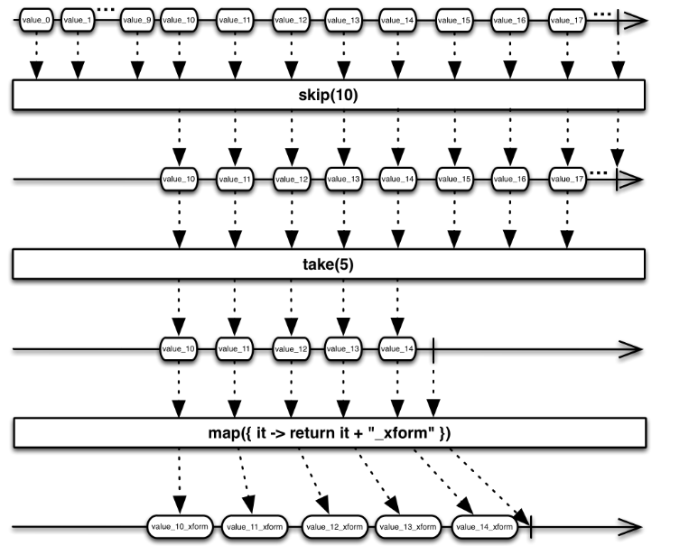

# RxJava入门

## gradle导入：

```gradle
implementation 'io.reactivex.rxjava2:rxjava:2.2.8'
```

## 如何使用rxjava

rxjava版Hello world!

从字符串列表创建一个Observable，然后使用为Observable发出的每个字符串打印“Hello String！”的方法订阅此Observable。

```java
public static void hello(String... args) {
  Flowable.fromArray(args).subscribe(new Consumer<String>() {
      @Override
      public void accept(String s) {
          System.out.println("Hello " + s + "!");
      }
  });
}
```

## RxJava的设计原理

要使用RxJava，您需要创建Observables（发出数据项），以各种方式转换这些Observable以获取您感兴趣的精确数据项（通过使用Observable运算符），然后观察并响应这些有趣项目序列（通过实现观察者） 或者订阅者，然后将它们订阅到最终的变换后的Observables）。

### 创建被观察者（Creating Observables）

要创建Observable，您可以通过将函数传递给展示Observable行为的create（）来手动实现Observable的行为，也可以通过使用为此目的设计的一些Observable运算符将现有数据结构转换为Observable。

#### 从现有数据结构创建Observable

您可以使用Observable just（）和from（）方法将对象，列表或对象数组转换为发出这些对象的Observable：

```java
Observable<String> o = Observable.fromArray("a", "b", "c");
Integer[] list = {5, 6, 7, 8};
Observable<Integer> o1 = Observable.fromArray(list);
Observable<String> o2 = Observable.just("one object");
```

对于Observable要发出的每个项，这些转换后的Observable将同步调用订阅它们的任何订阅者的onNext（）方法，然后调用订阅者的onCompleted（）方法。

#### 通过create（）方法创建Observable

您可以通过设计自己的Observable并使用create（）方法实现它来实现异步i / o，计算操作甚至“无限”数据流。

**创建同步的Observable：**

```java
public static void customObservable(){
    Observable<String> o3 = Observable.create(new ObservableOnSubscribe<String>(){
        @Override
        public void subscribe(ObservableEmitter<String> emitter) throws Exception {
            for(int i=0; i<=5; i++){
                emitter.onNext("i = "+i);
            }
            emitter.onComplete();
        }
    });
    o3.subscribe(new Observer<String>() {
        @Override
        public void onSubscribe(Disposable d) {

        }

        @Override
        public void onNext(String s) {
            System.out.println("onNext   s "+s);
        }

        @Override
        public void onError(Throwable e) {

        }

        @Override
        public void onComplete() {

        }
    });
}
```

**创建异步的Observable:**

```java
public static void asynchronousCustomObservable(){
    Observable<String> o3 = Observable.create(new ObservableOnSubscribe<String>(){
        @Override
        public void subscribe(final ObservableEmitter<String> emitter) throws Exception {
            new Thread(new Runnable() {
                @Override
                public void run() {
                    try {
                        Thread.sleep(5000);
                    } catch (InterruptedException e) {
                        e.printStackTrace();
                    }
                    for(int i=0; i<=5; i++){
                        emitter.onNext("i = "+i);
                    }
                    emitter.onComplete();
                }
            },"异步Observable线程").start();

        }
    });
    o3.subscribe(new Observer<String>() {
        @Override
        public void onSubscribe(Disposable d) {

        }

        @Override
        public void onNext(String s) {
            System.out.println("onNext   s "+s+"  线程名字："+Thread.currentThread().getName());
        }

        @Override
        public void onError(Throwable e) {

        }

        @Override
        public void onComplete() {

        }
    });
}
```

## 用运算符转换Observable

下面的这个例子：先定义发起75个emitter的异步Observable，跳过前10个，然后执行5个，并使用map转换它们。

```java
	/**
     *用运算符转换Observable
     * */
    public static void operationObservable(){
        Observable.create(new ObservableOnSubscribe<String>(){
            @Override
            public void subscribe(final ObservableEmitter<String> emitter) throws Exception {
                new Thread(new Runnable() {
                    @Override
                    public void run() {
                        try {
                            Thread.sleep(5000);
                        } catch (InterruptedException e) {
                            e.printStackTrace();
                        }
                        for(int i=0; i<75; i++){
                            emitter.onNext("i = "+i);
                        }
                        emitter.onComplete();
                    }
                },"异步Observable线程").start();

            }
        })
                .skip(10)
                .take(5)
                .map(new Function<String, String>() {
                    @Override
                    public String apply(String s) throws Exception {
                        return s+" _Function";
                    }
                })
                .subscribe(new Observer<String>() {
            @Override
            public void onSubscribe(Disposable d) {

            }

            @Override
            public void onNext(String s) {
                System.out.println("onNext   value  "+s);
            }

            @Override
            public void onError(Throwable e) {

            }

            @Override
            public void onComplete() {

            }
        });
    }
```

这里是Observable的状态转换图：



使用zip转换：

```java
/**
 * zip操作
 * */
public static void zipOperationObservable(){
    Observable<String> o = Observable.fromArray("a", "b", "c","d","f");
    Integer[] listI = {5, 6, 7, 8};
    Observable<Integer> o1 = Observable.fromArray(listI);
    /**
     * zip中的ObservableSource必须是同步的
     * */
    Observable.zip(o, o1, new BiFunction<String, Integer, String>() {
        @Override
        public String apply(String s, Integer integer) throws Exception {
            return "我是："+s+integer;
        }
    }).subscribe(new Observer<String>() {
        @Override
        public void onSubscribe(Disposable d) {

        }

        @Override
        public void onNext(String s) {
            System.out.println(s);
        }

        @Override
        public void onError(Throwable e) {

        }

        @Override
        public void onComplete() {

        }
    });
}
```

