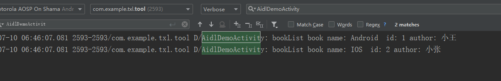

# 基本概念：

Android Interface Definition Language,即Android接口定义语言。Android系统中的进程之间不能共享内存，因此，需要提供一些机制在不同进程之间进行数据通信。为了使其他的应用程序也可以访问本应用程序提供的服务，Android系统采用了远程过程调用（Remote Procedure Call，RPC）方式来实现。

# AIDL支持的数据类型

1. java基本数据类型、String和CharSequence
2. List和Map(每个数据元素都被aidl支持)
3. 实现了Parcelable的实例
4. 其他实现了AIDL的实例

# 基本实现

1. 根据需求实现需要操作的实体类，实现 Parcelable 接口

   ```java
   public class Book implements Parcelable {
       private int bookId;
       private String name;
       private String author;
   
   
       protected Book(Parcel in) {
           bookId = in.readInt();
           name = in.readString();
           author = in.readString();
       }
   
       public static final Creator<Book> CREATOR = new Creator<Book>() {
           @Override
           public Book createFromParcel(Parcel in) {
               return new Book( in );
           }
   
           @Override
           public Book[] newArray(int size) {
               return new Book[size];
           }
       };
   
       @Override
       public int describeContents() {
           return 0;
       }
   
       @Override
       public void writeToParcel(Parcel dest, int flags) {
           dest.writeInt( bookId );
           dest.writeString( name );
           dest.writeString( author );
       }
   }
   ```

   

2. 声明AIDL文件

   在 main 文件夹下新建 aidl 文件夹，使用的包名要和 java 文件夹的包名一致

   **注意：**在aidl中使用到的自定义实现Parcelable 的类，也需要对应的aidl声明，包名和实体类的包名一致

   非基本类型的数据需要导入，比如上面的 Book，需要导入它的全路径。 
   这里的 Book我理解的是 Book.aidl，然后通过 Book.aidl 又找到真正的实体 Book类。
   方法参数中，除了基本数据类型，其他类型的参数都需要标上方向类型 。in(输入)，out(输出)，inout(输入输出)。

   ```java
   // Book.aidl
   package com.example.txl.tool.inter.process.communication;
   
   // Declare any non-default types here with import statements
   
   parcelable Book;
   ```

   

   ```java
   // IBookManager.aidl
   package com.example.txl.tool.inter.process.communication;
   
   // Declare any non-default types here with import statements
   
   import com.example.txl.tool.inter.process.communication.Book;
   interface IBookManager {
       /**
        * Demonstrates some basic types that you can use as parameters
        * and return values in AIDL.
        */
       List<Book> getBookList();
       void addBook(in Book book);
   }
   ```

   ​	

3. 实现服务端的代码

   ```java
   package com.example.txl.tool.inter.process.communication;
   
   import android.app.Service;
   import android.content.Intent;
   import android.os.Binder;
   import android.os.IBinder;
   import android.os.RemoteException;
   
   import java.util.List;
   import java.util.concurrent.CopyOnWriteArrayList;
   
   public class BookManagerService extends Service {
       private static final String TAG = "BookManagerService";
   
       private CopyOnWriteArrayList<Book> mBookList = new CopyOnWriteArrayList<>(  );
   
       private Binder mBinder = new IBookManager.Stub() {
           @Override
           public List<Book> getBookList() throws RemoteException {
               return mBookList;
           }
   
           @Override
           public void addBook(Book book) throws RemoteException {
               mBookList.add( book );
           }
       };
   
       public BookManagerService() {
       }
   
       @Override
       public void onCreate() {
           super.onCreate();
           mBookList.add( new Book( 1,"Android","小王" ) );
           mBookList.add( new Book( 2,"IOS" ,"小张") );
       }
   
       @Override
       public IBinder onBind(Intent intent) {
   
           return mBinder;
       }
   }
   ```

   ```xml
   <service
               android:name=".inter.process.communication.BookManagerService"
               android:enabled="true"
               android:exported="true"
               android:process=":remote" >
               <intent-filter >
                   <action android:name="com.txl.aidl.demo"/>
               </intent-filter>
           </service>
   ```

实现客户端代码：

```java
public class AidlDemoActivity extends AppCompatActivity {
    private TextView tvGetBookList, tvAddBook;
    IBookManager bookManager;
    ServiceConnection serviceConnection = new ServiceConnection() {
        @Override
        public void onServiceConnected(ComponentName name, IBinder service) {
            bookManager = IBookManager.Stub.asInterface( service );
        }

        @Override
        public void onServiceDisconnected(ComponentName name) {
            bookManager = null;
        }
    };

    @Override
    protected void onCreate(Bundle savedInstanceState) {
        super.onCreate( savedInstanceState );
        setContentView( R.layout.activity_aidl_demo );
        initView();
        bindAidlService();
    }

    private void initView() {
        tvGetBookList = findViewById( R.id.tv_get_book_list );
        tvGetBookList.setOnClickListener( new View.OnClickListener(){
            @Override
            public void onClick(View v) {
                if(bookManager != null){
                    try {
                        //这个东西是一个耗时操作
                        List<Book> bookList = bookManager.getBookList();
                        for (Book book : bookList){
                            Log.d( "AidlDemoActivity", "bookList book name: "+book.getName()+"  id: "+book.getBookId()+" author: "+book.getAuthor());
                        }
                    } catch (RemoteException e) {
                        e.printStackTrace();
                    }
                }
            }
        } );
        tvAddBook = findViewById( R.id.tv_add_book );
        tvAddBook.setOnClickListener( new View.OnClickListener() {
            @Override
            public void onClick(View v) {
                if(bookManager != null){
                    try {
                        //这个东西是一个耗时操作
                        int id = (int) (Math.random()*1000);
                        Book book = new Book(id,"测试添加book:"+id,"作者:"+id );
                        bookManager.addBook( book );
                    } catch (RemoteException e) {
                        e.printStackTrace();
                    }
                }
            }
        } );
    }

    private void bindAidlService(){
        Intent intent = new Intent(  );
        intent.setPackage(getPackageName());
        intent.setAction( "com.txl.aidl.demo" );
        bindService( intent,serviceConnection ,BIND_AUTO_CREATE);
    }

    @Override
    protected void onDestroy() {
        super.onDestroy();
        unbindService( serviceConnection );
    }
```

xml:

```xml
<?xml version="1.0" encoding="utf-8"?>
<LinearLayout xmlns:android="http://schemas.android.com/apk/res/android"
    xmlns:app="http://schemas.android.com/apk/res-auto"
    xmlns:tools="http://schemas.android.com/tools"
    android:layout_width="match_parent"
    android:layout_height="match_parent"
    tools:context=".inter.process.communication.AidlDemoActivity"
    android:gravity="center"
    android:orientation="vertical">
    <TextView
        android:id="@+id/tv_get_book_list"
        android:layout_marginTop="10dp"
        android:layout_width="match_parent"
        android:layout_height="60dp"
        android:text="获取书籍"
        android:gravity="center"
        android:textSize="18sp"
        android:background="#7f7"/>
    <TextView
        android:id="@+id/tv_add_book"
        android:layout_marginTop="10dp"
        android:layout_width="match_parent"
        android:layout_height="60dp"
        android:text="添加书籍"
        android:gravity="center"
        android:textSize="18sp"
        android:background="#7f7"/>
</LinearLayout>
```

结果：

点击页面中的获取书籍按钮:




#  使用AIDL接口实现双向调用

为了能够在有新书到来的时候及时通知到客户端，我们采用观察者模式来进行处理，将客户端对象注册到服务端。并在服务段模拟每5秒就有新书到达。

服务端：

```java
public class BookManagerService extends Service {
    private static final String TAG = "BookManagerService";
    private CopyOnWriteArrayList<IOnBookArrivedListener> onBookArrivedListeners = new CopyOnWriteArrayList<>(  );
    private AtomicBoolean atomicBoolean = new AtomicBoolean( false );


    private CopyOnWriteArrayList<Book> mBookList = new CopyOnWriteArrayList<>(  );

    private Binder mBinder = new IBookManager.Stub() {
        @Override
        public List<Book> getBookList() throws RemoteException {
            Log.d( TAG,"getBookList thread :"+Thread.currentThread().getName() );
            return mBookList;
        }

        @Override
        public void addBook(Book book) throws RemoteException {
            Log.d( TAG,"addBook thread :"+Thread.currentThread().getName() );
            mBookList.add( book );
        }

        @Override
        public void registerBookArrivedListener(IOnBookArrivedListener listenser) throws RemoteException {
            if(!onBookArrivedListeners.contains( listenser )){
                onBookArrivedListeners.add( listenser );
                Log.d( TAG,"registerBookArrivedListener success" );
            }else {
                Log.d( TAG,"registerBookArrivedListener failed" );
            }

        }

        @Override
        public void unRegisterBookArrivedListener(IOnBookArrivedListener listenser) throws RemoteException {
            if(onBookArrivedListeners.contains( listenser )){
                Log.d( TAG,"unRegisterBookArrivedListener success" );
                onBookArrivedListeners.remove( listenser );
            }else {
                Log.d( TAG,"unRegisterBookArrivedListener failed" );
            }

        }
    };

    public BookManagerService() {
    }

    @Override
    public void onCreate() {
        super.onCreate();
        mBookList.add( new Book( 1,"Android","小王" ) );
        mBookList.add( new Book( 2,"IOS" ,"小张") );
        new Thread( new ServiceWorker() ).start();
    }

    @Override
    public IBinder onBind(Intent intent) {

        return mBinder;
    }

    @Override
    public void onDestroy() {
        super.onDestroy();
        atomicBoolean.set( true );
    }

    private class ServiceWorker implements Runnable{

        @Override
        public void run() {
            while (!atomicBoolean.get()){
                try {
                    Thread.sleep( 5000 );
                } catch (InterruptedException e) {
                    e.printStackTrace();
                }
                Book book = new Book( mBookList.size(),"自动添加书籍"+mBookList.size(),"自动"+mBookList.size() );
                try {
                    onBookArrived(book);
                } catch (RemoteException e) {
                    e.printStackTrace();
                }
            }
        }
    }

    private void onBookArrived(Book book) throws RemoteException {
        mBookList.add( book );

        for (IOnBookArrivedListener listener:onBookArrivedListeners){
            listener.onNewBookArrived( book );
        }
    }
}
```

客户端：

```java
public class AidlDemoActivity extends AppCompatActivity {
    private final String TAG = "AidlDemoActivity";
    private TextView tvGetBookList, tvAddBook;
    IBookManager bookManager;
    IOnBookArrivedListener onBookArrivedListener =  new IOnBookArrivedListener.Stub(){
        @Override
        public void onNewBookArrived(Book book) throws RemoteException {
            Log.d( TAG,"onNewBookArrived  "+book);
        }
    };
    ServiceConnection serviceConnection = new ServiceConnection() {
        @Override
        public void onServiceConnected(ComponentName name, IBinder service) {
            bookManager = IBookManager.Stub.asInterface( service );
            try {
                bookManager.registerBookArrivedListener(onBookArrivedListener);
            } catch (RemoteException e) {
                e.printStackTrace();
            }
        }

        @Override
        public void onServiceDisconnected(ComponentName name) {
            bookManager = null;
        }
    };

    @Override
    protected void onCreate(Bundle savedInstanceState) {
        super.onCreate( savedInstanceState );
        setContentView( R.layout.activity_aidl_demo );
        initView();
        bindAidlService();
    }

    private void initView() {
        tvGetBookList = findViewById( R.id.tv_get_book_list );
        tvGetBookList.setOnClickListener( new View.OnClickListener(){
            @Override
            public void onClick(View v) {
                if(bookManager != null){
                    try {
                        //这个东西是一个耗时操作
                        List<Book> bookList = bookManager.getBookList();
                        for (Book book : bookList){
                            Log.d( "AidlDemoActivity", "bookList book name: "+book.getName()+"  id: "+book.getBookId()+" author: "+book.getAuthor());
                        }
                    } catch (RemoteException e) {
                        e.printStackTrace();
                    }
                }
            }
        } );
        tvAddBook = findViewById( R.id.tv_add_book );
        tvAddBook.setOnClickListener( new View.OnClickListener() {
            @Override
            public void onClick(View v) {
                if(bookManager != null){
                    try {
                        //这个东西是一个耗时操作
                        int id = (int) (Math.random()*1000);
                        Book book = new Book(id,"测试添加book:"+id,"作者:"+id );
                        bookManager.addBook( book );
                    } catch (RemoteException e) {
                        e.printStackTrace();
                    }
                }
            }
        } );
    }

    private void bindAidlService(){
        Intent intent = new Intent(  );
        intent.setPackage(getPackageName());
        intent.setAction( "com.txl.aidl.demo" );
        bindService( intent,serviceConnection ,BIND_AUTO_CREATE);
    }

    @Override
    protected void onDestroy() {
        super.onDestroy();
        if(bookManager != null && bookManager.asBinder().isBinderAlive()){
            try {
                bookManager.unRegisterBookArrivedListener( onBookArrivedListener );
            } catch (RemoteException e) {
                e.printStackTrace();
            }
        }
        unbindService( serviceConnection );
    }
}
```


# AIDL远程注册导致内存泄漏

在上面我们完成了客户端和服务端的注册监听，并且在onDestory的时候进行了解注册为什么还是有内存泄漏这个问题呢？

情况是这样的，因为aidl是通过binder进行跨进程通信，我们客户端注册的对象会通过序列化的操作生成一个新的对象在服务端进行注册，解注册也是这样的原理，这样通过list的remove肯定是移除不掉的。可以看到在销毁对应的activity的时候每次解注册都是failed。

服务端会一直持有客户端注册的对象，从而导致内存泄漏。

**解决方法：**服务端使用 **RemoteCallbackList**  

RemoteCallbackList是专门用于跨进程删除远程listenser的接口，它虽然叫list但是使用起来和list还是有一些不同

遍历其中的元素需要beginBroadcast()和finishBroadcast()配对使用。

服务端更改的代码如下：

```java
public class BookManagerService extends Service {
    private static final String TAG = "BookManagerService";
//    private CopyOnWriteArrayList<IOnBookArrivedListener> onBookArrivedListeners = new CopyOnWriteArrayList<>(  );
    private RemoteCallbackList<IOnBookArrivedListener> onBookArrivedListenerRemoteCallbackList = new RemoteCallbackList<>();
    private AtomicBoolean atomicBoolean = new AtomicBoolean( false );


    private CopyOnWriteArrayList<Book> mBookList = new CopyOnWriteArrayList<>(  );

    private Binder mBinder = new IBookManager.Stub() {
        @Override
        public List<Book> getBookList() throws RemoteException {
            Log.d( TAG,"getBookList thread :"+Thread.currentThread().getName() );
            return mBookList;
        }

        @Override
        public void addBook(Book book) throws RemoteException {
            Log.d( TAG,"addBook thread :"+Thread.currentThread().getName() );
            mBookList.add( book );
        }

        @Override
        public void registerBookArrivedListener(IOnBookArrivedListener listenser) throws RemoteException {

            if(onBookArrivedListenerRemoteCallbackList.register( listenser )){
                Log.d( TAG,"registerBookArrivedListener success" );
            }else {
                Log.d( TAG,"registerBookArrivedListener failed" );
            }
//            if(!onBookArrivedListeners.contains( listenser )){
//                onBookArrivedListeners.add( listenser );
//                Log.d( TAG,"registerBookArrivedListener success" );
//            }else {
//                Log.d( TAG,"registerBookArrivedListener failed" );
//            }
        }

        @Override
        public void unRegisterBookArrivedListener(IOnBookArrivedListener listenser) throws RemoteException {
            if(onBookArrivedListenerRemoteCallbackList.unregister( listenser )){
                Log.d( TAG,"unRegisterBookArrivedListener success" );
            }else {
                Log.d( TAG,"unRegisterBookArrivedListener failed" );
            }
//            if(onBookArrivedListeners.contains( listenser )){
//                Log.d( TAG,"unRegisterBookArrivedListener success" );
//                onBookArrivedListeners.remove( listenser );
//            }else {
//                Log.d( TAG,"unRegisterBookArrivedListener failed" );
//            }
        }
    };

    public BookManagerService() {
    }

    @Override
    public void onCreate() {
        super.onCreate();
        Log.d( TAG,"onCreate" );
        mBookList.add( new Book( 1,"Android","小王" ) );
        mBookList.add( new Book( 2,"IOS" ,"小张") );
        new Thread( new ServiceWorker() ).start();
    }

    @Override
    public IBinder onBind(Intent intent) {

        return mBinder;
    }

    @Override
    public void onDestroy() {
        super.onDestroy();
        Log.d( TAG,"onDestroy" );
        atomicBoolean.set( true );
    }

    private class ServiceWorker implements Runnable{

        @Override
        public void run() {
            while (!atomicBoolean.get()){
                try {
                    Thread.sleep( 5000 );
                } catch (InterruptedException e) {
                    e.printStackTrace();
                }
                Book book = new Book( mBookList.size(),"自动添加书籍"+mBookList.size(),"自动"+mBookList.size() );
                try {
                    onBookArrived(book);
                } catch (RemoteException e) {
                    e.printStackTrace();
                }
            }
        }
    }

    private void onBookArrived(Book book) throws RemoteException {
        mBookList.add( book );
        int count = onBookArrivedListenerRemoteCallbackList.beginBroadcast();
        for (int i = 0; i<count; i++){
            onBookArrivedListenerRemoteCallbackList.getBroadcastItem( i ).onNewBookArrived( book );
        }
        onBookArrivedListenerRemoteCallbackList.finishBroadcast();
//        for (IOnBookArrivedListener listener:onBookArrivedListeners){
//            listener.onNewBookArrived( book );
//        }
    }
}

```

这样我们就完成了一个aidl的基本学习

# 总结：

使用aidl有几点需要注意

1. 跨进程通信运行在binder线程池，调用尽量在子线程中进行。以免处理不当造成anr
2. 如果服务端需要客户端的监听，要是用RemoteCallbackList

# 感谢：

文中的内容基本来自 《android开发艺术探索》和我工作中见到的一些问题。

# 写这个的原因

都已经有这个书籍了为什么还要写这个和书上内容差不多的？最近读完了《这样读书就够了》深感自己学习能力的不足，其中说到知识的学习有输入也应该有输出。交会别人是最好的学习方式。我想用这样的方式来提高我的学习效率。搭建自己的android知识体系。这个就是我写这个笔记的原因。