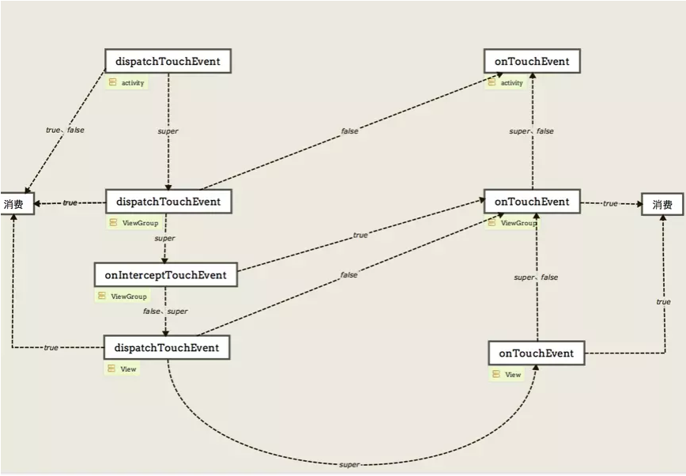

# 20分钟，我们一起实现爱奇艺式焦点寻找


**焦点处理是从Android手机开发到TV开发必须要经历的第一个关卡**，最近从手机开发转到Tv开发的小王就遇到了这个问。

小王经过一个月的努力，XXTV版项目1.0版本终于迭代完成，本以为可以轻松过一个周末，但是版本刚发出去，客户便提出了问题。为什么我们的列表焦点不能像爱奇艺一样在最左边按左键的时候焦点向上，在最右边按右键的时候焦点向下？为什么我们的导航不具备焦点记忆的功能呢？

为了解决客户的问题小王花了一个周末的时间来学学Android对 KeyEvent事件的处理，并且通过技术笔记的方式来检验学习效果。因为输出是最好的学习方式。

# KeyEvent事件总结：


1. KeyEvent事件分为前后两个阶段，以当前焦点View接收到dispatchKeyEvent为分界点，前半部分为KeyEvent事件处理，后半部分为焦点查找。
2. KeyEvent事件默认会交给当前拥有焦点的View进行处理。ViewGroup只是起到一个事件传递的作用。
3. 只有直接或间接包含当前焦点View的ViewGroup才有机会调用到dispatchKeyEvent和focusSearch方法
4. 只有直接或间接包含当前焦点View的ViewGroup，设置的OnKeyListener才可能有效果。
5. 我们可以重写ViewGroup的dispatchKeyEvent方法来实现自己的KeyEvent事件拦截处理。
6. 对于跨ViewGroup的焦点查找我们可以在addFocusable中进行处理，对于ViewGroup的内部焦点查找，在不打破原有的事件处理归则的情况下优先考虑重写focusSearch,其次才是dispatchKeyEvent。


# 什么是焦点记忆？什么是焦点内部搜索？


我们假设当前焦点 在C上，按键向右，D获取焦点，对于ViewGroup N 而言这个是焦点的内部搜索

我们假设当前焦点 在C上，按键向上，A获取焦点，这个是跨容器进行焦点查找，如果M的焦点自A离开，且只要ViewGroup M 只要有子View获取焦点，它一定在A上我们称ViewGroup M  具有焦点记忆功能。

那么应该如何解决客户的问题呢？小王主要面对下面的两个问题

1. 如何记录上一次的焦点元素 ？
2. 在什么时候介入焦点搜索的过程进行自己处理？

# View的获取焦点时发生了什么

为了了解详细的过程，小王从View的requestFocus方法开始，到requestChildFocus发现了View获取焦点比较重要的信息。从当前焦点View起到 根ViewGroup的mFocused都记录了 含有焦点的ViewGroup。链式的保存了焦点信息。

ViewGroup:

```java
@Override
public void requestChildFocus(View child, View focused) {
    if (DBG) {
        System.out.println(this + " requestChildFocus()");
    }
    if (getDescendantFocusability() == FOCUS_BLOCK_DESCENDANTS) {
        return;
    }

    // Unfocus us, if necessary
    super.unFocus(focused);

    // We had a previous notion of who had focus. Clear it.
    if (mFocused != child) {
        if (mFocused != null) {
            mFocused.unFocus(focused);
        }

        mFocused = child;
    }
    if (mParent != null) {
        mParent.requestChildFocus(this, focused);
    }
}
```

# Android  KeyEvent事件分发机制

拥有三年工作经验的小王，早已把传统手机触摸事件的分发流程烂熟于心。它的经典分发流程如下：

ViewRootImpl ->  DecorView -> Activity -> Window -> DecorView  

经典的U型图：



回顾了手机的触摸事件分发的过程，小王猜想遥控器的KeyEvent事件应该和手机触摸事件流程大同小异 。手机触摸事件的主要逻辑主要在dispatchTouchEvent，那么KeyEvent主要逻辑应该是dispatchKeyEvent。

ViewGroup:

```java
@Override
public boolean dispatchKeyEvent(KeyEvent event) {
    if (mInputEventConsistencyVerifier != null) {
        mInputEventConsistencyVerifier.onKeyEvent(event, 1);
    }

    if ((mPrivateFlags & (PFLAG_FOCUSED | PFLAG_HAS_BOUNDS))
            == (PFLAG_FOCUSED | PFLAG_HAS_BOUNDS)) {
        if (super.dispatchKeyEvent(event)) {
            return true;
        }
    } else if (mFocused != null && (mFocused.mPrivateFlags & PFLAG_HAS_BOUNDS)
            == PFLAG_HAS_BOUNDS) {
        if (mFocused.dispatchKeyEvent(event)) {
            return true;
        }
    }

    if (mInputEventConsistencyVerifier != null) {
        mInputEventConsistencyVerifier.onUnhandledEvent(event, 1);
    }
    return false;
}
```

View:

```java
public boolean dispatchKeyEvent(KeyEvent event) {
    if (mInputEventConsistencyVerifier != null) {
        mInputEventConsistencyVerifier.onKeyEvent(event, 0);
    }

    // Give any attached key listener a first crack at the event.
    //noinspection SimplifiableIfStatement
    ListenerInfo li = mListenerInfo;
    if (li != null && li.mOnKeyListener != null && (mViewFlags & ENABLED_MASK) == ENABLED
            && li.mOnKeyListener.onKey(this, event.getKeyCode(), event)) {
        return true;
    }

    if (event.dispatch(this, mAttachInfo != null
            ? mAttachInfo.mKeyDispatchState : null, this)) {
        return true;
    }

    if (mInputEventConsistencyVerifier != null) {
        mInputEventConsistencyVerifier.onUnhandledEvent(event, 0);
    }
    return false;
}
```

通过阅读源码，小王发现：

1. KeyEvent事件在ViewGroup中进行传递，在View中进行处理。
2. KeyEvent事件默认会交给当前拥有焦点的View进行处理。ViewGroup只是起到一个事件传递的作用。
3. 我们可以重写ViewGroup来实现自己的KeyEvent事件拦截处理。
4. 只有当前View拥有焦点的时候，设置的OnKeyListener才会有效果。
5. dispatchKeyEvent方法只有按键的处理，不涉及焦点查找。

## 焦点查找

小王通过上面的系统源码阅读，只有事件的传递处理，但是却没有关于焦点的处理，小王将目标瞄向了ViewRootImpl。在ViewRootImpl的内部类ViewPostImeInputStage的processKeyEvent方法中实现了整个KeyEvent的分发处理。

简单的伪代码如下

```java
//事件分发
if(mView.dispatchKeyEvent(event)){
	return FINISH_HANDLED;
}
//焦点搜索
View focused = mView.findFocus()
focused.focusSearch(direct)
```

也就是说所有的View的dispatchKeyEvent都返回false的时候，ViewRootImpl会通过DecorView获取当前的焦点View并调用它的focusSearch方法。

View:

```java
public View focusSearch(@FocusRealDirection int direction) {
    if (mParent != null) {
        return mParent.focusSearch(this, direction);
    } else {
        return null;
    }
}
```

ViewGroup:

```java
public View focusSearch(View focused, int direction) {
    if (isRootNamespace()) {
        // root namespace means we should consider ourselves the top of the
        // tree for focus searching; otherwise we could be focus searching
        // into other tabs.  see LocalActivityManager and TabHost for more info.
        return FocusFinder.getInstance().findNextFocus(this, focused, direction);
    } else if (mParent != null) {
        return mParent.focusSearch(focused, direction);
    }
    return null;
}
```

整个焦点查找的过程就是通过当前的焦点View不断向上进行焦点搜索。

为了清楚的说明整个事件的流程，小王绘制了下面的图片。帮助自己理解记忆。


1. KeyEvent事件分为前后两个阶段，以当前焦点View接收到dispatchKeyEvent为分界点，前半部分为KeyEvent事件处理，后半部分为焦点查找。
2. KeyEvent事件在ViewGroup中进行传递，在View中进行处理。
3. 只有直接或间接包含当前焦点View的ViewGroup才有机会调用到dispatchKeyEvent和focusSearch方法
4. KeyEvent事件默认会交给当前拥有焦点的View进行处理。ViewGroup只是起到一个事件传递的作用。
5. 我们可以重写ViewGroup来实现自己的KeyEvent事件拦截处理。
6. 只有直接或间接包含当前焦点View的ViewGroup，设置的OnKeyListener才可能有效果。
7. DispatchKeyEvent方法只有按键的处理，不涉及焦点查找。


# 焦点在FocusFinder中的查找过程

虽然搞明白了KeyEvent的事件分发过程,但是小王还是没想明白如何解决客户提出的问题，只能接着阅读源码看看能否找到一丝灵感。

FocusFinder:

```java
private View findNextFocus(ViewGroup root, View focused, Rect focusedRect, int direction) {
    View next = null;
    ViewGroup effectiveRoot = getEffectiveRoot(root, focused);
    if (focused != null) {
        //查找通过 nextFocusRight nextFocusLeft nextFocusUp  nextFocusDown 指定的View
        next = findNextUserSpecifiedFocus(effectiveRoot, focused, direction);
    }
    if (next != null) {
        return next;
    }
    ArrayList<View> focusables = mTempList;
    try {
        focusables.clear();
        //添加容器内可以获取焦点的View
        //通过这个方法可以控制当前ViewGroup的哪些子View可以获取焦点
        effectiveRoot.addFocusables(focusables, direction);
        if (!focusables.isEmpty()) {
            //通过就近算法对比查找最合适接下来获取焦点的View
            next = findNextFocus(effectiveRoot, focused, focusedRect, direction, focusables);
        }
    } finally {
        focusables.clear();
    }
    return next;
}
```

FocusFinder的焦点查找过程：

1. 查找特殊指定的焦点View
2. 就近获取下一个可以获取 焦点的View

# ViewGroup的焦点记忆功能实现

有了上面的理论基础小王决定在requestChildFocus中记录当前焦点元素。

介入焦点处理的时机：

- dispatchKeyEvent()  方法中处理, 事件的传递是以当前焦点为中心，焦点记忆需要跨ViewGroup实现。不满足
- focusSearch 同dispatchKeyEvent 不满足
- addFocusables 添加可以获取焦点的View，如何只将上次记录的View加入那么 此容器获取焦点的就只能是上次记录的View,能够实现焦点记忆功能。满足

参考： WandroidTv版的  DynamicLinearLayout类关于焦点记忆的实现

https://github.com/xiaolutang/WanAndroidTv/blob/master/tvlib/src/main/java/com/txl/tvlib/widget/dynamic/focus/DynamicLinearLayout.java

# 左右按键试下焦点向上向下

这个问题是一个焦点内部搜索问题，

我们可以通过自己处理dispatchKeyEvent或者focusSearch方法来进行处理。小王考虑到如果在dispatchKeyEvent中进行处理会打破原来的KeyEvent传递流程。因此小王通过focusSearch来处理。

参考  WanAndroidTv版  DynamicFlexboxLayout 和 LibTvRecyclerView

https://github.com/xiaolutang/WanAndroidTv/blob/master/wanandroid/src/main/java/com/txl/wanandroidtv/ui/widget/DynamicFlexboxLayout.java


总结如下：

1. 跨容器焦点查找通过重写addFocusables方法来进行处理。
2. 容器内部焦点查找优先通过focusSearch来实现，其次在考虑dispatchKeyEvent方法。


# 为什么ViewPage的焦点处理比较反常规

小王在实现了左右按键的焦点查找问题之后，单独 测试没有什么问题。但是放入ViewPager的时候却失效了。小王感觉很奇怪，难道是自己对KeyEvent流程理解有问题吗？怀着疑问小王打开了ViewPager源码。

ViewPager:

```java
@Override
public boolean dispatchKeyEvent(KeyEvent event) {
    // Let the focused view and/or our descendants get the key first
    return super.dispatchKeyEvent(event) || executeKeyEvent(event);
}
```

原来ViewPager为了实现按键的翻页效果自己处理了dispatchKeyEvent,如果keyEvent的传递过程中没有View处理这次事件且是左键或右键，那么它就会被ViewPager消费掉。自己进行焦点的查找。但是这样就打断了KeyEvent的传递 和焦点搜索的过程。

小王通过继承改变了RecyclerView的KeyEvent事件处理流程 

```java
public class NavViewPager extends ViewPager {
    public NavViewPager(@NonNull Context context) {
        super(context);
    }

    public NavViewPager(@NonNull Context context, @Nullable AttributeSet attrs) {
        super(context, attrs);
    }

    @Override
    public View focusSearch(View focused, int direction) {
        if(arrowScroll(direction)){
            return null;
        }
        return super.focusSearch(focused, direction);
    }

    @Override
    public boolean dispatchKeyEvent(KeyEvent event) {
        if(hasFocus()){
            return super.dispatchKeyEvent(event);
        }

        View focused = findFocus();
        if(focused != null){
            return focused.dispatchKeyEvent(event);
        }
        return false;
    }
}
```


这样终于学习完了android的KeyEvent事件流程。小王不用在为项目的焦点问题而担心了。

最后在补充文章开始的结论：


1. KeyEvent事件分为前后两个阶段，以当前焦点View接收到dispatchKeyEvent为分界点，前半部分为KeyEvent事件处理，后半部分为焦点查找。
2. KeyEvent事件默认会交给当前拥有焦点的View进行处理。ViewGroup只是起到一个事件传递的作用。
3. 只有直接或间接包含当前焦点View的ViewGroup才有机会调用到dispatchKeyEvent和focusSearch方法
4. 只有直接或间接包含当前焦点View的ViewGroup，设置的OnKeyListener才可能有效果。
5. 我们可以重写ViewGroup的dispatchKeyEvent方法来实现自己的KeyEvent事件拦截处理。
6. 对于跨ViewGroup的焦点查找我们可以在addFocusable中进行处理，对于ViewGroup的内部焦点查找，在不打破原有的事件处理归则的情况下优先考虑重写focusSearch,其次才是dispatchKeyEvent。


输出是检验学习成果的最好的方式。

这是我第一次用这样的方式，来写技术文章。你的转发是对我最大的鼓励