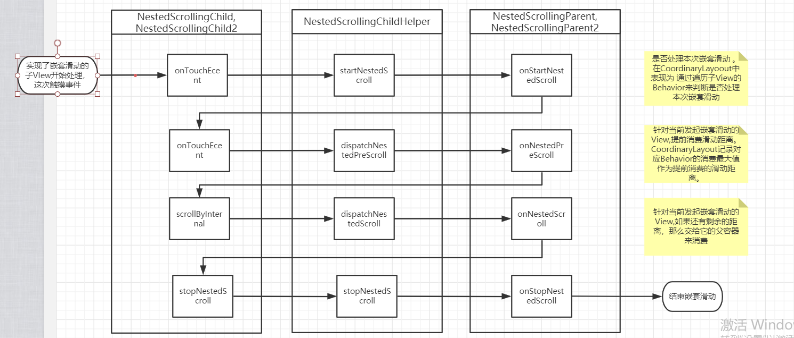

# Android Tv版嵌套滑动实现极光云视听顶部导航效果

通过这篇文章您可以和小王一起：

- 了解嵌套滑动的流程，原理
- 自定义Behavior的原理。
- 简单的实现TV版的嵌套滑动

小王最近很开心，上次快速的解决了可与提出的焦点问题。小王明显感觉 到了客户对自己的信任增加。最近客户又提出想要实现极光云视听Tv的顶部导航效果。页面焦点下滑的时候自动隐藏顶部，待滑动到顶部的时候又自动 展示出来。

极光云视听导航展开效果：


极光云视听收起效果：


看了具体的实现效果，小王判断这个功能实现非常简单。直接使用CoordinatorLayout+AppBarLayout应该非常简单就实现了。毕竟以前自己在手机上做过类似的效果。so Easy。但是在实践的过程中确出现了问题。

小王写下了下面的布局代码，

```xml
<?xml version="1.0" encoding="utf-8"?>
<androidx.coordinatorlayout.widget.CoordinatorLayout
    xmlns:android="http://schemas.android.com/apk/res/android"
    xmlns:app="http://schemas.android.com/apk/res-auto"
    xmlns:tools="http://schemas.android.com/tools"
    android:layout_width="match_parent"
    android:layout_height="match_parent">
    <com.google.android.material.appbar.AppBarLayout
        android:layout_height="wrap_content"
        android:layout_width="match_parent"
        android:clipToPadding="false"
        android:clipChildren="false"
        android:theme="@style/ThemeOverlay.AppCompat">
        <TextView
            android:layout_width="match_parent"
            android:layout_height="wrap_content"
            android:textSize="@dimen/sp_28"
            android:textColor="#fff"
            android:text="WanAndroidTv"
            app:layout_scrollFlags="scroll|enterAlways"
            android:focusable="true"/>
        <com.txl.tvlib.widget.dynamic.focus.LibTvRecyclerView
            android:layout_width="match_parent"
            android:layout_height="wrap_content"
            android:id="@+id/recycler_nav"
            android:layout_marginTop="@dimen/dp_30"
            android:layout_marginBottom="@dimen/dp_30"
            android:layout_marginStart="@dimen/dp_90"
            android:layout_marginEnd="@dimen/dp_90"/>
    </com.google.android.material.appbar.AppBarLayout>
    <com.txl.wanandroidtv.ui.widget.NavViewPager
        android:layout_width="match_parent"
        android:layout_height="match_parent"
        android:id="@+id/main_view_pager"
        android:visibility="visible"
        app:layout_behavior="@string/appbar_scrolling_view_behavior"/>
</androidx.coordinatorlayout.widget.CoordinatorLayout>
```

当程序运行起来的时候。按下遥控器，界面并没有出现类似的效果。为了确认是不是自己的代码问题，小王通过模拟器的触摸，发现确实拥有嵌套滑动的效果。那么为什么遥控器按键会失去效果呢？小王决定通过源码的阅读来一探究竟。

# 嵌套滑动原理

小王以前只是使用过CoordinatorLayout，并没有对它是如何实现嵌套滑动进行分析。小王决定看看CoordinatorLayout的实现原理，以便借鉴它的思想实现Tv版的嵌套滑动。

嵌套滑动并没有打断原有的手机触摸事件的分发处理。而是通过onTouchEvent来处理嵌套滑动的相关逻辑。

## 各个类介绍

NestedScrollingChild:  这个接口定义了关于嵌套滑动的方法。

- boolean startNestedScroll()开始进行嵌套滑动，如果返回ture意味着找到可以进行嵌套滑动的父容器，false表示不需要进行嵌套滑动。
- void stopNestedScroll()停止嵌套滑动
- boolean dispatchNestedPreScroll() 在内层view处理滚动事件前先被调用,可以让外层view先消耗部分滚动
- boolean dispatchNestedScroll() 在内层view将剩下的滚动消耗完之后调用,可以在这里处理最后剩下的滚动
- onNestedPreFling 在内层view的Fling事件处理之前被调用
- onNestedFling 在内层view的Fling事件处理完之后调用

NestedScrollingParent：实现这个接口表示当前的ViewGroup具有处理嵌套滑动的能力。

- boolean onStartNestedScroll()开始进行嵌套滑动，如果返回false后面的一些列嵌套滑动事件都不会再被接收。
- onStopNestedScroll()停止嵌套滑动。
- onNestedPreScroll()与dispatchNestedPreScroll()对应。
- onNestedScroll()与dispatchNestedScroll对应。


## RecyclerView+CoordinaryLayout嵌套滑动流程



总结如下：

1. 嵌套滑动由实现了NestedScrollingChild的View发起，借助NestedScrollingChildHelper调用可以处理嵌套滑动的父容器的相关方法。
2. 嵌套滑动通过屏幕触摸发起事件，会经历下面5个步骤
   1. 开始嵌套滑动
   2. 父容器是否提前消费部分滑动距离
   3. 发起嵌套滑动的View自身滑动
   4. 在自身滑动完成后，若还有没被消费的距离，交给父容器消费
   5. 停止嵌套滑动

## 自定义Behavior

小王记得在别人的博客上看到过：

> 参考：https://www.jianshu.com/p/b987fad8fcb4
>
> 通常自定义`Behavior`分为两种情况：
>
> - 某个`View`依赖另一个`View`，监听其位置、尺寸等状态的变化。
> - 某个`View`监听`CoordinatorLayout`内实现了`NestedScrollingChild`接口的子`View`的滑动状态变化(也是一种依赖关系)。

那么他么的原理是怎么样的呢？

1. 某个`View`监听`CoordinatorLayout`内实现了`NestedScrollingChild`接口的子`View`的滑动状态变化(也是一种依赖关系)。

   这个问题根据前面的嵌套滑动流程可以知道，嵌套滑动进行的时候，它的每一步都会调用到`CoordinatorLayout` 并决定自己是先消费滑动距离还是后消费。

2. 某个`View`依赖另一个`View`，监听其位置、尺寸等状态的变化

   在CoordinatorLayout的Behavior中有一个layoutDependsOn 方法，用来判断当前View是否依赖于其它的view。当它依赖的View的状态发生改变 的时候会通过onDependentViewChanged来通知当前View它所依赖的View放生了改变。

关于CoordinatorLayout自定义Behavior的实现,参考:

https://www.jianshu.com/p/b987fad8fcb4

https://blog.csdn.net/qq_35561554/article/details/89320881

# 如何实现Tv版的嵌套滑动

通过前面的知识分析，嵌套的滑动关键不在于是否有触摸事件，而是能不能通过在具体的滚动前通过一定的逻辑判断自己发起嵌套滑动。

小王在他的上一篇技术笔记： 

[20分钟，我们一起实现爱奇艺式焦点寻找]: https://juejin.im/post/5e85fe4e6fb9a03c6f66eef9

 中总结了 焦点的查找过程。每次子元素请求焦点都会调用父容器的requestChildFocus方法。而RecyclerView的实现如下：

```java
@Override
public void requestChildFocus(View child, View focused) {
    if (!mLayout.onRequestChildFocus(this, mState, child, focused) && focused != null) {
        //这个方法会通过滚动确保焦点元素显示在屏幕中，
        requestChildOnScreen(child, focused);
    }
    super.requestChildFocus(child, focused);
}
```

通过上面的代码 ，可以知道。每次为了让焦点View显示在屏幕中。都会发生滚动，小王决定在它的滚动之前做一点自己的处理。以便实现嵌套滑动的功能。

```java
@Override
    public void requestChildFocus(View child, View focused) {
        willRequestChildFocus = true;
        super.requestChildFocus(child, focused);
        willRequestChildFocus = false;
    }

private void handleFocusScroll(int dx, int dy){
    if(dy < 0 && computeVerticalScrollOffset() > getHeight()){//向上滑动并且当前的滚动位置大于高度的1/2不进行处理
        return;
    }
    int nestedScrollAxis = ViewCompat.SCROLL_AXIS_NONE |ViewCompat.SCROLL_AXIS_VERTICAL;
    startNestedScroll(nestedScrollAxis, TYPE_TOUCH);
    dispatchNestedPreScroll(dx, dy, new int[2], new int[2], TYPE_TOUCH);
    stopNestedScroll(TYPE_TOUCH);
}

@Override
public void scrollBy(int x, int y) {
    handleFocusScroll(x, y);
    super.scrollBy(x, y);
}

@Override
public void smoothScrollBy(int dx, int dy, @Nullable Interpolator interpolator,int duration) {
    handleFocusScroll(dx, dy);
    super.smoothScrollBy(dx, dy, interpolator,duration);
}
```

在因为焦点位置变化前，设置标记；如果不是因为焦点变化导致的滚动不进行处理。如果是因为焦点变化发生滚动，人为的模拟整个嵌套滑动的流程。