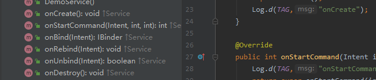

网上其实有很多关于Service的博客，但是为什么要写Service?

原因有下面几点：

1. 通过这次学习输出让自己加深对Service的了解
2. 本篇文章希望通过源码的分析，来解释Service的生命周期现象

文章出下面的几个方向出发

- 服务的生命周期
- 服务的工作过程
- 服务的anr检测

# 服务的生命周期

服务主要有下面的几个方法



即

onCreate

onStartCommand:

onBind

onRebind

onUnbind

onDestroy

关于每个生命周期方法的作用，这里不详细说明，可以参考网上的博客或者直接看官方文档。

https://developer.android.google.cn/guide/components/services

服务可以通知startService或者bindService启动它们的生命周期如下：


- 使用startService（）开启服务时，onCreate（）只会调用一次，onStartCommand（）的调用次数与startService()的调用次数相同。startService开启的服务需要通过 stopService()或者Service自己调用stopself()来停止服务。服务停止后会调用onDestory()
- 使用bindService()来开启的服务 onCreate 和 onBind()都只会调用一次（不论bindService调用多少次），bindService开启的服务需要通过 onBind来解绑暂停，解绑后会依次调用onUnbind()和unDestory()。需要注意的是：需要服务没有和任何一个客户端绑定之后才会调用onUnbind和onDestory暂停服务。
- 同时使用startService（）和 bindService（）会先调用 onCreate() 、onStartCommand() /onBind()  两者的调用关系取决于先调用的是startService还是bindService。暂停服务，需要调用stopService和unBindService同时调用。
- 关于onRebind  onRebind调用有几个前提条件。
  - 同时使用startService和bindService
  - 服务必须先绑定，然后绑定的客户端减少到0
  - onUnbind 返回true。

关于生命周期实验demo地址：

https://github.com/xiaolutang/androidTool/blob/master/app/src/main/java/com/example/txl/tool/service/ServiceDemoActivity.java

# 服务的工作过程

服务的工作过程主要是应用程序，与ActivityManagerService的交互过程。代码分析基于api 30

## startService的过程

我们知道四大组件的很多工作都最终执行的位置都是在ContextImpl来万层，启动服务也不例外。Activity#startService()最终会调用ContextImpl#startService()

```java
 @Override
    public ComponentName startService(Intent service) {
        warnIfCallingFromSystemProcess();
        return startServiceCommon(service, false, mUser);
    }

private ComponentName startServiceCommon(Intent service, boolean requireForeground,
            UserHandle user) {
        try {
            //检测启动目标的有效性，主要是目标包名和启动类不能同时为空。
            validateServiceIntent(service);
            service.prepareToLeaveProcess(this);
            //通过binder跨进程调用到ActivityManagerService
            ComponentName cn = ActivityManager.getService().startService(
                    mMainThread.getApplicationThread(), service,
                    service.resolveTypeIfNeeded(getContentResolver()), requireForeground,
                    getOpPackageName(), getAttributionTag(), user.getIdentifier());
            ...
            return cn;
        } catch (RemoteException e) {
            throw e.rethrowFromSystemServer();
        }
    }

```

ActivityManagerService最终会调用到ActiveServices#bringUpServiceLocked

```java
private String bringUpServiceLocked(ServiceRecord r, int intentFlags, boolean execInFg,
            boolean whileRestarting, boolean permissionsReviewRequired)
            throws TransactionTooLargeException {
    //根据 ServiceRecord#app判断当前服务是不是在运行，如果service在运行就调用sendServiceArgsLocked传递参数
        if (r.app != null && r.app.thread != null) {
            sendServiceArgsLocked(r, execInFg, false);
            return null;
        }
		...
       //真正的启动服务的位置
       if (app != null && app.thread != null) {
            realStartServiceLocked(r, app, execInFg);
       }
      ...
          if (app == null && !permissionsReviewRequired) {
            // TODO (chriswailes): Change the Zygote policy flags based on if the launch-for-service
            //  was initiated from a notification tap or not.
              //应用程序不存在，先创建应用程序
            if ((app=mAm.startProcessLocked(procName, r.appInfo, true, intentFlags,
                    hostingRecord, ZYGOTE_POLICY_FLAG_EMPTY, false, isolated, false)) == null) {
                String msg = "Unable to launch app "
                        + r.appInfo.packageName + "/"
                        + r.appInfo.uid + " for service "
                        + r.intent.getIntent() + ": process is bad";
                Slog.w(TAG, msg);
                bringDownServiceLocked(r);
                return msg;
            }
            if (isolated) {
                r.isolatedProc = app;
            }
        }
		...
        return null;
    }
```

ActiveServices#realStartServiceLocked

```java
private final void realStartServiceLocked(ServiceRecord r,
            ProcessRecord app, boolean execInFg) throws RemoteException {
        if (app.thread == null) {
            throw new RemoteException();
        }
        if (DEBUG_MU)
            Slog.v(TAG_MU, "realStartServiceLocked, ServiceRecord.uid = " + r.appInfo.uid
                    + ", ProcessRecord.uid = " + app.uid);
    //这里给ServiceRecord#app赋值，表示当前服务已经启动
        r.setProcess(app);
        r.restartTime = r.lastActivity = SystemClock.uptimeMillis();

        //注意这个东西，这个是为了监测anr而发送一个延时消息
        bumpServiceExecutingLocked(r, execInFg, "create");
        ...
            //回调服务所在应用程序，创建服务
            app.thread.scheduleCreateService(r, r.serviceInfo,
                    mAm.compatibilityInfoForPackage(r.serviceInfo.applicationInfo),
                    app.getReportedProcState());
    	...
            //回调服务所在应用程序传递参数
             sendServiceArgsLocked(r, execInFg, true);
    	...
    }
```

### onCreate()调用

ApplicationThread#scheduleCreateService方法通过handler H 进行消息转发，最终会调用到ActivityThread#handleCreateService

ActivityThread#handleCreateService

```java
 private void handleCreateService(CreateServiceData data) {
        // If we are getting ready to gc after going to the background, well
        // we are back active so skip it.
        unscheduleGcIdler();

        LoadedApk packageInfo = getPackageInfoNoCheck(
                data.info.applicationInfo, data.compatInfo);
        Service service = null;
        try {
            if (localLOGV) Slog.v(TAG, "Creating service " + data.info.name);
			//创建context
            ContextImpl context = ContextImpl.createAppContext(this, packageInfo);
            //获取application
            Application app = packageInfo.makeApplication(false, mInstrumentation);
            java.lang.ClassLoader cl = packageInfo.getClassLoader();
            //创建service
            service = packageInfo.getAppFactory()
                    .instantiateService(cl, data.info.name, data.intent);
            // Service resources must be initialized with the same loaders as the application
            // context.
            context.getResources().addLoaders(
                    app.getResources().getLoaders().toArray(new ResourcesLoader[0]));

            context.setOuterContext(service);
            service.attach(context, this, data.info.name, data.token, app,
                    ActivityManager.getService());
            //回调service onCreate
            service.onCreate();
            mServices.put(data.token, service);
            try {
                //发送消息，结束anr检测
                ActivityManager.getService().serviceDoneExecuting(
                        data.token, SERVICE_DONE_EXECUTING_ANON, 0, 0);
            } catch (RemoteException e) {
                throw e.rethrowFromSystemServer();
            }
        } catch (Exception e) {
            if (!mInstrumentation.onException(service, e)) {
                throw new RuntimeException(
                    "Unable to create service " + data.info.name
                    + ": " + e.toString(), e);
            }
        }
    }
```

### onStartCommand（）的调用

参数信息的发送是通过ActiveServices#sendServiceArgsLocked（）来进行的。

```java
 private final void sendServiceArgsLocked(ServiceRecord r, boolean execInFg,
            boolean oomAdjusted) throws TransactionTooLargeException {
        ...
        bumpServiceExecutingLocked(r, execInFg, "start");
        ...
         r.app.thread.scheduleServiceArgs(r, slice);
        ...
    }
```

与onCreate的调用过程类似，scheduleServiceArgs 也会经过H转发 最终会调用ActivityThread#handleServiceArgs

```java
private void handleServiceArgs(ServiceArgsData data) {
        Service s = mServices.get(data.token);
        if (s != null) {
            try {
                if (data.args != null) {
                    data.args.setExtrasClassLoader(s.getClassLoader());
                    data.args.prepareToEnterProcess();
                }
                int res;
                if (!data.taskRemoved) {
                //关键调用 onStartCommand
                    res = s.onStartCommand(data.args, data.flags, data.startId);
                } else {
                    s.onTaskRemoved(data.args);
                    res = Service.START_TASK_REMOVED_COMPLETE;
                }

                QueuedWork.waitToFinish();

                try {
                    //结束anr监测
                    ActivityManager.getService().serviceDoneExecuting(
                            data.token, SERVICE_DONE_EXECUTING_START, data.startId, res);
                } catch (RemoteException e) {
                    throw e.rethrowFromSystemServer();
                }
            } catch (Exception e) {
                if (!mInstrumentation.onException(s, e)) {
                    throw new RuntimeException(
                            "Unable to start service " + s
                            + " with " + data.args + ": " + e.toString(), e);
                }
            }
        }
    }
```


启动服务会经历如下过程

1. 判断服务所在进程是不是存在，不存在则先启动对应的进程
2. 判断服务是不是已经在运行，运行则调用ActiveServices#sendServiceArgsLocked传递参数，否则调用ActiveServices#realStartServiceLocked 先创建服务，在传递参数。
3. 服务不论是在创建还是传递参数的过程中都会调用ActiveServices#bumpServiceExecutingLocked 来发送消息监测anr。（所有生命周期方法都有这个特性呢？）

## stopService的过程

暂定服务有两种方式，调用stopService(),服务自己调用stopself()。我们这里分析stopService的过程。

## bindService的过程

我们知道绑定服务时传递的ServiceConnection对象并不具备跨进程传输的能力，那么绑定服务的过程中他是如何工作的呢？

在ContentxImpl中bindService最终会调用到bindServiceCommon 它的实现如下：

```java
private boolean bindServiceCommon(Intent service, ServiceConnection conn, int flags,
            String instanceName, Handler handler, Executor executor, UserHandle user) {
        // Keep this in sync with DevicePolicyManager.bindDeviceAdminServiceAsUser.
    //该对象是进行跨进程传输的队形，当绑定成功过后通过它进行回调
        IServiceConnection sd;
        ...
        if (mPackageInfo != null) {
            if (executor != null) {
                //getOuterContext() 意味着获取的是activiy、service、或者application  特别的当activity活这个service结束时，可以对绑定的服务进行清理，从系统级别防止内存泄漏
                sd = mPackageInfo.getServiceDispatcher(conn, getOuterContext(), executor, flags);
            } else {
                sd = mPackageInfo.getServiceDispatcher(conn, getOuterContext(), handler, flags);
            }
        } else {
            throw new RuntimeException("Not supported in system context");
        }
        validateServiceIntent(service);
        try {
            IBinder token = getActivityToken();
            if (token == null && (flags&BIND_AUTO_CREATE) == 0 && mPackageInfo != null
                    && mPackageInfo.getApplicationInfo().targetSdkVersion
                    < android.os.Build.VERSION_CODES.ICE_CREAM_SANDWICH) {
                flags |= BIND_WAIVE_PRIORITY;
            }
            service.prepareToLeaveProcess(this);
            int res = ActivityManager.getService().bindIsolatedService(
                mMainThread.getApplicationThread(), getActivityToken(), service,
                service.resolveTypeIfNeeded(getContentResolver()),
                sd, flags, instanceName, getOpPackageName(), user.getIdentifier());
            if (res < 0) {
                throw new SecurityException(
                        "Not allowed to bind to service " + service);
            }
            return res != 0;
        } catch (RemoteException e) {
            throw e.rethrowFromSystemServer();
        }
    }
```

在绑定服务的过程中会先调用LoadedApk#getServiceDispatcher()获取IServiceConnection对象，然后在通过ActivityManagerService进行绑定

### IServiceConnection的创建过程

getServiceDispatcher最终会调用到LoadedApk#getServiceDispatcherCommon（）

```java
private IServiceConnection getServiceDispatcherCommon(ServiceConnection c,
            Context context, Handler handler, Executor executor, int flags) {
        synchronized (mServices) {
            LoadedApk.ServiceDispatcher sd = null;
            ArrayMap<ServiceConnection, LoadedApk.ServiceDispatcher> map = mServices.get(context);
            if (map != null) {
                if (DEBUG) Slog.d(TAG, "Returning existing dispatcher " + sd + " for conn " + c);
                sd = map.get(c);
            }
            if (sd == null) {
                if (executor != null) {
                    sd = new ServiceDispatcher(c, context, executor, flags);
                } else {
                    sd = new ServiceDispatcher(c, context, handler, flags);
                }
                if (DEBUG) Slog.d(TAG, "Creating new dispatcher " + sd + " for conn " + c);
                if (map == null) {
                    map = new ArrayMap<>();
                    mServices.put(context, map);
                }
                map.put(c, sd);
            } else {
                sd.validate(context, handler, executor);
            }
            return sd.getIServiceConnection();
        }
    }
```

代码的逻辑很简单，以context作为key存储了一个类型为 ArrayMap<ServiceConnection, LoadedApk.ServiceDispatcher>  的map,然后依据 ServiceConnection 返回LoadedApk.ServiceDispatcher#getIServiceConnection()对应的东西。

LoadedApk#ServiceDispatcher

```java
 static final class ServiceDispatcher {
    private final ServiceDispatcher.InnerConnection mIServiceConnection;
     IServiceConnection getIServiceConnection() {
            return mIServiceConnection;
        }
 }
```

可以看到其实返回的是内部类ServiceDispatcher.InnerConnection。


### ActivityManagerService绑定的过程

绑定服务会调用ActivityManagerService#bindIsolatedService方法

## unBindService的过程


# 问题：

1. startService时为什么onCreate只调用一次，而onStartCommand却能够调用多次？
2. bindService的过程中为什么onBind只会在第一次绑定的过程中调用？
3. 为什么startService加bindService通过stopService不能停止服务？
4. 服务是如何检测anr的？
5. 绑定服务之后，服务端是如何调用到客户端的？


bumpServiceExecutingLocked  发送延时消息，处理anr

serviceDoneExecutingLocked


服务的生命周期

如何判断服务被启动

服务如何关闭

解绑服务会导致服务停止吗？


研究方向：

1. 服务生命周期
   - 启动服务
   - 绑定服务
   - 启动绑定   + 绑定启动
   - 服务生命周期的管理
3. 服务的工作过程
   - 服务的开启 如何判断服务已经启动？
   - 服务绑定  为什么当没有绑定的对象时服务会停止？
   - 通过源码阅读来查看为什么会有这个现象。
3. 前台服务