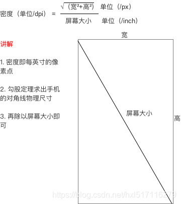

# 前言	

2018年的时候今日头条公布的他们的屏幕适配方案，紧接着各位大佬也陆续发布了屏幕适配的相关文章，同时 JessYan 还发布了今日头条方案的适配框架，这些都极大地帮助android开发者能够更加容易的进行屏幕适配。在所有的屏幕适配方案中，公认比较好的屏幕适配方案有基于最小宽度 SmallWidth和 基于头条适配方案的 AutoSize。

我们都知道手机屏幕的显示是通过一个个像素来完成的，但是android并不推荐我们直接使用px来标记ui大小。因为不同的手机分辨率不同。相同的像素在越高的分辨率的手机上显示越小。

android推荐使用dp来进行屏幕适配。

> **那么什么是dp？**
>
> dp指的是设备独立像素，以dp为尺寸单位的控件，在不同分辨率和尺寸的手机上代表了不同的真实像素，比如在分辨率较低的手机中，可能1dp=1px,而在分辨率较高的手机中，可能1dp=2px，这样的话，一个96*96dp的控件，在不同的手机中就能表现出差不多的大小了。

dp与px的关系

> 我们都知道一个公式： px = dp(dpi/160) 系统都是通过这个来判断px和dp的数学关系，
>
> 那么这里又出现了一个问题，
>
> **dpi是什么呢？**
>
> dpi是像素密度，指的是在**系统软件上**指定的单位尺寸的像素数量，它往往是写在系统出厂配置文件的一个固定值。

dpi的计算方式：

系统的dp能够解决大部分的问题，但是由于手机生产厂家的不同，系统的dpi就有可能不同，为了解决宽度相同像素不同dpi手机的适配问题，我们需要用到屏幕适配方案。

# SmallWidth适配方案

SmallWidth基于当前设备的宽度，从大到小一次查找最接近的dimen资源 进行使用。假设当前设备的宽度360dp  存在sw361dp，sw350dp。即使sw361dp和设备的宽度360dp接近。也会使用sw350dp的资源

SmallWodth是一种等比例适配方案，假设我们以360dp为设计宽度，那么在360dp的dimens中的 值该如何编写呢？在我们的设计中360dp能铺满全屏，那么在现在350dp也能铺满全屏。

即:如果 350中的dimen值/350 = 360dimen中的值/360   那么他们在不同设备的所占比例是相同的，ui看起来就是相同的。换言之在 在sw XXXdp中的值 =  XXX/设计目标尺寸。

以最sw360dp 为例，在sw360中  所占dp 为10 

在sw350中占用多少dp?  = 10 *  350/360 = 9.72dp

在sw400中占用多少dp? = 10 * 400/360 = 11.11dp

SmallWidth的优缺点:

优点：稳定，对app没有性能损耗，适配范围可控，不会影响其他三方库

缺点：dimens维护成本较高；方案侵入性大。适配方案切换起来非常麻烦；导致app体积增大。

# 今日头条屏幕适配方案

今日头条适配方案可以说是屏幕适配的终极应用。其原理如下。如果想让设计图上的ui在所有设备上看起来都差不多，以款或者高为基准进行等比例变化。就需要让下面的等式成立。

以宽度为基准举例：

设计图尺寸 X(单位dp)/设计图宽度DW（单位 dp） = ui实际占用 Y （单位px）/ 屏幕宽度W(单位px)

我们知道：在android中 ui实际像素y = X  * 设备独立密度M

即上面的等式可以转换成

 X / DW = M * X / W

这样就可以得到头条的适配方案公式 M = W / DW 

**即：当前设备屏幕总宽度（单位为像素）/ 设计图总宽度（单位为 dp) = density**

优缺点：

优点：使用成本低，一键接入。不会有性能损耗。

缺点：对三方库兼容性不好。

文章参考：

[Android 目前稳定高效的UI适配方案](https://mp.weixin.qq.com/s/X-aL2vb4uEhqnLzU5wjc4Q)

[骚年你的屏幕适配方式该升级了!-SmallestWidth 限定符适配方案](https://juejin.cn/post/6844903681524006925#heading-12)

[骚年你的屏幕适配方式该升级了!-今日头条适配方案](https://juejin.cn/post/6844903661819133960)

https://developer.android.google.cn/guide/topics/resources/providing-resources?hl=en