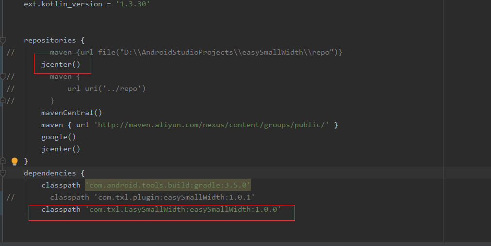
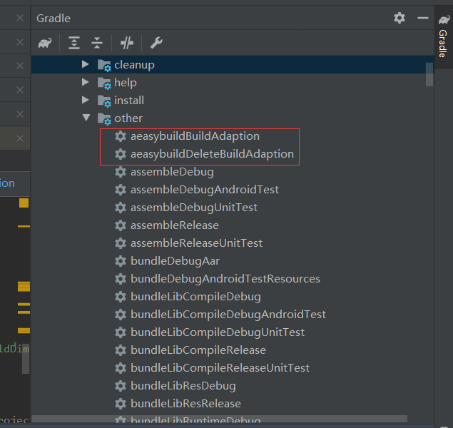
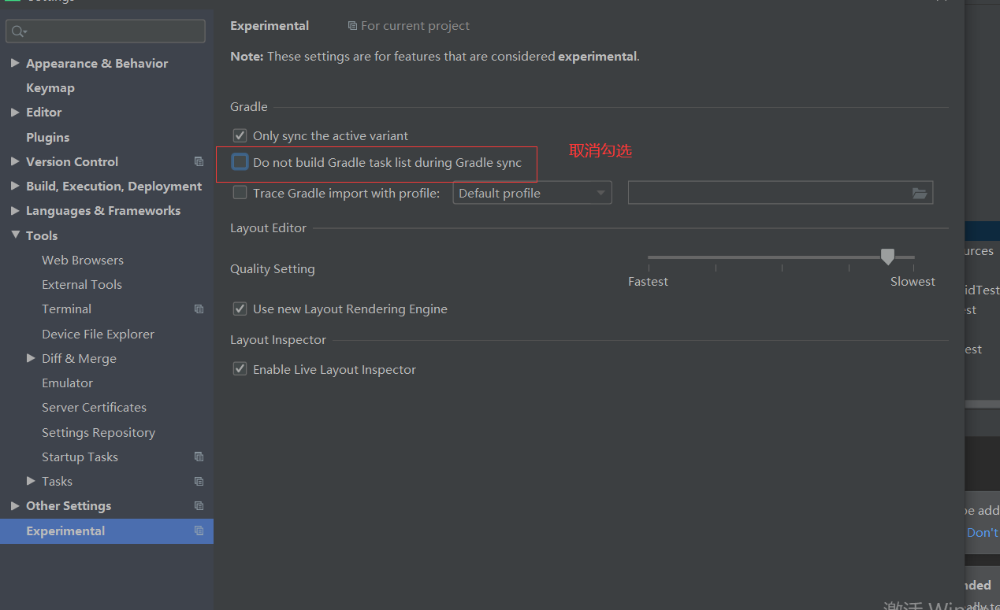
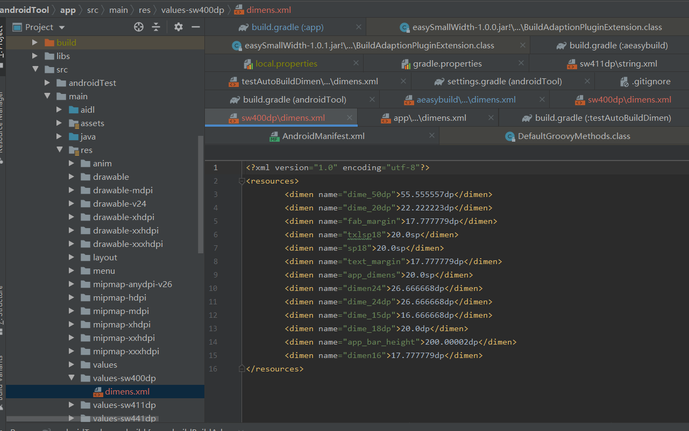

# 前言

首先声明一点这个并不是一个新的屏幕适配方案，其适配原理为SmallWidth，正如其名字一样，希望通过这个框架适配，让SmallWidth适配方案变得更加容易。

# 屏幕适配的原理简述

2018年的时候今日头条公布的他们的屏幕适配方案，紧接着各位大佬也陆续发布了屏幕适配的相关文章，同时 JessYan 还发布了今日头条方案的适配框架，这些都极大地帮助android开发者能够更加容易的进行屏幕适配。在所有的屏幕适配方案中，公认比较好的屏幕适配方案有基于最小宽度 [SmallWidth](https://github.com/ladingwu/dimens_sw/)和 基于头条适配方案的 [AndroidAutoSize](https://github.com/JessYanCoding/AndroidAutoSize)。


我们都知道手机屏幕的显示是通过一个个像素来完成的，但是android并不推荐我们直接使用px来标记ui大小。因为不同的手机分辨率不同。相同的像素在越高的分辨率的手机上显示越小。

android推荐使用dp来进行屏幕适配。

> **那么什么是dp？**
>
> dp指的是设备独立像素，以dp为尺寸单位的控件，在不同分辨率和尺寸的手机上代表了不同的真实像素，比如在分辨率较低的手机中，可能1dp=1px,而在分辨率较高的手机中，可能1dp=2px，这样的话，一个96*96dp的控件，在不同的手机中就能表现出差不多的大小了。

dp与px的关系

> 我们都知道一个公式： px = dp(dpi/160) 系统都是通过这个来判断px和dp的数学关系，
>
> 那么这里又出现了一个问题，
>
> **dpi是什么呢？**
>
> dpi是像素密度，指的是在**系统软件上**指定的单位尺寸的像素数量，它往往是写在系统出厂配置文件的一个固定值。

dpi的计算方式：


系统的dp能够解决大部分的问题，但是由于手机生产厂家的不同，系统的dpi就有可能不同，为了解决宽度相同像素不同dpi手机的适配问题，我们需要用到屏幕适配方案。

## SmallWidth适配方案

SmallWidth基于当前设备的宽度，从大到小一次查找最接近的dimen资源 进行使用。假设当前设备的宽度360dp  存在sw361dp，sw350dp。即使sw361dp和设备的宽度360dp接近。也会使用sw350dp的资源

SmallWodth是一种等比例适配方案，假设我们以360dp为设计宽度，那么在360dp的dimens中的 值该如何编写呢？在我们的设计中360dp能铺满全屏，那么在现在350dp也能铺满全屏。

即:如果 350中的dimen值/350 = 360dimen中的值/360   那么他们在不同设备的所占比例是相同的，ui看起来就是相同的。换言之在 在sw XXXdp中的值 =  XXX/设计目标尺寸。

以最sw360dp 为例，在sw360中  所占dp 为10 

在sw350中占用多少dp?  = 10 *  350/360 = 9.72dp

在sw400中占用多少dp? = 10 * 400/360 = 11.11dp

SmallWidth的优缺点:

优点：稳定，对app没有性能损耗，适配范围可控，不会影响其他三方库

缺点：dimens维护成本较高；方案侵入性大。适配方案切换起来非常麻烦；导致app体积增大。

## 今日头条屏幕适配方案

今日头条适配方案可以说是屏幕适配的终极应用。其原理如下。如果想让设计图上的ui在所有设备上看起来都差不多，以款或者高为基准进行等比例变化。就需要让下面的等式成立。

以宽度为基准举例：

设计图尺寸 X(单位dp)/设计图宽度DW（单位 dp） = ui实际占用 Y （单位px）/ 屏幕宽度W(单位px)

我们知道：在android中 ui实际像素y = X  * 设备独立密度M

即上面的等式可以转换成

 X / DW = M * X / W

这样就可以得到头条的适配方案公式 M = W / DW 

**即：当前设备屏幕总宽度（单位为像素）/ 设计图总宽度（单位为 dp) = density**

优缺点：

优点：使用成本低，一键接入。不会有性能损耗。

缺点：对三方库兼容性不好。


# SmallWidth与AndroidAutoSize我们该如何选择？

| 适配方案/对比角度 | SmallWidth                                  | AndroidAutoSize                                              |
| ----------------- | ------------------------------------------- | ------------------------------------------------------------ |
| 稳定性            | 基于系统原理适配非常稳定                    | 通过修改设备独立密度进行适配 ，因为是公共api,任何人都可以更改，存在一定的风险。但是随着框架的演进。基本上可以不考虑这方面对屏幕适配造成的影响 |
| 维护              | 一点有dimen值增加或者修改，需要维护多个文件 | 在三方库使用不多的情况维护简单，如果有较多的 三方库。维护困难 |
| 对三方库的兼容下  | 适配范围可控，不会影响三方库                | 除非三方库与自己设计图尺寸相同否则与三方库不兼容             |
| 性能              | 会增加许多适配文件，造成app体积增大         | 基本无影响                                                   |

可以看到AndroidAutoSize相较于SmallWidth优势还是比较明显，如果在三方库使用比较少的情况下，是非常不错的。但是正如AndroidAutoSize作者所提到的一样，如果使用较多的三方库，不兼容问题将是灾难性的。

> ## 缺点
>
> 暂时没发现其他什么很明显的缺点，已知的缺点有一个，那就是第三个优点，它既是这个方案的优点也同样是缺点，但是就这一个缺点也是非常致命的
>
> 只需要修改一次 **density**，项目中的所有地方都会自动适配，这个看似解放了双手，减少了很多操作，但是实际上反应了一个缺点，那就是只能一刀切的将整个项目进行适配，但适配范围是不可控的
>
> 这样不是很好吗？这样本来是很好的，但是应用到这个方案是就不好了，因为我上面的原理也分析了，这个方案依赖于设计图尺寸，但是项目中的系统控件、三方库控件、等非我们项目自身设计的控件，它们的设计图尺寸并不会和我们项目自身的设计图尺寸一样
>
> 当这个适配方案不分类型，将所有控件都强行使用我们项目自身的设计图尺寸进行适配时，这时就会出现问题，**当某个系统控件或三方库控件的设计图尺寸和和我们项目自身的设计图尺寸差距非常大时，这个问题就越严重**

也就是说在说用较多三方库的时候建议用SmallWidth，否则就使用SmallWidth。

# EasySmallWidth

通过上面的对比我们发现，在使用较多的三方库时，基本上不可能选择AndroidAutoSize。我们只能使用SmallWidth,那么我们也就只能接受SmallWidth的所有缺点了吗？

在使用SmallWidth的过程中我们最大的问题是维护困难。而EasySmallWidth就是为了解决SmallWidth的维护问题而产生的。

## EasySmallWidth原理

AndroidStudio通过Gradle进行打包，会经过 **Initialization**、**Configuration**、**Execution** 三个阶段。在configuration会读取所有项目的配置，并最终生成Gradle TASK执行的有相图。EasySmallWidth就是在Gradle 读取项目配置之后，生成有相图之前，插入自定义Task,让我们需要的dimens文件，先于构建Apk。通过观察Gradle打包生成apk的Task，不论是Android library 还是android application 在执行task之前都会执行 preBuild Task 。因此EasySmallWidth选取PreBuild作为插入点。进行适配工作。

## EasySmallWidth配置项

| 属性               | 作用                                                         | 默认值                           |
| ------------------ | ------------------------------------------------------------ | -------------------------------- |
| enableAdapter      | 是否开启适配  true  开启，false 关闭                         | true                             |
| defaultDesignWidth | 默认设计图宽度                                               | 360f                             |
| resPath            | res相对 当前模块的路径。系统会根据res查找默认的dimen文件，然后创建在此路径下创建values-swxxxdp文件。考虑到项目可能从eclipse迁移过来。增加这个配置项 | /src/main/res/                   |
| needToAdaptedWidth | 需要适配的最小宽度，需要自己添加                             | size为0的set                     |
| conversionMap      | 需要自定义转换的dimens文件，默认不需要填写。                 | 以Integer为Key,Float为value空map |

EasySmallWidth包含二级配置，总体配置，模块配置。具体的配置参考EasySmallWidth的使用step3。当没有模块配置的时候，会使用总体配置 。


## EasySmallWidth的使用

**step1:**  

在根目录的build.gradle添加下面的代码



```groovy
classpath 'com.txl.EasySmallWidth:easySmallWidth:1.0.0'
```

**step2:** 引入插件

项目的入口引入插件,EasySmallWidth会自动遍历当前项目的 所有模块并为它添加适配任务，所以不需要在 每个模块重复引用插件

```
apply plugin: 'BuildAdaptionPlugin'
```

插件引入成功后在模块的中可以看到EasySmallWidth为每个 模块添加的创建和删除适配文件的task



如果Android Studio 没有显示task  重新设置下下面的属性即可



**step3:添加配置项**

```groovy
adaptionAppExtension{
    defaultDesignWidth = 360f  //默认设计图的宽度为360dp
    enableAdapter = true //开启屏幕适配
    needToAdaptedWidth.add(400) // 需要适配最小宽度400dp  即会创建values-sw400dp
    needToAdaptedWidth.add(411) // 需要适配最小宽度411dp  即会创建values-sw411dp
    needToAdaptedWidth.add(441) // 需要适配最小宽度441dp  即会创建values-sw441dp
//   res路径，默认不用配置
//    resPath = "${File.separator}src${File.separator}main${File.separator}res${File.separator}"
    
    //针对testAutoBuildDimen 模块创建独自的配置
    def ex = createBuildAdaptionPluginExtension(project,adaptionAppExtension,"testAutoBuildDimen")
    //对模块testAutoBuildDimen sw400与默认值的转换关系为 实际值*1.0
    ex.conversionMap.put(400,1.0f)
    //对模块testAutoBuildDimen sw400与默认值的转换关系为 实际值*2.0
    ex.conversionMap.put(411,2.0f)
    //对模块testAutoBuildDimen sw400与默认值的转换关系为 实际值*3.0
    ex.conversionMap.put(441,3.0f)
    def aeasy = createBuildAdaptionPluginExtension(project,adaptionAppExtension,"aeasybuild")
    //aeasy  模块的默认宽度是375dp
    aeasy.defaultDesignWidth = 375f
}
```

## 验证EasySmallWidth

直接通过android studio 进行编译，然后在对应模块下就会产生对应的dimens文件

**app模块：**




可以看到 sw400dp中的 dimen值 = 400/360 * 实际值  符合SmallWidth要求

**aeasybuild模块：**


可以看到   sw400dp中的 dimen值 = 400/375 * 实际值  符合SmallWidth要求  (我们在配置的时候将aeasybuild的默认宽度设置成立375dp)

**testAutoBuildDimen模块：**


为什么这个模块的值不是按照smallWidth来的呢？因为我们在前面配置的时候对它做了自定义转换，sw400与设计图1.0倍处理

# EasySmallWidth demo

地址： https://github.com/xiaolutang/androidTool

# EasySmallWidth特性

缺点：

1. 由于SmallWidth适配的原因，它无法解决为了适配需要生成更多的文件的问题。

优点：

1. 代码侵入性低
2. 基于系统原理适配稳定性高
3. 方便适配方案切换，可与AndroidAutoSize适配方案进行无缝切换
4. 兼容性好，与第三方库适配没有冲突（与AndroidAutoSize不兼容）
5. 适配灵活，可以针对每一个模块进行适配。

可以这样说EasySmallWidth做为SmallWidth的升级版，主要的职责就是解决SmallWidth的维护性 和代码入侵的问题。

# 注意事项 

1. EasySmallWidth为了方便使用者切换适配方案（主要是AndroidAutoSize），在执行clean  task 的时候会删除每个模块下的适配文件，如果想买有特殊 处理，需要提前保存下
2. EasySmallWidth兼容三方库是指兼容第三方运用SmallWidth原理进行适配的三方库，它与AutoSize并不兼容。

# 关于三方库的适配问题建议

因为现在流行的AutoSize与SmallWidth之间不兼容，建议三方库不进行屏幕适配，对外公布自己的设计图尺寸，同时将默认的dimen文件发不出来。具体的适配工作交给开发者自己选择。

# 文章参考：

[Android 目前稳定高效的UI适配方案](https://mp.weixin.qq.com/s/X-aL2vb4uEhqnLzU5wjc4Q)

[骚年你的屏幕适配方式该升级了!-SmallestWidth 限定符适配方案](https://juejin.cn/post/6844903681524006925#heading-12)

[骚年你的屏幕适配方式该升级了!-今日头条适配方案](https://juejin.cn/post/6844903661819133960)

https://developer.android.google.cn/guide/topics/resources/providing-resources?hl=en