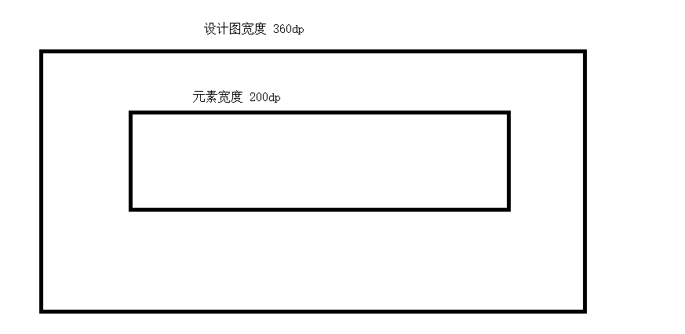

# androd屏幕适配

在了解学习屏幕适配之前先了解几个基本的概念

屏幕大小：指屏幕对角线的常丹。通常使用英寸度量（1英寸=2.54cm)

分辨率：指手机屏幕上的像素点个数：比如1920x1080就是说宽有1080个像素点，高有1920个像素点

ppi/dpi:  每英寸像素。它是由对角线像素除以屏幕大小得到。以Nexus5为例，官方参数为1920*1080,dpi=445，4.95 inch  那么，这个445的dpi是怎么算出来的呢？由上面介绍可知，屏幕尺寸4.95是屏幕对角线的长度，而dpi是指每英寸上的像素点数，所以应该由对角线所占的像素值除以4.95，如下:
$$
\sqrt{（1920^2+1080^2）}/4.95=445
$$
android定义了几个标准的dpi值作为手机固定的dpi

| 密度   | ldpi    | mdpi    | hdpi    | xhdpi    | xxhdpi    |
| ------ | ------- | ------- | ------- | -------- | --------- |
| 密度值 | 120     | 160     | 240     | 320      | 480       |
| 分辨率 | 240x320 | 320x480 | 480x800 | 720x1280 | 1080x1920 |

dp：独立像素密度，可以保证在不同屏幕像素密度的设备上显示相同的效果（思考一个问题，既然有了dp为什么还要进行适配？）

因为的屏幕密度的不同，导致同样大小的像素在不同密度的屏幕上显示出不同的效果。高密度的屏幕在宽度上显得更小，低密度的屏幕在宽度上显得更大。

android系统使用mdpi即屏幕密度为160dpi的屏幕作为标准，在这个屏幕上1px=1dp。

px 、dp、 dpi之间的关系：计算公式：px = dp*(dpi/160)

有了这个理论基础我们就可以来讨论学习android如何进行屏幕适配了。

在开始学习之前的几个小问题？

1. 一个360dp宽的view在720x1280 dpi为320的屏幕上显示的效果是怎么样的？
2. 在1080x1920 dpi为480的屏幕上的显示效果是什么样子的？
3. 假设分辨率不变改变dpi它的显示效果会怎么变化？

先来做一个小实验验证一下：布局代码

```
<?xml version="1.0" encoding="utf-8"?>
<FrameLayout xmlns:android="http://schemas.android.com/apk/res/android"
    xmlns:app="http://schemas.android.com/apk/res-auto"
    xmlns:tools="http://schemas.android.com/tools"
    android:layout_width="match_parent"
    android:layout_height="match_parent"
    tools:context=".activity.FloatItemRecyclerActivity"
    android:id="@+id/root_frame">
    <TextView
        android:layout_width="360dp"
        android:layout_height="wrap_content"
        android:gravity="center"
        android:text="测试屏幕适配"
        android:background="@color/colorAccent"
        android:layout_gravity="center"/>
</FrameLayout>
```

在720x1280 dpi为320的显示效果


在1080x1920 dpi为480屏幕的显示效果


我们在720x1280的基础上改变模拟器的dpi为240看看效果


可以看到view的宽度由原来的铺满整个屏幕变成了在左右两边各有一定的间距。

这样一看就明白了为什么在有dp的情况下还需要我们进行适配。因为不同厂商的android手机具有不同的分辨率以及屏幕大小。根本原因是他们的屏幕分辨率与dpi不是标准的对应关系。如果都是标准的对应关系也就不会存在屏幕适配这样的一个说法了。我们直接使用dp就可以解决屏幕适配的问题了。

## 屏幕适配解决的根本问题

怎么样让ui在手机上和设计图上的显示看起来差不多呢？等比处理 

设计图上的dp  / 设计图宽度dp =  手机上的占用像素 / 手机屏幕宽度  



情况1：在设计图dp 


在日常开发中我们怎么来解决分辨率和dpi不是标准对应关系的问题呢？一般而言都是通过估算或者百分比来进行处理。对于android开发而言常见的适配方案有：宽高限定符适配（这个是直接使用px进行适配的），SmallestWidth 限定符适配，今日头条方案适配。

参考博客：

<https://mp.weixin.qq.com/s/X-aL2vb4uEhqnLzU5wjc4Q>

<https://www.jianshu.com/p/55e0fca23b4f?utm_source=oschina-app>

<https://www.jianshu.com/p/2aded8bb6ede>

<https://www.jianshu.com/p/4aa23d69d481>