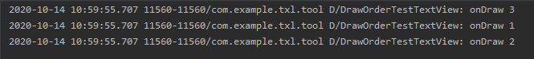

# android 绘制流程之修改子View的绘制顺序

android为我们提供了一个修改View绘制顺序的方法getChildDrawingOrder，今天我们就来学习一下这个方法。

如果对修改View的绘制顺序没有太好的理解可以先参考下这一篇文章

https://blog.csdn.net/plokmju88/article/details/107399102

再网络上流传比较广泛的是 修改RecyclerView的绘制层级的解决方法如下

```java
@Override
protected int getChildDrawingOrder(int childCount, int i) {
  View view = getLayoutManager().getFocusedChild();
  if (null == view) {
    return super.getChildDrawingOrder(childCount, i);
  }
  int position = indexOfChild(view);
  if (position < 0) {
    return super.getChildDrawingOrder(childCount, i);
  }
  if (i == childCount - 1) {
    return position;
  }
  if (i == position) {
    return childCount - 1;
  }
  return super.getChildDrawingOrder(childCount, i);
}
```

实现思路也比较简单，就是将焦点View的order与最后一个View的 order进行互换。这样就能实现焦点View在最上层。

那么getChildDrawingOrder是返回的View的绘制顺序吗？

我们来做一个简单的测试，代码布局如下：

```xml
<?xml version="1.0" encoding="utf-8"?>
<LinearLayout xmlns:android="http://schemas.android.com/apk/res/android"
    xmlns:app="http://schemas.android.com/apk/res-auto"
    xmlns:tools="http://schemas.android.com/tools"
    android:layout_width="match_parent"
    android:layout_height="match_parent"
    android:orientation="vertical"
    android:background="@color/colorPrimary">
    <com.example.txl.tool.draworder.DrawOrderTestFrameLayout
        android:layout_width="wrap_content"
        android:layout_height="wrap_content">
        <com.example.txl.tool.draworder.DrawOrderTestTextView
            android:id="@+id/tv_01"
            android:layout_width="wrap_content"
            android:layout_height="wrap_content"
            android:text="1"/>
        <com.example.txl.tool.draworder.DrawOrderTestTextView
            android:id="@+id/tv_02"
            android:layout_width="wrap_content"
            android:layout_height="wrap_content"
            android:text="2"/>
        <com.example.txl.tool.draworder.DrawOrderTestTextView
            android:id="@+id/tv_03"
            android:layout_width="wrap_content"
            android:layout_height="wrap_content"
            android:text="3"/>
    </com.example.txl.tool.draworder.DrawOrderTestFrameLayout>
</LinearLayout>
```

默认的绘制顺序是  1 2 3；我们的目标绘制顺序是 231

DrawOrderTestFrameLayout代码如下：

```java
public class DrawOrderTestFrameLayout extends FrameLayout {
    public DrawOrderTestFrameLayout(@NonNull Context context) {
        this(context,null);
    }

    public DrawOrderTestFrameLayout(@NonNull Context context, @Nullable AttributeSet attrs) {
        this(context, attrs,0);
    }

    public DrawOrderTestFrameLayout(@NonNull Context context, @Nullable AttributeSet attrs, int defStyleAttr) {
        super(context, attrs, defStyleAttr);
        init();
    }

    private void init() {
        setChildrenDrawingOrderEnabled(true);
    }

    @Override
    protected int getChildDrawingOrder(int childCount, int i) {
        View child = getChildAt(i);
        switch (child.getId()){
            case R.id.tv_01:{
                return 2;
            }
            case R.id.tv_02:{
                return 0;
            }
            case R.id.tv_03:{
                return 1;
            }
        }
        return super.getChildDrawingOrder(childCount, i);
    }
}
```

DrawOrderTestTextView代码如下：

```java
public class DrawOrderTestTextView extends TextView {
    public DrawOrderTestTextView(Context context) {
        super(context);
    }

    public DrawOrderTestTextView(Context context, @Nullable AttributeSet attrs) {
        super(context, attrs);
    }

    public DrawOrderTestTextView(Context context, @Nullable AttributeSet attrs, int defStyleAttr) {
        super(context, attrs, defStyleAttr);
    }

    @Override
    protected void onDraw(Canvas canvas) {
        super.onDraw(canvas);
        Log.d("DrawOrderTestTextView","onDraw "+getText());
    }
}
```

上面的代码输出日志如下：



可以看到并不是按照 我们想要的顺序进行绘制，那么getChildDrawingOrder的返回值到底是什么意思呢？

ViewGroup#dispatchDraw

```java
@Override
    protected void dispatchDraw(Canvas canvas) {
        //usingRenderNodeProperties 始终为false
        boolean usingRenderNodeProperties = canvas.isRecordingFor(mRenderNode);
        final int childrenCount = mChildrenCount;
        final View[] children = mChildren;
        int flags = mGroupFlags;
		//省略代码
        final ArrayList<View> preorderedList = usingRenderNodeProperties
                ? null : buildOrderedChildList();
        final boolean customOrder = preorderedList == null
                && isChildrenDrawingOrderEnabled();
        for (int i = 0; i < childrenCount; i++) {
           //省略代码

            final int childIndex = getAndVerifyPreorderedIndex(childrenCount, i, customOrder);
            final View child = getAndVerifyPreorderedView(preorderedList, children, childIndex);
            if ((child.mViewFlags & VISIBILITY_MASK) == VISIBLE || child.getAnimation() != null) {
                more |= drawChild(canvas, child, drawingTime);
            }
        }
      //省略代码
    }

private int getAndVerifyPreorderedIndex(int childrenCount, int i, boolean customOrder) {
        final int childIndex;
        if (customOrder) {
            final int childIndex1 = getChildDrawingOrder(childrenCount, i);
            if (childIndex1 >= childrenCount) {
                throw new IndexOutOfBoundsException("getChildDrawingOrder() "
                        + "returned invalid index " + childIndex1
                        + " (child count is " + childrenCount + ")");
            }
            childIndex = childIndex1;
        } else {
            childIndex = i;
        }
        return childIndex;
    }

private static View getAndVerifyPreorderedView(ArrayList<View> preorderedList, View[] children,
            int childIndex) {
        final View child;
        if (preorderedList != null) {
            child = preorderedList.get(childIndex);
            if (child == null) {
                throw new RuntimeException("Invalid preorderedList contained null child at index "
                        + childIndex);
            }
        } else {
            child = children[childIndex];
        }
        return child;
    }
```

整体的逻辑如下：

因为usingRenderNodeProperties始终为false，所以preorderedList会一直为空，getAndVerifyPreorderedIndex返回的childIndex就是getChildDrawingOrder返回的int值。getAndVerifyPreorderedView在preorderedList为空的情况下返回的View是child = children[childIndex];也就是说getChildDrawingOrder 的返回值是当前想要绘制View子在数组中的下标。

对应于getChildDrawingOrder(int childCount, int i) 就应该是 根据绘制的位置i 返回 当前想要绘制子View的在数组中的下标。

再来看看先前的代码：

```java
  View child = getChildAt(i);
        switch (child.getId()){
            case R.id.tv_01:{//i=0
                return 2;
            }
            case R.id.tv_02:{//i=1
                return 0;
            }
            case R.id.tv_03:{//i=2
                return 1;
            }
        }
```

根据刚才的分析我们就应该知道为什么绘制顺序是 312了。

输入 i =0    返回2   绘制  mChildren[2]  text = 3

输入 i =1    返回0   绘制  mChildren[0]  text = 1

输入 i =2    返回1   绘制  mChildren[1]  text = 2


显然要实现我们的 绘制目标  231，应该按照下面的逻辑进行返回

输入 i =0    返回1   绘制  mChildren[1]  text = 2

输入 i =1    返回2   绘制  mChildren[2]  text = 3

输入 i =2    返回0   绘制  mChildren[0]  text = 1


int getChildDrawingOrder（int childCount, int i）中i 代表的是绘制的顺序，第几个 。返回值 代表 当前容器的 第几个子View。

代码笔记：

[自定义绘制层级]: https://github.com/xiaolutang/androidTool/blob/master/app/src/main/java/com/example/txl/tool/draworder/DrawOrderActivity.java

