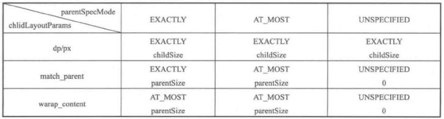

说到自定义View,可能大多数人都知道自定义View有三大流程。测量，布局，绘制。但是对于详细的过程却不是特别清楚。比如：

1. 为什么直接继承View为什么wrap_content会失效？
2. 父View是如何对子View进行测量的？
3. 子View的MeasureSpec是如何决定的？
4. 为什么在onMeasure中不调用setMeasuredDimension会发生异常。

本文将致力于两个位置。

1. 关键方法的调用流程
2. 对于重要的关键细节进行详细说明

# View的绘制流程

- 测量 measure -> onMeasure
- 摆放 layout -> onLayout
- 绘制 draw -> onDraw


# 认识MeasureSpec

MeasureSpec 是View测量的辅助类，View的MeasureSpec由自身的宽高和父容器共同决定。系统会将View的LayoutParams根据父容器所施加的规则转换成对应的MeasureSpec。

Me的高两位是测量模式，低30位是测量大小。测量模式有三种。

```java
 /**
         * Measure specification mode: The parent has not imposed any constraint
         * on the child. It can be whatever size it wants.
         */
        public static final int UNSPECIFIED = 0 << MODE_SHIFT;

        /**
         * Measure specification mode: The parent has determined an exact size
         * for the child. The child is going to be given those bounds regardless
         * of how big it wants to be.
         */
        public static final int EXACTLY     = 1 << MODE_SHIFT;

        /**
         * Measure specification mode: The child can be as large as it wants up
         * to the specified size.
         */
        public static final int AT_MOST     = 2 << MODE_SHIFT;
```

- UNSPECIFIED:父容器对view不限制，要多大给多大，一般系统内部使用。比如RecyclerView，NestedScrollView。
- EXACTLY：父容器检测出view所需大小，view最终大小就是SpecSize的值。对应 LayoutParams中的matchParent、具体数值 两种模式。
- AT_MOST：父容器制定了可用大小即SpecSize，view的大小不能大于这个值，具体要看view的具体实现。对应LayoutParams中的wrap_content。

前面说到MeasureSpec是父容器和自身LayoutParams的共同作用下决定的。那么这个规则是什么呢？ViewGroup抽取了一个公共的方法  getChildMeasureSpec()

```java
/**
     * Does the hard part of measureChildren: figuring out the MeasureSpec to
     * pass to a particular child. This method figures out the right MeasureSpec
     * for one dimension (height or width) of one child view.
     *
     * The goal is to combine information from our MeasureSpec with the
     * LayoutParams of the child to get the best possible results. For example,
     * if the this view knows its size (because its MeasureSpec has a mode of
     * EXACTLY), and the child has indicated in its LayoutParams that it wants
     * to be the same size as the parent, the parent should ask the child to
     * layout given an exact size.
     *
     * @param spec The requirements for this view
     * @param padding The padding of this view for the current dimension and
     *        margins, if applicable
     * @param childDimension How big the child wants to be in the current
     *        dimension
     * @return a MeasureSpec integer for the child
     */
    public static int getChildMeasureSpec(int spec, int padding, int childDimension) {
        int specMode = MeasureSpec.getMode(spec);
        int specSize = MeasureSpec.getSize(spec);

        int size = Math.max(0, specSize - padding);

        int resultSize = 0;
        int resultMode = 0;

        switch (specMode) {
        // Parent has imposed an exact size on us
        case MeasureSpec.EXACTLY:
            if (childDimension >= 0) {
                resultSize = childDimension;
                resultMode = MeasureSpec.EXACTLY;
            } else if (childDimension == LayoutParams.MATCH_PARENT) {
                // Child wants to be our size. So be it.
                resultSize = size;
                resultMode = MeasureSpec.EXACTLY;
            } else if (childDimension == LayoutParams.WRAP_CONTENT) {
                // Child wants to determine its own size. It can't be
                // bigger than us.
                resultSize = size;
                resultMode = MeasureSpec.AT_MOST;
            }
            break;

        // Parent has imposed a maximum size on us
        case MeasureSpec.AT_MOST:
            if (childDimension >= 0) {
                // Child wants a specific size... so be it
                resultSize = childDimension;
                resultMode = MeasureSpec.EXACTLY;
            } else if (childDimension == LayoutParams.MATCH_PARENT) {
                // Child wants to be our size, but our size is not fixed.
                // Constrain child to not be bigger than us.
                resultSize = size;
                resultMode = MeasureSpec.AT_MOST;
            } else if (childDimension == LayoutParams.WRAP_CONTENT) {
                // Child wants to determine its own size. It can't be
                // bigger than us.
                resultSize = size;
                resultMode = MeasureSpec.AT_MOST;
            }
            break;

        // Parent asked to see how big we want to be
        case MeasureSpec.UNSPECIFIED:
            if (childDimension >= 0) {
                // Child wants a specific size... let him have it
                resultSize = childDimension;
                resultMode = MeasureSpec.EXACTLY;
            } else if (childDimension == LayoutParams.MATCH_PARENT) {
                // Child wants to be our size... find out how big it should
                // be
                resultSize = View.sUseZeroUnspecifiedMeasureSpec ? 0 : size;
                resultMode = MeasureSpec.UNSPECIFIED;
            } else if (childDimension == LayoutParams.WRAP_CONTENT) {
                // Child wants to determine its own size.... find out how
                // big it should be
                resultSize = View.sUseZeroUnspecifiedMeasureSpec ? 0 : size;
                resultMode = MeasureSpec.UNSPECIFIED;
            }
            break;
        }
        //noinspection ResourceType
        return MeasureSpec.makeMeasureSpec(resultSize, resultMode);
    }
```

总结如下：


# 测量流程

View的测量、布局、绘制都发起于ViewRootImpl。我们这里不关心这一个其实流程直接进入与我们密切相关View&ViewGroup的测量流程。View的测量通过两个方法来完成，measure和onMeasure。measure被设置成final，意味着子View不能继承它，自身的独特测量逻辑需要通过重写onMeasure来实现。

## View#measure过程

```java
public final void measure(int widthMeasureSpec, int heightMeasureSpec) {
        boolean optical = isLayoutModeOptical(this);
        //省略 代码
        if (forceLayout || needsLayout) {
            // first clears the measured dimension flag
            mPrivateFlags &= ~PFLAG_MEASURED_DIMENSION_SET;

            resolveRtlPropertiesIfNeeded();

            int cacheIndex = forceLayout ? -1 : mMeasureCache.indexOfKey(key);
            if (cacheIndex < 0 || sIgnoreMeasureCache) {
                // measure ourselves, this should set the measured dimension flag back
                onMeasure(widthMeasureSpec, heightMeasureSpec);
                mPrivateFlags3 &= ~PFLAG3_MEASURE_NEEDED_BEFORE_LAYOUT;
            } else {
                long value = mMeasureCache.valueAt(cacheIndex);
                // Casting a long to int drops the high 32 bits, no mask needed
                setMeasuredDimensionRaw((int) (value >> 32), (int) value);
                mPrivateFlags3 |= PFLAG3_MEASURE_NEEDED_BEFORE_LAYOUT;
            }

            // flag not set, setMeasuredDimension() was not invoked, we raise
            // an exception to warn the developer
            if ((mPrivateFlags & PFLAG_MEASURED_DIMENSION_SET) != PFLAG_MEASURED_DIMENSION_SET) {
                throw new IllegalStateException("View with id " + getId() + ": "
                        + getClass().getName() + "#onMeasure() did not set the"
                        + " measured dimension by calling"
                        + " setMeasuredDimension()");
            }

            mPrivateFlags |= PFLAG_LAYOUT_REQUIRED;
        }

        mOldWidthMeasureSpec = widthMeasureSpec;
        mOldHeightMeasureSpec = heightMeasureSpec;

        mMeasureCache.put(key, ((long) mMeasuredWidth) << 32 |
                (long) mMeasuredHeight & 0xffffffffL); // suppress sign extension
    }
```

可以看到View自身的测量逻辑相对还是比较简单，调用onMeasure测量自生，然后检查PFLAG_MEASURED_DIMENSION_SET标记是否有设置，如果没有设置抛出异常，这就是为什么我们必须在onMeasure中调用setMeasuredDimension。

## View的onMeasure：

```java
protected void onMeasure(int widthMeasureSpec, int heightMeasureSpec) {
        setMeasuredDimension(getDefaultSize(getSuggestedMinimumWidth(), widthMeasureSpec),
                getDefaultSize(getSuggestedMinimumHeight(), heightMeasureSpec));
    }
    
    public static int getDefaultSize(int size, int measureSpec) {
        int result = size;
        int specMode = MeasureSpec.getMode(measureSpec);
        int specSize = MeasureSpec.getSize(measureSpec);

        switch (specMode) {
        case MeasureSpec.UNSPECIFIED:
            result = size;
            break;
        case MeasureSpec.AT_MOST:
        case MeasureSpec.EXACTLY:
            result = specSize;
            break;
        }
        return result;
    }
```

可以看到如果直接继承View,使用wrap_content与match_parent是相同的效果。

## VIewGroup的测量

ViewGroup并没有直接重写onMeasure方法，因为它并不清楚具体的子View的测量过程中能够给到每一个子View的宽高。但是ViewGroup抽取了如何和测量某一个子View的公共方法。measureChild 和 measureChildWithMargins

```java
protected void measureChild(View child, int parentWidthMeasureSpec,
            int parentHeightMeasureSpec) {
        final LayoutParams lp = child.getLayoutParams();

        final int childWidthMeasureSpec = getChildMeasureSpec(parentWidthMeasureSpec,
                mPaddingLeft + mPaddingRight, lp.width);
        final int childHeightMeasureSpec = getChildMeasureSpec(parentHeightMeasureSpec,
                mPaddingTop + mPaddingBottom, lp.height);

        child.measure(childWidthMeasureSpec, childHeightMeasureSpec);
    }
    
    protected void measureChildWithMargins(View child,
            int parentWidthMeasureSpec, int widthUsed,
            int parentHeightMeasureSpec, int heightUsed) {
        final MarginLayoutParams lp = (MarginLayoutParams) child.getLayoutParams();

        final int childWidthMeasureSpec = getChildMeasureSpec(parentWidthMeasureSpec,
                mPaddingLeft + mPaddingRight + lp.leftMargin + lp.rightMargin
                        + widthUsed, lp.width);
        final int childHeightMeasureSpec = getChildMeasureSpec(parentHeightMeasureSpec,
                mPaddingTop + mPaddingBottom + lp.topMargin + lp.bottomMargin
                        + heightUsed, lp.height);

        child.measure(childWidthMeasureSpec, childHeightMeasureSpec);
    }
```

measureChild和measureChildWithMargins的区别在于measureChild只考虑当前父容器能够给子View的所有宽高。而measureChildWithMargins能够给子View的是父容器能够给子View的宽高减去其它View已经占用的宽高。

如果你的子VIewGroup有特殊的测量过程，可以通过重新这两个方法来引导子View的测量。比如ScrollView。因为子ScrollView的高度可以任意高。因此重写了这两个方法。具体内容可以自己看看源码。

# 布局流程

View的layout过程是ViewGroup用来确定子元素的位置，当ViewGroup的位置被确定后，他在onLayout中会遍历所有子元素并调用其layout方法。

```java
public void layout(int l, int t, int r, int b) {
        if ((mPrivateFlags3 & PFLAG3_MEASURE_NEEDED_BEFORE_LAYOUT) != 0) {
            onMeasure(mOldWidthMeasureSpec, mOldHeightMeasureSpec);
            mPrivateFlags3 &= ~PFLAG3_MEASURE_NEEDED_BEFORE_LAYOUT;
        }

        int oldL = mLeft;
        int oldT = mTop;
        int oldB = mBottom;
        int oldR = mRight;

        boolean changed = isLayoutModeOptical(mParent) ?
                setOpticalFrame(l, t, r, b) : setFrame(l, t, r, b);

        if (changed || (mPrivateFlags & PFLAG_LAYOUT_REQUIRED) == PFLAG_LAYOUT_REQUIRED) {
            onLayout(changed, l, t, r, b);
            //省略代码。。。
    }
```

在省略其它代码的情况下来看，layout方法首先调用 setFrame确认自己的位置，然后调用onLayout来确定子VIew的位置。onLayout在ViewGroup中是一个空实现，具体的东西在子ViewGroup中实现。以LinearLayout为例。我们分析下它的水平方向上的布局

```java
 @Override
    protected void onLayout(boolean changed, int l, int t, int r, int b) {
        if (mOrientation == VERTICAL) {
            layoutVertical(l, t, r, b);
        } else {
            layoutHorizontal(l, t, r, b);
        }
    }
```


```java
void layoutHorizontal(int left, int top, int right, int bottom) {
        final boolean isLayoutRtl = isLayoutRtl();
        final int paddingTop = mPaddingTop;

        int childTop;
        int childLeft;

        // Where bottom of child should go
        final int height = bottom - top;
        int childBottom = height - mPaddingBottom;

        // Space available for child
        int childSpace = height - paddingTop - mPaddingBottom;

        final int count = getVirtualChildCount();

        final int majorGravity = mGravity & Gravity.RELATIVE_HORIZONTAL_GRAVITY_MASK;
        final int minorGravity = mGravity & Gravity.VERTICAL_GRAVITY_MASK;

        final boolean baselineAligned = mBaselineAligned;

        final int[] maxAscent = mMaxAscent;
        final int[] maxDescent = mMaxDescent;

        final int layoutDirection = getLayoutDirection();
        switch (Gravity.getAbsoluteGravity(majorGravity, layoutDirection)) {
            case Gravity.RIGHT:
                // mTotalLength contains the padding already
                childLeft = mPaddingLeft + right - left - mTotalLength;
                break;

            case Gravity.CENTER_HORIZONTAL:
                // mTotalLength contains the padding already
                childLeft = mPaddingLeft + (right - left - mTotalLength) / 2;
                break;

            case Gravity.LEFT:
            default:
                childLeft = mPaddingLeft;
                break;
        }

        int start = 0;
        int dir = 1;
        //In case of RTL, start drawing from the last child.
        if (isLayoutRtl) {
            start = count - 1;
            dir = -1;
        }

        for (int i = 0; i < count; i++) {
            final int childIndex = start + dir * i;
            final View child = getVirtualChildAt(childIndex);
            if (child == null) {
                childLeft += measureNullChild(childIndex);
            } else if (child.getVisibility() != GONE) {
                final int childWidth = child.getMeasuredWidth();
                final int childHeight = child.getMeasuredHeight();
                int childBaseline = -1;

                final LinearLayout.LayoutParams lp =
                        (LinearLayout.LayoutParams) child.getLayoutParams();

                if (baselineAligned && lp.height != LayoutParams.MATCH_PARENT) {
                    childBaseline = child.getBaseline();
                }

                int gravity = lp.gravity;
                if (gravity < 0) {
                    gravity = minorGravity;
                }

                switch (gravity & Gravity.VERTICAL_GRAVITY_MASK) {
                    case Gravity.TOP:
                        childTop = paddingTop + lp.topMargin;
                        if (childBaseline != -1) {
                            childTop += maxAscent[INDEX_TOP] - childBaseline;
                        }
                        break;

                    case Gravity.CENTER_VERTICAL:
                        // Removed support for baseline alignment when layout_gravity or
                        // gravity == center_vertical. See bug #1038483.
                        // Keep the code around if we need to re-enable this feature
                        // if (childBaseline != -1) {
                        //     // Align baselines vertically only if the child is smaller than us
                        //     if (childSpace - childHeight > 0) {
                        //         childTop = paddingTop + (childSpace / 2) - childBaseline;
                        //     } else {
                        //         childTop = paddingTop + (childSpace - childHeight) / 2;
                        //     }
                        // } else {
                        childTop = paddingTop + ((childSpace - childHeight) / 2)
                                + lp.topMargin - lp.bottomMargin;
                        break;

                    case Gravity.BOTTOM:
                        childTop = childBottom - childHeight - lp.bottomMargin;
                        if (childBaseline != -1) {
                            int descent = child.getMeasuredHeight() - childBaseline;
                            childTop -= (maxDescent[INDEX_BOTTOM] - descent);
                        }
                        break;
                    default:
                        childTop = paddingTop;
                        break;
                }

                if (hasDividerBeforeChildAt(childIndex)) {
                    childLeft += mDividerWidth;
                }

                childLeft += lp.leftMargin;
                setChildFrame(child, childLeft + getLocationOffset(child), childTop,
                        childWidth, childHeight);
                childLeft += childWidth + lp.rightMargin +
                        getNextLocationOffset(child);

                i += getChildrenSkipCount(child, childIndex);
            }
        }
    }
```

