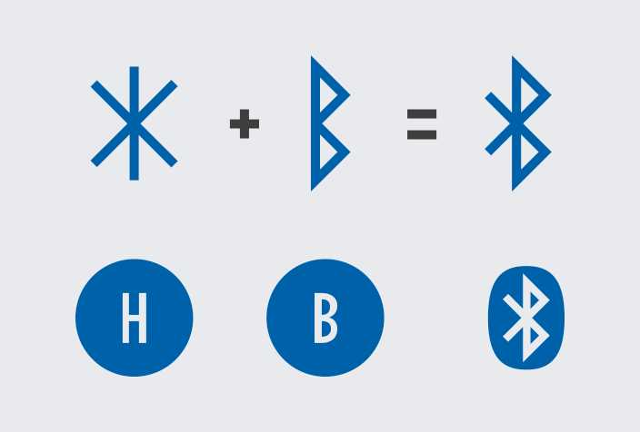
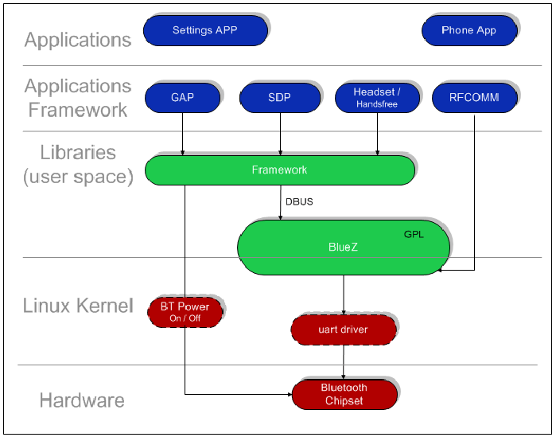
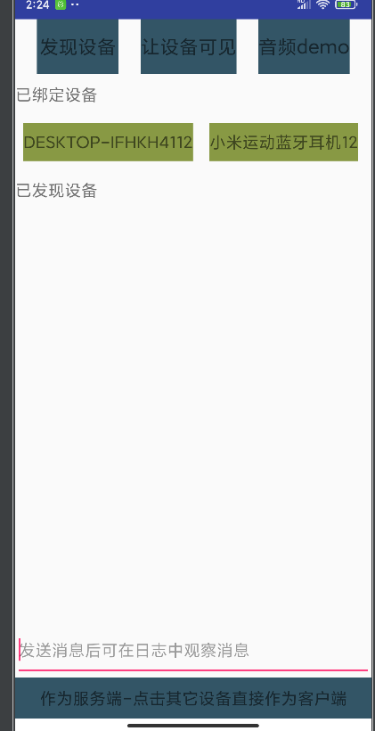
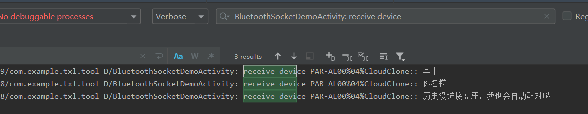

这是我参与更文挑战的第4天，活动详情查看： [更文挑战](https://juejin.cn/post/6967194882926444557)

6月的更文或许会迟到，但是却不会缺席。这两我们天不刷题，学习一下蓝牙方面的知识。

这周末不做饭，打算更新3篇与蓝牙相关的文章。

1. 写给Android应用开发工程师的蓝牙使用流程与案例（主要是蓝牙的基础使用流程）
2. 如何打造一个与车载蓝牙进行联动的音频播放器
3. 从源码的角度理解蓝牙工作流程


# 蓝牙由来

蓝牙（Bluetooth）一词取自于十世纪丹麦国王哈拉尔的名字 Harald Bluetooth。据说这位国王酷爱吃蓝莓，所以他的牙龈每天都是蓝色的，因此他的外号就叫做蓝牙王。

可能大家不知道，蓝牙（Bluetooth）一词取自于十世纪丹麦国王哈拉尔的名字 Harald Bluetooth。据说这位国王酷爱吃蓝莓，所以他的牙龈每天都是蓝色的，因此他的外号就叫做蓝牙王。


而将「蓝牙」与后来的无线通讯技术标准关联在一起的，是一位来自英特尔的工程师 Jim Kardach。

哈拉尔国王以统一了因宗教战争和领土争议而分裂的挪威与丹麦而闻名于世，国王的成就与 Jim Kardach 的理念不谋而合，他希望蓝牙也可以成为统一的通用传输标准——将所有分散的设备与内容互联互通。

现在大家所看到的蓝牙的图标，也是根据蓝牙国王的名字而来的，是由哈拉尔•蓝牙名字的首字母“H”和“B”的小Futhark弗萨克文字（属于老日耳曼如尼文）字母“ᚼ（Hagall）”和“ᛒ（Bjarkan）”拼在一起，成为了今天大家熟知的蓝色徽标（这里有资料说是老如尼文也是没错的，因为小Futhark弗萨克文字就是属于老如尼文）。




# 蓝牙协议栈组成

在应用层的角度我们可以不用太过深入理解蓝牙的相关协议，但是需要有一个概念性的认识，就像在刚学习开发的时候我们不必深究tcp/ip的每一层细节是如何实现的，只需要通过系统api进行数据传输就可以了。但是有了这些概念我们可以根据自身需求决定是否深入到某些细节进行研究



# 蓝牙开发流程

1. 声明权限
2. 蓝牙设置
3. 发现设备
4. 连接设备


## 蓝牙权限声明

蓝牙的使用有三个权限：

BLUETOOTH：需要此权限才能执行任何蓝牙通信，例如请求连接、接受连接和传输数据。

ACCESS_FINE_LOCATION：蓝牙扫描可用于收集用户的位置信息。此类信息可能来自用户自己的设备，以及在商店和交通设施等位置使用的蓝牙信标。

BLUETOOTH_ADMIN：这个权限不是必须，但是如果您想让应用启动设备发现或操纵蓝牙设置，需要使用这个权限。

权限声明代码：

```xml
<!--蓝牙权限-->
    <uses-permission android:name="android.permission.BLUETOOTH" />
    <uses-permission android:name="android.permission.BLUETOOTH_ADMIN" />
    <!-- If your app targets Android 9 or lower, you can declare
         ACCESS_COARSE_LOCATION instead. -->
    <uses-permission android:name="android.permission.ACCESS_FINE_LOCATION" />
    <!--蓝牙权限-->
```

## 蓝牙管理

- 检测设备是否支持蓝牙
- 启用蓝牙
- 监听蓝牙状态变化

在正常使用蓝牙功能之前我们需要判断当前设备是否支持蓝牙，如果不支持的话我们就不应该在使用蓝牙相关的功能。如果设备支持蓝牙，但是蓝牙已经关闭那么我们可以在不离开应用的情况下开启蓝牙。这些都需要借助BluetoothAdapter。

参考代码如下：

```java
BluetoothAdapter bluetoothAdapter = BluetoothAdapter.getDefaultAdapter();
        if (bluetoothAdapter == null) {//当bluetoothAdapter 为空的时候说明应用不支持蓝牙
            Toast.makeText(this, "当前设备不支持蓝牙", Toast.LENGTH_SHORT).show();
            return;
        }

        if (!bluetoothAdapter.isEnabled()) {//蓝牙不可用，开启蓝牙
            Intent enableBtIntent = new Intent(BluetoothAdapter.ACTION_REQUEST_ENABLE);
            startActivityForResult(enableBtIntent, REQUEST_ENABLE_BT);
        }
```

如果成功启用蓝牙，会在 Activity 的  onActivityResult() 回调中收到 RESULT_OK 结果代码。如果由于某个错误（或用户响应“No”）未成功启用蓝牙，则结果代码为 RESULT_CANCELED。

同时我们还可以通过广播注册的方式，来监听蓝牙的状态变化。

蓝牙有四种状态

STATE_TURNING_ON   正在打开

STATE_ON   打开

STATE_TURNING_OFF   正在关闭

STATE_OFF  关闭

每当蓝牙状态发生变化时，系统都会广播此 Intent。此广播包含额外字段 EXTRA_STATE 和 EXTRA_PREVIOUS_STATE，二者分别表示新的和旧的蓝牙状态。其值为上面4中状态中的一种。

```java
IntentFilter intentFilter = new IntentFilter();
        //监听蓝牙状态改变Action
intentFilter.addAction(BluetoothAdapter.ACTION_STATE_CHANGED);
```


## 设备发现

- 发现别的设备
- 监听发现的设备
- 能够被别的设备发现
- 监听被识别状态改变

设备发现是一个扫描过程，它会搜索局部区域内已启用蓝牙功能的设备，并请求与每台设备相关的某些信息。此过程有时也被称为发现、查询或扫描。但是，只有在当下接受信息请求时，附近区域的蓝牙设备才会通过启用可检测性响应发现请求。如果设备已启用可检测性，它会通过共享一些信息（例如设备的名称、类及其唯一的 MAC 地址）来响应发现请求。借助此类信息，执行发现过程的设备可选择发起对已检测到设备的连接。

在首次与远程设备建立连接后，系统会自动向用户显示配对请求。当设备完成配对后，系统会保存关于该设备的基本信息（例如设备的名称、类和 MAC 地址），并且可使用 Bluetooth API 读取这些信息。借助远程设备的已知 MAC 地址，您可以随时向其发起连接，而无需执行发现操作（假定该设备仍处于有效范围内）。

请注意，被配对与被连接之间存在区别：

- 被配对是指两台设备知晓彼此的存在，具有可用于身份验证的共享链路密钥，并且能够与彼此建立加密连接。
- 被连接是指设备当前共享一个 RFCOMM 通道，并且能够向彼此传输数据。当前的 Android Bluetooth API 要求规定，只有先对设备进行配对，然后才能建立 RFCOMM 连接。在使用 Bluetooth API 发起加密连接时，系统会自动执行配对。

**查询配对设备**

在执行设备发现之前，您必须查询已配对的设备集，以了解所需的设备是否处于已检测到状态。为此，请调用 getBondedDevices()。此方法会返回一组表示已配对设备的 BluetoothDevice 对象。BluetoothDevice包含了蓝牙连接的相关信息。

```java
Set<BluetoothDevice> pairedDevices = bluetoothAdapter.getBondedDevices();
```

**蓝牙设备发现**

Android系统通过BluetoothAdapter 提供了三个设备发现相关的api

```java
startDiscovery()//开始设备查找
cancelDiscovery()//取消设备查找
isDiscovering()//是否正在执行设备发现
```

**处理发现的设备**

要接收处理设备发现信息必须注册一个 action为BluetoothDevice.ACTION_FOUND的广播。系统会为每台设备广播此 Intent。Intent 包含额外字段 EXTRA_DEVICE 和 EXTRA_CLASS，二者又分别包含 BluetoothDevice 和 BluetoothClass。BluetoothDevice包含蓝牙连接的相关信息，BluetoothClass可以查看当前设备支持的协议。

**蓝牙设备的可检测性**

如果您希望将本地设备设为可被其他设备检测到，请使用 ACTION_REQUEST_DISCOVERABLE Intent 调用 startActivityForResult(Intent, int)。这样便可发出启用系统可检测到模式的请求，从而无需导航至设置应用，避免暂停使用您的应用。默认情况下，设备处于可检测到模式的时间为 120 秒（2 分钟）。通过添加 EXTRA_DISCOVERABLE_DURATION Extra 属性，您可以定义不同的持续时间，最高可达 3600 秒（1 小时）。

示例代码：

```java
Intent discoverableIntent =
        new Intent(BluetoothAdapter.ACTION_REQUEST_DISCOVERABLE);
discoverableIntent.putExtra(BluetoothAdapter.EXTRA_DISCOVERABLE_DURATION, 300);//如果时间设置成0,那么设备会一直处于可检测状态
startActivity(discoverableIntent);
```

**监听设备的可检测性**

设备将在分配的时间内以静默方式保持可检测到模式。如果您希望在可检测到模式发生变化时收到通知，则可以为 ACTION_SCAN_MODE_CHANGED Intent 注册 BroadcastReceiver。此 Intent 将包含额外字段 EXTRA_SCAN_MODE 和 EXTRA_PREVIOUS_SCAN_MODE，二者分别提供新的和旧的扫描模式。每个 Extra 属性可能拥有以下值：

SCAN_MODE_CONNECTABLE_DISCOVERABLE
设备处于可检测到模式。
SCAN_MODE_CONNECTABLE
设备未处于可检测到模式，但仍能收到连接。
SCAN_MODE_NONE
设备未处于可检测到模式，且无法收到连接。
如果您要发起对远程设备的连接，则无需启用设备可检测性。只有当您希望应用对接受传入连接的服务器套接字进行托管时，才有必要启用可检测性，因为在发起对其他设备的连接之前，远程设备必须能够发现这些设备。

需要注意的是  **如果尚未在设备上启用蓝牙，则启用设备可检测性会自动启用蓝牙。**

**蓝牙连接**

蓝牙的连接会涉及到 两个关键类BluetoothServerSocket 、BluetoothSocket   。BluetoothServerSocket作为服务端来监听客户端的连接请求，BluetoothSocket用于已经建立的连接发送数据。

参考代码：利用蓝牙进行数据传输。

```java
package com.example.txl.tool.bluetooth;

import androidx.annotation.Nullable;
import androidx.appcompat.app.AppCompatActivity;
import androidx.recyclerview.widget.RecyclerView;

import android.bluetooth.BluetoothAdapter;
import android.bluetooth.BluetoothDevice;
import android.bluetooth.BluetoothServerSocket;
import android.bluetooth.BluetoothSocket;
import android.content.BroadcastReceiver;
import android.content.Context;
import android.content.Intent;
import android.content.IntentFilter;
import android.os.Bundle;
import android.text.Editable;
import android.text.TextWatcher;
import android.util.Log;
import android.view.KeyEvent;
import android.view.View;
import android.view.inputmethod.EditorInfo;
import android.widget.EditText;
import android.widget.TextView;
import android.widget.Toast;

import com.example.txl.tool.R;
import com.example.txl.tool.base.BaseAdapter;
import com.example.txl.tool.utils.AppExecutors;

import org.jetbrains.annotations.NotNull;

import java.io.IOException;
import java.io.InputStream;
import java.io.OutputStream;
import java.util.ArrayList;
import java.util.Set;
import java.util.UUID;

public class BluetoothSocketDemoActivity extends AppCompatActivity {
    private static final String TAG = BluetoothSocketDemoActivity.class.getSimpleName();
    private static final int REQUEST_ENABLE_BT = 10086;

    private  UUID uuid = null;

    private final BluetoothAdapter bluetoothAdapter = BluetoothAdapter.getDefaultAdapter();
    private ServerRunnable serverRunnable = null;
    private ClientRunnable clientRunnable = null;
    private final BroadcastReceiver receiver = new BroadcastReceiver() {
        @Override
        public void onReceive(Context context, Intent intent) {
            String action = intent.getAction();
            if(BluetoothAdapter.ACTION_STATE_CHANGED.equals(action)){//蓝牙状态改变
                int currentState =  intent.getIntExtra(BluetoothAdapter.EXTRA_STATE,BluetoothAdapter.STATE_OFF);
                int perState =  intent.getIntExtra(BluetoothAdapter.EXTRA_PREVIOUS_STATE,BluetoothAdapter.STATE_OFF);
                Log.d(TAG,"蓝牙状态改变 onReceive BluetoothAdapter.ACTION_STATE_CHANGED perState = "+perState+" currentState = "+currentState);
            }else if(BluetoothDevice.ACTION_FOUND.equals(action)) {//设备发现
                BluetoothDevice device = intent.getParcelableExtra(BluetoothDevice.EXTRA_DEVICE);
                Log.d(TAG,"onReceive BluetoothDevice.ACTION_FOUND "+device.getName()+" address: "+device.getAddress());
                foundDeviceAdapter.addData(device);//因为是Demo这里不关心是否有重复设备，设备被移除
            }else if(BluetoothAdapter.ACTION_SCAN_MODE_CHANGED.equals(action)){//蓝牙可见性
                int currentState =  intent.getIntExtra(BluetoothAdapter.EXTRA_SCAN_MODE,BluetoothAdapter.SCAN_MODE_NONE);
                int perState =  intent.getIntExtra(BluetoothAdapter.EXTRA_PREVIOUS_SCAN_MODE,BluetoothAdapter.SCAN_MODE_NONE);
                Log.d(TAG," 蓝牙可见性 onReceive BluetoothAdapter.ACTION_SCAN_MODE_CHANGED perState = "+perState+" currentState = "+currentState);
            }
        }
    };


    private RecyclerView rvBound,rvFound;
    private FoundDeviceAdapter foundDeviceAdapter;
    private BoundDeviceAdapter boundDeviceAdapter;

    @Override
    protected void onCreate(Bundle savedInstanceState) {
        super.onCreate(savedInstanceState);
        setContentView(R.layout.activity_bluetooth_socket_demo);
        initView();
        settingBluetooth();
    }

    private void initView() {
        rvBound = findViewById(R.id.recyclerViewBound);
        rvFound = findViewById(R.id.recyclerViewFind);
        TextView tvFound = findViewById(R.id.tvStartDiscovery);
        tvFound.setOnClickListener(new View.OnClickListener() {
            @Override
            public void onClick(View v) {
                if(bluetoothAdapter == null){
                    Toast.makeText(BluetoothSocketDemoActivity.this, "当前设备不支持蓝牙", Toast.LENGTH_SHORT).show();
                    return;
                }
                findDevice();
            }
        });
        tvFound = findViewById(R.id.tvMakeVisible);
        tvFound.setOnClickListener(new View.OnClickListener() {
            @Override
            public void onClick(View v) {
                if(bluetoothAdapter == null){
                    Toast.makeText(BluetoothSocketDemoActivity.this, "当前设备不支持蓝牙", Toast.LENGTH_SHORT).show();
                    return;
                }
                makeBluetoothVisible();
            }
        });
        findViewById(R.id.tvAsServer).setOnClickListener(new View.OnClickListener() {
            @Override
            public void onClick(View v) {
                asServer();
                Toast.makeText(BluetoothSocketDemoActivity.this,"以作为服务端,可以通过其他设备连接进行通信",Toast.LENGTH_SHORT).show();
            }
        });
        EditText editText = findViewById(R.id.edInput);
        editText.setOnEditorActionListener(new TextView.OnEditorActionListener() {
            @Override
            public boolean onEditorAction(TextView v, int actionId, KeyEvent event) {
                if(actionId == EditorInfo.IME_ACTION_SEND){
                    sendMessage(editText.getText().toString());
                    editText.getText().clear();
                    return true;
                }
                return false;
            }
        });
        boundDeviceAdapter = new BoundDeviceAdapter(this);
        rvBound.setAdapter(boundDeviceAdapter);
        foundDeviceAdapter = new FoundDeviceAdapter(this);
        rvFound.setAdapter(foundDeviceAdapter);
        boundDeviceAdapter.setItemClickListener(new BaseAdapter.OnItemClickListener<BluetoothDevice>() {
            @Override
            public void onItemClick(@NotNull View clickView, int position, @org.jetbrains.annotations.Nullable BluetoothDevice data, @NotNull BaseAdapter<BluetoothDevice> adapter) {
                asClient(data);
            }
        });
        foundDeviceAdapter.setItemClickListener(new BaseAdapter.OnItemClickListener<BluetoothDevice>() {
            @Override
            public void onItemClick(@NotNull View clickView, int position, @org.jetbrains.annotations.Nullable BluetoothDevice data, @NotNull BaseAdapter<BluetoothDevice> adapter) {
                asClient(data);
            }
        });
    }

    private void sendMessage(String message){
        if(message == null || message.isEmpty()){
            Toast.makeText(this,"不能发送空消息",Toast.LENGTH_SHORT).show();
            return;
        }
        if(serverRunnable != null){
            serverRunnable.write(message);
            return;
        }
        if(clientRunnable != null){
            clientRunnable.write(message);
            return;
        }
        Toast.makeText(this,"没有连接的对象发送消息",Toast.LENGTH_SHORT).show();
    }

    private void asServer(){
        resetServer();
        resetClient();
        serverRunnable = new ServerRunnable();
        AppExecutors.getInstance().networkIO().execute(serverRunnable);
    }

    private void asClient(BluetoothDevice device){
        resetServer();
        resetClient();
        clientRunnable = new ClientRunnable(device);
        AppExecutors.getInstance().networkIO().execute(clientRunnable);
    }

    private void resetClient(){
        if(clientRunnable != null){
            clientRunnable.cancel();
            clientRunnable = null;
        }
    }

    private void resetServer(){
        if(serverRunnable != null){
            serverRunnable.cancel();
            serverRunnable = null;
        }
    }


    // Unique UUID for this application
    private static final UUID MY_UUID_SECURE =
            UUID.fromString("fa87c0d0-afac-11de-8a39-0800200c9a66");
    private static final UUID MY_UUID_INSECURE =
            UUID.fromString("8ce255c0-200a-11e0-ac64-0800200c9a66");

    //step2 设置蓝牙
    private void settingBluetooth() {
        if (bluetoothAdapter == null) {//当bluetoothAdapter 为空的时候说明应用不支持蓝牙
            Toast.makeText(this, "当前设备不支持蓝牙", Toast.LENGTH_SHORT).show();
            finish();
            return;
        }

//        uuid = UUID.nameUUIDFromBytes((getPackageName()+bluetoothAdapter.getAddress()).getBytes());
        uuid = MY_UUID_SECURE;

        if (!bluetoothAdapter.isEnabled()) {//蓝牙不可用，开启蓝牙
            Intent enableBtIntent = new Intent(BluetoothAdapter.ACTION_REQUEST_ENABLE);
            startActivityForResult(enableBtIntent, REQUEST_ENABLE_BT);
        }
        registerReceiver();
//        makeBluetoothVisible();

    }

    @Override
    protected void onResume() {
        super.onResume();
        if(bluetoothAdapter != null){
            Set<BluetoothDevice> devices =  bluetoothAdapter.getBondedDevices();
            boundDeviceAdapter.setListData(new ArrayList<>(devices));
        }

    }

    private void registerReceiver() {
        IntentFilter intentFilter = new IntentFilter();
        //监听蓝牙状态改变
        intentFilter.addAction(BluetoothAdapter.ACTION_STATE_CHANGED);
        //监听设备发现
        intentFilter.addAction(BluetoothDevice.ACTION_FOUND);
        //监听蓝牙设备的可见性
        intentFilter.addAction(BluetoothAdapter.ACTION_SCAN_MODE_CHANGED);
        registerReceiver(receiver,intentFilter);
    }

    /**
     * 设置蓝牙在30s内可见
     * */
    private void makeBluetoothVisible() {
        Intent discoverableIntent = new Intent(BluetoothAdapter.ACTION_REQUEST_DISCOVERABLE);
        discoverableIntent.putExtra(BluetoothAdapter.EXTRA_DISCOVERABLE_DURATION, 30);
        startActivity(discoverableIntent);
    }


    //step3 发现设备
    private void findDevice(){
        if(bluetoothAdapter != null && bluetoothAdapter.isEnabled()){
            if(bluetoothAdapter.isDiscovering()){
                Toast.makeText(this,"处于设备发现中",Toast.LENGTH_SHORT).show();
                return;
            }
            foundDeviceAdapter.setListData(new ArrayList<>());
            foundDeviceAdapter.notifyDataSetChanged();
            bluetoothAdapter.startDiscovery();
            Toast.makeText(this,"设备发现开启",Toast.LENGTH_SHORT).show();
        }else {
            Toast.makeText(this,"蓝牙状态异常",Toast.LENGTH_SHORT).show();
        }
    }

    @Override
    protected void onActivityResult(int requestCode, int resultCode, @Nullable Intent data) {
        if(requestCode == REQUEST_ENABLE_BT){
            if(resultCode == RESULT_OK){
                Toast.makeText(this,"蓝牙已开启",Toast.LENGTH_SHORT).show();
                return;
            }
        }
        super.onActivityResult(requestCode, resultCode, data);
    }


    @Override
    protected void onDestroy() {
        super.onDestroy();
        unregisterReceiver(receiver);
        resetClient();
        resetServer();

    }

    class ServerRunnable implements Runnable{
        boolean runAccept = true;
        BluetoothServerSocket serverSocket;
        BluetoothSocket bluetoothSocket;
        InputStream inputStream = null;
        OutputStream outputStream = null;
        BluetoothDevice remoteDevice = null;

        public ServerRunnable() {
            try {
                serverSocket = bluetoothAdapter.listenUsingRfcommWithServiceRecord("bluetoothSocket",uuid );
            } catch (IOException e) {
                e.printStackTrace();
            }
        }

        @Override
        public void run() {
            try {
                bluetoothSocket = serverSocket.accept();
            } catch (IOException e) {
                e.printStackTrace();
            }
            if(bluetoothSocket != null){
                try {
                    serverSocket.close();
                    serverSocket = null;
//                    bluetoothSocket.connect();
                    remoteDevice = bluetoothSocket.getRemoteDevice();
                    bluetoothSocket.getRemoteDevice();
                    inputStream = bluetoothSocket.getInputStream();
                    outputStream =bluetoothSocket.getOutputStream();
                } catch (IOException e) {
                    e.printStackTrace();
                }
                byte[] buffer = new byte[1024];
                int bytes;
                while (runAccept){
                    try {
                        bytes = inputStream.read(buffer);
                        String readMessage = new String(buffer, 0, bytes);
                        Log.d(TAG,"receive device "+remoteDevice.getName()+":: "+readMessage);
                    } catch (IOException e) {
                        e.printStackTrace();
                    }
                }
            }

        }

        public void cancel(){
            runAccept =  false;
            if(outputStream  != null){
                try {
                    outputStream.close();
                    outputStream = null;
                } catch (IOException e) {
                    e.printStackTrace();
                }
            }
            if(inputStream  != null){
                try {
                    inputStream.close();
                    inputStream = null;
                } catch (IOException e) {
                    e.printStackTrace();
                }
            }
            if(bluetoothSocket != null){
                try {
                    bluetoothSocket.close();
                    bluetoothSocket = null;
                } catch (IOException e) {
                    e.printStackTrace();
                }
            }
            if(serverSocket != null){
                try {
                    serverSocket.close();
                    serverSocket = null;
                } catch (IOException e) {
                    e.printStackTrace();
                }
            }
        }
        private void write(String data){
            if(outputStream != null){

                try {
                    outputStream.write(data.getBytes());
                } catch (IOException e) {
                    e.printStackTrace();
                }
            }
        }
    }

    class ClientRunnable implements Runnable{
        private BluetoothSocket bluetoothSocket;
        InputStream inputStream = null;
        OutputStream outputStream = null;
        BluetoothDevice device;
        boolean runAccept;
        public ClientRunnable(BluetoothDevice device) {
            this.device = device;
            try {
                bluetoothSocket = device.createRfcommSocketToServiceRecord(uuid);
            } catch (IOException e) {
                e.printStackTrace();
            }
        }

        @Override
        public void run() {
            if(bluetoothSocket != null){
                try {
                    bluetoothSocket.connect();
                    AppExecutors.getInstance().mainThread().execute(new Runnable() {
                        @Override
                        public void run() {
                            Toast.makeText(BluetoothSocketDemoActivity.this,"连接成功，可以发送消息拉",Toast.LENGTH_SHORT).show();
                        }
                    });

                    inputStream = bluetoothSocket.getInputStream();
                    outputStream =bluetoothSocket.getOutputStream();
                } catch (IOException e) {
                    e.printStackTrace();
                    AppExecutors.getInstance().mainThread().execute(new Runnable() {
                        @Override
                        public void run() {
                            Toast.makeText(BluetoothSocketDemoActivity.this,"连接失败，请重试",Toast.LENGTH_SHORT).show();
                        }
                    });
                    return;
                }
                byte[] buffer = new byte[1024];
                int bytes;
                while (runAccept){
                    try {
                        bytes = inputStream.read(buffer);
                        String readMessage = new String(buffer, 0, bytes);
                        Log.d(TAG,"receive device "+device.getName()+":: "+readMessage);
                    } catch (IOException e) {
                        e.printStackTrace();
                    }
                }
            }
        }

        public void cancel(){
            runAccept =  false;
            if(outputStream  != null){
                try {
                    outputStream.close();
                    outputStream = null;
                } catch (IOException e) {
                    e.printStackTrace();
                }
            }
            if(inputStream  != null){
                try {
                    inputStream.close();
                    inputStream = null;
                } catch (IOException e) {
                    e.printStackTrace();
                }
            }
            if(bluetoothSocket != null){
                try {
                    bluetoothSocket.close();
                    bluetoothSocket = null;
                } catch (IOException e) {
                    e.printStackTrace();
                }
            }
        }

        private void write(String data){
            if(outputStream != null){
                try {
                    outputStream.write(data.getBytes());
                } catch (IOException e) {
                    e.printStackTrace();
                }
            }
        }
    }


}
```

运行是要注意，需要两个设备进行配合，一段作为客户端，一端作为服务端来进行连接运行。

效果截图



运行结果




参考代码地址：https://github.com/xiaolutang/androidTool/blob/master/app/src/main/java/com/example/txl/tool/bluetooth/BluetoothSocketDemoActivity.java

# 下一小节预告

打造一个能与车载蓝牙进行互动的音频播放器。敬请期待。

既然都看到了这里，点个赞鼓励下作者吧。打卡不易

文章参考：

https://www.shenzhenware.com/articles/12384

http://www.360doc.com/content/16/0309/19/235269_540838074.shtml

https://developer.android.google.cn/guide/topics/connectivity/bluetooth#TheBasics

http://www.360doc.com/content/17/1205/04/49958124_710002696.shtml