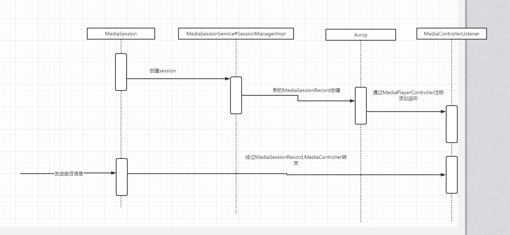

这是我参与更文挑战的第6天，活动详情查看： [更文挑战](https://juejin.cn/post/6967194882926444557)

# BluetoothManagerService的启动过程

SystemServer#startOtherService  启动BluetoothService服务

```java
private void startOtherServices() {
	...
	 // Skip Bluetooth if we have an emulator kernel
     // TODO: Use a more reliable check to see if this product should
     // support Bluetooth - see bug 988521
     if (isEmulator) {
     Slog.i(TAG, "No Bluetooth Service (emulator)");
     } else if (mFactoryTestMode == FactoryTest.FACTORY_TEST_LOW_LEVEL) {
     Slog.i(TAG, "No Bluetooth Service (factory test)");
     } else if (!context.getPackageManager().hasSystemFeature
     (PackageManager.FEATURE_BLUETOOTH)) {
     Slog.i(TAG, "No Bluetooth Service (Bluetooth Hardware Not Present)");
     } else {
     traceBeginAndSlog("StartBluetoothService");
     mSystemServiceManager.startService(BluetoothService.class);
     traceEnd();
     }
	...
}
```

SystemServiceManager#startService启动BluetoothService，BluetoothService将BluetoothManagerServicet添加到系统服务，其它应用程序可以通过getSystemService访问。

```java
class BluetoothService extends SystemService {
    private BluetoothManagerService mBluetoothManagerService;

    public BluetoothService(Context context) {
        super(context);
        mBluetoothManagerService = new BluetoothManagerService(context);
    }

    @Override
    public void onStart() {
    }

    @Override
    public void onBootPhase(int phase) {
        if (phase == SystemService.PHASE_SYSTEM_SERVICES_READY) {
            publishBinderService(BluetoothAdapter.BLUETOOTH_MANAGER_SERVICE,
                    mBluetoothManagerService);
        } else if (phase == SystemService.PHASE_ACTIVITY_MANAGER_READY) {
            mBluetoothManagerService.handleOnBootPhase();
        }
    }

    @Override
    public void onSwitchUser(int userHandle) {
        mBluetoothManagerService.handleOnSwitchUser(userHandle);
    }

    @Override
    public void onUnlockUser(int userHandle) {
        mBluetoothManagerService.handleOnUnlockUser(userHandle);
    }
}
```

# BluetoothAdapter的初始化过程

```java
 public static synchronized BluetoothAdapter getDefaultAdapter() {
        if (sAdapter == null) {
            //如果BluetoothManagerService 已经启动 此时的b是BluetoothManagerService的代理对象
            IBinder b = ServiceManager.getService(BLUETOOTH_MANAGER_SERVICE);
            if (b != null) {
                IBluetoothManager managerService = IBluetoothManager.Stub.asInterface(b);
                sAdapter = new BluetoothAdapter(managerService);
            } else {
                Log.e(TAG, "Bluetooth binder is null");
            }
        }
        return sAdapter;
    }
    
    BluetoothAdapter(IBluetoothManager managerService) {

        if (managerService == null) {
            throw new IllegalArgumentException("bluetooth manager service is null");
        }
        try {
            mServiceLock.writeLock().lock();
            //
            mService = managerService.registerAdapter(mManagerCallback);
        } catch (RemoteException e) {
            Log.e(TAG, "", e);
        } finally {
            mServiceLock.writeLock().unlock();
        }
        mManagerService = managerService;
        mLeScanClients = new HashMap<LeScanCallback, ScanCallback>();
        mToken = new Binder();
    }
```

BluetoothManagerService#registerAdapter  返回的是一个AdapterServiceBinder 对象，该对象持有AdapterService，AdapterService可以理解成与底层系统打交道，并且负责管理当前设备支持的profile。当对应的profile连接状态改变的时候，由它负责回调响应的观察者。

# 蓝牙的开启过程

蓝牙的开关都是通过调用BluetoothAdapter 的enable和disable来进行这里分析下开启的流程

BluetoothAdapter

```java
public boolean enable() {
        if (isEnabled()) {
            if (DBG) {
                Log.d(TAG, "enable(): BT already enabled!");
            }
            return true;
        }
        try {
            return mManagerService.enable(ActivityThread.currentPackageName());
        } catch (RemoteException e) {
            Log.e(TAG, "", e);
        }
        return false;
    }
```

mManagerService 是BluetoothManagerService的代理对象

```java
public boolean enable(String packageName) throws RemoteException {
        final int callingUid = Binder.getCallingUid();
        final boolean callerSystem = UserHandle.getAppId(callingUid) == Process.SYSTEM_UID;

        if (isBluetoothDisallowed()) {//判断蓝牙是否被禁用
            if (DBG) {
                Slog.d(TAG, "enable(): not enabling - bluetooth disallowed");
            }
            return false;
        }

        if (!callerSystem) {//并不是系统调用
            if (!checkIfCallerIsForegroundUser()) {//检查应用是否在前台，非前台应用不能调用
                Slog.w(TAG, "enable(): not allowed for non-active and non system user");
                return false;
            }
			//检查权限BLUETOOTH_ADMIN_PERM
            mContext.enforceCallingOrSelfPermission(BLUETOOTH_ADMIN_PERM,
                    "Need BLUETOOTH ADMIN permission");
			//startConsentUiIfNeeded  逻辑与我们自己通过BluetoothAdapter.ACTION_REQUEST_ENABLE action 启动activity一致
            if (!isEnabled() && mPermissionReviewRequired && startConsentUiIfNeeded(packageName,
                    callingUid, BluetoothAdapter.ACTION_REQUEST_ENABLE)) {
                return false;
            }
        }

        if (DBG) {
            Slog.d(TAG, "enable(" + packageName + "):  mBluetooth =" + mBluetooth + " mBinding = "
                    + mBinding + " mState = " + BluetoothAdapter.nameForState(mState));
        }

        synchronized (mReceiver) {
            mQuietEnableExternal = false;
            mEnableExternal = true;
            // waive WRITE_SECURE_SETTINGS permission check
            sendEnableMsg(false,
                    BluetoothProtoEnums.ENABLE_DISABLE_REASON_APPLICATION_REQUEST, packageName);
        }
        if (DBG) {
            Slog.d(TAG, "enable returning");
        }
        return true;
    }
```

sendEnableMsg 发送了一个MESSAGE_ENABLE消息

```java
 private void sendEnableMsg(boolean quietMode, int reason, String packageName) {
        mHandler.sendMessage(mHandler.obtainMessage(MESSAGE_ENABLE, quietMode ? 1 : 0, 0));
        addActiveLog(reason, packageName, true);
        mLastEnabledTime = SystemClock.elapsedRealtime();
    }
```

在处理MESSAGE_ENABLE时又会调用handleEnable（）

```java
private void handleEnable(boolean quietMode) {
    ...
        Intent i = new Intent(IBluetooth.class.getName());
         if (!doBind(i, mConnection, Context.BIND_AUTO_CREATE | Context.BIND_IMPORTANT,
                        UserHandle.CURRENT)) {
                    mHandler.removeMessages(MESSAGE_TIMEOUT_BIND);
                }
    ....
    }
```

此时会绑定IBluetooth 它的实现类是AdapterServiceBinder 该类持有AdapterService。mConnection 是BluetoothServiceConnection的实例对象,连接成功后会发型一个MESSAGE_BLUETOOTH_SERVICE_CONNECTED消息。

```java
private class BluetoothServiceConnection implements ServiceConnection {
        public void onServiceConnected(ComponentName componentName, IBinder service) {
            String name = componentName.getClassName();
            if (DBG) {
                Slog.d(TAG, "BluetoothServiceConnection: " + name);
            }
            Message msg = mHandler.obtainMessage(MESSAGE_BLUETOOTH_SERVICE_CONNECTED);
            if (name.equals("com.android.bluetooth.btservice.AdapterService")) {
                msg.arg1 = SERVICE_IBLUETOOTH;
            } else if (name.equals("com.android.bluetooth.gatt.GattService")) {
                msg.arg1 = SERVICE_IBLUETOOTHGATT;
            } else {
                Slog.e(TAG, "Unknown service connected: " + name);
                return;
            }
            msg.obj = service;
            mHandler.sendMessage(msg);
        }

        public void onServiceDisconnected(ComponentName componentName) {
            // Called if we unexpectedly disconnect.
            String name = componentName.getClassName();
            if (DBG) {
                Slog.d(TAG, "BluetoothServiceConnection, disconnected: " + name);
            }
            Message msg = mHandler.obtainMessage(MESSAGE_BLUETOOTH_SERVICE_DISCONNECTED);
            if (name.equals("com.android.bluetooth.btservice.AdapterService")) {
                msg.arg1 = SERVICE_IBLUETOOTH;
            } else if (name.equals("com.android.bluetooth.gatt.GattService")) {
                msg.arg1 = SERVICE_IBLUETOOTHGATT;
            } else {
                Slog.e(TAG, "Unknown service disconnected: " + name);
                return;
            }
            mHandler.sendMessage(msg);
        }
    }
```

在MESSAGE_BLUETOOTH_SERVICE_CONNECTED的处理过程中会注册一个callback接收蓝牙状态改变，并且调用AdapterService#enable方法来开启蓝牙。

```java
case MESSAGE_BLUETOOTH_SERVICE_CONNECTED: {
    ...
    //获取AdapterServiceBinder 代理对象
    mBluetooth = IBluetooth.Stub.asInterface(Binder.allowBlocking(service));
	...
    //注册蓝牙状态改变监听
    mBluetooth.registerCallback(mBluetoothCallback);
     ...
    //通过底层服务开启蓝牙
	mBluetooth.enable()
    ...
}
```

mBluetoothCallback 的相关回调。

```java
 private final IBluetoothCallback mBluetoothCallback = new IBluetoothCallback.Stub() {
        @Override
        public void onBluetoothStateChange(int prevState, int newState) throws RemoteException {
            Message msg =
                    mHandler.obtainMessage(MESSAGE_BLUETOOTH_STATE_CHANGE, prevState, newState);
            mHandler.sendMessage(msg);
        }
    };
```

在处理MESSAGE_BLUETOOTH_STATE_CHANGE的过程中会调用一个bluetoothStateChangeHandler在这里会看到一个我们熟悉的东西，应用层注册广播监听蓝牙变化。

```java
private void bluetoothStateChangeHandler(int prevState, int newState) {
        boolean isStandardBroadcast = true;
        if (prevState == newState) { // No change. Nothing to do.
            return;
        }
        
...
        if (isStandardBroadcast) {
            if (prevState == BluetoothAdapter.STATE_BLE_ON) {
                // Show prevState of BLE_ON as OFF to standard users
                prevState = BluetoothAdapter.STATE_OFF;
            }
            //这个正是我们注册广播监听蓝牙状态变化的action。
            Intent intent = new Intent(BluetoothAdapter.ACTION_STATE_CHANGED);
            intent.putExtra(BluetoothAdapter.EXTRA_PREVIOUS_STATE, prevState);
            intent.putExtra(BluetoothAdapter.EXTRA_STATE, newState);
            intent.addFlags(Intent.FLAG_RECEIVER_REGISTERED_ONLY_BEFORE_BOOT);
            mContext.sendBroadcastAsUser(intent, UserHandle.ALL, BLUETOOTH_PERM);
        }
    }
```

# 蓝牙歌词的传输过程

## Avrcp的相关初始化

Avrcp#start() 启动注册Session监听到MediaSessionManager

```java
if (mMediaSessionManager != null) {
            mMediaSessionManager.addOnActiveSessionsChangedListener(mActiveSessionListener, null,
                    mHandler);
            mMediaSessionManager.setCallback(mButtonDispatchCallback, null);
        }
```

MediaSessionManager的注册过程：

```java
 public void addOnActiveSessionsChangedListener(
            @NonNull OnActiveSessionsChangedListener sessionListener,
            @Nullable ComponentName notificationListener, int userId, @Nullable Handler handler) {
        if (sessionListener == null) {
            throw new IllegalArgumentException("listener may not be null");
        }
        if (handler == null) {
            handler = new Handler();
        }
        synchronized (mLock) {
            if (mListeners.get(sessionListener) != null) {
                Log.w(TAG, "Attempted to add session listener twice, ignoring.");
                return;
            }
            SessionsChangedWrapper wrapper = new SessionsChangedWrapper(mContext, sessionListener,
                    handler);
            try {
         
                mService.addSessionsListener(wrapper.mStub, notificationListener, userId);
                mListeners.put(sessionListener, wrapper);
            } catch (RemoteException e) {
                Log.e(TAG, "Error in addOnActiveSessionsChangedListener.", e);
            }
        }
    }
```

mService是MediaSessionService的内部类，SessionManagerImpl，实际上通过装饰者注册的是SessionsChangedWrapper


mActiveSessionListener的实现如下，

```java
private MediaSessionManager.OnActiveSessionsChangedListener mActiveSessionListener =
            new MediaSessionManager.OnActiveSessionsChangedListener() {

                @Override
                public void onActiveSessionsChanged(
                        List<android.media.session.MediaController> newControllers) {
					...
                    addMediaPlayerController(controller);
                    ...
                }
            };
```

addMediaPlayerController又会调用updateCurrentController

```java
/* unregister to the old controller, update new IDs and register to the new controller */
    private boolean updateCurrentController(int addrId, int browseId) {
        boolean registerRsp = true;

        updateNewIds(addrId, browseId);

        MediaController newController = null;
        MediaPlayerInfo info = getAddressedPlayerInfo();
        if (info != null) {
            newController = info.getMediaController();
        }

        if (DEBUG) {
            Log.d(TAG, "updateCurrentController: " + mMediaController + " to " + newController);
        }
        synchronized (this) {
            if (mMediaController == null || (!mMediaController.equals(newController))) {
                if (mMediaController != null) {
                    mMediaController.unregisterCallback(mMediaControllerCb);
                }
                mMediaController = newController;
                if (mMediaController != null) {
                    mMediaController.registerCallback(mMediaControllerCb, mHandler);
                } else {
                    registerRsp = false;
                }
            }
        }
        updateCurrentMediaState();
        return registerRsp;
    }
```

将mMediaControllerCb注册到MediaController。mMediaControllerCb的实现如下：

```java
 private class MediaControllerListener extends MediaController.Callback {
        @Override
        public void onMetadataChanged(MediaMetadata metadata) {
            if (DEBUG) {
                Log.v(TAG, "onMetadataChanged");
            }
            updateCurrentMediaState();
        }

        @Override
        public synchronized void onPlaybackStateChanged(PlaybackState state) {
            if (DEBUG) {
                Log.v(TAG, "onPlaybackStateChanged: state " + state.toString());
            }

            updateCurrentMediaState();
        }

        @Override
        public void onSessionDestroyed() {
            Log.v(TAG, "MediaController session destroyed");
            synchronized (Avrcp.this) {
                if (mMediaController != null) {
                    removeMediaController(mMediaController.getWrappedInstance());
                }
            }
        }

        @Override
        public void onQueueChanged(List<MediaSession.QueueItem> queue) {
            if (queue == null) {
                Log.v(TAG, "onQueueChanged: received null queue");
                return;
            }

            final AvrcpMessageHandler handler = mHandler;
            if (handler == null) {
                if (DEBUG) Log.d(TAG, "onQueueChanged: mHandler is already null");
                return;
            }

            Log.v(TAG, "onQueueChanged: NowPlaying list changed, Queue Size = "
                    + queue.size());
            handler.sendEmptyMessage(MSG_NOW_PLAYING_CHANGED_RSP);
        }
    }
```

## MediaSession的初始化

构造函数

```java
public MediaSession(@NonNull Context context, @NonNull String tag, int userId) {
        if (context == null) {
            throw new IllegalArgumentException("context cannot be null.");
        }
        if (TextUtils.isEmpty(tag)) {
            throw new IllegalArgumentException("tag cannot be null or empty");
        }
        mMaxBitmapSize = context.getResources().getDimensionPixelSize(
                com.android.internal.R.dimen.config_mediaMetadataBitmapMaxSize);
        mCbStub = new CallbackStub(this);
        MediaSessionManager manager = (MediaSessionManager) context
                .getSystemService(Context.MEDIA_SESSION_SERVICE);
        try {
            mBinder = manager.createSession(mCbStub, tag, userId);
            mSessionToken = new Token(mBinder.getController());
            mController = new MediaController(context, mSessionToken);
        } catch (RemoteException e) {
            throw new RuntimeException("Remote error creating session.", e);
        }
    }
```

MediaSessionManager创建mBinder  对象的过程

```java
 public @NonNull ISession createSession(@NonNull MediaSession.CallbackStub cbStub,
            @NonNull String tag, int userId) throws RemoteException {
        return mService.createSession(mContext.getPackageName(), cbStub, tag, userId);
    }
```

我们只带mService是MediaSessionService#SessionManagerImpl的远程代理，

```java
class SessionManagerImpl extends ISessionManager.Stub {
...
        @Override
        public ISession createSession(String packageName, ISessionCallback cb, String tag,
                int userId) throws RemoteException {
...
                return createSessionInternal(pid, uid, resolvedUserId, packageName, cb, tag)
                        .getSessionBinder();
            } finally {
                Binder.restoreCallingIdentity(token);
            }
        }
}
```

而createSessionInternal最终会调用到createSessionLocked

```java
/*
     * When a session is created the following things need to happen.
     * 1. Its callback binder needs a link to death
     * 2. It needs to be added to all sessions.
     * 3. It needs to be added to the priority stack.
     * 4. It needs to be added to the relevant user record.
     */
    private MediaSessionRecord createSessionLocked(int callerPid, int callerUid, int userId,
            String callerPackageName, ISessionCallback cb, String tag) {
        FullUserRecord user = getFullUserRecordLocked(userId);
        if (user == null) {
            Log.wtf(TAG, "Request from invalid user: " +  userId);
            throw new RuntimeException("Session request from invalid user.");
        }

        final MediaSessionRecord session = new MediaSessionRecord(callerPid, callerUid, userId,
                callerPackageName, cb, tag, this, mHandler.getLooper());
        try {
            cb.asBinder().linkToDeath(session, 0);
        } catch (RemoteException e) {
            throw new RuntimeException("Media Session owner died prematurely.", e);
        }

        user.mPriorityStack.addSession(session);
        //注意这个它会将新创建的MediaSessionRecord
        mHandler.postSessionsChanged(userId);

        if (DEBUG) {
            Log.d(TAG, "Created session for " + callerPackageName + " with tag " + tag);
        }
        return session;
    }
```

mHandler.postSessionsChanged(userId)的最终执行的位置是pushSessionsChanged

```java
private void pushSessionsChanged(int userId) {
        synchronized (mLock) {
            FullUserRecord user = getFullUserRecordLocked(userId);
            if (user == null) {
                Log.w(TAG, "pushSessionsChanged failed. No user with id=" + userId);
                return;
            }
            List<MediaSessionRecord> records = getActiveSessionsLocked(userId);
            int size = records.size();
            ArrayList<MediaSession.Token> tokens = new ArrayList<MediaSession.Token>();
            for (int i = 0; i < size; i++) {
                tokens.add(new MediaSession.Token(records.get(i).getControllerBinder()));
            }
            pushRemoteVolumeUpdateLocked(userId);
            for (int i = mSessionsListeners.size() - 1; i >= 0; i--) {
                SessionsListenerRecord record = mSessionsListeners.get(i);
                if (record.mUserId == UserHandle.USER_ALL || record.mUserId == userId) {
                    try {
                        //这里会跳转到Avrcp通过MediaController#registerCallback添加监听
                        record.mListener.onActiveSessionsChanged(tokens);
                    } catch (RemoteException e) {
                        Log.w(TAG, "Dead ActiveSessionsListener in pushSessionsChanged, removing",
                                e);
                        mSessionsListeners.remove(i);
                    }
                }
            }
        }
    }
```

## 歌词的发送

到现在我们上层应用和系统蓝牙的交互流程基本上就梳理出来了，接下来我们看看歌曲信息的发送过程。MediaSession#setMetadata

```java
public void setMetadata(@Nullable MediaMetadata metadata) {
    if (metadata != null) {
        metadata = (new MediaMetadata.Builder(metadata, mMaxBitmapSize)).build();
    }
    try {
        //mBinder 是MediaSessionRecord内部类SessionStub
        mBinder.setMetadata(metadata);
    } catch (RemoteException e) {
        Log.wtf(TAG, "Dead object in setPlaybackState.", e);
    }
}
```

//mBinder 是MediaSessionRecord内部类SessionStub

```java
 private final class SessionStub extends ISession.Stub {
     ...

        @Override
        public void setMetadata(MediaMetadata metadata) {
            ...
            mHandler.post(MessageHandler.MSG_UPDATE_METADATA);
        }

        @Override
        public void setPlaybackState(PlaybackState state) {
            int oldState = mPlaybackState == null
                    ? PlaybackState.STATE_NONE : mPlaybackState.getState();
            int newState = state == null
                    ? PlaybackState.STATE_NONE : state.getState();
            synchronized (mLock) {
                mPlaybackState = state;
            }
            final long token = Binder.clearCallingIdentity();
            try {
                mService.onSessionPlaystateChanged(MediaSessionRecord.this, oldState, newState);
            } finally {
                Binder.restoreCallingIdentity(token);
            }
            mHandler.post(MessageHandler.MSG_UPDATE_PLAYBACK_STATE);
        }
...
    }
```

可以看到通过SessionStub发送了一个MessageHandler.MSG_UPDATE_METADATA消息，而消息的最终处理在pushMetadataUpdate

```java
private void pushMetadataUpdate() {
    synchronized (mLock) {
        if (mDestroyed) {
            return;
        }
        for (int i = mControllerCallbackHolders.size() - 1; i >= 0; i--) {
            ISessionControllerCallbackHolder holder = mControllerCallbackHolders.get(i);
            try {
                //这个在MediaController#registerCallback中添加，而注册的过程在Avrcp.因此代码会跳转到Avrcp.java
                holder.mCallback.onMetadataChanged(mMetadata);
            } catch (DeadObjectException e) {
                logCallbackException("Removing dead callback in pushMetadataUpdate", holder, e);
                mControllerCallbackHolders.remove(i);
            } catch (RemoteException e) {
                logCallbackException("unexpected exception in pushMetadataUpdate", holder, e);
            }
        }
    }
}
```

mControllerCallbackHolders中元素的添加是在MediaController#registerCallback中，而MediaController#registerCallback在Avrcp.java中被调用。

```java
private class MediaControllerListener extends MediaController.Callback {
        @Override
        public void onMetadataChanged(MediaMetadata metadata) {
            if (DEBUG) {
                Log.v(TAG, "onMetadataChanged");
            }
            updateCurrentMediaState();
        }

        @Override
        public synchronized void onPlaybackStateChanged(PlaybackState state) {
            if (DEBUG) {
                Log.v(TAG, "onPlaybackStateChanged: state " + state.toString());
            }

            updateCurrentMediaState();
        }

        @Override
        public void onSessionDestroyed() {
            Log.v(TAG, "MediaController session destroyed");
            synchronized (Avrcp.this) {
                if (mMediaController != null) {
                    removeMediaController(mMediaController.getWrappedInstance());
                }
            }
        }

        @Override
        public void onQueueChanged(List<MediaSession.QueueItem> queue) {
            if (queue == null) {
                Log.v(TAG, "onQueueChanged: received null queue");
                return;
            }

            final AvrcpMessageHandler handler = mHandler;
            if (handler == null) {
                if (DEBUG) Log.d(TAG, "onQueueChanged: mHandler is already null");
                return;
            }

            Log.v(TAG, "onQueueChanged: NowPlaying list changed, Queue Size = "
                    + queue.size());
            handler.sendEmptyMessage(MSG_NOW_PLAYING_CHANGED_RSP);
        }
    }
```

至此蓝牙歌词的发送过程与系统蓝牙的流程我们就梳理完成了。因为流程确实比较复杂，总结一下：

1. Avrcp 注册监听活动的MediaSeeeion,
2. 每当监听到活动的MedisSession时，通过对应的MediaController将MediaControllerListener对象放置入对应的MrdiaSessionRecord，
3. 在发送歌词时，先由应用app调用系统，再由系统转到蓝牙应用进行信息发送。



