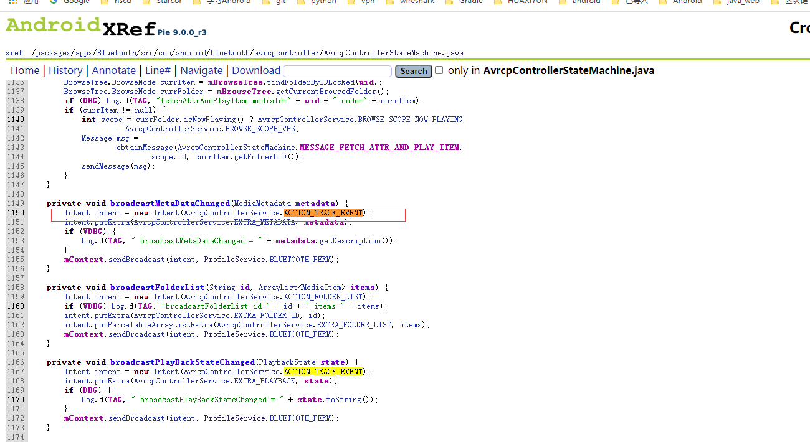

这是我参与更文挑战的第5天，活动详情查看： [更文挑战](https://juejin.cn/post/6967194882926444557)

在

[写给android应用开发工程师的蓝牙入]: https://juejin.cn/post/6970195589589893157#heading-0

我们简单介绍了蓝牙的基本使用流程。这一小节我们主要研究音频播放过程的数据在两个设备之间如何进行传输。

一个比较常见的场景就是大家在手机上通过蓝牙连接汽车 ，然后汽车屏幕能够显示当前播放的音频信息，并且汽车上的应用也能够反向控制当前手机上的音乐播放。在上一小节蓝牙之间是通过socket进行数据通信的。那么对于车载蓝牙是不是这样的呢？接下来我们就来探究这一过程。

demo结果：

手机app传输信息到车载


车载反向控制手机：


# 认识profile文件


# 音频信息如何发送给车载蓝牙

在android5.0之前的音频信息发送是通过RemoteControlClient来完成的。5.0之后是通过MediaSession来完成。

MediaSession能够进行播放器音量、按键和数据传输控制的类。一般而言一个应用程序只有一个MediaSession。

如果想要接收其它设备的调用控制需要调用 setActive（true）和setCallback(Callback)。

## 音频信息的发送

通过MediaSession#setMetadata(@Nullable MediaMetadata metadata)可以发送当前歌曲信息，

在MediaMetadata 定义了很多相关的key,数据发送端只需要按照对应的key添加数据即可

MediaSession#setPlaybackState(@Nullable PlaybackState state)可以发送与播放状态相关的信息。

播放器数据发送：

```java
mediaSession = new MediaSession(BluetoothPlayerActivity.this, "test");
mediaSession.setActive(true);
mediaSession.setMetadata(new MediaMetadata.Builder()
                         .putString(MediaMetadata.METADATA_KEY_TITLE, "你是风而我是沙")
                         .putString(MediaMetadata.METADATA_KEY_ARTIST, "我是谁谁谁")
                         .build());
Toast.makeText(BluetoothPlayerActivity.this,"已经开始执行发送信息，重置需要退出重进",Toast.LENGTH_SHORT).show();
AppExecutors.getInstance().networkIO().execute(new Runnable() {
    @Override
    public void run() {
        int i = 0;
        while (!destroy){
            Log.d(TAG,"update PlaybackState  "+mediaPlayer.getCurrentPosition());
            mediaSession.setPlaybackState(new PlaybackState.Builder()
                                          .setState(PlaybackState.STATE_PLAYING, mediaPlayer.getCurrentPosition(), 1.0f)
                                          .build());
            mediaSession.setMetadata(new MediaMetadata.Builder()
                                     .putLong(MediaMetadata.METADATA_KEY_DURATION, mediaPlayer.getDuration())
                                     .putString(MediaMetadata.METADATA_KEY_TITLE, "你是风而我是沙"+i)
                                     .putString(MediaMetadata.METADATA_KEY_ARTIST, "我是谁谁谁")
                                     .build());
            SystemClock.sleep(500);
            i++;
        }
    }
});
```

## 车载音频信息接收

当系统接收到音频信息变化的时候会发送两个广播：



因此我们也同样的注册这个广播以便接收音频信息。

```java
 BroadcastReceiver avrcpBroadcastReceiver = new BroadcastReceiver() {
        @RequiresApi(api = Build.VERSION_CODES.LOLLIPOP)
        @Override
        public void onReceive(Context context, Intent intent) {
            if(intent.getAction().equals(AvrcpControllerHelper.ACTION_TRACK_EVENT)){
                final MediaMetadata mediaMetadata = intent.getParcelableExtra(AvrcpControllerHelper.EXTRA_METADATA);
                final PlaybackState playbackState = intent.getParcelableExtra(AvrcpControllerHelper.EXTRA_PLAYBACK);
//                if(mediaMetadata == null || playbackState == null){
//                    Log.e(TAG,"some info null ? = "+mediaMetadata+"   "+playbackState);
//                    return;
//                }
                if(mediaMetadata != null){
                    name = mediaMetadata.getString(MediaMetadata.METADATA_KEY_TITLE);
                    author = mediaMetadata.getString(MediaMetadata.METADATA_KEY_ARTIST);
                    totalTime = timeCover(+mediaMetadata.getLong(MediaMetadata.METADATA_KEY_DURATION));
                }
                if(playbackState != null){
                    currentTime = timeCover(playbackState.getPosition());
                    play = playbackState.getState() == PlaybackState.STATE_PLAYING;
                }
                TextView textView = findViewById(R.id.tvPlayTime);
                textView.setText("开始时间"+currentTime);
                textView = findViewById(R.id.tvTotalTime);
                textView.setText("总时长"+totalTime);
                textView = findViewById(R.id.tvMusicInfo);
                textView.setText("歌名："+name   +"------------ 作者 ： "+author);
                textView = findViewById(R.id.tvPlayToggle);
                textView.setText("远程播放器 "+(play?"正在播放":"未播放"));
            }
        }
    };
    
     registerReceiver(avrcpBroadcastReceiver,new IntentFilter(AvrcpControllerHelper.ACTION_TRACK_EVENT));
```

# 车载蓝牙如何反向控制音频播放器

车载蓝牙要反向控制音频播放器需要借助BluetoothAvrcpController，BluetoothAvrcpController对普通应而言是隐藏的。如果有framework可以直接访问，没有的话我们可以通过反射来进行处理。BluetoothAvrcpController#sendGroupNavigationCmd是用来反向调用音频播放器的。

同时我们为mediaSession设置callback对象

```java
mediaSession.setCallback(new MediaSession.Callback() {
                       
                        @Override
                        public void onCommand(@NonNull String command, @Nullable Bundle args, @Nullable ResultReceiver cb) {
                            Log.e(TAG,"onCommand");
                            super.onCommand(command, args, cb);
                        }
                        
                        @Override
                        public boolean onMediaButtonEvent(@NonNull Intent mediaButtonIntent) {
                            Log.e(TAG,"onMediaButtonEvent");
                            Toast.makeText(BluetoothPlayerActivity.this,"我对你那么好，你居然操作我",Toast.LENGTH_SHORT).show();
                            return super.onMediaButtonEvent(mediaButtonIntent);
                        }
                    });
```

反射BluetoothAvrcpController来处理相关的方法

```java
public class AvrcpControllerHelper {
    private static final String TAG = AvrcpControllerHelper.class.getSimpleName();
    public static int AVRCP_CONTROLLER = 12;

    public static final String ACTION_TRACK_EVENT = "android.bluetooth.avrcp-controller.profile.action.TRACK_EVENT";
    public static final String EXTRA_METADATA = "android.bluetooth.avrcp-controller.profile.extra.METADATA";
    public static final String EXTRA_PLAYBACK = "android.bluetooth.avrcp-controller.profile.extra.PLAYBACK";


    public static void  sendGroupNavigationCmd(BluetoothProfile bluetoothProfile, BluetoothDevice device, int keyCode, int keyState){
        if(bluetoothProfile != null){
            try {
                Method m = bluetoothProfile.getClass().getMethod("sendGroupNavigationCmd",BluetoothDevice.class,int.class,int.class);
                m.setAccessible(true);
                m.invoke(bluetoothProfile,device,keyCode,keyState);
            } catch (NoSuchMethodException | IllegalAccessException | InvocationTargetException e) {
                e.printStackTrace();
            }
        }
    }

    private static void fixSystemHideApi(){
        if (Build.VERSION.SDK_INT < Build.VERSION_CODES.P) {
            return;
        }
        try {
            Method forName = Class.class.getDeclaredMethod("forName", String.class);
            Method getDeclaredMethod = Class.class.getDeclaredMethod("getDeclaredMethod", String.class, Class[].class);
            Class<?> vmRuntimeClass = (Class<?>) forName.invoke(null, "dalvik.system.VMRuntime");
            Method getRuntime = (Method) getDeclaredMethod.invoke(vmRuntimeClass, "getRuntime", null);
            Method setHiddenApiExemptions = (Method) getDeclaredMethod.invoke(vmRuntimeClass, "setHiddenApiExemptions", new Class[]{String[].class});
            Object sVmRuntime = getRuntime.invoke(null);
            setHiddenApiExemptions.invoke(sVmRuntime, new Object[]{new String[]{"L"}});
        } catch (Throwable e) {
            Log.e("[error]", "reflect bootstrap failed:", e);
        }
    }

    public static List<BluetoothDevice> getConnectedDevices(BluetoothProfile profile){
        if(profile == null){
            return null;
        }
        fixSystemHideApi();
        try {
            Method m = profile.getClass().getDeclaredMethod("getConnectedDevices");
            m.setAccessible(true);
            return (List<BluetoothDevice>) m.invoke(profile);
        } catch (NoSuchMethodException e) {
            Log.w(TAG, "No disconnect method in the " + profile.getClass().getName() +
                    " class, ignoring request.");
            return null;
        } catch (InvocationTargetException | IllegalAccessException e) {
            Log.w(TAG, "Could not execute method 'disconnect' in profile " +
                    profile.getClass().getName() + ", ignoring request.", e);
            return null;
        }
    }

//系统的BluetoothAvrcp 获取不到，这里把这个拷贝出来
    public static class BluetoothAvrcp {

        /*
         * State flags for Passthrough commands
         */
        public static final int PASSTHROUGH_STATE_PRESS = 0;
        public static final int PASSTHROUGH_STATE_RELEASE = 1;

        /*
         * Operation IDs for Passthrough commands
         */
        public static final int PASSTHROUGH_ID_SELECT = 0x00;    /* select */
        public static final int PASSTHROUGH_ID_UP = 0x01;    /* up */
        public static final int PASSTHROUGH_ID_DOWN = 0x02;    /* down */
        public static final int PASSTHROUGH_ID_LEFT = 0x03;    /* left */
        public static final int PASSTHROUGH_ID_RIGHT = 0x04;    /* right */
        public static final int PASSTHROUGH_ID_RIGHT_UP = 0x05;    /* right-up */
        public static final int PASSTHROUGH_ID_RIGHT_DOWN = 0x06;    /* right-down */
        public static final int PASSTHROUGH_ID_LEFT_UP = 0x07;    /* left-up */
        public static final int PASSTHROUGH_ID_LEFT_DOWN = 0x08;    /* left-down */
        public static final int PASSTHROUGH_ID_ROOT_MENU = 0x09;    /* root menu */
        public static final int PASSTHROUGH_ID_SETUP_MENU = 0x0A;    /* setup menu */
        public static final int PASSTHROUGH_ID_CONT_MENU = 0x0B;    /* contents menu */
        public static final int PASSTHROUGH_ID_FAV_MENU = 0x0C;    /* favorite menu */
        public static final int PASSTHROUGH_ID_EXIT = 0x0D;    /* exit */
        public static final int PASSTHROUGH_ID_0 = 0x20;    /* 0 */
        public static final int PASSTHROUGH_ID_1 = 0x21;    /* 1 */
        public static final int PASSTHROUGH_ID_2 = 0x22;    /* 2 */
        public static final int PASSTHROUGH_ID_3 = 0x23;    /* 3 */
        public static final int PASSTHROUGH_ID_4 = 0x24;    /* 4 */
        public static final int PASSTHROUGH_ID_5 = 0x25;    /* 5 */
        public static final int PASSTHROUGH_ID_6 = 0x26;    /* 6 */
        public static final int PASSTHROUGH_ID_7 = 0x27;    /* 7 */
        public static final int PASSTHROUGH_ID_8 = 0x28;    /* 8 */
        public static final int PASSTHROUGH_ID_9 = 0x29;    /* 9 */
        public static final int PASSTHROUGH_ID_DOT = 0x2A;    /* dot */
        public static final int PASSTHROUGH_ID_ENTER = 0x2B;    /* enter */
        public static final int PASSTHROUGH_ID_CLEAR = 0x2C;    /* clear */
        public static final int PASSTHROUGH_ID_CHAN_UP = 0x30;    /* channel up */
        public static final int PASSTHROUGH_ID_CHAN_DOWN = 0x31;    /* channel down */
        public static final int PASSTHROUGH_ID_PREV_CHAN = 0x32;    /* previous channel */
        public static final int PASSTHROUGH_ID_SOUND_SEL = 0x33;    /* sound select */
        public static final int PASSTHROUGH_ID_INPUT_SEL = 0x34;    /* input select */
        public static final int PASSTHROUGH_ID_DISP_INFO = 0x35;    /* display information */
        public static final int PASSTHROUGH_ID_HELP = 0x36;    /* help */
        public static final int PASSTHROUGH_ID_PAGE_UP = 0x37;    /* page up */
        public static final int PASSTHROUGH_ID_PAGE_DOWN = 0x38;    /* page down */
        public static final int PASSTHROUGH_ID_POWER = 0x40;    /* power */
        public static final int PASSTHROUGH_ID_VOL_UP = 0x41;    /* volume up */
        public static final int PASSTHROUGH_ID_VOL_DOWN = 0x42;    /* volume down */
        public static final int PASSTHROUGH_ID_MUTE = 0x43;    /* mute */
        public static final int PASSTHROUGH_ID_PLAY = 0x44;    /* play */
        public static final int PASSTHROUGH_ID_STOP = 0x45;    /* stop */
        public static final int PASSTHROUGH_ID_PAUSE = 0x46;    /* pause */
        public static final int PASSTHROUGH_ID_RECORD = 0x47;    /* record */
        public static final int PASSTHROUGH_ID_REWIND = 0x48;    /* rewind */
        public static final int PASSTHROUGH_ID_FAST_FOR = 0x49;    /* fast forward */
        public static final int PASSTHROUGH_ID_EJECT = 0x4A;    /* eject */
        public static final int PASSTHROUGH_ID_FORWARD = 0x4B;    /* forward */
        public static final int PASSTHROUGH_ID_BACKWARD = 0x4C;    /* backward */
        public static final int PASSTHROUGH_ID_ANGLE = 0x50;    /* angle */
        public static final int PASSTHROUGH_ID_SUBPICT = 0x51;    /* subpicture */
        public static final int PASSTHROUGH_ID_F1 = 0x71;    /* F1 */
        public static final int PASSTHROUGH_ID_F2 = 0x72;    /* F2 */
        public static final int PASSTHROUGH_ID_F3 = 0x73;    /* F3 */
        public static final int PASSTHROUGH_ID_F4 = 0x74;    /* F4 */
        public static final int PASSTHROUGH_ID_F5 = 0x75;    /* F5 */
        public static final int PASSTHROUGH_ID_VENDOR = 0x7E;    /* vendor unique */
        public static final int PASSTHROUGH_KEYPRESSED_RELEASE = 0x80;
    }
}
```

整体使用demo:

https://github.com/xiaolutang/androidTool/blob/master/app/src/main/java/com/example/txl/tool/bluetooth/BluetoothPlayerActivity.java

下一篇：

从系统流程上分析蓝牙交互的过程。

