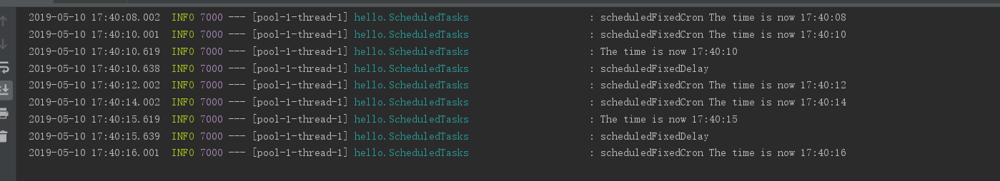

# @Scheduled注解的

先送上官网的学习地址：https://spring.io/guides

**目标：**学习Spring @Scheduled注解的使用

这里我就不在按照官方的示例教程进行了：直接使用 构建RESTful Web服务 的代码:进行修改处理即可。

**step1:**创建任务调度的类

```java
package hello;

import java.text.SimpleDateFormat;
import java.util.Date;

import org.slf4j.Logger;
import org.slf4j.LoggerFactory;
import org.springframework.scheduling.annotation.Scheduled;
import org.springframework.stereotype.Component;

@Component
public class ScheduledTasks {

    private static final Logger log = LoggerFactory.getLogger(ScheduledTasks.class);

    private static final SimpleDateFormat dateFormat = new SimpleDateFormat("HH:mm:ss");

    @Scheduled(fixedRate = 5000)
    public void reportCurrentTime() {
        log.info("The time is now {}", dateFormat.format(new Date()));
    }
}
```

计划注释定义特定方法何时运行。 注意：此示例使用fixedRate，它指定从每次调用的开始时间开始测量的方法调用之间的间隔。 还有其他选项，例如fixedDelay，它指定从完成任务开始测量的调用之间的间隔。 您还可以使用@Scheduled（cron =“...”）表达式进行更复杂的任务调度。

fixedDelay和fixedRate的功能类似，都是以固定的周期运行。

corn是一个字符串表达式：字符串以5或6个空格隔开，分开工6或7个域，每一个域代表一个含义,Cron有如下两种语法：

Seconds Minutes Hours DayofMonth Month DayofWeek Year 或 
Seconds Minutes Hours DayofMonth Month DayofWeek 
每一个域可出现的字符如下：

代码
Seconds:可出现,-  *  / 四个字符，有效范围为0-59的整数    
Minutes:可出现,-  *  / 四个字符，有效范围为0-59的整数    
Hours:可出现,-  *  / 四个字符，有效范围为0-23的整数    
DayofMonth:可出现,-  *  / ? L W C八个字符，有效范围为0-31的整数     
Month:可出现,-  *  / 四个字符，有效范围为1-12的整数或JAN-DEc    
DayofWeek:可出现,-  *  / ? L C #四个字符，有效范围为1-7的整数或SUN-SAT两个范围。1表示星期天，2表示星期一， 依次类推    
Year:可出现,-  *  / 四个字符，有效范围为1970-2099年   

每一个域都使用数字，但还可以出现如下特殊字符，它们的含义是：

(1)*：表示匹配该域的任意值，假如在Minutes域使用*,即表示每分钟都会触发事件。    

(2)?:只能用在DayofMonth和DayofWeek两个域。它也匹配域的任意值，但实际不会。因为DayofMonth和DayofWeek会相互影响。
例如想在每月的20日触发调度，不管20日到底是星期几，则只能使用如下写法： 13  13 15 20 * ?,其中最后一位只能用？，而不能使用*，
如果使用*表示不管星期几都会触发，实际上并不是这样。    

(3)-:表示范围，例如在Minutes域使用5-20，表示从5分到20分钟每分钟触发一次    

(4)/：表示起始时间开始触发，然后每隔固定时间触发一次，例如在Minutes域使用5/20,则意味着5分钟触发一次，而25，45等分别触发一次.    

(5),:表示列出枚举值值。例如：在Minutes域使用5,20，则意味着在5和20分每分钟触发一次。    

(6)L:表示最后，只能出现在DayofWeek和DayofMonth域，如果在DayofWeek域使用5L,意味着在最后的一个星期四触发。    

(7)W:表示有效工作日(周一到周五),只能出现在DayofMonth域，系统将在离指定日期的最近的有效工作日触发事件。
例如：在DayofMonth使用5W，如果5日是星期六，则将在最近的工作日：星期五，即4日触发。如果5日是星期天，则在6日触发；
如果5日在星期一到星期五中的一天，则就在5日触发。另外一点，W的最近寻找不会跨过月份    

(8)LW:这两个字符可以连用，表示在某个月最后一个工作日，即最后一个星期五。    
(9)#:用于确定每个月第几个星期几，只能出现在DayofMonth域。例如在4#2，表示某月的第二个星期三。

比如：0-59 * * * * ? 表示每一秒中都出现一次；0/2 * * * * ? 表示0秒开始没两秒钟触发一次

**step2:**执行Scheduled

在Application上添加注解@EnableScheduling，@EnableScheduling确保创建后台任务执行程序。 没有它，没有任务调度。

```java
package hello;

import org.springframework.boot.SpringApplication;
import org.springframework.boot.autoconfigure.SpringBootApplication;
import org.springframework.scheduling.annotation.EnableScheduling;

@EnableScheduling
@SpringBootApplication
public class Application {

    public static void main(String[] args) {
        SpringApplication.run(Application.class, args);
    }
}
```

接下啦就可以通过gradle执行啦：日志如下

