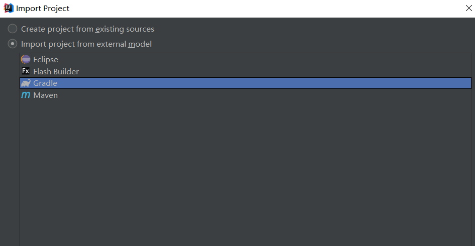

# 构建RESTful Web服务

先送上官网的学习地址：https://spring.io/guides

**目标：**通过spring构建能够响应：http://localhost:8080/greeting 的服务

**step1:**

下载官方示例：

```
git clone https://github.com/spring-guides/gs-rest-service.git
```

**step2:** 使用idea导入，选择官方示例下的inital哈，如果选择complete就是一个完成的结果了。complete是可以直接运行的。因为我相较maven更加熟悉gradle所以我在导入的时候选择的gradle



一路next。

**step3:** 在hello目录下创建javaBean对象Greeting

```java
package hello;

public class Greeting {
    private final long id;
    private final String content;

    public Greeting(long id, String content) {
        this.id = id;
        this.content = content;
    }

    public long getId() {
        return id;
    }

    public String getContent() {
        return content;
    }
}
```

**step4:**创建访问资源服务的控制器。

在Spring构建RESTful Web服务的方法中，HTTP请求由控制器处理。 这些组件可以通过@RestController注释识别，下面的GreetingController通过返回Greeting类的新实例来处理/ greeting的GET请求：

```java
package hello;

import java.util.concurrent.atomic.AtomicLong;
import org.springframework.web.bind.annotation.RequestMapping;
import org.springframework.web.bind.annotation.RequestParam;
import org.springframework.web.bind.annotation.RestController;

@RestController
public class GreetingController {

    private static final String template = "Hello, %s!";
    private final AtomicLong counter = new AtomicLong();

    @RequestMapping("/greeting")
    public Greeting greeting(@RequestParam(value="name", defaultValue="World") String name) {
        return new Greeting(counter.incrementAndGet(),
                String.format(template, name));
    }
}
```

其中：@RequestMapping注释确保对/ greeting的HTTP请求映射到greeting（）方法。它默认是get请求，如果想指定它的方法可以这样：

```java
@RequestMapping(method = RequestMethod.GET,path = "/greeting")
```

他还定义了其他的更加直接请求注解：GetMapping、PostMapping等等。在上面的示例中我们可以直接使用GetMapping注解 进行get请求：

```java
@GetMapping("/greeting")
```

@RequestParam将查询字符串参数名称的值绑定到greeting（）方法的name参数中。 如果请求中不存在name参数，则使用“World”的defaultValue。

最后再方法体里面返回了一个Greeting对象，我们不需要对这个对象进行处理，因为spring使用Jackson 框架自动将它转换成了JSON。

**step5:** 创建Spring的Application让程序运行起来

```java
package hello;

import org.springframework.boot.SpringApplication;
import org.springframework.boot.autoconfigure.SpringBootApplication;

@SpringBootApplication
public class Application {

    public static void main(String[] args) {
        SpringApplication.run(Application.class, args);
    }
}
```

@SpringBootApplication是一个便利注释，添加了以下所有内容：

@Configuration将类标记为应用程序上下文的bean定义源。

@EnableAutoConfiguration告诉Spring Boot根据类路径设置，其他bean和各种属性设置开始添加bean。

通常你会为Spring MVC应用程序添加@EnableWebMvc，但Spring Boot会在类路径上看到spring-webmvc时自动添加它。这会将应用程序标记为Web应用程序并激活关键行为，例如设置DispatcherServlet。

@ComponentScan告诉Spring在hello包中寻找其他组件，配置和服务，允许它找到控制器。

main（）方法使用Spring Boot的SpringApplication.run（）方法来启动应用程序。您是否注意到没有一行XML？也没有web.xml文件。此Web应用程序是100％纯Java，您无需处理配置任何基础结构。

**step6:**构建可执行的jar

1. 在项目的根目录（有build.gradle的那个目录）下执行cmd 命令：

   ```
   ./gradlew bootRun
   ```

2. 在项目的根目录下执行：

   ```
   ./gradlew build
   ```

   然后在执行：

   ```
   java -jar target/gs-rest-service-0.1.0.jar
   ```

   

**step7:**现在服务已经在运行了，你可以直接访问：<http://localhost:8080/greeting> 测试

