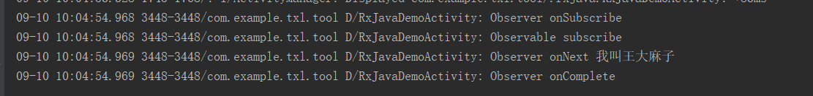
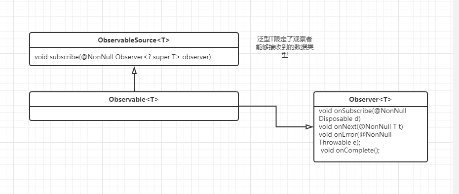
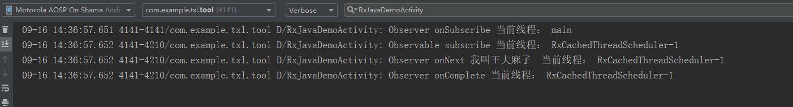

# RxJava是什么？

根据官方文档：RxJava是ReactiveX（Reactive Extensions）的Java VM实现：一个库，用于通过使用可观察序列来编写异步和基于事件的程序。

# rxjava核心设计思想

要使用RxJava，您需要创建Observables（发出数据项），以各种方式转换这些Observable以获取您感兴趣的精确数据项（通过使用Observable运算符），然后观察并响应这些有趣项目序列（通过实现观察者） 或者订阅者，然后将它们订阅到最终的变换后的Observables）。

# RxJava使用&原理分析

## 基本使用

1. 创建被观察者
2. 创建观察者
3. 链接观察者和被观察者

```java
 //创建被观察者
        Observable<String> observable =  Observable.create( new ObservableOnSubscribe<String>() {
            @Override
            public void subscribe(ObservableEmitter<String> emitter) throws Exception {
                Log.d( TAG, "Observable subscribe ");
                emitter.onNext( "我叫王大麻子" );
                emitter.onComplete();
            }
        } );
        //创建观察者
        Observer<String> observer = new Observer<String>() {
            @Override
            public void onSubscribe(Disposable d) {
                Log.d( TAG, "Observer onSubscribe ");
            }

            @Override
            public void onNext(String s) {
                Log.d( TAG, "Observer onNext "+s);
            }

            @Override
            public void onError(Throwable e) {
                Log.d( TAG, "Observer onError ");
            }

            @Override
            public void onComplete() {
                Log.d( TAG, "Observer onComplete ");
            }
        };
        //通过subscribe链接观察者和被观察者
        observable.subscribe( observer);
```

输出日志：



通过日志我们知道RxJava的执行顺序是:

1. 观察者的onSubscribe方法
2. 被观察者的subscribe方法
3. 观察者的onNext、onComplete或者onError

### 基本使用源码分析

Observable<T>实现了ObservableSource<T>接口，泛型T指定了观察者将会接收到的数据类型。

在上面的例子中我们将T限定为String,在observer中的onNext会就收到一个String 类型的对象。

Observable的crate方法

```java
 public static <T> Observable<T> create(ObservableOnSubscribe<T> source) {
        ObjectHelper.requireNonNull(source, "source is null");
        return RxJavaPlugins.onAssembly(new ObservableCreate<T>(source));
    }
```

```java
 @NonNull
    public static <T> Observable<T> onAssembly(@NonNull Observable<T> source) {
        Function<? super Observable, ? extends Observable> f = onObservableAssembly;
        if (f != null) {
            return apply(f, source);
        }
        return source;
    }
```

从上面的代码我们知道create最终创建的是一个持有ObservableOnSubscribe<T>的ObservableCreate<T>对象。我们来看看它的实现：

```java
public final class ObservableCreate<T> extends Observable<T> {
    final ObservableOnSubscribe<T> source;

    public ObservableCreate(ObservableOnSubscribe<T> source) {
        this.source = source;
    }

    @Override
    protected void subscribeActual(Observer<? super T> observer) {
        CreateEmitter<T> parent = new CreateEmitter<T>(observer);
        //1.通知观察者订阅成功
        observer.onSubscribe(parent);

        try {
            //2.被观察者开始进行工作 调用Emitter的onNext、onError、onComplete方法。
            source.subscribe(parent);
        } catch (Throwable ex) {
            Exceptions.throwIfFatal(ex);
            parent.onError(ex);
        }
    }

    static final class CreateEmitter<T>
    extends AtomicReference<Disposable>
    implements ObservableEmitter<T>, Disposable {

        private static final long serialVersionUID = -3434801548987643227L;

        final Observer<? super T> observer;

        CreateEmitter(Observer<? super T> observer) {
            this.observer = observer;
        }

        @Override
        public void onNext(T t) {
            if (t == null) {
                onError(new NullPointerException("onNext called with null. Null values are generally not allowed in 2.x operators and sources."));
                return;
            }
            if (!isDisposed()) {
                //3.观察者接收到onNext
                observer.onNext(t);
            }
        }

        @Override
        public void onError(Throwable t) {
            if (!tryOnError(t)) {
                //3.观察者接收到onError
                RxJavaPlugins.onError(t);
            }
        }

        @Override
        public boolean tryOnError(Throwable t) {
            if (t == null) {
                t = new NullPointerException("onError called with null. Null values are generally not allowed in 2.x operators and sources.");
            }
            if (!isDisposed()) {
                try {
                    observer.onError(t);
                } finally {
                    dispose();
                }
                return true;
            }
            return false;
        }

        @Override
        public void onComplete() {
            if (!isDisposed()) {
                try {
                     //3.观察者接收到onComplete
                    observer.onComplete();
                } finally {
                    dispose();
                }
            }
        }

        @Override
        public void setDisposable(Disposable d) {
            DisposableHelper.set(this, d);
        }

        @Override
        public void setCancellable(Cancellable c) {
            setDisposable(new CancellableDisposable(c));
        }

        @Override
        public ObservableEmitter<T> serialize() {
            return new SerializedEmitter<T>(this);
        }

        @Override
        public void dispose() {
            DisposableHelper.dispose(this);
        }

        @Override
        public boolean isDisposed() {
            return DisposableHelper.isDisposed(get());
        }

        @Override
        public String toString() {
            return String.format("%s{%s}", getClass().getSimpleName(), super.toString());
        }
    }
   //省略部分内部类相关的代码
}
```

在被观察者调用subscribe（）的时候会调用到subscribeActual方法。在这里会依次调用 注释 1,2,3。这样就完成了一次Rxjava被观察者到观察者的调用。

**重点注意：**

我们知道RxJava是基于扩展的的观察者模式来进行设计的，我们将这个和常规的观察者模式进行对比，来分析rxJava的设计实现。假设我们要进行一个网络请求，一般而言我们可以通过设置一个callBack对网络请求进行监听，伪代码如下：

```java
//开始异步的网络请求
网络请求.注册监听（callBack）
发起网络请求（相关参数）{
	if(网络请求成功){
		callBack.success(请求成功的特定数据);
	}else{
		callBack.failed(请求失败的特定数据);
	}
}
```

当然上面的伪代码同样可以以链式调用的方式进行。比如在注册监听的时候返回一个网络请求对象，在调用发起网络请求。

既然观察者模式实现如此简单为什么RxJava还要设计的如此复杂呢？

个人理解原因有下：

1. rxjava面对的应用场景复杂，它不知道被观察者是谁，观察者是谁
2. rxjava需要实现链式调用，使代码阅读更加方便
3. 被观察者需要能够灵活变化。

通过阅读源码我们发现rxJava的核心实现如下：



因为不知道具体的观察者需要什么类型的数据消息RxJava通过Observable<T>中的泛型限定观察者能够接收到的数据，通过统一的Observable包装能够将被观察者转换成任意想要的Observable<T>类型(这个在后面会进行详细的说明) , 因为要实现链式调用就使用被观察者订阅观察者的形式。

这里我们就不再分析其它的创建被观察者方法，因为其他的分析都是类似的去看它如何创建的。

## 线程切换

RxJava可以利用`subscribeOn()` 和 `observeOn()` 来实现线程控制，让事件的产生和消费发生在不同的线程。

```java
/**
     * RxJava调度
     * */
    private void rxJavascheduling(){
        //创建被观察者
        Observable<String> observable =  Observable.create( new ObservableOnSubscribe<String>() {
            @Override
            public void subscribe(ObservableEmitter<String> emitter) throws Exception {
                Log.d( TAG, "Observable subscribe 当前线程： "+Thread.currentThread().getName());
                emitter.onNext( "我叫王大麻子" );
                emitter.onComplete();
            }
        } );
        //创建观察者
        Observer<String> observer = new Observer<String>() {
            @Override
            public void onSubscribe(Disposable d) {
                Log.d( TAG, "Observer onSubscribe 当前线程： "+Thread.currentThread().getName());
            }

            @Override


            public void onNext(String s) {
                Log.d( TAG, "Observer onNext "+s+"  当前线程： "+Thread.currentThread().getName());
            }

            @Override
            public void onError(Throwable e) {
                Log.d( TAG, "Observer onError 当前线程： "+Thread.currentThread().getName());
            }

            @Override
            public void onComplete() {
                Log.d( TAG, "Observer onComplete 当前线程： "+Thread.currentThread().getName());
            }
        };
        //通过subscribe链接观察者和被观察者
        observable.subscribeOn( Schedulers.io() ).subscribe( observer);
    }
```

运行上面的代码结果如下：



通过运行结果我们知道：

1. 可以看到在只指定被观察者运行所在线程的情况下，观察者和被观察者运行在相同的线程。
2. 观察者的onSubscribe方法运行在subscribe的调用线程

### 线程切换源码分析

在前面的基本使用源码分析里面我们已经分析了观察者和被观察者的创建过程，这里我们直接来看线程切换的源码。

```java
 public final Observable<T> subscribeOn(Scheduler scheduler) {
        ObjectHelper.requireNonNull(scheduler, "scheduler is null");
        return RxJavaPlugins.onAssembly(new ObservableSubscribeOn<T>(this, scheduler));
    }
```

结合基本使用的源码分析我们知道，调用subscribeOn后Observable对象转变成了一个ObservableSubscribeOn对象。这里我们不对scheduler进行详细的分析，把这个理解成一个线程池即可。

ObservableSubscribeOn实现：

```java
public final class ObservableSubscribeOn<T> extends AbstractObservableWithUpstream<T, T> {
    final Scheduler scheduler;

    //source 是原来的未经变化的被观察者
    public ObservableSubscribeOn(ObservableSource<T> source, Scheduler scheduler) {
        super(source);
        this.scheduler = scheduler;
    }

    @Override
    public void subscribeActual(final Observer<? super T> observer) {
        final SubscribeOnObserver<T> parent = new SubscribeOnObserver<T>(observer);
		//发生在调用subscribe的线程
        observer.onSubscribe(parent);

        parent.setDisposable(scheduler.scheduleDirect(new SubscribeTask(parent)));
    }

    static final class SubscribeOnObserver<T> extends AtomicReference<Disposable> implements Observer<T>, Disposable {

        private static final long serialVersionUID = 8094547886072529208L;
        final Observer<? super T> downstream;

        final AtomicReference<Disposable> upstream;

        SubscribeOnObserver(Observer<? super T> downstream) {
            this.downstream = downstream;
            this.upstream = new AtomicReference<Disposable>();
        }

        @Override
        public void onSubscribe(Disposable d) {
            DisposableHelper.setOnce(this.upstream, d);
        }

        @Override
        public void onNext(T t) {
            downstream.onNext(t);
        }

        @Override
        public void onError(Throwable t) {
            downstream.onError(t);
        }

        @Override
        public void onComplete() {
            downstream.onComplete();
        }

        @Override
        public void dispose() {
            DisposableHelper.dispose(upstream);
            DisposableHelper.dispose(this);
        }

        @Override
        public boolean isDisposed() {
            return DisposableHelper.isDisposed(get());
        }

        void setDisposable(Disposable d) {
            DisposableHelper.setOnce(this, d);
        }
    }

    final class SubscribeTask implements Runnable {
        private final SubscribeOnObserver<T> parent;

        SubscribeTask(SubscribeOnObserver<T> parent) {
            this.parent = parent;
        }

        @Override
        public void run() {
            //新的线程中执行source 的subscribe，对应的准备数据和onNext、onComplete或者onError执行在新线程
            source.subscribe(parent);
        }
    }
}
```

通过源码我们证实了上面日志的结论。

1. 可以看到在只指定被观察者运行所在线程的情况下，观察者和被观察者运行在相同的线程。
2. 观察者的onSubscribe方法运行在subscribe的调用线程

接下来我们再看看RxJava如何实现观察者线程是如何指定的

```java
public final Observable<T> observeOn(Scheduler scheduler) {
        return observeOn(scheduler, false, bufferSize());
    }
```

```java
public final Observable<T> observeOn(Scheduler scheduler, boolean delayError, int bufferSize) {
        ObjectHelper.requireNonNull(scheduler, "scheduler is null");
        ObjectHelper.verifyPositive(bufferSize, "bufferSize");
        return RxJavaPlugins.onAssembly(new ObservableObserveOn<T>(this, scheduler, delayError, bufferSize));
    }
```

由前面的知识我们知道观察者的线程是通过ObservableObserveOn<T>来进行指定的，我们来看看具体的实现：

```java
public final class ObservableObserveOn<T> extends AbstractObservableWithUpstream<T, T> {
    final Scheduler scheduler;
    final boolean delayError;
    final int bufferSize;
    public ObservableObserveOn(ObservableSource<T> source, Scheduler scheduler, boolean delayError, int bufferSize) {
        super(source);
        this.scheduler = scheduler;
        this.delayError = delayError;
        this.bufferSize = bufferSize;
    }

    @Override
    protected void subscribeActual(Observer<? super T> observer) {
        if (scheduler instanceof TrampolineScheduler) {
            source.subscribe(observer);
        } else {
            Scheduler.Worker w = scheduler.createWorker();

            source.subscribe(new ObserveOnObserver<T>(observer, w, delayError, bufferSize));
        }
    }

    //相当于构建了一个观察者代理，当这个ObserveOnObserver接收到对应的数据，通过Scheduler.Worker
    //来进行观察者线程的调度执行
    static final class ObserveOnObserver<T> extends BasicIntQueueDisposable<T>
    implements Observer<T>, Runnable {

        private static final long serialVersionUID = 6576896619930983584L;
        final Observer<? super T> downstream;
        final Scheduler.Worker worker;
        final boolean delayError;
        final int bufferSize;

        SimpleQueue<T> queue;

        Disposable upstream;

        Throwable error;
        volatile boolean done;

        volatile boolean disposed;

        int sourceMode;

        boolean outputFused;

        ObserveOnObserver(Observer<? super T> actual, Scheduler.Worker worker, boolean delayError, int bufferSize) {
            this.downstream = actual;
            this.worker = worker;
            this.delayError = delayError;
            this.bufferSize = bufferSize;
        }

        @Override
        public void onSubscribe(Disposable d) {
            if (DisposableHelper.validate(this.upstream, d)) {
                this.upstream = d;
                if (d instanceof QueueDisposable) {
                    @SuppressWarnings("unchecked")
                    QueueDisposable<T> qd = (QueueDisposable<T>) d;

                    int m = qd.requestFusion(QueueDisposable.ANY | QueueDisposable.BOUNDARY);

                    if (m == QueueDisposable.SYNC) {
                        sourceMode = m;
                        queue = qd;
                        done = true;
                        downstream.onSubscribe(this);
                        schedule();
                        return;
                    }
                    if (m == QueueDisposable.ASYNC) {
                        sourceMode = m;
                        queue = qd;
                        downstream.onSubscribe(this);
                        return;
                    }
                }

                queue = new SpscLinkedArrayQueue<T>(bufferSize);

                downstream.onSubscribe(this);
            }
        }

        @Override
        public void onNext(T t) {
            if (done) {
                return;
            }

            if (sourceMode != QueueDisposable.ASYNC) {
                queue.offer(t);
            }
            schedule();
        }

        @Override
        public void onError(Throwable t) {
            if (done) {
                RxJavaPlugins.onError(t);
                return;
            }
            error = t;
            done = true;
            schedule();
        }

        @Override
        public void onComplete() {
            if (done) {
                return;
            }
            done = true;
            schedule();
        }

        @Override
        public void dispose() {
            if (!disposed) {
                disposed = true;
                upstream.dispose();
                worker.dispose();
                if (getAndIncrement() == 0) {
                    queue.clear();
                }
            }
        }

        @Override
        public boolean isDisposed() {
            return disposed;
        }

        void schedule() {
            if (getAndIncrement() == 0) {
                worker.schedule(this);
            }
        }

        void drainNormal() {
            int missed = 1;

            final SimpleQueue<T> q = queue;
            final Observer<? super T> a = downstream;

            for (;;) {
                if (checkTerminated(done, q.isEmpty(), a)) {
                    return;
                }

                for (;;) {
                    boolean d = done;
                    T v;

                    try {
                        v = q.poll();
                    } catch (Throwable ex) {
                        Exceptions.throwIfFatal(ex);
                        disposed = true;
                        upstream.dispose();
                        q.clear();
                        a.onError(ex);
                        worker.dispose();
                        return;
                    }
                    boolean empty = v == null;

                    if (checkTerminated(d, empty, a)) {
                        return;
                    }

                    if (empty) {
                        break;
                    }

                    a.onNext(v);
                }

                missed = addAndGet(-missed);
                if (missed == 0) {
                    break;
                }
            }
        }

        void drainFused() {
            int missed = 1;

            for (;;) {
                if (disposed) {
                    return;
                }

                boolean d = done;
                Throwable ex = error;

                if (!delayError && d && ex != null) {
                    disposed = true;
                    downstream.onError(error);
                    worker.dispose();
                    return;
                }

                downstream.onNext(null);

                if (d) {
                    disposed = true;
                    ex = error;
                    if (ex != null) {
                        downstream.onError(ex);
                    } else {
                        downstream.onComplete();
                    }
                    worker.dispose();
                    return;
                }

                missed = addAndGet(-missed);
                if (missed == 0) {
                    break;
                }
            }
        }

        @Override
        public void run() {
            if (outputFused) {
                drainFused();
            } else {
                drainNormal();
            }
        }

        boolean checkTerminated(boolean d, boolean empty, Observer<? super T> a) {
            if (disposed) {
                queue.clear();
                return true;
            }
            if (d) {
                Throwable e = error;
                if (delayError) {
                    if (empty) {
                        disposed = true;
                        if (e != null) {
                            a.onError(e);
                        } else {
                            a.onComplete();
                        }
                        worker.dispose();
                        return true;
                    }
                } else {
                    if (e != null) {
                        disposed = true;
                        queue.clear();
                        a.onError(e);
                        worker.dispose();
                        return true;
                    } else
                    if (empty) {
                        disposed = true;
                        a.onComplete();
                        worker.dispose();
                        return true;
                    }
                }
            }
            return false;
        }

        @Override
        public int requestFusion(int mode) {
            if ((mode & ASYNC) != 0) {
                outputFused = true;
                return ASYNC;
            }
            return NONE;
        }

        @Nullable
        @Override
        public T poll() throws Exception {
            return queue.poll();
        }

        @Override
        public void clear() {
            queue.clear();
        }

        @Override
        public boolean isEmpty() {
            return queue.isEmpty();
        }
    }
}
```

即指定观察者的线程执行关键在于ObservableObserveOn的静态内部类ObserveOnObserver通过它借助Scheduler.Worker进行线程调度来实现。

rxjava默认提供了几种线程池：

| 调度器类型                | 效果                                                         |
| ------------------------- | ------------------------------------------------------------ |
| Schedulers.computation( ) | 用于计算任务，如事件循环或和回调处理，不要用于IO操作(IO操作请使用Schedulers.io())；默认线程数等于处理器的数量 |
| Schedulers.from(executor) | 使用指定的Executor作为调度器                                 |
| Schedulers.immediate( )   | 在当前线程立即开始执行任务                                   |
| Schedulers.io( )          | 用于IO密集型任务，如异步阻塞IO操作，这个调度器的线程池会根据需要增长；对于普通的计算任务，请使用Schedulers.computation()；Schedulers.io( )默认是一个CachedThreadScheduler，很像一个有线程缓存的新线程调度器 |
| Schedulers.newThread( )   | 为每个任务创建一个新线程                                     |
| Schedulers.trampoline( )  | 当其它排队的任务完成后，在当前线程排队开始执行               |

## RxJava变换

对于变换的解释借用“

[给Android开发者的RxJava详解]: http://gank.io/post/560e15be2dca930e00da1083#toc_14

”的说明：**所谓变换，就是将事件序列中的对象或整个序列进行加工处理，转换成不同的事件或事件序列**

map变换源码分析：

```java
public final <R> Observable<R> map(Function<? super T, ? extends R> mapper) {
        ObjectHelper.requireNonNull(mapper, "mapper is null");
        return RxJavaPlugins.onAssembly(new ObservableMap<T, R>(this, mapper));
    }
```

同样的我们来看ObservableMap的实现

```java
public final class ObservableMap<T, U> extends AbstractObservableWithUpstream<T, U> {
    final Function<? super T, ? extends U> function;

    public ObservableMap(ObservableSource<T> source, Function<? super T, ? extends U> function) {
        super(source);
        this.function = function;
    }

    @Override
    public void subscribeActual(Observer<? super U> t) {
        source.subscribe(new MapObserver<T, U>(t, function));
    }

    static final class MapObserver<T, U> extends BasicFuseableObserver<T, U> {
        final Function<? super T, ? extends U> mapper;

        MapObserver(Observer<? super U> actual, Function<? super T, ? extends U> mapper) {
            super(actual);
            this.mapper = mapper;
        }

        @Override
        public void onNext(T t) {
            if (done) {
                return;
            }

            if (sourceMode != NONE) {
                downstream.onNext(null);
                return;
            }

            U v;

            try {
                //map变换的核心处理
                v = ObjectHelper.requireNonNull(mapper.apply(t), "The mapper function returned a null value.");
            } catch (Throwable ex) {
                fail(ex);
                return;
            }
            downstream.onNext(v);
        }

        @Override
        public int requestFusion(int mode) {
            return transitiveBoundaryFusion(mode);
        }

        @Nullable
        @Override
        public U poll() throws Exception {
            T t = qd.poll();
            return t != null ? ObjectHelper.<U>requireNonNull(mapper.apply(t), "The mapper function returned a null value.") : null;
        }
    }
}
```

和Rxjava的线程切换类似，ObservableMap也是通过内部实现一个特定的观察者MapObserver，在接收到消息的时候对结果进行变换。

分析到这里我决定不再对RxJava的基本使用进行分析。因为我们对它的基本设计实现已经有一个比较清晰的认识了。

# 总结：

结论1：Rxjava的Observer有四个回调方法

- onSubscribe  当调用observable.subscribe( observer)时发生，这个方法调用于调用observable.subscribe的线程，在这里我们可以进行一些初始化工作
- onNext  通知Observer有一个数据准备好了
- onError 通知Observer出错
- onComplete 通知完成


结论2：Rxjava的每次变化或者线程切换基本都是通过创建新的被观察者Observable的子类来实现，一般而言它们是有这样的逻辑

- 内部实现观察者代理，在接收到对应的数据元素的时候通过这个代理对元素进行处理，在回调到最终的观察者Observer对象。

- 内部实现观察者代理不仅可以进行数据处理还能够决定观察者和被观察者的运行线程。

- RxJava的变换和线程调度会组成被观察者链，当调用subscribe时，从当前这个observable向上调用顶层的observable的subscribe方法，然后从顶层的observable向下链式调用到当前的observable，onNext、onComplete。

  因为这个结论可能有点难以理解这里在详细说明一下，任然以map变换为例：这里就不贴全部源码了，可以直接返回上面变换中来进行查看，其实核心就是在subscribe发生的时候，原来的ObservableSource 调用的是下面的代码：

  ```java
  public void subscribeActual(Observer<? super U> t) {
          source.subscribe(new MapObserver<T, U>(t, function));
      }
  ```

  也就是MapObserver，这样当MapObserver的onNext、onComplete或onError被调用的时候，会经过我们指定的map变换对结果进行处理，最后在传递给真正的observer

参考：

[给]: http://gank.io/post/560e15be2dca930e00da1083#toc_17

Rxjava中文文档：https://mcxiaoke.gitbooks.io/rxdocs/content/


