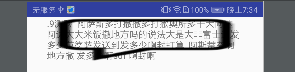
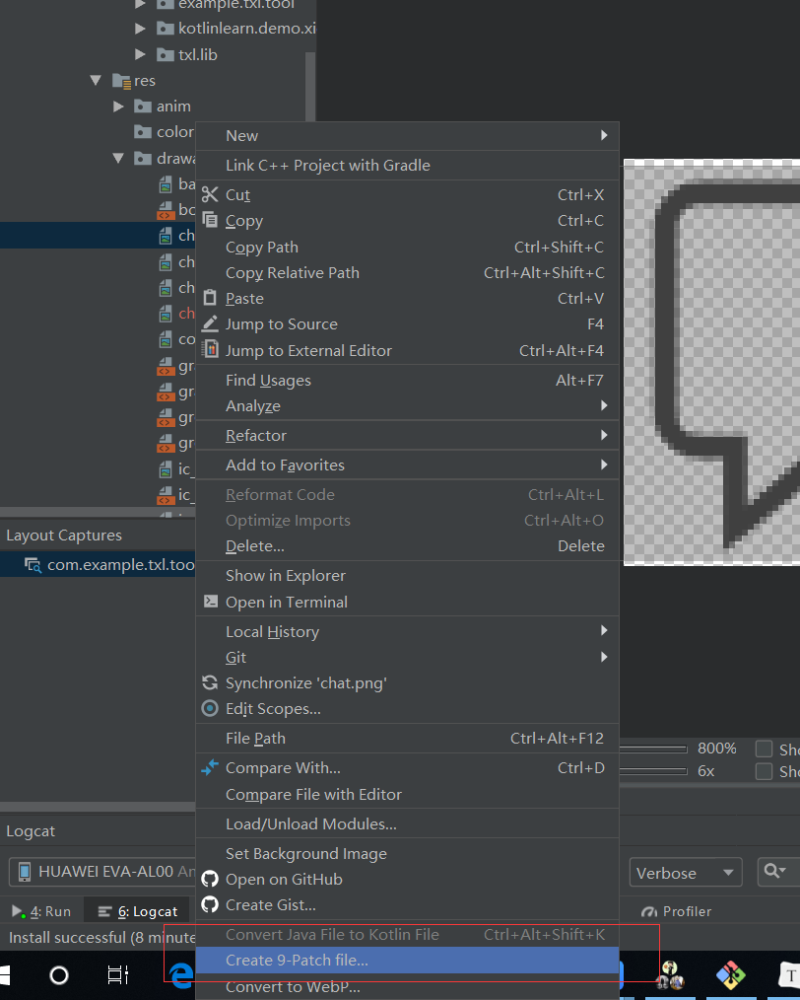

# android .9图的制作和使用

刚开始接触.9的时候感觉这个东西是一个神奇的玩意。对这个东西的制作和使用都是一脸懵逼。最近正好自己在使用这个东西对.9的制作、使用有一个全新的了解。下面我们就来学习.9图片吧。

## 基本概念：

9patch图片是andriod app开发里一种特殊的图片形式，文件的扩展名为：.9.png。

## 作用

.9图片的作用就是在图片拉伸的时候保证其不会失真。我们能够指定那些区域进行拉伸。

## 特点&原理

.9图片有四条黑边，每一条变代表不同的意义：

1. 左边：在竖直拉伸的时候，保持其他位置不动，只在这个点的区域做无限的延伸。
2. 上边：在水平拉伸的时候，保持其他位置不动，只在这个点的区域做无限的延伸。
3. 下边：在水平拉伸的时候，指定图片里的内容显示的区域。
4. 右边：在竖直拉伸的时候，指定图片里的内容显示的区域。

如果你不是特别理解上面的特点，没关系接下来我们来一步步学习.9的制作，以及对比它们之间的差异。

## .9的学习之旅

### 原图效果

我们在 阿里矢量图标库 下载一张聊天的图片对它进行处理，


这个是原来的图片，我们直接在drawable中使用这张图片：

代码如下：

```xml
<TextView
    android:layout_gravity="center_horizontal"
    android:background="@drawable/chat"
    android:layout_width="300dp"
    android:layout_height="wrap_content"
    android:text=".9测验  阿萨斯多打撒撒多打撒奥所多十大阿达
     \n阿达大大米饭撒地方吗的说法大是大非富士达发多少范德萨发送到发多少啊封打算  阿斯蒂芬啊 地方撒 发多少啊sdf 啊封啊"/>
```

其效果如下：

### .9效果

看了原图的效果接下来我们使用.9图片

#### .9的制作

在新版的android studio我们可以直接使用它制作.9图片。

制作步骤：

1. 选中你要制作.9的原图片：然后保存在对应的位置。这样一张原始的.9图片就生成了。

   **请注意：**这个时候的.9默认是全部区域缩放和显示内容，换句话来说就是它和不使用.9图片是没什么区别的。

2. 处理缩放区域：

3. 

#### .9的缩放范围

#### .9的内容区域

