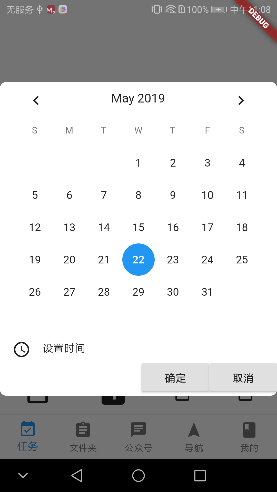

# 自定dialog

Dialog 在我们的日常开发中是必不可少的，Flutter 也提供了 AlertDialog 、SimpleDialog 等供我们选择，但是对于开发还是不够的。

在android原生的开发中我们可以通过继承dialog或者setContentView的方式来进行设置自己的ui。在flutter中没有setContentView的方式。

要实现自定义dialog我们可以通过继承系统的Dialog实现自己想要的样式。

比如：



这个是一个时间选择对话框：最后能够返回选择的时间

```dart
import 'package:flutter/material.dart';
import 'package:to_do/pages/common.widget/PickDataWidget.dart';

class DataPickDialog extends Dialog{
  const DataPickDialog({Key key}) : super(key: key);

  @override
  Widget build(BuildContext context) {
    void _onCancel(){
      Navigator.pop(context);
    }

    void _onSure(DateTime dateTime){
      Navigator.pop(context,dateTime);
    }
    return new Material( //创建透明层
      type: MaterialType.transparency, //透明类型
      child:Center( //保证控件居中效果
        child: IntrinsicHeight(
          child: Container(
            decoration: ShapeDecoration(
              color: Color(0xffffffff),
              shape: RoundedRectangleBorder(
                borderRadius: BorderRadius.all(
                  Radius.circular(8.0),
                ),
              ),
            ),
            child: PickDataWidget(_onSure,_onCancel),
          ),
        ),
      ),
    );
  }
}
```

```dart
import 'package:flutter/material.dart';
import 'package:flutter/widgets.dart';
import 'package:to_do/pages/common.widget/CalendarWidget.dart';

class PickDataWidget extends StatefulWidget{
  final VoidCallback onCancel;
  final Function(DateTime) onSure;

  const PickDataWidget(this.onSure, this.onCancel);

  @override
  State<StatefulWidget> createState() {
    return _PickDataState();
  }
}

class _PickDataState extends State<PickDataWidget>{
  DateTime _selectedDate;


  _PickDataState({DateTime selectedDate}){
    if(selectedDate == null){
      _selectedDate = DateTime.now();
    }else{
      _selectedDate = selectedDate;
    }
  }

  @override
  Widget build(BuildContext context) {
    return Column(
      mainAxisAlignment: MainAxisAlignment.start,
      children: <Widget>[
        CalendarWidget(
          onChange: (value)=> setState(() {
            _selectedDate = DateTime(value.year,value.month,value.day,_selectedDate.hour,_selectedDate.minute);
          }),
          selectedDate: _selectedDate,
          firstDate: DateTime(2018),
          lastDate: DateTime(2030),
        ),
        Padding(
          padding: EdgeInsets.only(left: 16.0),
          child:  GestureDetector(
            onTap: (){
              Future<TimeOfDay> selectedTime = showTimePicker(
                initialTime: TimeOfDay.now(),
                context: context,
              );
              selectedTime.then((timeOfDay){
                if(timeOfDay is TimeOfDay){
                  setState(() {
                    _selectedDate = DateTime(_selectedDate.year,_selectedDate.month,_selectedDate.day,timeOfDay.hour,timeOfDay.minute);
                  });
                }
              });
            },
            child: Row(
              crossAxisAlignment: CrossAxisAlignment.start,
              children: <Widget>[
                Icon(
                    Icons.access_time
                ),
                Container(
                  margin: EdgeInsets.only(left: 15),
                  child: Text("设置时间"),
                ),
              ],
            ),
          ),
        ),
        Row(
          mainAxisAlignment: MainAxisAlignment.end,
          children: <Widget>[
            RaisedButton(
              child: Text("确定"),
              onPressed: (){
                widget.onSure(_selectedDate);
              },
            ),
            RaisedButton(
              child: Text("取消"),
              onPressed: widget.onCancel,
            ),
          ],
        ),
      ],
    );
  }
}
```

```dart
import 'package:flutter/gestures.dart';
import 'package:flutter/material.dart';
import 'package:flutter/widgets.dart';

class CalendarWidget extends StatefulWidget{

  /// The currently selected date.
  ///
  /// This date is highlighted in the picker.
  final DateTime selectedDate;

  /// The earliest date the user is permitted to pick.
  final DateTime firstDate;

  /// The latest date the user is permitted to pick.
  final DateTime lastDate;

  /// Optional user supplied predicate function to customize selectable days.
  final SelectableDayPredicate selectableDayPredicate;

  /// {@macro flutter.widgets.scrollable.dragStartBehavior}
  final DragStartBehavior dragStartBehavior;

  final ValueChanged<DateTime> onChange;

  @override
  State<StatefulWidget> createState() {
    return _CalendarState(selectedDate);
  }

  const CalendarWidget({
    Key key,
    @required this.selectedDate,
    @required this.firstDate,
    @required this.lastDate,
    @required this.onChange,
    this.selectableDayPredicate,
    this.dragStartBehavior = DragStartBehavior.down,
  }):super(key: key);

}

class _CalendarState extends State<CalendarWidget>{

  DateTime selectedDate;

  _CalendarState(this.selectedDate);

  @override
  Widget build(BuildContext context) {
    return MonthPicker(
      selectedDate: selectedDate,
      firstDate: widget.firstDate,
      lastDate: widget.lastDate,
      selectableDayPredicate:widget.selectableDayPredicate,
      dragStartBehavior:widget.dragStartBehavior,
      onChanged: (value){
        widget.onChange(value);
        setState(() {
          selectedDate = value;
        });
      },
    );
  }


}
```

显示dialog:

```dart
Future<DateTime> dateTime = showDialog(
  context: context,
  builder: (BuildContext context) {
    return DataPickDialog(); //调用对话框
  },
  barrierDismissible: false
);
dateTime.then((dateTime){
  print(dateTime);
});
```


# dialog的实现原理

在刚开始学习flutter的时候，我记得在flutter中有一句话万事万物皆组件（widget），这个dialog又是什么东西？其实在flutter中dialog也是widget。

我们直接从showDialog方法入手看看显示一个dialog究竟干了些什么事。

```dart
Future<T> showDialog<T>({
  @required BuildContext context,
  bool barrierDismissible = true,
  @Deprecated(
    'Instead of using the "child" argument, return the child from a closure '
    'provided to the "builder" argument. This will ensure that the BuildContext '
    'is appropriate for widgets built in the dialog.'
  ) Widget child,
  WidgetBuilder builder,
}) {
  assert(child == null || builder == null);
  assert(debugCheckHasMaterialLocalizations(context));
  return showGeneralDialog(
    context: context,
    pageBuilder: (BuildContext buildContext, Animation<double> animation, Animation<double> secondaryAnimation) {
      final ThemeData theme = Theme.of(context, shadowThemeOnly: true);
      final Widget pageChild =  child ?? Builder(builder: builder);
      return SafeArea(
        child: Builder(
          builder: (BuildContext context) {
            return theme != null
                ? Theme(data: theme, child: pageChild)
                : pageChild;
          }
        ),
      );
    },
    barrierDismissible: barrierDismissible,
    barrierLabel: MaterialLocalizations.of(context).modalBarrierDismissLabel,
    barrierColor: Colors.black54,
    transitionDuration: const Duration(milliseconds: 150),
    transitionBuilder: _buildMaterialDialogTransitions,
  );
}
```

可以看到showDialog()函数必须的参数有buildContext同时：child和WidgetBuilder不能都为空。传递chid就是直接传递一个widget进行显示。那么WidgetBuilder是一个什么玩意呢？

在flutter框架中是这样来定义的：

```dart
typedef WidgetBuilder = Widget Function(BuildContext context);
```

可以看到它其实是一个接受BuildContext返回一个Widget的函数。

在showDialog()的return中我们看到调用了showGeneralDialog()。 我们可以看看这个函数具体做了些什么。

```dart
Future<T> showGeneralDialog<T>({
  @required BuildContext context,
  @required RoutePageBuilder pageBuilder,
  bool barrierDismissible,
  String barrierLabel,
  Color barrierColor,
  Duration transitionDuration,
  RouteTransitionsBuilder transitionBuilder,
}) {
  assert(pageBuilder != null);
  assert(!barrierDismissible || barrierLabel != null);
  return Navigator.of(context, rootNavigator: true).push<T>(_DialogRoute<T>(
    pageBuilder: pageBuilder,
    barrierDismissible: barrierDismissible,
    barrierLabel: barrierLabel,
    barrierColor: barrierColor,
    transitionDuration: transitionDuration,
    transitionBuilder: transitionBuilder,
  ));
}
```

可以看到实现dialog的显示最终是向导航中添加了一个_DialogRoute的路由。这个说明了dialog在flutter中其实是一个页面。如果你有什么其它样式的dialog需要显示完全可以像设计普通的组件一样来设计它。并且dialog本身就是继承自StatelessWidget。同时如果想要从dialog中获取返回值就像普通路由一样在退出时传入需要传递的参数。

比如在DataPickDialog调用onSure函数的时候：

```dart
void _onSure(DateTime dateTime){
  Navigator.pop(context,dateTime);
}
```

**小结：**在flutter中可以这样来理解dialog，他就是一个样式有点不同的普通页面。可以用和普通页面相同的方式获取dialog的返回值。

