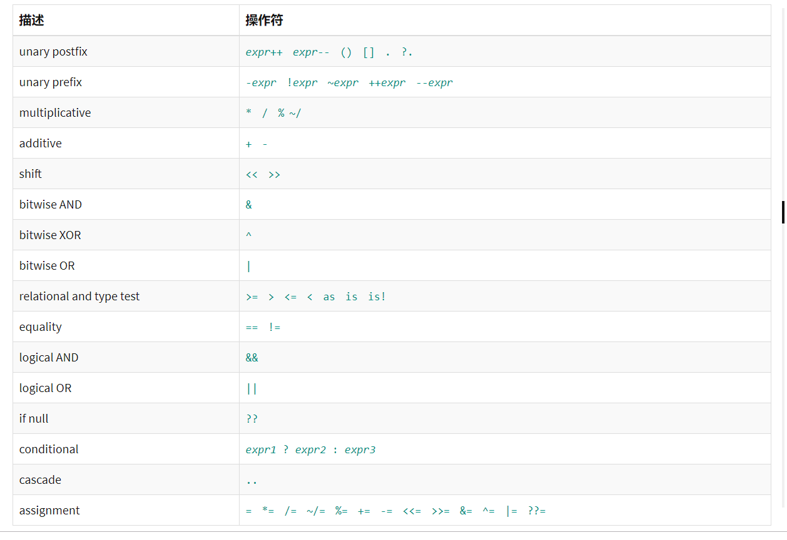

# 操作符

下表是 Dart 中定义的操作符。 很多操作符都可以重载。



在使用操作符的时候，就创建了表达式。下面是一些 操作符表达式：

```dart
a++
a + b
a = b
a == b
a ? b: c
a is T
```

在操作符表格中所列的操作符 都是按照优先级顺序从左到右，从上到下的方式来列出的， 上面和左边的操作符优先级要高于下面和右边的。 例如 % 操作符优先级高于 ==，而 等号 高于 &&。所以下面的 代码结果是一样的：

```dart
// 1: Parens improve readability.
if ((n % i == 0) && (d % i == 0))

// 2: Harder to read, but equivalent.
if (n % i == 0 && d % i == 0)
```

## 算术操作符

| `+`       | 加号                   |
| --------- | ---------------------- |
| `–`       | 减号                   |
| `-*expr*` | 负号                   |
| `*`       | 乘号                   |
| `/`       | 除号                   |
| `~/`      | 除号，但是返回值为整数 |
| `%`       | 取模                   |

示例：

```dart
assert(2 + 3 == 5);
assert(2 - 3 == -1);
assert(2 * 3 == 6);
assert(5 / 2 == 2.5);   // Result is a double
assert(5 ~/ 2 == 2);    // Result is an integer
assert(5 % 2 == 1);     // Remainder

print('5/2 = ${5~/2} r ${5%2}'); // 5/2 = 2 r 1
```

Dart 还支持递增、递减前缀 和后缀操作：

| `++*var*` | `*var* = *var* + 1` (expression value is `*var* + 1`) |
| --------- | ----------------------------------------------------- |
| `*var*++` | `*var* = *var* + 1` (expression value is `*var*`)     |
| `--*var*` | `*var* = *var* – 1` (expression value is `*var* – 1`) |
| `*var*--` | `*var* = *var* – 1` (expression value is `*var*`)     |

示例：

```dart
var a, b;

a = 0;
b = ++a; // Increment a before b gets its value.
assert(a == b); // 1 == 1

a = 0;
b = a++; // Increment a AFTER b gets its value.
assert(a != b); // 1 != 0

a = 0;
b = --a; // Decrement a before b gets its value.
assert(a == b); // -1 == -1

a = 0;
b = a--; // Decrement a AFTER b gets its value.
assert(a != b); // -1 != 0
```

## 相等相关的操作符

| 操作符 | 解释     |
| :----- | :------- |
| `==`   | 相等     |
| `!=`   | 不等     |
| `>`    | 大于     |
| `<`    | 小于     |
| `>=`   | 大于等于 |
| `<=`   | 小于等于 |

要测试两个对象代表的是否为同样的内容，使用 == 操作符。(在某些情况下，你需要知道两个对象是否是同一个对象， 使用 identical() 方法。) 下面是 == 操作符工作原理解释：

如果 x 或者 y 是 null，如果两个都是 null 则返回 true，如果 只有一个是 null 返回 false。

返回如下函数的返回值 x.==(y)。 （你没看错， 像 == 这种操作符是定义在左边对象上的函数。 你甚至还可以覆写这些操作符。 在后面的 Overridable operators 将介绍如何做。）

下面是相等关系操作符的 使用示例：

```dart
assert(2 == 2);
assert(2 != 3);
assert(3 > 2);
assert(2 < 3);
assert(3 >= 3);
assert(2 <= 3);
```

## 类型判定操作符

| 操作符 | 解释                           |
| :----- | :----------------------------- |
| `as`   | 类型转换                       |
| `is`   | 如果对象是指定的类型返回 True  |
| `is!`  | 如果对象是指定的类型返回 False |

只有当 obj 实现了 T 的接口， obj is T 才是 true。例如 obj is Object 总是 true。

使用 as 操作符把对象转换为特定的类型。 一般情况下，你可以把它当做用 is 判定类型然后调用 所判定对象的函数的缩写形式。

例如下面的 示例：

```dart
if (emp is Person) { // Type check
  emp.firstName = 'Bob';
}
```

使用 `as` 操作符可以简化上面的代码：

```dart
(emp as Person).firstName = 'Bob';
```

## 赋值操作符

使用 `=` 操作符来赋值。 但是还有一个 `??=` 操作符用来指定 值为 null 的变量的值。

```dart
a = value;   // 给 a 变量赋值
b ??= value; // 如果 b 是 null，则赋值给 b；
             // 如果不是 null，则 b 的值保持不变
```

还有复合赋值操作符 `+=` 等可以 赋值：

| `=`  | `–=` | `/=`  | `%=`  | `>>=` | `^=` |
| ---- | ---- | ----- | ----- | ----- | ---- |
| `+=` | `*=` | `~/=` | `<<=` | `&=`  | `|=` |

下面是复合赋值操作符工作原理解释：

|                     | 复合赋值操作符 | 相等的表达式   |
| :------------------ | :------------- | :------------- |
| **对于 操作符 op:** | `a *op*= b`    | `a = a *op* b` |
| **示例:**           | `a += b`       | `a = a + b`    |

下面的代码使用赋值操作符合 复合赋值操作符：

```dart
var a = 2;           // Assign using =
a *= 3;              // Assign and multiply: a = a * 3
assert(a == 6);
```

## 逻辑操作符

可以使用逻辑操作符来 操作布尔值

| 操作符    | 解释                                                  |
| :-------- | :---------------------------------------------------- |
| `!*expr*` | 对表达式结果取反（true 变为 false ，false 变为 true） |
| `||`      | 逻辑 OR                                               |
| `&&`      | 逻辑 AND                                              |

示例：

```dart
if (!done && (col == 0 || col == 3)) {
  // ...Do something...
}
```

## 位和移位操作符

在 Dart 中可以单独操作数字的某一位， 下面操作符同样应用于整数：

| 操作符    | 解释                                                  |
| :-------- | :---------------------------------------------------- |
| `&`       | AND                                                   |
| `|`       | OR                                                    |
| `^`       | XOR                                                   |
| `~*expr*` | Unary bitwise complement (0s become 1s; 1s become 0s) |
| `<<`      | Shift left                                            |
| `>>`      | Shift right                                           |

使用位于和移位操作符的示例：

```dart
final value = 0x22;
final bitmask = 0x0f;

assert((value & bitmask)  == 0x02);  // AND
assert((value & ~bitmask) == 0x20);  // AND NOT
assert((value | bitmask)  == 0x2f);  // OR
assert((value ^ bitmask)  == 0x2d);  // XOR
assert((value << 4)       == 0x220); // Shift left
assert((value >> 4)       == 0x02);  // Shift right
```

## 条件表达式

Dart 有两个特殊的操作符可以用来替代 if-else 语句：

condition ? expr1 : expr2
如果 condition 是 true，执行 expr1 (并返回执行的结果)； 否则执行 expr2 并返回其结果。
expr1 ?? expr2
如果 expr1 是 non-null，返回其值； 否则执行 expr2 并返回其结果。
如果你需要基于布尔表达式 的值来赋值， 考虑使用 ?:。

```dart
var finalStatus = m.isFinal ? 'final' : 'not final';
```

如果布尔表达式是测试值是否为 null， 考虑使用 `??`。

```dart
String toString() => msg ?? super.toString();
```

下面是一样效果的实现， 但是代码不是那么简洁：

```dart
// Slightly longer version uses ?: operator.
String toString() => msg == null ? super.toString() : msg;

// Very long version uses if-else statement.
String toString() {
  if (msg == null) {
    return super.toString();
  } else {
    return msg;
  }
}
```

## 级联操作符

级联操作符 (..) 可以在同一个对象上 连续调用多个函数以及访问成员变量。 使用级联操作符可以避免创建 临时变量， 并且写出来的代码看起来 更加流畅：

例如下面的代码：

```dart
querySelector('#button') // Get an object.
  ..text = 'Confirm'   // Use its members.
  ..classes.add('important')
  ..onClick.listen((e) => window.alert('Confirmed!'));
```

第一个方法 `querySelector()` 返回了一个 selector 对象。 后面的级联操作符都是调用这个对象的成员， 并忽略每个操作 所返回的值。

上面的代码和下面的代码功能一样：

```dart
var button = querySelector('#button');
button.text = 'Confirm';
button.classes.add('important');
button.onClick.listen((e) => window.alert('Confirmed!'));
```

级联调用也可以嵌套：

```dart
final addressBook = (new AddressBookBuilder()
      ..name = 'jenny'
      ..email = 'jenny@example.com'
      ..phone = (new PhoneNumberBuilder()
            ..number = '415-555-0100'
            ..label = 'home')
          .build())
    .build();
```

在方法上使用级联操作符需要非常小心， 例如下面的代码就是不合法的：

```dart
// Does not work
var sb = new StringBuffer();
sb.write('foo')..write('bar');
```

`sb.write()` 函数返回一个 void， 无法在 `void` 上使用级联操作符。

## 其他操作符

下面是其他操作符：

| Operator | Name         | Meaning                                                      |
| :------- | :----------- | :----------------------------------------------------------- |
| `()`     | 使用方法     | 代表调用一个方法                                             |
| `[]`     | 访问 List    | 访问 list 中特定位置的元素                                   |
| `.`      | 访问 Member  | 访问元素，例如 `foo.bar` 代表访问 `foo` 的 `bar` 成员        |
| `?.`     | 条件成员访问 | 和 `.` 类似，但是左边的操作对象不能为 null，例如 `foo?.bar` 如果 `foo` 为 null 则返回 null，否则返回 `bar` 成员 |