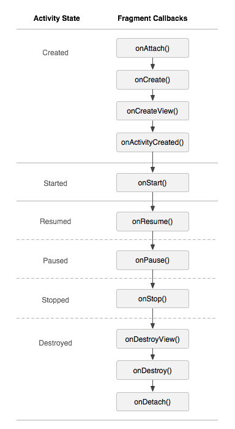

# fragment基本概念：

`Fragment` 表示 `FragmentActivity` 中的行为或界面的一部分。您可以在一个 Activity 中组合多个片段，从而构建多窗格界面，并在多个 Activity 中重复使用某个片段。您可以将片段视为 Activity 的模块化组成部分，它具有自己的生命周期，能接收自己的输入事件，并且您可以在 Activity 运行时添加或移除片段（这有点像可以在不同 Activity 中重复使用的“子 Activity”）。

片段必须始终托管在 Activity 中，其生命周期直接受宿主 Activity 生命周期的影响。例如，当 Activity 暂停时，Activity 的所有片段也会暂停；当 Activity 被销毁时，所有片段也会被销毁。不过，当 Activity 正在运行时，您可以独立操纵每个片段，如添加或移除片段。当执行此类片段事务时，您也可将其添加到由 Activity 管理的返回栈 — Activity 中的每个返回栈条目都是一条已发生片段事务的记录。借助返回栈，用户可以通过按*返回*按钮撤消片段事务（后退）。

# fragment的使用

1. 要是用fragment必须继承Fragment

2. 将fragment引入布局。

   1. 从xml布局中引入  其中`android:name` 属性指定要在布局中进行实例化的 `Fragment` 类

      ```xml
      <fragment
              android:id="@+id/fragment"
              android:name="com.example.txl.tool.fragment.DemoFragment"
              android:layout_width="match_parent"
              android:layout_height="match_parent"/>
      ```

   2. 从代码中引入：

      从代码中引入fragment主要是通过`FragmentTransaction` 中的 API。

      ```java
      FragmentManager fragmentManager = getSupportFragmentManager();
      FragmentTransaction fragmentTransaction = fragmentManager.beginTransaction();
      DemoFragment fragment = new DemoFragment();
      fragmentTransaction.add(R.id.fragment_container, fragment);
      fragmentTransaction.commit();
      ```

      **需要注意:**当我们希望系统像管理activity一样的来管理Fragment的时候在提交之前可以调用addToBackStack方法,可以将事务保存到返回栈，这样当我们点击返回的时候会吧fragmnet移除掉，而不是直接退出activity。如果再删除fragment的时候调用addToBackStack，系统会停止fragment的工作，在返回时恢复。


# fragment的生命周期

同activity一样fragment也有自己的生命周期，借用谷歌官方的一张图片



可以看到fragment的生命周期和activity类似。他们不同的地方就在于在创建和销毁的时候。我们对不同的方法进行说明。如果其他的方法不明白可以参考activity生命周期

onAttach:fragment与activty关联

onCreateView:创建fragment的view

onActivityCreated:当 Activity 的 onCreate() 方法已返回时进行调用。这里可以恢复保存的数据

onDestroyView:在移除与片段关联的视图层次结构时进行调用

onDetach:在取消片段与 Activity 的关联时进行调用


# frgment和activity通信

在activity中可以通过FragmentManager来查找到对应的fragment

```java
DemoFragment fragment = (DemoFragment) getSupportFragmentManager().findFragmentById(R.id.example_fragment);
```

同样的在fragment可以通过它的getActivity获取activity对象。

# fragment懒加载

在fragment中有一个方法叫做：setUserVisibleHint(boolean isVisibleToUser)dangfragment可视状态发生变化的时候会调用。但是需要注意的是这个方法的调用和生命周期没有关系它的调用时机是不确定的。比如说，回调时机有可能在`onCreateView`方法之后，也可能在`onCreateView`方法之前。因此，必须引入一个标志位`isPrepareView`判断`view`是否创建完成，不然，很容易会造成空指针异常。

这样就造成了一个新的问题，我们在setUserVisibleHint中不能够直接开始进行加载数据，所以一般而言还需要一个标记，标记是否初始化过，在onActivityCreated中同样的进行懒加载。

