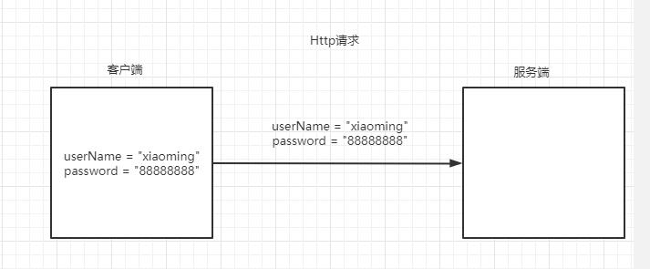
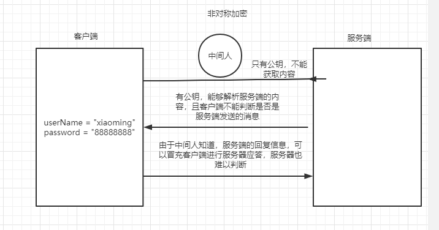

# Http与Https的区别

问题：加密的公钥私钥怎么来？

# Http通信的过程

## 什么是HTTP?

> 超文本传输协议，是一个基于请求与响应，无状态的，应用层的协议，常基于TCP/IP协议传输数据，互联网上应用最为广泛的一种网络协议,所有的WWW文件都必须遵守这个标准。设计HTTP的初衷是为了提供一种发布和接收HTML页面的方法。

http的大致通信过程如下

可以发现由于http采用明文传输，一旦有黑客对我们传输的内容进行拦截，就能够将我们的信息看的一清二楚、甚至串改我们传递的内容。

## 从http到https

对于htpp的明文传输问题我们首先想到的是对内容进行加密。

### 对称加密

使用相同的密钥来对数据进行加密解密，

**密钥的持有方式**：

- 每一个客户端都有自己的密钥。问题，客户端需要将自己的密钥推送给服务器，在推送的过程中可能出在密钥泄漏，并且服务器需要管理多个密钥，增加了服务端的压力
- 所有客户端都是用同一个密钥，密钥的加密解密形同虚设。

### 非对称加密

​	有一个公钥，私钥 ，公钥加密只能私钥解密，私钥加密只能公钥解密；公钥用于放置在互联网上。这样能够保证通信双方的内容不被修改，但是由于公钥存在与网络，通过服务器发送给客户端的信息依然能够被别有用心的人看见，并且非对称加密解密的过程非常耗时。

可以看到，不论是采用对称加密还是非对称加密都有他们自身固有的问题，并且他们都无法确认通信双方的真是身份信息。

既然对称加密和非对称加密都难以满足我们对信息安全的要求。那么有没有一个比较好点的方法来处理这个问题呢。

# https

https的通信过程有下面几个特点

1. 确认通信双方的真实身份
2. 保证通信双方的信息不被窃取
3. 传输高效

通信过程大致如下。

参考：https://www.cnblogs.com/shijingjing07/p/5965792.html