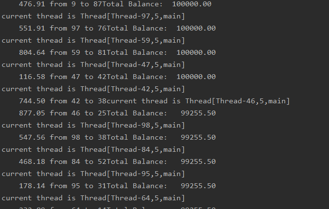
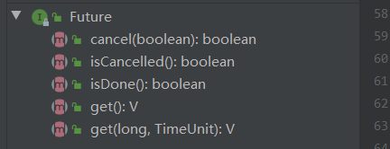

# 什么是线程

线程是cpu执行调度的最小单元，可以独立的执行任务。在android上最常见的就是主线程执行ui更新，而其它的耗时操作放在子线程中来执行，比如网络请求，文件操作。

# 多线程的使用方式

实现多线程有几种方式，常见的如下

1. 继承Thread，重写run方法；调用Thread类的start方法

   ```java
   Thread thread = new Thread(){
               @Override
               public void run() {
                   super.run();
               }
           };
           thread.start();
   ```

   

2. 实现 Runnable接口，将之与Thread关联；调用Thread类的start方法

   ```java
   Runnable runnable = new Runnable() {
               @Override
               public void run() {
                   System.out.println("多线程");
               }
           };
           Thread thread1 = new Thread(runnable);
           thread1.start();
   ```

   

# 线程的中断

当线程的run方法执行方法体中的最后一条语句后，并经由执行return语句返回时，或者出现了在方法中没有捕获的异常，线程将终止。

没有可以强制终止线程的方法，可以通过interrupt来请求终止线程。当对一个线程调用interrupt的时候，线程的中断状态将被置位。这是每一个线程都具有的boolean标志。每个线程都应该不时的检查这个标志，以判断线程是否被中断。当线程处于阻塞状态的时候（调用了sleep或wait）会产生InterruptedException。

测试中断代码:

```java
package com.txl.concurrency;

/**
 * 线程中断
 * */
public class InterruptedDemo {
    static Runnable runnable = new Runnable() {
        @Override
        public void run() {
            int i;
            while (true){

                i=0;
                while (i<10*1000 ){
                    if (i%1000 == 0)
                    System.out.println("i is "+i);
                    i++;
                }
                if(Thread.interrupted()){
                    System.out.println("receive interrupted");
                    return;
                }
            }
        }
    };
    static Runnable runnable2 = new Runnable() {
        @Override
        public void run() {
            int i=0;
            while (true){
                try {
                    Thread.sleep(5000);
                }catch (InterruptedException e){
                    e.printStackTrace();
                }
            }
        }
    };

    public static void main(String[] args){
        Thread thread = new Thread(runnable);
        Thread thread2 = new Thread(runnable2);
        thread.start();
        thread2.start();

        thread.interrupt();
        thread2.interrupt();
    }

}

```

# 线程的状态

线程可以有下面6种状态

- New(新创建)
- Runnable(可运行)
- Blocked(被阻塞)
- Waiting(等待)
- Timed waiting(计时等待)
- Terminated(被终止)


新建状态：当使用new操作符新建一个线程，该线程还没有开始运行。这意味着它的状态是New

可运行线程：一旦调用start方法，线程处于可运行状态。一个可运行的线程可能在运行也可能没有运行。这个取决于操作系统给线程提供的可运行的时间。

被阻塞线程和等待线程：当线程处于被阻塞或等待状态时，它暂时是不活动。它不运行任何代码且消耗最少的资源。直到线程调度器重新激活它。细节取决于它是怎样达到非活跃状态。

- 当一个线程试图获取一个内部的对象锁，而该锁被其它线程持有，则该线程进入阻塞状态。当其它线程释放该锁，并且线程调度器运行本线程持有它的时候，该线程将变为非阻塞状态。
- 当线程等待另一个线程通知调度器一个条件时，它自己进入等待状态。在调用Object.wait或Thread.join或java.concurrent库的Lock或Condition时，就会出现这种情况。
- 有几个方法有一个超时参数。调用他们导致线程进入计时等待的状态。这一状态将持续到超时期满或者接收到适当的通知。带有超时参数的方法有Thread.sleep和Object.wait、Thread.join、Lock.tryLock以及Condition.await

被终止的线程：

线程因为run方法的正常退出而自然死亡；因为没有捕获的异常终止了run方法而意外死亡。

# 线程的属性

## 线程的优先级

在Java程序设计中，每一个线程都有一个优先级，默认情况下，一个线程继承它的父线程的优先级。可以通过setPriority方法来提供或降低优先级。线程的优先级范围为1-10；默认情况先线程优先级为5。

每当线程调度器有机会选择新的线程时，它首先选择具有较高优先级的线程。但是，线程优先级是高度依赖于系统的。

Thread.yield（）该方法导致当前线程处于让步状态。如果有其它的可运行线程具有至少与该线程具有相同高的优先级，那么这些线程接下里会被调用。

## 守护线程

通过调用Thread.setDaemon可以将线程设置为守护线程。守护线程的唯一作用就是为其它线程提供服务。当程序只剩下守护线程的时候，虚拟机就退出了。

## 处理未捕获的异常

可以通过调用Thread.setUncaughtExceptionHandler为 当前线程设置异常处理器，也可以通过Thread.setDefaultUncaughtExceptionHandler来为所有线程安装一个默认的处理器。

# 同步

为了避免多线程引起的对共享数据的讹误，我们需要学习同步机制。

简单示例：模拟有若干账户的银行。随机在这些账户之间转移钱款交易。每个账户有一个线程。每一笔交易中，会从线程所服务的账户中随机转移一定数目的钱款到另一个随机账户。

```java
public class Bank {
    private final double[] accounts;

    /**
     * 构造函数初始化的时候，初始账户个数，并且为每个账户赋值
     * */
    public Bank(int n, double initialBalance){
        accounts = new double[n];
        Arrays.fill(accounts,initialBalance);
    }

    /**
     * 将钱从一个账户转移到另一个账户
     * @param from 从该账户转出
     * @param to 将钱转入改 账户
     * @param amount 转账金额
     * */
    public void transfer(int from, int to, double amount){
        if(accounts[from] < amount){//账户金额不足转出，停止转账
            return;
        }
        System.out.println("current thread is "+Thread.currentThread());
        accounts[from] -= amount;
        System.out.printf("%10.2f from %d to %d",amount,from,to);
        accounts[to] += amount;
        System.out.printf("Total Balance: %10.2f%n",getTotalBalance());
    }

    /**
     * 获取银行总金额
     * */
    public double  getTotalBalance(){
        double sum = 0;
        for (double num:accounts){
            sum += num;
        }
        return sum;
    }

    public int size(){
        return accounts.length;
    }
}
```

```java
public class UnsynchBankTest {
    public static final int NACCOUNTS = 100;
    public static final double INITIAL_BALANCE = 1000;
    public static final double MAX_AMOUNT = 1000;
    public static final int DELAY = 10;

    public static void main(String[] args) {
        Bank bank = new Bank(NACCOUNTS, INITIAL_BALANCE);
        for (int i = 0; i < NACCOUNTS; i++) {
            int fromAccount = i;
            Runnable runnable = new Runnable() {
                @Override
                public void run() {
                    try {
                        while (true){
                            int toAccount = (int)(bank.size() * Math.random());
                            double amount = MAX_AMOUNT * Math.random();
                            bank.transfer(fromAccount,toAccount,amount);
                            Thread.sleep((long) (DELAY*Math.random()));
                        }
                    }catch (InterruptedException e){
                        e.printStackTrace();
                    }
                }
            };
            Thread thread = new Thread(runnable);
            thread.start();
        }
    }
}
```

代码的运行结果：



可以明显看到运行一段时间后，银行总账户的钱发生了变化。这到底是什么原因导致的呢？

accounts[to] += amount 并不是一个原子操作。改指令可能被如下操作：

1. 将accounts[to]加载到寄存器。
2. 增加amount
3. 将结果回写accounts[to]

我们假设线程1执行了步骤1、2，然后，它被剥夺了运行权，假定线程2被唤醒并修改了accounts数组中的同一项。然后，第一个线程被唤醒并完成其第3步。

这样这一个动作擦去了第二个线程所做的更新，结果不在正确。

其实真正的问题在于执行transfer方法的过程中可能会被中断，如果能够确保线程在失去控制之前完成方法的运行，那么银行账户对象的状态永远不会出现讹误。

## lock

java有两种机制防止代码款受并发访问的干扰，分别是synchronized和Lock;synchronized是系统内置关键字，而ReentrantLock是java se 5.0之后加入的类。

ReentrantLock保护代码块的基本结构如下：

```java
public class ReentrantLockDemo {
    ReentrantLock myLock = new ReentrantLock();
    private void demo(){
        myLock.lock();
        try {
            System.out.println("todo some thing");
        }catch (Exception e){
            e.printStackTrace();
        }finally {
            myLock.unlock();
        }
    }
}
```

这个结构确保任意时刻只有一个线程进入临界区，一旦一个线程封锁了锁对象，其它任何线程都无法通过lock语句。当其它线程调用lock的 时候，他们被阻塞，直到第一个线程释放锁对象。

**注意：**在finally中释放锁对象十分重要，如果在临界区的代码抛出异常，锁必须被释放。否则其它线程将永远阻塞。

使用ReentrantLock进行同步：

```java
public class ReentrantLockBank {
    private Lock bankLock = new ReentrantLock();
    private final double[] accounts;

    /**
     * 构造函数初始化的时候，初始账户个数，并且为每个账户赋值
     * */
    public ReentrantLockBank(int n, double initialBalance){
        accounts = new double[n];
        Arrays.fill(accounts,initialBalance);
    }

    /**
     * 将钱从一个账户转移到另一个账户
     * @param from 从该账户转出
     * @param to 将钱转入改 账户
     * @param amount 转账金额
     * */
    public void transfer(int from, int to, double amount){
        bankLock.lock();
        try {
            if(accounts[from] < amount){//账户金额不足转出，停止转账
                return;
            }
            System.out.println("current thread is "+Thread.currentThread());
            accounts[from] -= amount;
            System.out.printf("%10.2f from %d to %d",amount,from,to);
            accounts[to] += amount;
            System.out.printf("Total Balance: %10.2f%n",getTotalBalance());
        }catch (Exception e){
            e.printStackTrace();
        }finally {
            bankLock.unlock();
        }
    }

    /**
     * 获取银行总金额
     * */
    public double  getTotalBalance(){
        double sum = 0;
        for (double num:accounts){
            sum += num;
        }
        return sum;
    }

    public int size(){
        return accounts.length;
    }
}

```

可以发现经过这样处理银行对象，不会在发生讹误。

### 锁的可重入

因为线程可以重复的获得已经持有的锁。锁保持一个持有计数来跟踪对lock方法的嵌套调用。线程在每一次调用lock后都需要调用unlock来释放。由于这一特性，被一个锁保护的代码可以调用另一个使用相同锁的方法。

### 条件对象

通常，线程进入临界区，却发现在在某一条件满足之后才能执行。要使用条件对象来管理那些已经获得了一个锁但却不能做有用的工作的线程。

比如在进行转账的时候需要判断当前账户拥有足够多的钱才能进行。需要等待其它线程为账户中转入祖国多的钱，但是这一线程刚刚获得了排它性访问，因此没有线程有进行错款操作的机会。这就是我们为什么需要使用条件变量。


**锁总结：**

- 所可以用来保护代码片段，任何时候只能有一个线程执行被保护的代码
- 锁可以管理视图进入被保护代码段的线程
- 锁可以拥有一个或多个条件对象
- 每个条件对象管理那些已经进入被保护的代码段但还不能运行的线程

## synchronized

java中的每一个对象都有一个内部锁。如果一个方法用synchronized关键字声明，那么对象锁将保护整个方法。也就是说要调用改方法，线程必须获得内部的对象锁。

简单示例：使用synchronized修改银行对象：

```java
public class SynchronizedBank {
    private final double[] accounts;

    /**
     * 构造函数初始化的时候，初始账户个数，并且为每个账户赋值
     * */
    public SynchronizedBank(int n, double initialBalance){
        accounts = new double[n];
        Arrays.fill(accounts,initialBalance);
    }

    /**
     * 将钱从一个账户转移到另一个账户
     * @param from 从该账户转出
     * @param to 将钱转入改 账户
     * @param amount 转账金额
     * */
    public synchronized void transfer(int from, int to, double amount){
        if(accounts[from] < amount){//账户金额不足转出，停止转账
            return;
        }
        System.out.println("current thread is "+Thread.currentThread());
        accounts[from] -= amount;
        System.out.printf("%10.2f from %d to %d",amount,from,to);
        accounts[to] += amount;
        System.out.printf("Total Balance: %10.2f%n",getTotalBalance());
    }

    /**
     * 获取银行总金额
     * */
    public synchronized double  getTotalBalance(){
        double sum = 0;
        for (double num:accounts){
            sum += num;
        }
        return sum;
    }

    public int size(){
        return accounts.length;
    }
}
```

synchronized关键字作用于不同的位置有不同的作用：

1. 普通同步方法（实例方法），锁是当前实例对象 ，进入同步代码前要获得当前实例的锁
2. 静态同步方法，锁是当前类的class对象 ，进入同步代码前要获得当前类对象的锁
3. 同步方法块，锁是括号里面的对象，对给定对象加锁，进入同步代码库前要获得给定对象的锁。
   1. 给定的对象是成员变量，类似普通方法同步，同时的是当前实例对象
   2. 给定对象是static修饰的变量，或者class，类似同步静态方法。

示例代码：

```java
public class SynchronizedTest {
    public static String TAG = "SynchronizedTest";
    public static void main(String[] args){
        demoSynchronizedFiled();
    }

    /**
     * 同一个实例对象
     * */
    private static void demoSynchronizedMethod(){
        final SynchronizedDemo synchronizedDemo = new SynchronizedDemo();
        Thread thread1 = new Thread(new Runnable() {
            @Override
            public void run() {
                synchronizedDemo.test();
            }
        },"Thread 1 ::");
        Thread thread2 = new Thread(new Runnable() {
            @Override
            public void run() {
                synchronizedDemo.test();
            }
        },"Thread 2 ::");
        thread1.start();
        thread2.start();
    }
    /**
     * 测试不同的实例对象
     * */
    private static void demoSynchronizedMethod2(){
        final SynchronizedDemo synchronizedDemo = new SynchronizedDemo();
        final SynchronizedDemo synchronizedDemo2 = new SynchronizedDemo();
        Thread thread1 = new Thread(new Runnable() {
            @Override
            public void run() {
                synchronizedDemo.test();
            }
        },"Thread 1 ::");
        Thread thread2 = new Thread(new Runnable() {
            @Override
            public void run() {
                synchronizedDemo2.test();
            }
        },"Thread 2 ::");
        thread1.start();
        thread2.start();
    }

    /**
     * 测试同步static方法
     * */
    private static void demoSynchronizedStaticMethod(){
        Thread thread1 = new Thread(new Runnable() {
            @Override
            public void run() {
                SynchronizedDemo.test1();
            }
        },"Thread 1 ::");
        Thread thread2 = new Thread(new Runnable() {
            @Override
            public void run() {
                SynchronizedDemo.test1();
            }
        },"Thread 2 ::");
        thread1.start();
        thread2.start();
    }

    private static void demoSynchronizedFiled(){
        final SynchronizedDemo synchronizedDemo = new SynchronizedDemo();
        Thread thread1 = new Thread(new Runnable() {
            @Override
            public void run() {
                synchronizedFiled(synchronizedDemo);
            }
        },"Thread 1 ::");
        Thread thread2 = new Thread(new Runnable() {
            @Override
            public void run() {
                synchronizedFiled(synchronizedDemo);
            }
        },"Thread 2 ::");
        thread1.start();
        thread2.start();
    }

    private static void synchronizedFiled(SynchronizedDemo synchronizedDemo){
//        synchronizedDemo.synchronizedObject();
//        synchronizedDemo.synchronizedStaticObject();
        synchronizedDemo.synchronizedClass();
    }
}
class SynchronizedDemo{
    public static String TAG = "SynchronizedTest";

    private final Object object = new Object();

    private final static Object staticObject = new Object();

    /**
     * 同步方法
     * */
    public synchronized void test(){
        System.out.println(TAG+"线程 "+Thread.currentThread().getName() +"获得锁");
        try {
            Thread.sleep(5*1000);
        } catch (InterruptedException e) {
            e.printStackTrace();
        }
        System.out.println(TAG+Thread.currentThread().getName()+"  执行test");
    }

    /**
     * 同步静态方法
     * */
    public static synchronized void test1(){
        System.out.println(TAG+"线程 "+Thread.currentThread().getName() +"获得锁");
        try {
            Thread.sleep(5*1000);
        } catch (InterruptedException e) {
            e.printStackTrace();
        }
        System.out.println(TAG+Thread.currentThread().getName()+"  执行test1");
    }

    public void synchronizedObject(){
        synchronized (object){
            System.out.println(TAG+"线程 "+Thread.currentThread().getName() +"获得锁");
            try {
                Thread.sleep(5*1000);
            } catch (InterruptedException e) {
                e.printStackTrace();
            }
            System.out.println(TAG+Thread.currentThread().getName()+"  执行test");
        }
    }

    public void synchronizedStaticObject(){
        synchronized (staticObject){
            System.out.println(TAG+"线程 "+Thread.currentThread().getName() +"获得锁");
            try {
                Thread.sleep(5*1000);
            } catch (InterruptedException e) {
                e.printStackTrace();
            }
            System.out.println(TAG+Thread.currentThread().getName()+"  执行test");
        }
    }

    public void synchronizedClass(){
        synchronized (SynchronizedDemo.class){
            System.out.println(TAG+"线程 "+Thread.currentThread().getName() +"获得锁");
            try {
                Thread.sleep(5*1000);
            } catch (InterruptedException e) {
                e.printStackTrace();
            }
            System.out.println(TAG+Thread.currentThread().getName()+"  执行test");
        }
    }
}
```


# 死锁 

所谓死锁是指多个线程因竞争资源而造成的一种僵局（互相等待），若无外力作用，这些进程都将无法向前推进。

   所谓死锁是指两个或两个以上的线程在执行过程中，因争夺资源而造成的一种互相等待的现象，若无外力作用，它们都将无法推进下去。

# 乐观锁&悲观锁

**悲观锁(Pessimistic Lock)**

顾名思义，就是很悲观，每次去拿数据的时候都认为别人会修改，所以每次在拿数据的时候都会上锁，这样别人想拿这个数据就会block直到它拿到锁。传统的关系型数据库里边就用到了很多这种锁机制，比如行锁，表锁等，读锁，写锁等，都是在做操作之前先上锁。它指的是对数据被外界（包括本系统当前的其他事务，以及来自外部系统的事务处理）修改持保守态度，因此，在整个数据处理过程中，将数据处于锁定状态。悲观锁的实现，往往依靠数据库提供的锁机制（也只有数据库层提供的锁机制才能真正保证数据访问的排他性，否则，即使在本系统中实现了加锁机制，也无法保证外部系统不会修改数据）。

**乐观锁(Optimistic Lock)**

顾名思义，就是很乐观，每次去拿数据的时候都认为别人不会修改，所以不会上锁，但是在更新的时候会判断一下在此期间别人有没有去更新这个数据，可以使用版本号等机制。

# Callable&Future

Runnable封装一个异步运行的任务，可以把它想象成一个没有参数和返回值的方法。Callable与Runnable类似，但是有一个返回值。Callable接口是一个参数化的类型，只有一个方法call。

```java
public interface Callable<V> {
    V call() throws Exception;
}
```

类型参数是返回值的类型。例如Callable<Integer>表示一个最终返回Integer对象的异步计算。

Future保存异步计算结果。可以启动一个计算，将Future对象交给某个线程，然后忘掉它。Future对象的所有者在结果计算好之后就可以获得它。

Future接口的定义如下：



- get（）方法调用被阻塞，直到计算完成。如果在计算完成之前，get(long timeout, TimeUnit unit)调用超时，会抛出InterruptedException异常。如果计算已经完成，那么get方法立即返回。
- 如果计算还在进行isDone方法返回false;否则，返回true
- cancel方法可以取消计算，如果计算还没开始，它被取消且不再开始。如果计算处于运行之中，那么如果mayInterruptIfRunning参数为true,它就被中断。


FutureTask包装器是一种非常便利的机制，可以将Callable转换成Future和Runnable,它同时实现两者的接口。

简单示例：

```java
Callable<String> callable = new Callable<String>() {
            @Override
            public String call() throws Exception {
                Thread.sleep(10000);
                return "finish callable !";
            }
        };
        FutureTask<String> futureTask = new FutureTask<>(callable);
        Thread thread = new Thread(futureTask);
        thread.start();
        try {
            System.out.println("  :::: "+futureTask.get());
        } catch (InterruptedException | ExecutionException e) {
            e.printStackTrace();
        }
```


# 线程池

使用线程池有下面几点好处：

1. 重用线程池中的线程，避免因为线程的创建和销毁带来的性能开销。
2. 能有效控制线程池的最大并发数，避免大量的线程之间因为互相抢占系统资源而导致阻塞现象。
3. 能够对线程进行简单的管理，并提供定时器执行以及指定间隔循环执行等功能。

线程池的配置我们一般使用ThreadPoolExecutor或者Executors来进行配置。

ThreadPoolExecutor有4个构造函数 ，最终他们都调用了下面的这个构造函数

```java
/**
     * Creates a new {@code ThreadPoolExecutor} with the given initial
     * parameters.
     *
     * @param corePoolSize the number of threads to keep in the pool, even
     *        if they are idle, unless {@code allowCoreThreadTimeOut} is set
     * @param maximumPoolSize the maximum number of threads to allow in the
     *        pool
     * @param keepAliveTime when the number of threads is greater than
     *        the core, this is the maximum time that excess idle threads
     *        will wait for new tasks before terminating.
     * @param unit the time unit for the {@code keepAliveTime} argument
     * @param workQueue the queue to use for holding tasks before they are
     *        executed.  This queue will hold only the {@code Runnable}
     *        tasks submitted by the {@code execute} method.
     * @param threadFactory the factory to use when the executor
     *        creates a new thread
     * @param handler the handler to use when execution is blocked
     *        because the thread bounds and queue capacities are reached
     * @throws IllegalArgumentException if one of the following holds:<br>
     *         {@code corePoolSize < 0}<br>
     *         {@code keepAliveTime < 0}<br>
     *         {@code maximumPoolSize <= 0}<br>
     *         {@code maximumPoolSize < corePoolSize}
     * @throws NullPointerException if {@code workQueue}
     *         or {@code threadFactory} or {@code handler} is null
     */
public ThreadPoolExecutor(int corePoolSize,
                              int maximumPoolSize,
                              long keepAliveTime,
                              TimeUnit unit,
                              BlockingQueue<Runnable> workQueue,
                              ThreadFactory threadFactory,
                              RejectedExecutionHandler handler) 
```

从它的注释上我们可以看出各个参数的含义。

- corePoolSize 核心线程数，默认情况下，核心线程会一直在线程池中存活，即使它们处于闲置状态。如果将ThreadPoolExcutor的allowCoreThreadTimeOut设为true,那么闲置的核心线程在等待新的任务到来时会有超时策略，这个时间间隔由keepAliveTime所指定，当等待的时间超过keepAliveTime所指定的时长后，核心线程就会被终止。
- maximumPoolSize 线程池所能容纳的最大线程数，当活动线程数达到这个数值后，后续新的任务会被阻塞。
- keepAliveTime 非核心线程的等待超时时长，超过这个时长，非核心线程就会被回收。当ThreadPoolExcutor的allowCoreThreadTimeOut被设置为true时，keepAliveTime同样会作用于核心线程。
- unit 用于指定keepAliveTime参数的时间单位，这是一个枚举值。
- workQueue  线程池中的任务队列，通过线程池的execute方法提交的Runnable对象会存储在这个参数中
- threadFactory 线程工厂，为线程池提供创建新线程的功能。ThreadFactory是一个接口，它只有一个方法：Thread newThread(Runnable r)
- handler 当线程池无法执行新任务时，这可能是由于任务队列已满或者是无法成功执行任务，这个时候ThreadPoolExector会调用handler的rejectedExecution来通知调用者，默认情况下rejectedExecution会直接抛出一个RejectedExecutionException。

