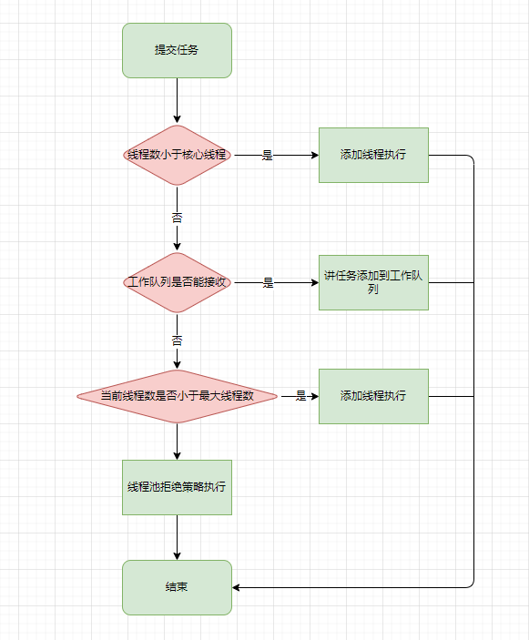

为什么写这篇博客，作为一个Android开发者，日常使用线程池的频率相对较少，网上又许多的关于线程池的博客。真的有必要写这个东西吗？辗转思考我还是决定要写一篇关于线程池的文章，因为站在不同的角度可能有不同的理解，同时别人的文章也并没有解答我想要的问题。比如

- 核心线程和非核心线程的区别？怎么来进行维护的？线程池的线程复用和我们的对象池对象重用一样吗？
- workQueue存储量无限大，这个非核心线程怎么启动？
- 非核心线程池到底会不会从workQueue取数据？
- java线程池的设计理念。为什么是核心线程-->workQueue --> 非核心线程 而不是  核心线程-->非核心线程 而不是  --> workQueue  的顺序插入？

2022年掘金的愿望：升级到lv4,写出一篇点赞数超过100的文章。目标从这篇文章开始。如果觉得文章还不错，评论、点赞、关注是对我最大的鼓励。


# 前言

在Android中，为了保证UI的流畅性，会将许多耗时的操作放到子线程中来完成。但是线程作为CPU调度的最小单位，创建、销毁和线程调度都需要较大的成本。因此线程的管理就显得尤为重要。并且，一些常用的框架比如Glide,Okhttp都有有自己的线程池配置，线程池也是Android面试过程中的高频问题。所以对于一个想要进阶高级Android开发人员来说，线程池是一个绕不开的话题。

# 线程池配置参数

线程池可以通过ThreadPoolExecutor来创建，ThreadPoolExecutor有多个构造函数，但是最终会通过this调用参数最多的这个。我们来看看。

```java
public ThreadPoolExecutor(int corePoolSize,
                              int maximumPoolSize,
                              long keepAliveTime,
                              TimeUnit unit,
                              BlockingQueue<Runnable> workQueue,
                              ThreadFactory threadFactory,
                              RejectedExecutionHandler handler)
```

参数解析：

- corePoolSize： 线程池核心线程数最大值
- maximumPoolSize： 线程池最大线程数大小
- keepAliveTime： 线程池中非核心线程空闲的存活时间大小，但是allowCoreThreadTimeOut(boolean value) 设置为 true 时 这个时间也会作用于核心线程。
- unit： 线程空闲存活时间单位
- workQueue： 线程池中的任务队列，我们提交给线程池的runnable会被存储在这个对象上。
- 线程池的分配遵循这样的规则：当线程池中的核心线程数量未达到最大线程数时，启动一个核心线程去执行任务；
- 如果线程池中的核心线程数量达到最大线程数时，那么任务会被插入到任务队列中排队等待执行；
- 如果在上一步骤中任务队列已满但是线程池中线程数量未达到限定线程总数，那么启动一个非核心线程来处理任务；

- threadFactory： 用于设置创建线程的工厂，通过实现newThread返回一个新的线程
- handler：  线城池的饱和策略事件，主要有四种类型。
  - AbortPolicy(抛出一个异常，默认的)
  - DiscardPolicy(直接丢弃任务)
  - DiscardOldestPolicy（丢弃队列里最老的任务，将当前这个任务继续提交给线程池）
  - CallerRunsPolicy（交给线程池调用所在的线程进行处理)

# ThreadPoolExecutor关键成员

```java
private final AtomicInteger ctl = new AtomicInteger(ctlOf(RUNNING, 0));
    private static final int COUNT_BITS = Integer.SIZE - 3;
    private static final int CAPACITY   = (1 << COUNT_BITS) - 1;

    // runState is stored in the high-order bits
    private static final int RUNNING    = -1 << COUNT_BITS;
    private static final int SHUTDOWN   =  0 << COUNT_BITS;
    private static final int STOP       =  1 << COUNT_BITS;
    private static final int TIDYING    =  2 << COUNT_BITS;
    private static final int TERMINATED =  3 << COUNT_BITS;
   
	// Packing and unpacking ctl
	//通过位操作获取线程池的运行状态 runState
    private static int runStateOf(int c)     { return c & ~CAPACITY; }
	//通过位操作获取线程池的有效线程个数 workerCount
    private static int workerCountOf(int c)  { return c & CAPACITY; }
	//将runState与workerCount合成 ctl
    private static int ctlOf(int rs, int wc) { return rs | wc; }

```

ctl是一个线程安全的int,它的高三位用来存储线程池的状态（runState），低29位用来存储线程池内有效线程的个数(workerCount)。需要注意的是workerCount值可能暂时与活动线程的实际数量不同。

## runState生命周期

runState 提供主要的生命周期控制，其值为：

- RUNNING：接受新任务，处理排队任务 。

- SHUTDOWN：不接受新任务，但处理排队任务 。

- STOP：不接受新任务，不处理排队任务，以及中断正在进行的任务 。

- TIDYING ：所有任务都已终止，workerCount 为零，转换到状态 TIDYING 的线程将运行 terminate() 钩子方法 。

- TERMINATED： terminate() 已完成。


# 线程池的执行流程

向线程池提交任务有execute、submit、invokeAny 、invokeAll四种方式，但是他们最终都会被包装成调用execute的方式，这里不去探讨其他方式调用的实现。就以execute分析线程池的执行流程。

```java
public void execute(Runnable command) {
        if (command == null)
            throw new NullPointerException();
      	
        int c = ctl.get();
    	//workerCountOf从ctl中解析出当前工作线程的数量
    	//如果当前的工作线程数小于核心线程数，则新创建一个线程进行工作
        if (workerCountOf(c) < corePoolSize) {
            //添加核心线程成功，则直接退出
            if (addWorker(command, true))
                return;
            //当前核心线程添加失败，重新获取ctl的值
            c = ctl.get();
        }
    	//当前线程池处于RUNNING状态并且成功的添加到了工作队列
    	//只有运行状态  workQueue才能添加任务
        if (isRunning(c) && workQueue.offer(command)) {
            //再次获取ctl并进行RUNNING状态判断，如果不是RUNNING状态，
            //尝试从workQueue 移除刚才添加的任务，如果移除成功，执行拒绝策略。
            int recheck = ctl.get();
            if (! isRunning(recheck) && remove(command))
                reject(command);
            //判断当前工作线程的数量，如果为0 则尝试创建一个非核心线程
            //来从工作队里中读取处理任务
            //什么时候工作线程会为0？为什么要在这个位置尝试添加一个非核心线程？ 
            //情况1： 线程池配置的核心线程数为0  workQueue能够添加任务，此时必须有线程处理workQueue中的任务，
            //否则直到workQueue饱和前，任务都不会被处理。如果workQueue是无界的，那么当任务堆积过多就只能等待oom。
            //因此需要创建一个非核心线程来处理。
            else if (workerCountOf(recheck) == 0)
                addWorker(null, false);
        }
    	//代码流转到这个位置有如下情况
    	//情况1：当前状态不是 RUNNING  
    	//情况2：当前是RUNNING 状态，但是核心线程数和workQueue都已经到达最大值。
    	//尝试添加一个非核心线程处理当前任务，如果失败执行拒绝策略
        else if (!addWorker(command, false))
            reject(command);
    }
```

execute执行流程如下：

- 如果当前存活的线程数小于核心线程，则直接创建一个线程执行当前任务
- 如果当前核心线程数已经达到最大值且工作队列能够存储任务，那么将任务添加进入队列等待执行。
- 在核心线程数已经达到最大值的情况下，工作队列不能接受任务，如果可以创建非核心线程，那么创建非核心线程执行，否则执行任务拒绝策略。




## addWorker代码分析

addWorker的作用是尝试在线程池中创建一个线程，第一个参数firstTask，代表第一个要执行的任务，第二个core 为true代表要创建的是核心线程，否则创建非核心线程。不论创建的是核心线程还是非核心线程，线程一旦创建就不不断的读取workQueue队列中的任务进行处理，直到没有任务处理的时候，非核心线程会因为超时而被回收，核心线程依据allowCoreThreadTimeOut是否为true来决定是否被回收。

```java
private boolean addWorker(Runnable firstTask, boolean core) {
        retry:
        for (;;) {
            int c = ctl.get();
            //获取当前运行状态
            int rs = runStateOf(c);
            // 再次回顾  runState生命周期，在SHUTDOWN状态下，不会接收新任务可以创建线程处理已经存在的任务
            //  rs >= SHUTDOWN 即不会在接收新的任务，
            //  rs == SHUTDOWN  在SHUTDOWN状态下可以处理workQueue的任务
            //  firstTask  当firstTask不为空时，说明添加当前线程是为了执行新任务
            //  workQueue.isEmpty() 为true的时候,说明工作队列已经处理完毕，不需要在创建线程
            //总体上来说就是 在不能接收新任务的时候，判断是否可以创建线程处理workQueue的任务，能够创建则继续否则直接返回false 创建失败
            if (rs >= SHUTDOWN &&
                ! (rs == SHUTDOWN &&
                   firstTask == null &&
                   ! workQueue.isEmpty()))
                return false;

            for (;;) {
                int wc = workerCountOf(c);
                // wc >= CAPACITY CAPACITY是二进制是29个1  此时意味着当前的线程总数已经到了能够记录的极限，不能在创建线程
                //根据创建的类型是否是核心线程将wc来比较corePoolSize或maximumPoolSize来判断是否能创建线程
                if (wc >= CAPACITY ||
                    wc >= (core ? corePoolSize : maximumPoolSize))
                    return false;
                //尝试将当前记录的工作线程数加一，如果成功退出上一个循环
                //需要注意的是这里的加一只是计数器加一，实际上还没有创建工作线程
                if (compareAndIncrementWorkerCount(c))
                    break retry;
                c = ctl.get();  // Re-read ctl
                //因为尝试将当前记录的工作线程数加一失败，说明上一次获取的ctl并不精确，
                //用新获取的ctl状态与上次的状态对比，如果状态发生改变,重新执行能否创建线程的判断逻辑，
                //否则说明原来不准确的部分只是低29位即workerCount部分,继续执行当前循环，尝试将workerCount 加1
                if (runStateOf(c) != rs)
                    continue retry;
            }
        }

        boolean workerStarted = false;
        boolean workerAdded = false;
        Worker w = null;
        try {
            //在计数器加一后，创建一个Worker  Worker实现了Runnable并持有当前需要需要第一个执行的任务，
            //同时在构造方法中会通过线程池配置的threadFactory来创建一个新的线程。并且将自己传递给新创建的线程。
            w = new Worker(firstTask);
            final Thread t = w.thread;
            if (t != null) {
                final ReentrantLock mainLock = this.mainLock;
                mainLock.lock();
                try {
                    int rs = runStateOf(ctl.get());
					//再次判断当前线程池的状态， rs < SHUTDOWN 即为RUNNING 可以直接添加
                    //rs == SHUTDOWN && firstTask == null 如果处于SHUTDOWN 那么线程
                    //池中创建新的线程只能是处理workQueue中的任务，因此firstTask必须为null
                    if (rs < SHUTDOWN ||
                        (rs == SHUTDOWN && firstTask == null)) {
                        if (t.isAlive()) // precheck that t is startable
                            throw new IllegalThreadStateException();
                        workers.add(w);
                        int s = workers.size();
                        if (s > largestPoolSize)
                            largestPoolSize = s;
                        workerAdded = true;
                    }
                } finally {
                    mainLock.unlock();
                }
                if (workerAdded) {
                    //启动新创建的线程
                    t.start();
                    workerStarted = true;
                }
            }
        } finally {
            if (! workerStarted)
                //如果线程启动失败，调用addWorkerFailed
                //addWorkerFailed 内部会移除新创建的weork  并且对workerCount计数器减一
                addWorkerFailed(w);
        }
        return workerStarted;
    }
```

## Worker类的工作

在前面我们提到Worker自身实现了Runnable并且将自身传递给了新创建的线程。

```java
Worker(Runnable firstTask) {
    setState(-1); // inhibit interrupts until runWorker
    this.firstTask = firstTask;
    this.thread = getThreadFactory().newThread(this);
}
```

也就意味着当线程启动的时候会调用Worker#run而它会直接调用ThreadPoolExecutor#runWorker

```java
final void runWorker(Worker w) {
        Thread wt = Thread.currentThread();
    	//如果task不为空，会优先执行这个task 
        Runnable task = w.firstTask;
        w.firstTask = null;
        w.unlock(); // allow interrupts
        boolean completedAbruptly = true;
        try {
            while (task != null || (task = getTask()) != null) {
                w.lock();
                // If pool is stopping, ensure thread is interrupted;
                // if not, ensure thread is not interrupted.  This
                // requires a recheck in second case to deal with
                // shutdownNow race while clearing interrupt
                if ((runStateAtLeast(ctl.get(), STOP) ||
                     (Thread.interrupted() &&
                      runStateAtLeast(ctl.get(), STOP))) &&
                    !wt.isInterrupted())
                    wt.interrupt();
                try {
                    beforeExecute(wt, task);
                    Throwable thrown = null;
                    try {
                        task.run();
                    } catch (RuntimeException x) {
                        thrown = x; throw x;
                    } catch (Error x) {
                        thrown = x; throw x;
                    } catch (Throwable x) {
                        thrown = x; throw new Error(x);
                    } finally {
                        afterExecute(task, thrown);
                    }
                } finally {
                    task = null;
                    w.completedTasks++;
                    w.unlock();
                }
            }
            completedAbruptly = false;
        } finally {
            processWorkerExit(w, completedAbruptly);
        }
    }
```


线程池的状态变化（生命周期）

线程池的拒绝策略

线程池的异常处理

常见的几种工作队列

java提供的几种线程池配置的使用场景

Glide中的动画线程池配置合理吗？

OkHttp中的线程池是如何配置的？合理吗。


文章参考：

[面试必备：Java线程池解析](https://juejin.cn/post/6844903889678893063)

[深入理解 Java 线程池：ThreadPoolExecutor](https://juejin.cn/post/6844903475197788168)