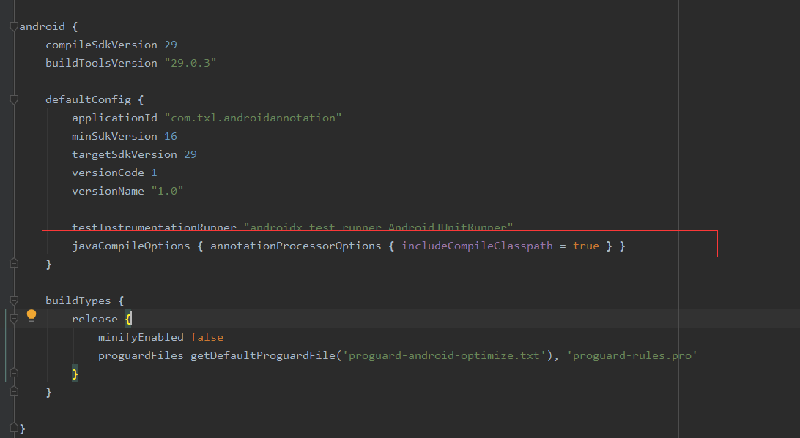

# 什么是注解？

注解也称为标注，它为我们在代码中添加信息提供了一种形式化的方法，使我们在稍后某个时候非常方便的使用这些数据。

# 为什么要学习注解？

在平时开发中经常遇到注解，比如 ：Room,ButterKnife它的原理是是我非常好奇的一部分。同时有助于我们更加深入的理解框架的运行机制。

# 注解的使用场景

每当你创建描述符性质的类或接口时，一旦其中包含了重复性的工作那么就可以考虑使用注解来简化与自动化该过程。

# 注解的基本语法

简单示例：

```java
@Target(ElementType.METHOD)
@Retention(RetentionPolicy.RUNTIME)
public @interface SimpleAnnotation {
}
```

```java
public class Test {
    
    @SimpleAnnotation
    public void simpleAnnotationTest(){
        
    }
}
```

注解 使用@interface进行定义，同时需要元注解来进行说明。比如@Target用来定义注解会用在哪些地方；@Retention用来定义注解在 那个级别可用。

注解中，一般都会包含元素以表示某些值。当分析处理注解时，程序或工具可以利用这些值。注解元素看起来就像是接口方法，但是我们可以指定其默认值。

```java
@Target(ElementType.METHOD)
@Retention(RetentionPolicy.RUNTIME)
public @interface UseCase {
    public int id() ;
    public String description() default "no description";
}
```

```java
public class PassWordUtils {
    @UseCase(id = 47, description = "password must contain at least one numeric")
    public boolean validatePassword(String password){
        return (password.matches("\\w*\\d\\w*"));
    }

    @UseCase(id = 48)
    public String encryptPassword(String password){
        return new StringBuilder(password).reverse().toString();
    }

    @UseCase(id = 49, description = "New password can't equal previously used ones")
    public boolean checkForNewPassword(List<String> prevPasswords, String password){
        return !prevPasswords.contains(password);
    }
}
```


## 元注解

java内置了三种标准注解，以及四种元注解。元注解专职负责注解其它的注解。

- @Target  表示该注解可以用在什么地方，ElementType参数包括
  - CONSTRUCTOR  构造器的声明
  - FILED 域声明
  - LOCAL_VARIABLE  局部变量声明
  - METHOD 方法声明
  - PACKAGE 包声明
  - PARAMETER 参数声明
  - TYPE  类、接口（包括注解类型）或 enum声明
- @Retention  表示要在什么级别保存该注解信息，可选的RetentionPolicy包括：
  - SOURCE ：注解将会被编译器 丢弃
  - CLASS : 注解在class文件中可用，但会被VM丢弃
  - RUNTIME： VM将在运行期也保留注解，因此可以通过反射机制读取注解信息。 

# 编写注解处理器

在使用注解的过程中很重要的一部分就是创建与使用注解处理器。java SE5 扩展了反射机制的API,以帮助程序员构造这类工具，同时，它还 提供一个外部工具apt帮助程序员解析带有注解的java源码。

示例：编写一个注解处理器，读取PasswordUtils类，并使用反射机制来查找 @UseCase标记。提供一组id值，然后它会列出在PasswordUtils中找到的用例，以及缺失的用例。

```java
public class UseCaseTracker {
    public static void trackUseCases(List<Integer> useCases, Class<?> cl){
        for (Method m :cl.getDeclaredMethods()){
            UseCase useCase = m.getAnnotation(UseCase.class);
            if(useCase != null){
                System.out.println("Found UseCase : "+useCase.id()+" "+useCase.description());
                useCases.remove(Integer.valueOf(useCase.id()));
            }
        }
        for (int i : useCases){
            System.out.println("Warning : Missing use case -  "+i);
        }
    }

    public static void main(String[] args){
        List<Integer> useCases = new ArrayList<>();
        Collections.addAll(useCases,47,48,49,50);
        trackUseCases(useCases,PassWordUtils.class);
    }
}
```

## 注解元素

标签@UseCase由UseCase.java定义，包含一个int元素id,一个String元素description。注解 元素 可以使用如下类型

- 所有基本类型（int, float, boolean等）
- String
- Class
- enum
- Annotation
- 以上类型的数组

**上面注解也可以作为元素类型，意味着注解可以嵌套。这个是一个非常有用的技巧**

## 元素默认值

元素默认值遵循下面的要求 

1. 不能有不确定的值，元素要么必须具有默认值，要么使用注解时提供元素的值。
2. 对于非基本类型的元素，不论是在源代码中声明或者在注解中定义默认值时，都不能以null作为其值。

## 生成外部文件

加入希望提供一些基本的对象/关系映射功能，能够自动生成数据库表用以存储JavaBean对象,可以考虑使用注解。

简单示例，通过注解生成数据库表。

1. 通过数据库声明表名

   ```java
   @Target(ElementType.TYPE)
   @Retention(RetentionPolicy.RUNTIME)
   public @interface DBTable {
       //通过注解声明数据库表名
       public String name() default "";
   }
   ```

2. 为修饰javaBean的域准备注解

   ```java
   @Target(ElementType.FIELD)
   @Retention(RetentionPolicy.RUNTIME)
   public @interface Constraints {
       boolean primaryKey() default false;
       boolean allowNull() default true;
       boolean unique() default false;
   }
   
   @Target(ElementType.FIELD)
   @Retention(RetentionPolicy.RUNTIME)
   public @interface SQLInteger {
       String name() default "";
       Constraints constraints() default @Constraints;
   }
   
   @Target(ElementType.FIELD)
   @Retention(RetentionPolicy.RUNTIME)
   public @interface SQLString {
       int value() default 0;
       String name() default "";
       Constraints constraints() default @Constraints;
   }
   ```

3. 定义javaBean，并运用上面的注解

   ```java
   @DBTable(name = "MEMBER")
   public class Member {
       @SQLString(30)
       String firstName;
       @SQLString(50)
       String laseName;
       @SQLInteger
       Integer age;
       @SQLString(value = 30,constraints = @Constraints(primaryKey = true))
       String handle;
   
       static int memberCount;
   
       public String getFirstName() {
           return firstName;
       }
   
       public String getLaseName() {
           return laseName;
       }
   
       public Integer getAge() {
           return age;
       }
   
       public String getHandle() {
           return handle;
       }
   }
   ```

## 实现处理器

示例，读取一个类文件，检查上面的数据库注解，并生成用来创建数据库的SQL命令：

```java
public class TableCreator {
    public static void main(String[] args) throws Exception{
        if(args.length < 1){
            System.out.println("arguments: annotation classes");
            System.exit(0);
        }
        for (String className : args){
            Class<?> cl = Class.forName(className);
            DBTable dbTable = cl.getAnnotation(DBTable.class);
            if(dbTable == null){
                System.out.println("No DbTable annotation in class "+className);
                continue;
            }
            String tableName = dbTable.name();
            //if the name is empty use class name
            if(tableName.length() < 1){
                tableName = cl.getName().toUpperCase();
            }
            List<String> columnDefs = new ArrayList<>();
            for (Field field:cl.getDeclaredFields()){
                String columnName = null;
                Annotation[] annotations = field.getAnnotations();
                if(annotations.length < 1){
                    continue;
                }
                if(annotations[0] instanceof SQLInteger){
                    SQLInteger sqlInteger = (SQLInteger) annotations[0];
                    //use the filed name if name not specified
                    if(sqlInteger.name().length() < 1){
                        columnName = field.getName().toUpperCase();
                    }else {
                        columnName = sqlInteger.name();
                    }
                    columnDefs.add(columnName + " INT"+getConstraints(sqlInteger.constraints()));
                }
                if(annotations[0] instanceof SQLString){
                    SQLString sqlString = (SQLString) annotations[0];
                    //use the filed name if name not specified
                    if(sqlString.name().length() < 1){
                        columnName = field.getName().toUpperCase();
                    }else {
                        columnName = sqlString.name();
                    }
                    columnDefs.add(columnName + " VARCHAR("+sqlString.value()+")"+getConstraints(sqlString.constraints()));
                }
                StringBuilder createCommand = new StringBuilder("CREATE TABLE "+tableName+"(");
                for (String columnDef : columnDefs){
                    createCommand.append("\n    "+columnDef+",");
                }
                String tableCreate = createCommand.substring(0,createCommand.length())+");";
                System.out.println("Table Creation SQL for "+className+" is : \n"+tableCreate);

            }
        }
    }

    private static String getConstraints(Constraints con){
        String constraints = "";
        if(!con.allowNull()){
            constraints += " NOT NULL";
        }
        if(con.primaryKey()){
            constraints += " PRIMARY KEY";
        }
        if(con.unique()){
            constraints += " UNIQUE";
        }
        return constraints;
    }

}
```

# 使用apt处理注解

到目前为止，我们都是通过自己调用main方法来处理注解，显然与我们使用的框架场景不相同，那么它们到底是如何使用注解的呢？或许在apt中我们能够找到答案。

apt是sun为了帮助注解的处理过程而提供的工具，apt被设计为操作源文件，而不是编译后的类。apt会在处理完源文件后编译它们。如果在系统的构建过程中会自动创建一些源文件，那么这个特性非常有用。

在java编程思想中基于java se5 通过AnnotationProcessor和AnnotationProcessorFactory来进行对应的注解处理，但是这些类在java8中已经被废弃 。对应的处理方式如下。

[使用Java 8 新类进行注解]: https://blog.csdn.net/xx326664162/article/details/75947735?utm_medium=distribute.pc_relevant.none-task-blog-BlogCommendFromMachineLearnPai2-2.nonecase&amp;depth_1-utm_source=distribute.pc_relevant.none-task-blog-BlogCommendFromMachineLearnPai2-2.nonecase

因为我是用的是 jdk1.8，直接采用了新的方式。

网上有一个教程将在AndroidStudio上使用注解说的比较清楚。

[]: https://blog.csdn.net/dapangzao/article/details/75549461	"Android 编译时注解"

但是需要注意的是在新版的androidStudio需要在app的build.gradle中的defaultConfig中添加下面的代码。

```gradle
javaCompileOptions { annotationProcessorOptions { includeCompileClasspath = true } }
```



需要注意的是新的注解使用不再是java编程思想中的实现AnnotationProcessor接口，而是集成抽象类AbstractProcessor。我们必须要实现process方法，在这里可以处理注解相关的信息。

下面是我copy网上的示例，编写的代码。

https://github.com/xiaolutang/annotationLearn.git

# 分析ButterKnife的注解实现

