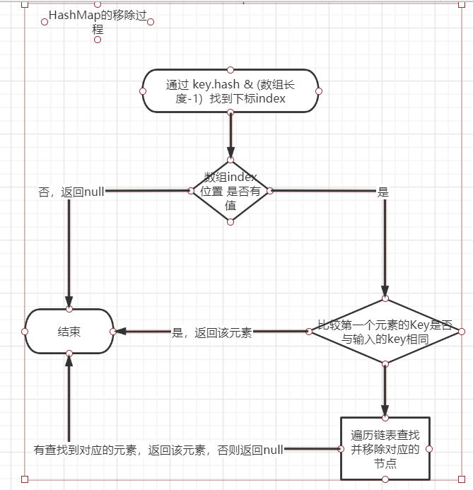

## HashMap的存储结构

### 什么是hash值

> **定义**
>
> 我所理解的哈希是指一个过程，这个过程就是把任意长度的输入，通过哈希算法，变换成固定长度的输出，所输出的称为哈希值。这种变换是一种压缩映射，也即哈希值所占的空间一般来说远小于输入值的空间，不同的输入可能会哈希出相同的输出。
>
> **哈希函数、算法**
>
> 哈希算法将任意长度的二进制值映射为较短的固定长度的二进制值，这个小的二进制值称为哈希值。哈希值是一段数据唯一且极其紧凑的数值表示形式。如果散列一段明文而且哪怕只更改该段落的一个字母，随后的哈希都将产生不同的值。要找到散列为同一个值的两个不同的输入，在计算上是不可能的，所以数据的哈希值可以检验数据的完整性。一般用于快速查找和加密算法 ---《数据结构与算法分析》
>
> **哈希值的特点是:** 是否需要这个？
>
> 对于同一个对象如果没有被修改（使用equals比较返回true）那么无论何时它的hashcode值都是相同的
>
> 对于两个对象如果他们的equals返回false,那么他们的hashcode值也有可能相等

### 链表结构

```java
static class Node<K,V> implements Map.Entry<K,V> {
        final int hash;
        final K key;
        V value;
        Node<K,V> next;
    }
```

可以看到Node是一个静态内部内，它不仅包含了当前节点的hashcode值、key、value。而且还有有下一个节点的引用。

### 红黑树结构

关于红黑树的结构因为水平限制，暂时不分析。以后专门学习一下这个数据结构。

## HashMap的插入，修改过程

HashMap的插入最终会调用putVal

```java
final V putVal(int hash, K key, V value, boolean onlyIfAbsent,
                   boolean evict) {
        Node<K,V>[] tab; Node<K,V> p; int n, i;
    //如果hash数组为空或者长度为0，调用resize为数组重新分配空间
        if ((tab = table) == null || (n = tab.length) == 0)
            n = (tab = resize()).length;
    //i = (n - 1) & hash n为hash表的长度，这个操作能够保证查找一定在数组范围内。
    //如果节点为空，创新一个新的节点
        if ((p = tab[i = (n - 1) & hash]) == null)
            tab[i] = newNode(hash, key, value, null);
        else {
          //hash表有冲突，处理冲突
            Node<K,V> e; K k;
            //判断第一个Node是不是需要查找的node
            if (p.hash == hash &&
                ((k = p.key) == key || (key != null && key.equals(k))))
                e = p;
            else if (p instanceof TreeNode)//如果当前的节点是红黑树节点，调用它的插入方式
                e = ((TreeNode<K,V>)p).putTreeVal(this, tab, hash, key, value);
            else {
                //循环遍历当前位置
                for (int binCount = 0; ; ++binCount) {
                    if ((e = p.next) == null) {//如果链表后续为空，直接将新插入的值放在链表尾部
                        p.next = newNode(hash, key, value, null);
                        //链表长度大于6转换成红黑树
                        if (binCount >= TREEIFY_THRESHOLD - 1) // -1 for 1st
                            treeifyBin(tab, hash);
                        break;
                    }
                    //如果有相同的key,遍历结束
                    if (e.hash == hash &&
                        ((k = e.key) == key || (key != null && key.equals(k))))
                        break;
                    p = e;
                }
            }
            if (e != null) { // existing mapping for key
                V oldValue = e.value;
                if (!onlyIfAbsent || oldValue == null)
                    //替换原来的值
                    e.value = value;
                afterNodeAccess(e);
                return oldValue;
            }
        }
        ++modCount;
        if (++size > threshold)//如果当前大小大于门限，门限原本是初始容量*0.75  
            resize();//进行两倍扩容。
        afterNodeInsertion(evict);
        return null;
    }
```

从插入过程我们可以得出下面的结论：

1. HashMap内存通过数组+链表的形式进行数据存储
2. HashMap Key相同必须满足下面的条件 hash值相同 并且 内存地址和equals必须有一个相同。因为内存地址我们没有办法控制所以 hashCode和equals需要同时重写。
3. HashMap链表的插入是放在最后的
4. 在链表长度大于6的时候会将链表转换成红黑树。
5. 当HashMap的长度大于门限值得时候会出发扩容。这个门限值会随着HashMap的大小不断变化。

## HashMap元素的删除

元素的删除过程比较简单,这里就不粘贴代码了。具体的逻辑如下



## HashMap元素查找

查找最终会调用getNode方法。

```java
final Node<K,V> getNode(int hash, Object key) {
        Node<K,V>[] tab; Node<K,V> first, e; int n; K k;
        if ((tab = table) != null && (n = tab.length) > 0 &&
            (first = tab[(n - 1) & hash]) != null) {
            if (first.hash == hash && // always check first node
                ((k = first.key) == key || (key != null && key.equals(k))))
                return first;
            if ((e = first.next) != null) {
                if (first instanceof TreeNode)
                    return ((TreeNode<K,V>)first).getTreeNode(hash, key);
                do {
                    if (e.hash == hash &&
                        ((k = e.key) == key || (key != null && key.equals(k))))
                        return e;
                } while ((e = e.next) != null);
            }
        }
        return null;
    }
```

查找的过程比较简单：首先根据hash值计算出数组的位置，如果第一个元素匹配则返回第一个元素，否则判断第一个元素是不是红黑树节点，是则使用红黑树进行查找，不是则根据key遍历链表直到查找到匹配的元素。

## HashMap扩容

hashMap的扩容是通过resize函数来进行。

```java
final Node<K,V>[] resize() {
        Node<K,V>[] oldTab = table;
    //原来数组的长度
        int oldCap = (oldTab == null) ? 0 : oldTab.length;
    //数组扩容的门限值，一般情况下超过这个值就会触发扩容
        int oldThr = threshold;
        int newCap, newThr = 0;
        if (oldCap > 0) {//数据已经存在
            if (oldCap >= MAXIMUM_CAPACITY) {//原来数组的长度超过最大长度，不能进行扩容
                threshold = Integer.MAX_VALUE;
                return oldTab;
            }
            else if ((newCap = oldCap << 1) < MAXIMUM_CAPACITY &&
                     oldCap >= DEFAULT_INITIAL_CAPACITY)//原数组长度的2倍不能超过数组最大值，且原始长度大于等于16，新门限值为原来的2倍。新的数组长度是原来的2倍
                newThr = oldThr << 1; // double threshold
        }
        else if (oldThr > 0) // initial capacity was placed in threshold
            newCap = oldThr;
        else {               // zero initial threshold signifies using defaults
            newCap = DEFAULT_INITIAL_CAPACITY;
            newThr = (int)(DEFAULT_LOAD_FACTOR * DEFAULT_INITIAL_CAPACITY);
        }
        if (newThr == 0) {
            float ft = (float)newCap * loadFactor;
            newThr = (newCap < MAXIMUM_CAPACITY && ft < (float)MAXIMUM_CAPACITY ?
                      (int)ft : Integer.MAX_VALUE);
        }
        threshold = newThr;
        @SuppressWarnings({"rawtypes","unchecked"})
            Node<K,V>[] newTab = (Node<K,V>[])new Node[newCap];
        table = newTab;
        if (oldTab != null) {
            for (int j = 0; j < oldCap; ++j) {
                Node<K,V> e;
                if ((e = oldTab[j]) != null) {
                    oldTab[j] = null;
                    if (e.next == null)
                        newTab[e.hash & (newCap - 1)] = e;
                    else if (e instanceof TreeNode)
                        ((TreeNode<K,V>)e).split(this, newTab, j, oldCap);
                    else { // preserve order
                        Node<K,V> loHead = null, loTail = null;
                        Node<K,V> hiHead = null, hiTail = null;
                        Node<K,V> next;
                        do {
                            next = e.next;
                            if ((e.hash & oldCap) == 0) {
                                if (loTail == null)
                                    loHead = e;
                                else
                                    loTail.next = e;
                                loTail = e;
                            }
                            else {
                                if (hiTail == null)
                                    hiHead = e;
                                else
                                    hiTail.next = e;
                                hiTail = e;
                            }
                        } while ((e = next) != null);
                        if (loTail != null) {
                            loTail.next = null;
                            //存放与原来数组相同的角标  j == e.hash & (oldCap -1) ==  e.hash & (2  * oldCap -1)
                            newTab[j] = loHead;
                        }
                        if (hiTail != null) {
                            hiTail.next = null;
                            //e.hash & (oldCap -1) + oldCap == e.hash & (2 * oldCap -1)
                            newTab[j + oldCap] = hiHead;
                        }
                    }
                }
            }
        }
        return newTab;
    }
```

这个动态扩容的过程还是比较 有意思的。这里决定仔细分析下。在扩容的时候根据节点的下标的计算方式index = hash & (数组长度 - 1)，在扩容的时候如果发现原来的下标中的数据是一个链表，常见能想到的做法是什么呢？

直接 遍历链表上的元素 通过 index = hash & (数组长度 - 1) 计算出新的角标，直接参考put进行赋值操作。但是HashMap却不是这样的。

HashMap的操作如下：

**依据hash & 原来的数组长度 == 0 是否为真组成两个链表，如果hash & 原来的数组长度 == 0为 真那么新数组中的角标与原数组的角标相同，否则新数组的角标为原数组角标+原数组长度。**

那么这个结论是否正确呢？

因为hashmap的默认初始化长度为16，我们这里以16的 二进制表示为基础进行探究

| 数字X范围 | 二进制范围           | 与16进行&运算是否为0 | 与15进行&运算结果比较与31进行&运算结果 |
| --------- | -------------------- | -------------------- | -------------------------------------- |
| 0-15      | 0,0000 ~ 0,1111      | 是                   | 相同                                   |
| 16-31     | 1,0000 ~ 1,1111      | 不是                 | X & 15 + 16 = X & 31                   |
| 32-47     | 10,0000 ~ 10,1111    | 是                   | 相同                                   |
| 48-63     | 11,0000 ~ 11,1111    | 不是                 | X & 15 + 16 = X & 31                   |
| 64-79     | 100,0000 ~ 100,1111  | 是                   | 相同                                   |
| 80-95     | 101,0000  ~ 101,1111 | 不是                 | X & 15 + 16 = X & 31                   |
| 96-111    | 110,0000 ~ 110,1111  | 是                   | 相同                                   |
| 112-127   | 111,0000 ~ 111,1111  | 不是                 | X & 15 + 16 = X & 31                   |
| ....      | ....                 |                      |                                        |

可以看出：

数字X  / 16 为奇数  X & 16 = X & 31

数字X / 16 为偶数  X & 16 + 16 = X & 31

推广结论：

1. **对于一个已知数 M=2^n,n大于等于1。如果有 一个未知数 X , X/M 为奇数，那么数字M转换成2进制从左到右的第n+1个位置必为1； X/M 为偶数，那么数字M转换成2进制从左到右的第n+1个位置必为0。**
2. **对于一个已知数 M,M>=2且M为2的幂次方，如果有 一个未知数 X , 一旦 X & M 等于0成立，那么 X &(M-1) = X &(2 * M -1)；否则X & （M-1） + M = X & (2 * M -1)**


## HashMap如何判断Key相同

hashMap比较相同有两个判断条件

1. 通过HashMap函数hash的得到的hash值相同

   ```java
   static final int hash(Object key) {
           int h;
           return (key == null) ? 0 : (h = key.hashCode()) ^ (h >>> 16);
       }
   ```

   

2. key的内存地址相同或者 key的equals函数返回true

