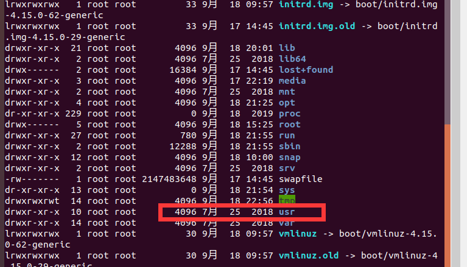
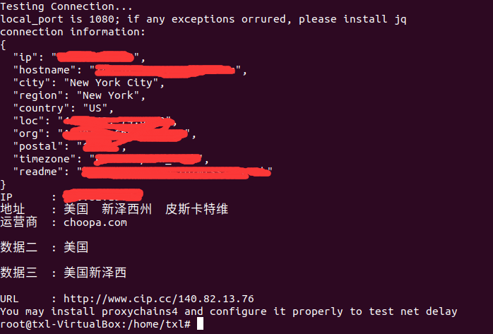
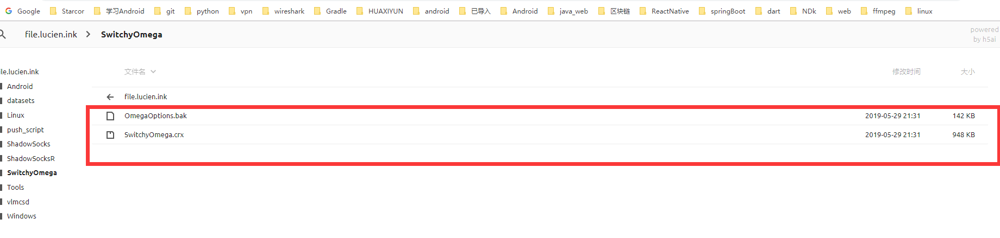
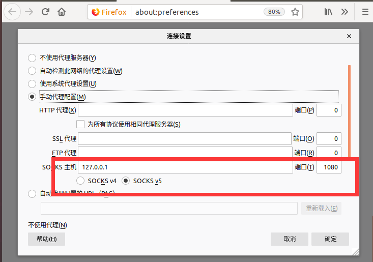

# 安装ssr客户端

最近想要使用linux来编译一些android中要用到库，于是使用virtualbox 装了ubuntu虚拟机。每次下载东西都是先下到windows在copy到虚拟机感觉十分麻烦。于是就想能不能在linux中直接使用ssr客户端直接来访问外网。

我们知道在Window中有直接可执行的ssr客户端，但是在linux中我们又找到这样的应用程序。

在网上流传着这样的一个脚本可以使用ssr

```sh
#!/bin/bash
# 作者：老徐
# SSR免费分享网站（所有帐号均来源于网上别人的分享）：http://ss.pythonic.life
# 源代码主页：https://github.com/the0demiurge
# 访问https://github.com/the0demiurge/CharlesScripts/blob/master/charles/bin/ssr获取本脚本的最新版
# 使用方法：把该脚本放到$PATH里面并加入可执行权限就行（比如说放到/usr/local/bin）
# 首次使用输入ssr install后安装时会自动安装到 $HOME/.local/share/shadowsocksr
# 输入ssr config进行配置，输入JSON格式的配置文件
# 输入ssr uninstall卸载
# 输入ssr help 展示帮助信息

set -e
if [ -z "$EDITOR" ]; then
    EDITOR=vi
fi

WEBSITE=http://ss.pythonic.life
BRANCH=manyuser
GIT_REPO=https://github.com/shadowsocksrr/shadowsocksr.git
INSTALL_PATH=$HOME/.local/share/shadowsocksr

ssr_help() {
    echo ShadowSocksR python client tool
    echo -e if you have not installed ssr, run \`ssr install\` first
    echo Usage:
    echo -e "\t" "ssr help"
    echo -e "\n" "Install/Uninstall"
    echo -e "\t" "ssr install      install shadowsocksr client"
    echo -e "\t" "ssr uninstall    uninstall shadowsocksr client"
    echo -e "\n" "Config and Subscribe"
    echo -e "\t" "ssr update       update subscription from $WEBSITE"
    echo -e "\t" "ssr config       edit config.json"
    echo -e "\t" "ssr xclip        paste configs from clipboard to config.json"
    echo -e "\n" "Start/Stop/Restart"
    echo -e "\t" "ssr start        start the shadowsocks service"
    echo -e "\t" "ssr stop         stop the shadowsocks service"
    echo -e "\t" "ssr restart      restart the shadowsocks service"
    echo -e "\n" "Testing and Maintenance"
    echo -e "\t" "ssr test         get ip from cip.cc using socks5 proxy"
    echo -e "\t" "ssr log          cat the log of shadowsocks"
    echo -e "\t" "ssr shell        cd into ssr installation dir"
    echo -e "\t" "ssr clean        clean ssr configuration backups"
}

ssr_install() {
    git clone -b $BRANCH $GIT_REPO $INSTALL_PATH
    echo -e "Install finished!\nYou can visit my website $WEBSITE to acquire free ssr configs"
}

ssr_uninstall() {
    echo "Danger! are you to remove $INSTALL_PATH forever?(y/N)"
    read doit
    if [ $doit == 'y' ]; then rm -rvf $INSTALL_PATH; fi
}

ssr_test() {
    echo Testing Connection...
    if [[ ! -z $(which jq 2>/dev/null) ]]; then
        echo 'jq in use'
        PORT=$(jq .local_port $INSTALL_PATH/config.json)
    else
        PORT=$(sed -r 's/\/\/.*$|\s+//g' $INSTALL_PATH/config.json | grep -oP '(?<!//)(?<="local_port":)\d+')
        echo "local_port is $PORT; if any exceptions orrured, please install jq"
    fi

    echo 'connection information:'
    curl ipinfo.io --socks5 localhost:$PORT
    echo
    curl cip.cc --socks5 localhost:$PORT

    if [ $? == 0 ]; then
        if [[ -z $(which proxychains4 2>/dev/null) ]]; then
            echo "You may install proxychains4 and configure it properly to test net delay"
        else
            echo -e '\nChecking delay...'
            proxychains4 ping -c 5 cip.cc
        fi
    fi
}

ssr_start() {
    cd $INSTALL_PATH/shadowsocks/
    python local.py -d start --pid-file=$INSTALL_PATH/ssr.pid --log-file=$INSTALL_PATH/ssr.log
    sleep 1
    ssr_test
}

ssr_stop() {
    cd $INSTALL_PATH/shadowsocks/
    python local.py -d stop --pid-file=$INSTALL_PATH/ssr.pid --log-file=$INSTALL_PATH/ssr.log
}

ssr_restart() {
    ssr_stop
    ssr_start
}

ssr_config() {
    $EDITOR $INSTALL_PATH/config.json
    ssr_restart
}

BLOCKED='
Update failed! For more information, see
https://github.com/the0demiurge/ShadowSocksShare-OpenShift/issues/17
And edit `$WEBSITE` in this script.'

ISSUE='
The response was empty, try it 10 mins later or report it on
https://github.com/the0demiurge/CharlesScripts/issues'

ssr_update() {
    JSON=$(curl -L $WEBSITE/json)
    # If failed
    case $? in
    0) ;;
    *)
        echo -e $BLOCKED
        exit $?
        ;;
    esac

    # If json is empty
    case $JSON in
    'Not Found')
        echo -e $BLOCKED
        exit $?
        ;;
    '' | '{}')
        echo $ISSUE
        exit 2
        ;;
    esac

    mv $INSTALL_PATH/config.json $INSTALL_PATH/config.json.bak.$(date +%y-%m-%d-%T)
    echo -e "$JSON" | tee $INSTALL_PATH/config.json
    ssr_restart
    echo -e "Updated from $WEBSITE"
}

ssr_xclip() {
    xclip -o | tee $INSTALL_PATH/config.json
    ssr_restart
}

ssr_log() {
    tail -f $INSTALL_PATH/ssr.log
}

ssr_shell() {
    cd $INSTALL_PATH
    $SHELL
}

ssr_clean() {
    rm -ri $INSTALL_PATH/config.json.bak.*
}

ssr_main() {
    case $1 in
    help) ssr_help ;;
    install) ssr_install ;;
    uninstall) ssr_uninstall ;;
    update) ssr_update ;;
    config) ssr_config ;;
    xclip) ssr_xclip ;;
    start) ssr_start ;;
    stop) ssr_stop ;;
    restart) ssr_restart ;;
    test) ssr_test ;;
    log) ssr_log ;;
    shell) ssr_shell ;;
    clean) ssr_clean ;;
    *) ssr_help ;;
    esac
}

ssr_main $1
```

由于本身对linux知识了解的很少在执行脚本的过程中遇见了很多的问题.

1. 把该脚本放到$PATH里面并加入可执行权限就行（比如说放到/usr/local/bin）

   我们装好ubuntu虚拟机，打开终端切换到root用户（新安装的不能直接切换，具体操作自行google）。这个时候在home/用户名  目录下。

   我们可以通过 两次 cd.. 命令 进入到根目录 在通过 ls -l 命令可以看到根目录下的所有文件其中的usr就是我们要找的。

   

   看这个的目的只是要知道我们的文件放在哪个位置。

   执行下面命令  ：

   ```bash
   vi /usr/local/bin/ssr
   ```

   对于vi/vim不熟悉可以自行搜索、将脚本内容粘贴进来。按下键盘 esc 键 输入 :wq

   给脚本添加可执行权限：

   ```
   chmod +x /usr/local/bin/ssr
   ```

   接下来的内容就简单了按照脚本上面的注释执行

   ```
   ssr install
   ssr config
   ```

   执行ssr config时我们会看到下面的内容：

   ```bash
   {
       "server": "0.0.0.0",
       "server_ipv6": "::",
       "server_port": 8388,
       "local_address": "127.0.0.1",
       "local_port": 1080,
       "password": "m",
       "method": "aes-128-ctr",
       "protocol": "auth_aes128_md5",
       "protocol_param": "",
       "obfs": "tls1.2_ticket_auth_compatible",
       "obfs_param": "",
       "speed_limit_per_con": 0,
       "speed_limit_per_user": 0,
       "additional_ports" : {}, // only works under multi-user mode
       "additional_ports_only" : false, // only works under multi-user mode
       "timeout": 120,
       "udp_timeout": 60,
       "dns_ipv6": false,
       "connect_verbose_info": 0,
       "redirect": "",
       "fast_open": false
   }
   ```

   修改信息，主要是: 

   ```bash
   "server_port":8388,        //端口
   "password":"password",     //密码
    "protocol":"origin",       //协议插件
    "obfs":"http_simple",      //混淆插件
    "method":"aes-256-cfb",    //加密方式   
   ```

   上面的具体内容还和你的ssr服务器有关。不同的ssr服务器上面的信息有所不同

   当编辑完成后同样的 按下键盘 esc 键 输入 :wq

   我们会看到输出如下结果

   

   看到上面的结果说明我们ssr客户端安装成功了，但是这个时候我们还不能够正常访问外网。

   

# 安装proxychains

前面我们已经安装成功了ssr客户端，接下来需要安装代理

执行下面的命令：

```
sudo apt install proxychains
```

配置proxychains

```
sudo vi /etc/proxychains.conf
```

将最后一行改成

```
socks5 127.0.0.1 1080
```

测试网络连接：

```
proxychains wget https://www.google.com
```

当上面的命令能够正常执行就说明可以连接外网了。

# 配置浏览器代理

## 配置chrome浏览器

进入 https://file.lucien.ink/SwitchyOmega  下载下面两个文件



在Chrome里打开`chrome://extensions`，把SwitchyOmega.crx文件拖放到扩展程序页面，点击添加扩展程序进行安装。

 打开SwitchyOmega的设置页面，跳过设置向导，点击导入/导出、从备份文件恢复、找到OmegaOptions.bak打开，恢复完成后点击应用选项,可以点击扩展设置选择直连、代理还是自动切换。

## 配置火狐浏览器

打开菜单-->>首选项-->>网络设置




这样我们就可以在浏览器中愉快的使用外网了。