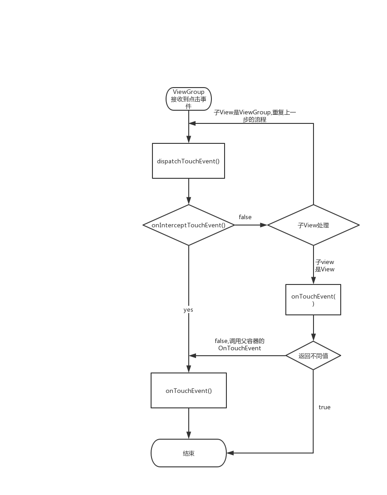

今天我们要学习的内容是《Android开发艺术探索》第三章View的事件体系。作者大致从五个方面进行知识的讲解。

# 基础知识的准备

作者为了让我们更加容易理解后续的知识，需要我们掌握几个和View相关的基础知识。

1. 什么是View?

   View是Android所有控件的基类，是一种界面的抽象。Android中的View可以分成两类，View和ViewGroup。整个界面通过ViewGroup包裹View和ViewGroup形成界面树。

2. View的位置参数

   View的位置主要由它的四个顶点来决定，分别对应top，left,right,bottom。这些坐标都是相对父容器来说的，top和bottom对应上边界，left和right对应左边界。效果图如下：

   

   从3.0开始View新加了几个额外的参数。x、y、translationX、translationY。他们和left的关系如下

   x = left + translationX

   y = top + translationY

   可以这样来理解他们的含义。

   translationX是View在水平放下上的平移距离。X是View在视觉上看起来相对父容器的位置。

   同样的在竖直方向上translationY是竖直方向上的移动距离，y是View在视觉上相对父容器的位置。

3. MotionEvent

   手指接触屏幕产生的一些列事件的封装，通过MotionEvent这个对象我们可以得到当前事件的X/Y坐标。系统提供了两种方法：getX/getY和getRawX/getRawY 他们的区别是getX/getY返回的是相对当前View左上角的X和Y坐标，而getRawX/getRawY返回的是相对手机屏幕左上角的X和Y坐标

4. TouchSlop

   系统所能识别的被认为是滑动的最小距离，这个值和设备有关，不同的设备可能值不同。

5. VelocityTracker

   速度追踪，用于计算滑动过程中的速度。

   使用的时候先计算在获取，不使用的时候需要调用clear来重置并回收内存。

6. GestureDetector

   手势识别

7. Scroller

   用于实现View弹性滑动

# 滑动&弹性滑动的实现

在Android滑动几乎是应用的标配，几乎所有的App都使用到了滑动。滑动的实现常见的有三种方式

## 使用ScrollTo/ScrollBy实现滑动

可以看看scrollTo和ScrollBy的源码实现

```java
	/**
     * Move the scrolled position of your view. This will cause a call to
     * {@link #onScrollChanged(int, int, int, int)} and the view will be
     * invalidated.
     * @param x the amount of pixels to scroll by horizontally
     * @param y the amount of pixels to scroll by vertically
     */
    public void scrollBy(int x, int y) {
        scrollTo(mScrollX + x, mScrollY + y);
    }
    
    **
     * Set the scrolled position of your view. This will cause a call to
     * {@link #onScrollChanged(int, int, int, int)} and the view will be
     * invalidated.
     * @param x the x position to scroll to
     * @param y the y position to scroll to
     */
    public void scrollTo(int x, int y) {
        if (mScrollX != x || mScrollY != y) {
            int oldX = mScrollX;
            int oldY = mScrollY;
            mScrollX = x;
            mScrollY = y;
            invalidateParentCaches();
            onScrollChanged(mScrollX, mScrollY, oldX, oldY);
            if (!awakenScrollBars()) {
                postInvalidateOnAnimation();
            }
        }
    }
```

可以看到ScrollBy最终调用的是scrollTo。ScrollBy实现相对位置滑动，scrollTo实现绝对位置滑动。View的滑动关键参数mScrollX和mScrollY可以通过getScrollX/getScrollY获取。mScrollX的值总是等于View左边缘和View内容左边在水平方向上的距离，mScrollY的值总是等于View上边缘和View内容上边在竖直方向上的距离。

从左向右滑mScrollX为负，反之为正。

从上往下滑mScrollY为负，反之为正。

记住 mScrollX/mScrollY = View的边界 - View内容的边界

ScrollTo/ScrollBy实现的是View内容的滑动。


## 使用动画

通过改变translationX/translationY来实现View的移动。移动的是View

## 改变布局参数

通过改变LayoutParams的margin来实现移动的效果。加入View右移100px我们需要将LayoutParams的marginLeft添加100px

## 三种滑动方式对比

ScrollTo/ScrollBy滑动的是View内容，使用简单。

动画实现复杂的动画效果，使用简单。

改变布局参数，操作复杂。


## 借助Scroller实现弹性滑动

典型使用方法：

```java
private Scroller mScroller = new Scroller(context)

//缓慢滚动到指定位置
private void smoothScrollTo(int destX, int destY){
	int scrollX = getScrollX();
	int deltax = destX - scrollX;
	mScroller.startScroll(scrollX,0,deltax,0,1000);
	invalidate()
}

@Override
public void computeScroll(){
	if(mScroller.computeScrollOffset()){
		scrollTo(mScroller.getCurrX(),mScroller.getCurrY());
		postInvalidate();
	}
}
```

Scroller的弹性滑动实现原理：

Scroller本身自己不能实现滑动，在调用startScroll()后需要更新View的界面（比如调用 invalidate），而更新界面会调用View的draw方法，draw方法会调用computeScroll。而computeScroll又会调用postInvalidate。这样一次一次反复调用最后实现滑动玩成。Scroller在滑动的过程中的功能是根据时间获取当前应该滑动的位置。

## 借助动画实现弹性滑动

动画本身就是一种渐进过程，可以非常方便的实现弹性滑动。其本质是在动画的改变过程中动态改变相关的属性。

比如translationX/Y 或者mScrollX/Y

## 使用延时策略实现弹性滑动

通过handler延时分多次滑动目标距离，比如1000ms中滑动100px，那么每100ms滑动10px知道滑动距离为100px

# View的事件分发机制

在Android中View的事件分发主要由几个方法完成：

dispatchTouchEvent() 事件分发。

onInterceptTouchEvent() 事件拦截。注意这个只有ViewGroup有这个方法。

onTouchEvent() 事件处理。

当事件传递到ViewGroup的disoatchTouchEvent时候,它会先判断自身是否需要拦截处理，如果需要进行拦截处理就自己处理，如果不拦截则交给它的子View（包含ViewGroup和View）处理，如果它的子View不处理，则它自身的onTouchEvent会被调用。



如上所示View的事件处理流程大概就是这样。

### 从源码中理解事件分发机制

ViewGroup 部分dispatchTouchEvent()代码

```java
// Check for interception.
final boolean intercepted;
if (actionMasked == MotionEvent.ACTION_DOWN || mFirstTouchTarget != null) {
    final boolean disallowIntercept = (mGroupFlags & FLAG_DISALLOW_INTERCEPT) != 0;
          if (!disallowIntercept) {
             intercepted = onInterceptTouchEvent(ev);
             ev.setAction(action); // restore action in case it was changed
           } else {
             intercepted = false;
           }
} else {
     // There are no touch targets and this action is not an initial down
     // so this view group continues to intercept touches.
     intercepted = true;
}
```

从这里我们可以看出ViewGroup在两种情况下会判断是否需要拦截当前事件，事件类型为ACTION_DOWN或mFirstTouchTarget不为空。ACTION_DOWN是指手指按下屏幕的那一瞬间，点击事件的开始。当ViewGroup的子元素处理成功时mFirstTouchTarget会被赋值并指向子元素。一旦ViewGroup拦截本次事件，mFirstTouchTarget会被置空，当ACTION_MOVE和ACTION_UP到来的时候。就不会再对是否拦截进行判断，并且同一系列事件的其他事件都会交给它处理。

从代码中我们也可以看到ViewGroup对事件的拦截还受mGroupFlags影响。如果mGroupFlags包含FLAG_DISALLOW_INTERCEPT那么ViewGroup不会对本次事件进行拦截。需要注意的是在ACTION_DOWN来临的时候ViewGroup会调用resetTouchState() 重置这个标志。

```java
private void resetTouchState() {
        clearTouchTargets();
        resetCancelNextUpFlag(this);
        mGroupFlags &= ~FLAG_DISALLOW_INTERCEPT;
        mNestedScrollAxes = SCROLL_AXIS_NONE;
    }
```

即一旦这个标志位被设置那么ViewGroup将无法拦截ACTION_DOWN以外的事件。

当ViewGroup不拦截事件的时候，事件会向下分发交给它的子View进行处理。在进行分发的过程中会调用到dispatchTransformedTouchEvent（）来进行处理。

```java
/**
     * Transforms a motion event into the coordinate space of a particular child view,
     * filters out irrelevant pointer ids, and overrides its action if necessary.
     * If child is null, assumes the MotionEvent will be sent to this ViewGroup instead.
     */
    private boolean dispatchTransformedTouchEvent(MotionEvent event, boolean cancel,
            View child, int desiredPointerIdBits) 
```

这里没有将代码全部贴出来，但是从方法的注释中我们可以简单的理解为，当参数child为空

# View的滑动冲突

# 嵌套滑动的实现

