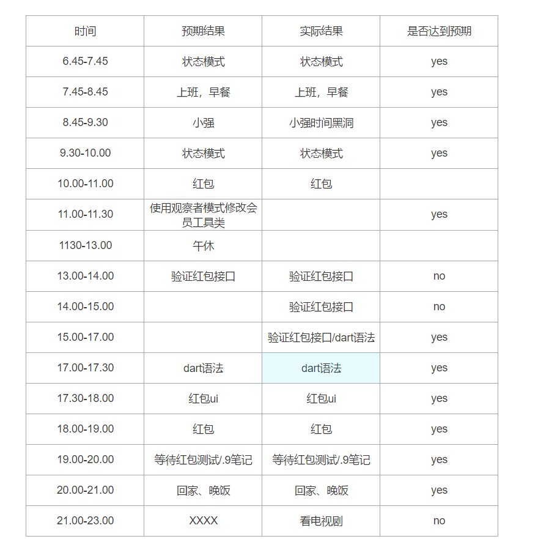

# 你真的很忙吗？

忙碌的分类：

- 假装很忙
- 确实很忙
  - 会自我管理，用20%的时间完成不会自我管理的人用80%的时间完成的事
  - 不会自我管理

## 时间统计表

看看你浪费了多少时间：

1. 在一张纸上写下自己认为分别花在“集中精力工作”、“无意义的浪费时间”、“正真的休息” 上的比例，比如：50%、30%、20%
2. 在纸上写下自己对“集中精力工作”、“无意义的浪费时间”、“正真的休息”的描述。
   1. 集中精力做事：心无杂念；进入忘我状态；效率很高
   2. 无意义的浪费时间：打开浏览器漫无目的的乱逛；各种纠结；无法集中精力；烦躁不安
   3. 正真的休息：打个盹，到楼下散步
3. 连续5个工作日，每隔一个小时记录下自己究竟处于哪个状态，从早上8点开始到晚上21点结束。
4. 在周六上午统计一下在过去70个小时中三种状态所占的时间比例。

|  时间/状态  | 集中精力做事 | 无意义的浪费时间 | 正真的休息 |
| :---------: | :----------: | :--------------: | :--------: |
|  8:00-9:00  |              |                  |            |
| 9:00-10:00  |              |                  |            |
| 10:00-11:00 |              |                  |            |
| 11:00-12:00 |              |                  |            |
| 12:00-13:00 |              |                  |            |
| 13:00-14:00 |              |                  |            |
| 15:00-16:00 |              |                  |            |
| 16:00-17:00 |              |                  |            |
| 17:00-18:00 |              |                  |            |
| 18:00-19:00 |              |                  |            |
| 19:00-20:00 |              |                  |            |
| 20:00-21:00 |              |                  |            |
| 21:00-22:00 |              |                  |            |

做这个统计表的目的：统计每天自己的时间消耗，清楚的分析每天的时间是怎么度过的。记得一定要坚持哦！

## 时间黑洞

**典型特点：**提供很多相互关联的信息吸引我们的注意力，使时间消耗在不知不觉中膨胀。

**产生原因：**大脑喜欢做简单的事情

**小练习：**记录自己一天的工作情况

1. 每隔一小时写出下一小时计划做的事情。
2. 一个小时之后记录下结果
3. 坚持一整天

# 如何记录和分析时间日志

时间运用分为：主动运用时间；被动运用时间。做事之前有预期，并且追求预期结果，这就是主动运用时间，否则就是被动运用时间，而时间黑洞就是被动运用时间的集合

对时间日志进行分析：

1. 完成了那些事
2. 按时完成的 ，按时完成的原因是什么？
3. 延时完成的，延时完成的原因是什么？
4. 没有完成的， 没有完成的原因是什么？

这个是我一天的时间日志：

可以看到这一天我一共完成了6件事：

1. 设计模式阅读+笔记
2. 小强升职记阅读+笔记
3. 项目的红包功能
4. 观察者模式修改会员工具类
5. dart语法+笔记
6. .9图笔记

**按时完成的有5件事：**阅读+笔记的方式学习是最近一直在做的事情，时间安排的比较充分能够完成。观察者模式处理的 问题因为以前阅读过类似的源码因此也能较快完成。

**延时完成的：**项目的红包功能，原因是时间预估不够准确，在开发的过程中才发现有许多的问题前面没有考虑到。花费时间较长接近7个小时。

**没有完成：**还有一件事情未完成，因为回到家里面看电视去了，导致事情没有做完。应该是自己的目标感不够强，需要培养即使回到家也要把自己的目标完成在休息。

分析时间日志的目标：寻找**高效时段**

时间黑洞由时间块聚集而成，就像滚雪球一样，一点一点的变大变多。获取你对写报告时聊天3分钟不以为然。但是，曾经有人做过实验：当你的注意力被打断的时候，如果想要重新集中注意力至少需要15分钟。时间黑洞不仅将被动时间吞噬，还将主动时间破坏。

避开时间黑洞的一些小建议：

- 做一张任务清单
- 尽量隔离自己
- 要事第一
- 无法集中精力时休息一会
- 设置任务的最后期限
- 关掉无关的聊天工具