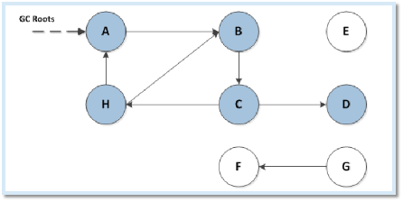

# 内存优化

## **java虚拟机运行时数据：**

- 线程私有

  - 程序计数器：

    相当于一个执行代码的指示器，用来确认下一行执行代码的地址；每一个线程都有；没有oom区

  - 虚拟机栈

    这块区域就是我们平常说的栈区；java虚拟机规范中定义了outofmemory和stackoverflow异常。

    对stackoverflow:每当java程序启动一个新的线程时，java虚拟机会为他分配一个栈，java栈以帧为单位保持线程运行状态；当线程调用一个方法是，jvm压入一个新的栈帧到这个线程的栈中，只要这个方法还没返回，这个栈帧就存在。 
    如果方法的嵌套调用层次太多(如递归调用),随着java栈中的帧的增多，最终导致这个线程的栈中的所有栈帧的大小的总和大于-Xss设置的值，而产生生StackOverflowError溢出异常。

  - 本地方法栈：java虚拟机规范中定义了outofmemory和stackoverflow异常。

  - 在hotspotVM把虚拟机栈和本地方法栈合为一个栈区

- 共享数据区

  - 方法区

    - ClassLoader加载类信息

      常量，静态变量

      编译后的代码

    - OOM

    - 运行时常量池：

      字面量public satic final  java常量,

      符号引用    类，接口全名，方法名

  - java堆

    - 虚拟机能管理的最大的一块内存   GC的主战场
    - OOM
    - 对象实例    数组的内容

## java常见的垃圾回收算法

**引用计数法**

给对象中添加一个引用计数器，每当有一个地方引用它时，计数器值就加1；当引用失效时，计数器值就减1；任何时刻计数器都为0的对象就是不再被使用的，垃圾收集器将回收该对象使用的内存。

引用计数算法实现简单，效率很高，微软的COM技术、ActionScript、Python等都使用了引用计数算法进行内存管理，但是引用计数算法对于对象之间相互循环引用问题难以解决，因此java并没有使用引用计数算法。

**可达性分析算法**

从GC Root作为起点开始搜索，那么整个连通图中对象都是活的，对于GC Root无法达到的对象便是垃圾对象，随时可被GC回收。

**垃圾回收和引用类型关系**

- 强引用
- 软引用：内存不足的时候进行回收
- 弱引用：gc的时候进行回收
- 虚引用：不对生存造成任何影响，用于跟踪gc的回收通知。