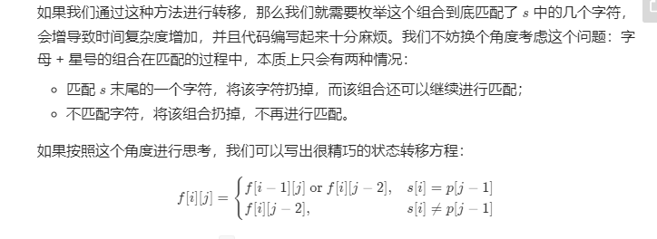
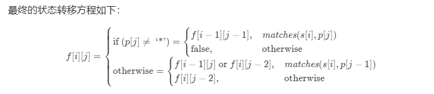

这是我参与更文挑战的第3天，活动详情查看： [更文挑战](https://juejin.cn/post/6967194882926444557)

# LeetCode刷题笔记 第10题正则表达式匹配

笔记重点，如何从自己的解题思路过度到动态规划

对于测试用例编写的一点思考方向。

题目地址：https://leetcode-cn.com/problems/regular-expression-matching/

题目描述：

> 给你一个字符串 s 和一个字符规律 p，请你来实现一个支持 '.' 和 '*' 的正则表达式匹配。
>
> '.' 匹配任意单个字符
> '*' 匹配零个或多个前面的那一个元素
> 所谓匹配，是要涵盖 整个 字符串 s的，而不是部分字符串。
>
>
> 示例 1：
>
> 输入：s = "aa" p = "a"
> 输出：false
> 解释："a" 无法匹配 "aa" 整个字符串。
> 示例 2:
>
> 输入：s = "aa" p = "a*"
> 输出：true
> 解释：因为 '*' 代表可以匹配零个或多个前面的那一个元素, 在这里前面的元素就是 'a'。因此，字符串 "aa" 可被视为 'a' 重复了一次。
> 示例 3：
>
> 输入：s = "ab" p = ".*"
> 输出：true
> 解释：".*" 表示可匹配零个或多个（'*'）任意字符（'.'）。
> 示例 4：
>
> 输入：s = "aab" p = "c*a*b"
> 输出：true
> 解释：因为 '*' 表示零个或多个，这里 'c' 为 0 个, 'a' 被重复一次。因此可以匹配字符串 "aab"。
> 示例 5：
>
> 输入：s = "mississippi" p = "mis*is*p*."
> 输出：false
>
> 提示：
>
> 0 <= s.length <= 20
> 0 <= p.length <= 30
> s 可能为空，且只包含从 a-z 的小写字母。
> p 可能为空，且只包含从 a-z 的小写字母，以及字符 . 和 *。
> 保证每次出现字符 * 时，前面都匹配到有效的字符

## 自己的题解：暴力递归求解

字符串匹配是一个逐步比较的过程，我们选择从右向左进行匹配比较。

每一组字符会存在下面的情况

s[i] = p[j]  匹配

s[i] != p[j]  p[j] = '.'   匹配

p[j]  = '*'  p[j-1] != s[j]  可以看做p[j-1]p[j]  两个字符匹配0个p[j-1] 

p[j]  = '*'  p[j-1] = s[j]  这个时候会假设s中有k个连续字符与p[j-1]相同，那么在这个位置就会有 k+2中匹配情况出现，在这些子情况中只要有一个s剩余子串与p的剩余子串想匹配，那么整个字符串s就与p相匹配。

```java
 public boolean solution1(String s, String p) {
        int sStart = s.length() - 1;
        int pStart = p.length() - 1;
        while (true) {
//            if(sStart < 0  && pStart >=0){//"" 可以和 "a*b*" 匹配
//                return false;
//            }
            if (sStart >= 0 && pStart < 0) {
                return false;
            }
            if (sStart < 0 && pStart < 0) {
                return true;
            }
            System.out.println( "输入：  " + s.substring(0,sStart+1) + "         " + p.substring(0,pStart+1) + "        " + sStart + "    " + pStart );
            Character pc = p.charAt( pStart );
            Character sc = sStart < 0 ? null : s.charAt( sStart );
            Character prePc = null;
            if (pStart - 1 >= 0) {
                prePc = p.charAt( pStart - 1 );
            }
            if (pc.equals( '*' )) {//遇到*就递归
                if (prePc != null && prePc.equals( '.' )) {
                    if (pStart == 1) {//当匹配字符串的长度
                        return true;
                    }
                    String np = p.substring( 0, Math.max( pStart - 1, 0 ) );
                    if(sc == null){
                        return solution1( "",np );
                    }else {
                        boolean result = false;
                        //编写测试用例的时候需要，尽可能的让测试用例走到每一个分支，并且测试对应的边界条件。
                        while (sStart >= -1) {//为什么是-1  因为当sStart 是0 的时候，表示匹配第一个字符没有被 .*匹配
                            result = solution1( s.substring( 0, sStart + 1 ), np );
                            sStart--;
                            if (result) {
                                break;
                            }
                        }
                        return result;
                    }
                } else if (prePc != null && !prePc.equals( sc )) {//前一个与当前值不等，直接跳过当前
                    pStart -= 2;
                    continue;
                } else {//当前那个数等于*之前的那个数
                    String np = p.substring( 0, Math.max( pStart - 1, 0 ) );
                    boolean result = false;
                    while (true) {
                        result = solution1( s.substring( 0, sStart + 1 ), np );//第一次一个都不匹配
                        if (result) {
                            break;
                        }
                        sStart--;
                        if (sStart < 0) {
                            result = solution1( "", np );//sStart < 0 时说明主串循环完毕
                            break;
                        }
                        sc = s.charAt( sStart );
                        if(!sc.equals( prePc )){
                            result = solution1( s.substring( 0, sStart + 1 ), np );//把相同的全部匹配完成
                            break;
                        }
                    }
                    return result;
                }
            }
            if (!pc.equals( sc ) && !pc.equals( '.' )) {
                return false;
            }
            if(sc == null){
                return false;
            }
            sStart--;
            pStart--;
        }
    }
```

## 官方题解：动态规划

在我们自己是用暴力递归的时候可以发现，字符串s和p的匹配情况是非后项依赖的，我们完全可以使用动态规划来进行处理，减少时间复杂度

### 模型建立

记得我们在刷第5题的时候学习过动态规划，https://juejin.cn/post/6969029763629318157/

动态规划三要素

- 状态转移方程

- 最优子结构

- 边界条件

**状态转移方程：**

`f[i][j]` 表示 `s` 的前 *i* 个是否能被 `p` 的前 *j* 个匹配

当 p[j] != '*'  时  (s[i] == p[j]  || p[j] == '.')  && f\[i-1]\[j-1]

当p\[j] == '*'  时   这个情况比较复杂也难以理解

官方说明



为了便于理解这里举一个简单的例子；

s = "caab"   p =  "ca\*b"   当 j = 2  时 各个i的情况如下：

1.  i = 0   s[0] != p[j-1]   &&  p[1] != '.'      p[1]  = a    即a\*  不能匹配 c  a* 直接被丢弃  它的匹配结果取决于   f\[0]\[0]  
2. i = 1  s[1] == p[1] || p[1] == '.'  此时  a\*  可以不匹配当前字符 结果就和  1 相同   当 a* 匹配当前字符的时候  结果就是f[i-1]\[j]


这样就可以得到官方的状态转移方程：



**最优子结构**：

根据状态转移方案我们可知最优子结构是根据p[j] 是否为 * 分情况讨论的。

**边界问题：**

因为s p 都可以为空因此 他们的边界是  其分别为空的匹配情况

### 代码编写

动态规划在进行数据存储的时候会有两种选中。

1. 将所有数据都存储下来
2. 只存储当前需要的依赖数据。

官方代码：

```java
public boolean isMatch(String s, String p) {
        int m = s.length();
        int n = p.length();

        boolean[][] f = new boolean[m + 1][n + 1];
        f[0][0] = true;
        for (int i = 0; i <= m; ++i) {
            for (int j = 1; j <= n; ++j) {
                if (p.charAt(j - 1) == '*') {
                    f[i][j] = f[i][j - 2];
                    if (matches(s, p, i, j - 1)) {
                        f[i][j] = f[i][j] || f[i - 1][j];
                    }
                } else {
                    if (matches(s, p, i, j)) {
                        f[i][j] = f[i - 1][j - 1];
                    }
                }
            }
        }
        return f[m][n];
    }

    public boolean matches(String s, String p, int i, int j) {
        if (i == 0) {
            return false;
        }
        if (p.charAt(j - 1) == '.') {
            return true;
        }
        return s.charAt(i - 1) == p.charAt(j - 1);
    }
```

## 总结：

1. 在做自己的暴力求解的问题得时候因为边界条件考虑不够清晰，导致反反复复的提交代码，造成了一定时间的浪费。在刷其它题目的时候一定要慢慢开始学会自己编写测试用例。实际开发的过程中不会有地方能够测试代码的正确性。
2. 使用动态规划解决该题目的难点在于状态转移方程的确立，对比自己的暴力递归 因为采取的是循环列举所有可能情况其时间复杂度O(n^m) n代表p的长度，没带白s的长度 原因是在遇到*的时候我们就开始递归，而本次递归的总个数在最坏情况下有m个，如果P 以字符\*不断间隔组成每一层递归都可能有p+2总可能，直到到达边界条件。所以我们在构建动态方程的时候需要尽可能的让其依赖项变少。

