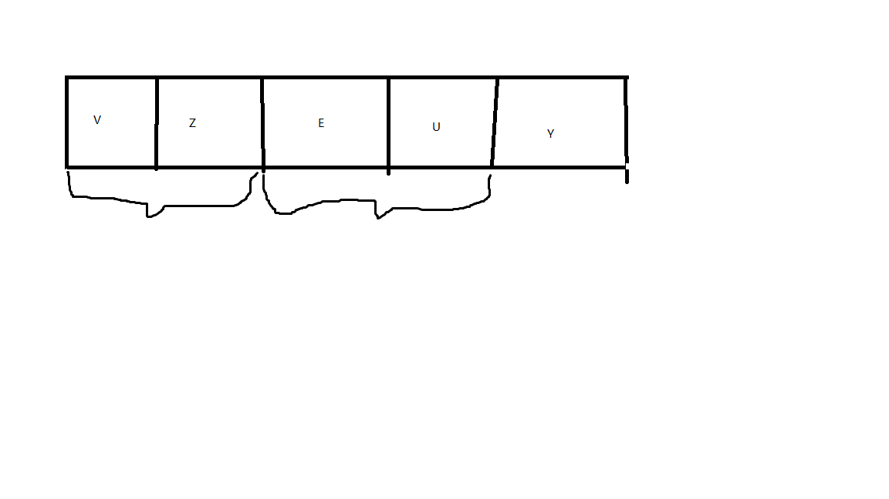
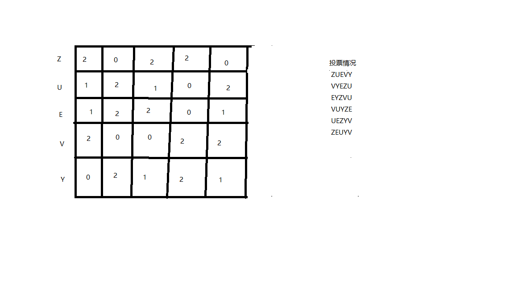

# LeetCode刷题笔记1366通过投票对团队排名

地址：https://leetcode-cn.com/problems/rank-teams-by-votes/

题目描述：

> 现在有一个特殊的排名系统，依据参赛团队在投票人心中的次序进行排名，每个投票者都需要按从高到低的顺序对参与排名的所有团队进行排位。
>
> 排名规则如下：
>
> 参赛团队的排名次序依照其所获「排位第一」的票的多少决定。如果存在多个团队并列的情况，将继续考虑其「排位第二」的票的数量。以此类推，直到不再存在并列的情况。
> 如果在考虑完所有投票情况后仍然出现并列现象，则根据团队字母的字母顺序进行排名。
> 给你一个字符串数组 votes 代表全体投票者给出的排位情况，请你根据上述排名规则对所有参赛团队进行排名。
>
> 请你返回能表示按排名系统 排序后 的所有团队排名的字符串。
>
>  
>
> 示例 1：
>
> 输入：votes = ["ABC","ACB","ABC","ACB","ACB"]
> 输出："ACB"
> 解释：A 队获得五票「排位第一」，没有其他队获得「排位第一」，所以 A 队排名第一。
> B 队获得两票「排位第二」，三票「排位第三」。
> C 队获得三票「排位第二」，两票「排位第三」。
> 由于 C 队「排位第二」的票数较多，所以 C 队排第二，B 队排第三。
> 示例 2：
>
> 输入：votes = ["WXYZ","XYZW"]
> 输出："XWYZ"
> 解释：X 队在并列僵局打破后成为排名第一的团队。X 队和 W 队的「排位第一」票数一样，但是 X 队有一票「排位第二」，而 W 没有获得「排位第二」。 
> 示例 3：
>
> 输入：votes = ["ZMNAGUEDSJYLBOPHRQICWFXTVK"]
> 输出："ZMNAGUEDSJYLBOPHRQICWFXTVK"
> 解释：只有一个投票者，所以排名完全按照他的意愿。
> 示例 4：
>
> 输入：votes = ["BCA","CAB","CBA","ABC","ACB","BAC"]
> 输出："ABC"
> 解释： 
> A 队获得两票「排位第一」，两票「排位第二」，两票「排位第三」。
> B 队获得两票「排位第一」，两票「排位第二」，两票「排位第三」。
> C 队获得两票「排位第一」，两票「排位第二」，两票「排位第三」。
> 完全并列，所以我们需要按照字母升序排名。
> 示例 5：
>
> 输入：votes = ["M","M","M","M"]
> 输出："M"
> 解释：只有 M 队参赛，所以它排名第一。
>
>
> 提示：
>
> 1 <= votes.length <= 1000
> 1 <= votes[i].length <= 26
> votes[i].length == votes[j].length for 0 <= i, j < votes.length
> votes[i][j] 是英文 大写 字母
> votes[i] 中的所有字母都是唯一的
> votes[0] 中出现的所有字母 同样也 出现在 votes[j] 中，其中 1 <= j < votes.length

## 题目分析：

题目阅读起来比较简单，总体而言就是对参赛人员进行排序，排序规则是先比较投票靠前的总个数，个数大的优先级高，最后比较字母顺序

## 自我题解：

为了节省循环次数，我们采取这样的思路，每一次循环记录本次排名的个数。

参赛人员 ：ZUEVY  投票情况如下。

投票情况如下：

 ZUEVY
 VYEZU
 EYZVU
 VUYZE
 UEZYV
 ZEUYV

1.第一次循环，遍历所有投票人的第一名情况：Z:2、V:2、E:1、U:1、 Y:0

因为存在投票总个数相等的情况，进行下一轮循环，查看所有投票者排名第二的情况，但是这里需要注意的是只有上一轮投票的value相同他们才会在第二轮循环中进行比较。



2.此时已经确认Y在最后的位置，VZ第二轮比较争夺前两位，EU争夺34位；

因为Y确定在最后一位，直接忽略不记，二轮结果如下

V:0、Z:0 ；U:2、E:2、

3.第二轮比较同样没有结果，进入第三轮。

V:0、Z:2; E:2、U:1

此时，结果比较出来了为 ZVEUY;

代码实现：

```java
private String solution1(String[] votes) {
        if (votes == null || votes.length == 0 || votes[0] == null || votes[0].length() == 0) {
            return "";
        }
        ArrayList<OrderNode> orderList = new ArrayList<>();
        int length = votes[0].length();
        for (int i = 0; i < length; i++) {
            orderList.add(new OrderNode(votes[0].charAt(i), 0));
        }
        sort(0, votes[0].length() - 1, orderList, 0, votes);
        StringBuilder sb = new StringBuilder();
        for (OrderNode o : orderList) {
            sb.append(o.character);
        }
        return new String(sb);
    }

    /**
     * @param start     需要进行排序处理的列表的开始坐标
     * @param end       需要进行排序处理的列表的结束坐标
     * @param orderList 需要进行排序的列表
     * @param position  votes[] 数组字符串第几个位置
     * @param votes     输入字符串
     */
    private void sort(int start, int end, ArrayList<OrderNode> orderList, int position, String[] votes) {
        if (start >= end) {
            return;
        }
        if (position >= votes[0].length()) {
            return;
        }
        TreeSet<OrderNode> treeSet = new TreeSet<>(new Comparator<OrderNode>() {
            @Override
            public int compare(OrderNode o1, OrderNode o2) {
                if (o1.value == o2.value) {
                    return o1.character - o2.character;
                }
                return o2.value - o1.value;
            }
        });
        HashMap<Character, OrderNode> orderNodeHashMap = new HashMap<>();
        for (int i = start; i <= end; i++) {
            OrderNode orderNode = orderList.get(i);
            orderNode.value = 0;
            orderNodeHashMap.put(orderNode.character, orderNode);
        }

        for (String s : votes) {
            Character character = s.charAt(position);
            if (orderNodeHashMap.containsKey(character)) {
                OrderNode orderNode = orderNodeHashMap.get(character);
                orderNode.value++;
                orderNodeHashMap.put(character, orderNode);
            }
        }
        treeSet.addAll(orderNodeHashMap.values());
        for (int i = start; i <= end; i++) {
            orderList.set(i, treeSet.pollFirst());
        }
        int lastValue = -1;
        int lastIndex = start;
        int count = 0;
        for (int i = start; i <= end; i++) {
            OrderNode orderNode = orderList.get(i);
            if (orderNode.value != lastValue) {
                sort(lastIndex, i - 1, orderList, position + 1, votes);//不相等，需要排序
                lastValue = orderNode.value;
                lastIndex = i;
                count = 0;
            } else {
                count++;
            }

        }
        if (count > 0) {
            sort(lastIndex, end, orderList, position + 1, votes);//不相等，需要排序
        }

    }

private static class OrderNode {
        Character character;
    	//保存投票总个数
        int value = 0;
        ArrayList<Integer> rank = new ArrayList<>();

        public OrderNode(Character character) {
            this.character = character;
        }

        public OrderNode(Character character, int value) {
            this.character = character;
            this.value = value;
        }

        @Override
        public boolean equals(Object obj) {
            if (obj instanceof OrderNode && this.character == ((OrderNode) obj).character) {
                return true;
            }
            return false;
        }

        @Override
        public int hashCode() {
            return character.hashCode();
        }
    }
```

## 官方题解：

官方的解题思路如下：构建一个二维数组，保存每一个排名总的投票情况。在依次比较确定排名

参赛人员 ：ZUEVY  投票情况如下。

投票情况如下：

 ZUEVY
 VYEZU
 EYZVU
 VUYZE
 UEZYV
 ZEUYV

其二维数组的结构如下：



因为已经有了所有位置的排名情况，我们在排序的时候可以直接使用就好。参考代码：

```java
private String solution2(String[] votes) {
        if (votes == null || votes.length == 0 || votes[0] == null || votes[0].length() == 0) {
            return "";
        }

        ArrayList<OrderNode> orderNodeArrayList = new ArrayList<>();
        String allUser = votes[0];
        for (int i=0;i<allUser.length();i++){//i是投票的人数
            orderNodeArrayList.add(new OrderNode(allUser.charAt(i)));
        }
        //比赛人数
        final int userCount = votes[0].length();
        for (int i=0; i<userCount;i++){//这里的userCount需要理解成排名
            for (String vote : votes) {
                char c = vote.charAt(i);
                int index = orderNodeArrayList.indexOf(new OrderNode(c));
                OrderNode orderNode = orderNodeArrayList.get(index);
                if(orderNode.rank.size() <= i){
                    while (orderNode.rank.size() <=i){
                        orderNode.rank.add( 0);
                    }
                }
                Integer integer = orderNode.rank.get(i);
                orderNode.rank.set(i, integer + 1);
            }
        }
        Collections.sort(orderNodeArrayList, new Comparator<OrderNode>() {
            @Override
            public int compare(OrderNode o1, OrderNode o2) {
                for (int i=0;i<o1.rank.size();i++){
                    if(!o2.rank.get(i).equals(o1.rank.get(i))){
                        return o2.rank.get(i) - o1.rank.get(i);
                    }
                }
                return o1.character-o2.character;
            }
        });

        StringBuilder sb = new StringBuilder();
        for (OrderNode o : orderNodeArrayList) {
            sb.append(o.character);
        }
        return new String(sb);
    }
```

明显可以看出我们自己的题解方案是要优于官方题解的，我们每一轮比较后只需要比较本次排名相同的位置，而官方题解使用暴力方案现将所有的信息遍历出来，在来进行比较。
代码参考地址：
https://github.com/xiaolutang/androidTool/blob/master/leetcode/src/main/java/com/txl/leetcode/sort/Solution1366.java