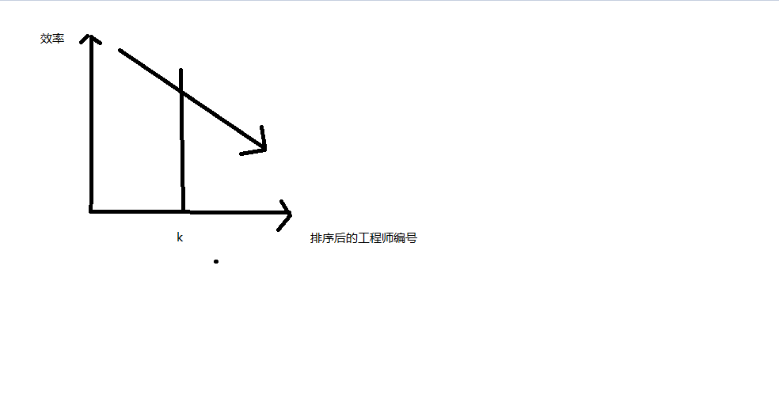

leetcode刷题笔记之1383--最大团队表现值


leetcode 地址：https://leetcode-cn.com/problems/maximum-performance-of-a-team/

**解题思路来自leetcode官方题解，在这里做记录只是为了更加深刻的理解官方的解题思路。**

题目描述：

公司有编号为 1 到 n 的 n 个工程师，给你两个数组 speed 和 efficiency ，其中 speed[i] 和 efficiency[i] 分别代表第 i 位工程师的速度和效率。请你返回由最多 k 个工程师组成的 最大团队表现值 ，由于答案可能很大，请你返回结果对 10^9 + 7 取余后的结果。

团队表现值 的定义为：一个团队中「所有工程师速度的和」乘以他们「效率值中的最小值」。

 

示例 1：

输入：n = 6, speed = [2,10,3,1,5,8], efficiency = [5,4,3,9,7,2], k = 2
输出：60
解释：
我们选择工程师 2（speed=10 且 efficiency=4）和工程师 5（speed=5 且 efficiency=7）。他们的团队表现值为 performance = (10 + 5) * min(4, 7) = 60 。
示例 2：

输入：n = 6, speed = [2,10,3,1,5,8], efficiency = [5,4,3,9,7,2], k = 3
输出：68
解释：
此示例与第一个示例相同，除了 k = 3 。我们可以选择工程师 1 ，工程师 2 和工程师 5 得到最大的团队表现值。表现值为 performance = (2 + 10 + 5) * min(5, 4, 7) = 68 。
示例 3：

输入：n = 6, speed = [2,10,3,1,5,8], efficiency = [5,4,3,9,7,2], k = 4
输出：72


提示：

1 <= n <= 10^5
speed.length == n
efficiency.length == n
1 <= speed[i] <= 10^5
1 <= efficiency[i] <= 10^8
1 <= k <= n


## 解题思路

这道题目有两个关键值 速度效率  ，采用定一动一的思路来进行处理。因为团队效率=所有选取工程师速度和 * 最小效率   我们选取效率做为一个定值，

定义一个数据结构  包含速度和效率

```java
private static class Engineer{
        /**
         * 速度，效率
         * */
        int speed;
        int efficiency;

        public Engineer(int speed, int efficiency) {
            this.speed = speed;
            this.efficiency = efficiency;
        }
    }
```

按照效率从高到低排序。依次计算最大团队效率。



我们假设工程师编号为m ，因为我们固定选取最后一个为最小的效率，问题就转换为选取在编号在 0到m-1的工程师中选取k-1个速度和最大的工程师（效率固定，速度和越大团队最大效率越大），然后加上第m个工程师求此时的团队最大效率。

代码：

```java
public int maxPerformance(int n, int[] speed, int[] efficiency, int k) {
        //解题思路，在最小效率确定的情况下，速度越快团队效率越高
        if(k == 0 || n == 0){
            return 0;
        }
        if(speed == null || efficiency == null || speed.length == 0 || efficiency.length == 0){
            return 0;
        }
        List<Engineer> engineers = new ArrayList<>();
        for (int i=0;i<speed.length;i++){
            engineers.add(new Engineer(speed[i],efficiency[i]));
        }
        Collections.sort(engineers,new Comparator<Engineer>(){
            @Override
            public int compare(Engineer o1, Engineer o2) {
                return o2.efficiency-o1.efficiency;
            }
        });
        //使用队列或者栈都可以，有序栈弹出最小值，有序队列取出最小值
        PriorityQueue<Engineer> queue = new PriorityQueue<Engineer>(new Comparator<Engineer>() {
            public int compare(Engineer staff1, Engineer staff2) {
                return staff1.speed - staff2.speed;
            }
        });
       // ans 团队效率， sum 速度和
        long ans = 0, sum = 0;
        for (Engineer engineer:engineers){
            long minE = engineer.efficiency;
            long sumS = sum + engineer.speed;
            ans = Math.max(ans, sumS * minE);
            queue.offer(engineer);
            sum += engineer.speed;
            queue.add(engineer);
            if(queue.size() == k){
                sum -= queue.poll().speed;
            }
        }
        final int MODULO = 1000000007;
        return (int) (ans % MODULO);
    }
```

代码：https://github.com/xiaolutang/androidTool/blob/master/leetcode/src/main/java/com/txl/leetcode/sort/Solution1383.java

## **扩展：**

**是否可以以速度排序呢？**

不能以速度来作为参考标准，假设速度一定我们如何求此时的最大团队效率？我们将最小的效率排除出去，但是可能最小编号的工程师效率最低，但是速度极快。此时并不能求出速度一定时的最大团队效率

**求团队最小效率？**

求团队最小效率与团队最大效率类似，我们只需要将效率按照升序排列，同时在最大的效率确定的情况下，速度和越小团队效率越小。


