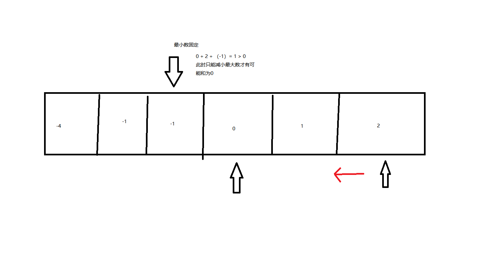

这是我参与更文挑战的第7天，活动详情查看： [更文挑战](https://juejin.cn/post/6967194882926444557)

题目地址：https://leetcode-cn.com/problems/3sum/

# 题目描述：

> 给你一个包含 n 个整数的数组 nums，判断 nums 中是否存在三个元素 a，b，c ，使得 a + b + c = 0 ？请你找出所有和为 0 且不重复的三元组。
>
> 注意：答案中不可以包含重复的三元组。
>
>  
>
> 示例 1：
>
> 输入：nums = [-1,0,1,2,-1,-4]
> 输出：[[-1,-1,2],[-1,0,1]]
> 示例 2：
>
> 输入：nums = []
> 输出：[]
> 示例 3：
>
> 输入：nums = [0]
> 输出：[]
>
>
> 提示：
>
> 0 <= nums.length <= 3000
> -105 <= nums[i] <= 105


# 暴力求解


step1:如何去除重复的？要使取出的三个数不重复，我们可以以依次取出三个有序的数a<=b<=c 这样因为a+b+c = 0。取数的思路是：

先取a,如果a与上一次a相同则跳过取下一个；

再取b， b在当前a之后的 如果b与上次的b相同则跳过取下一个

同理取c c如果与上一次的c相同则跳过。

step2:判断当前取出的三个数之和是否为0

因为当最小的数大于0时三数之和不可能为0，直接退出循环


参考代码：

```java
/**
     * 暴力求解
     */
    List<List<Integer>> solution1(int[] nums) {
        Arrays.sort(nums);
        int length = nums.length;
        int lastI = Integer.MAX_VALUE, lastJ, lastK;
        List<List<Integer>> arrayList = new ArrayList<>();
        for (int i = 0; i < length; i++) {
            if (lastI == nums[i]) {
                continue;
            }
            if(lastI > 0){
                break;
            }
            //进入下一轮循环的时候
            lastJ = Integer.MAX_VALUE;
            lastI = nums[i];
            for (int j = i + 1; j < length; j++) {
                if (lastJ == nums[j]) {
                    continue;
                }
                lastJ = nums[j];
                lastK = Integer.MAX_VALUE;
                for (int k = j + 1; k < length; k++) {
                    if (lastK == nums[k]) {
                        continue;
                    }
                    lastK = nums[k];
                    if (lastI + lastJ + lastK == 0) {
                        ArrayList<Integer> integerArrayList = new ArrayList<>();
                        integerArrayList.add(lastI);
                        integerArrayList.add(lastJ);
                        integerArrayList.add(lastK);
                        arrayList.add(integerArrayList);
                    }
                }
            }
        }
        System.out.println("solution1  size " + arrayList.size());
        return arrayList;
    }
```

# 双指针

优先取出最小数，当三数之和小于0是增加中间那个数，当三数之和大于0时减小最大数



参考代码：

```java
List<List<Integer>> solution2(int[] nums) {
        Arrays.sort(nums);
        List<List<Integer>> arrayList = new ArrayList<>();
        int lastI = Integer.MAX_VALUE;
        for (int i = 0; i < nums.length; i++) {
            if(nums[i] == lastI){
                continue;
            }
            lastI = nums[i];
            int start=i+1, end = nums.length - 1;
            int lastStart = Integer.MAX_VALUE;
            int lastEnd = Integer.MAX_VALUE;
            boolean changeStart = true;
            while (start<end){
                if(lastStart == nums[start] && changeStart){
                    start++;
                    continue;
                }
                if(lastEnd == nums[end] && !changeStart){
                    end--;
                    continue;
                }
                lastStart = nums[start];
                lastEnd = nums[end];
                int result = nums[i]+nums[start]+nums[end];
                if(result > 0){
                    changeStart = false;
                    end--;
                }else if(result < 0){
                    changeStart = true;
                    start++;
                }else {
                    ArrayList<Integer> integerArrayList = new ArrayList<>();
                    integerArrayList.add(nums[i]);
                    integerArrayList.add(nums[start]);
                    integerArrayList.add(nums[end]);
                    arrayList.add(integerArrayList);
                    start++;
                    changeStart = true;
                }
            }
        }
        return arrayList;
    }
```

