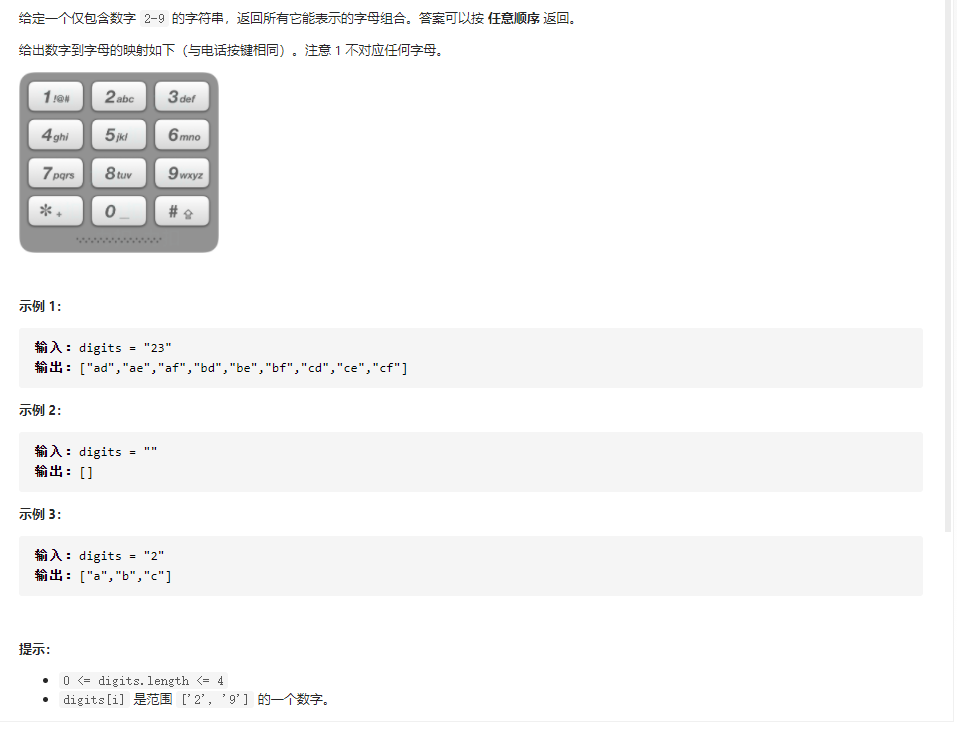
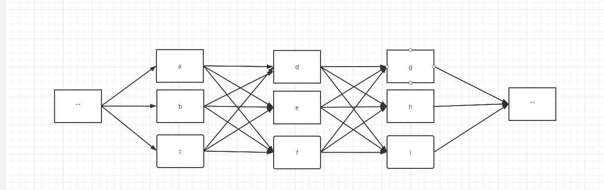
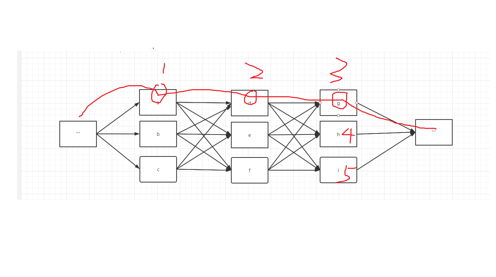

这是我参与更文挑战的第8天，活动详情查看： [更文挑战](https://juejin.cn/post/6967194882926444557)

题目地址：https://leetcode-cn.com/problems/letter-combinations-of-a-phone-number/

# 题目：电话号码的字母组合

题目描述：




# 暴力求解

因为需要所有可能的组合我们依次遍历输入数据，然后保存当前所有的可能，在与下一轮的数据进行组合生成新的结果。

以 “234” 为例



求234的所有可能字母组合就相当于求从一个空字符串开始到另一个空字符串结束的所有路径。当输入是2时，有3条路径，当输入是3时有3x3 = 9条路径，同理输入是4是有9x3 = 27 总。即我们需要保存上一步的所有可能结果，与输入的数字对应的字符进行两两组合构成新的结果。

代码：

```java
public List<String> letterCombinations1(String digits) {
        if(digits == null || digits.length() == 0){
            return new ArrayList<>();
        }
        ArrayList<String> result = new ArrayList<>();
        Map<Character, String> phoneMap = new HashMap<>();
        phoneMap.put('2', "abc");
        phoneMap.put('3', "def");
        phoneMap.put('4', "ghi");
        phoneMap.put('5', "jkl");
        phoneMap.put('6', "mno");
        phoneMap.put('7', "pqrs");
        phoneMap.put('8', "tuv");
        phoneMap.put('9', "wxyz");

        for (int i=0; i<digits.length(); i++){
            char c = digits.charAt(i);
            if(phoneMap.containsKey(c)){
                ArrayList<String> temp = new ArrayList<>();
                String current = phoneMap.get(c);
                int originLength = result.size();
                if(originLength == 0){
                    for (int j=0;j<current.length();j++){
                        result.add(""+current.charAt(j));
                    }
                }else {//假设原来是 输入23  此时数组中存在 a b c 三个字符串
                    for (int k=0;k<originLength;k++){//第一次循环后 ad ae af
                        String origin = result.get(k);
                        for (int j=0;j<current.length();j++){
                            result.add(origin+current.charAt(j));
                        }
                    }
                    result.subList(0, originLength).clear();
                }


            }
        }
        return result;
    }
```

# 官方题解：回溯

> 回溯过程中维护一个字符串，表示已有的字母排列（如果未遍历完电话号码的所有数字，则已有的字母排列是不完整的）。该字符串初始为空。每次取电话号码的一位数字，从哈希表中获得该数字对应的所有可能的字母，并将其中的一个字母插入到已有的字母排列后面，然后继续处理电话号码的后一位数字，直到处理完电话号码中的所有数字，即得到一个完整的字母排列。然后进行回退操作，遍历其余的字母排列。
>
> 回溯算法用于寻找所有的可行解，如果发现一个解不可行，则会舍弃不可行的解。在这道题中，由于每个数字对应的每个字母都可能进入字母组合，因此不存在不可行的解，直接穷举所有的解即可
>

官方代码：

```java
public List<String> letterCombinations(String digits) {
        List<String> combinations = new ArrayList<String>();
        if (digits.length() == 0) {
            return combinations;
        }
        Map<Character, String> phoneMap = new HashMap<Character, String>() {{
            put('2', "abc");
            put('3', "def");
            put('4', "ghi");
            put('5', "jkl");
            put('6', "mno");
            put('7', "pqrs");
            put('8', "tuv");
            put('9', "wxyz");
        }};
        backtrack(combinations, phoneMap, digits, 0, new StringBuffer());
        return combinations;
    }

    public void backtrack(List<String> combinations, Map<Character, String> phoneMap, String digits, int index, StringBuffer combination) {
        if (index == digits.length()) {
            combinations.add(combination.toString());
        } else {
            char digit = digits.charAt(index);
            String letters = phoneMap.get(digit);
            int lettersCount = letters.length();
            for (int i = 0; i < lettersCount; i++) {
                combination.append(letters.charAt(i));
                backtrack(combinations, phoneMap, digits, index + 1, combination);
                combination.deleteCharAt(index);
            }
        }
    }
```

# 官方思路与自己的思路对比（探究为什么我们的程序耗时长）



对比官方的思路同样的迭代循环官方的要比我们自己的快上不少，有下列的原因

1. 使用一个StringBuffer来存储数据，减少了中间过程产生的临时变量
2. 我们自己的循环方式时间复杂度 以 234为例的话， 总的训话次数是 3 + 3x3 + 9 x3  也就是说它是只有最后一轮循环的计算次数是3^mX4^n 相比于官方的实现方式多了很多的中间过程。因此速度较官方慢


# 题目额外的想法：
这个题目是否可以看做是一个树，而官方的遍历方式有点像树的前序遍历，我们自己的实现方式是层序遍历。可以把这个看做一个有向图，求的是起点到终点的所有可能的路径，如果加上权值就可以求最短路径了。