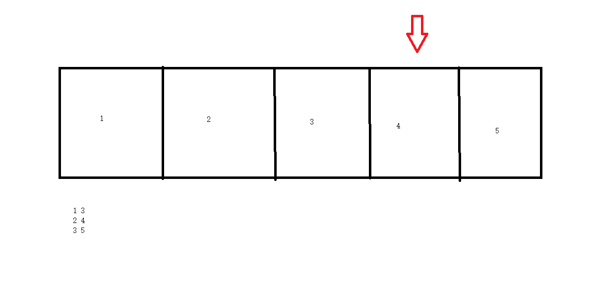

题目地址：https://leetcode-cn.com/problems/remove-nth-node-from-end-of-list/

## 题目描述：

> 给你一个链表，删除链表的倒数第 `n` 个结点，并且返回链表的头结点。
>
> **进阶：**你能尝试使用一趟扫描实现吗？
>
> 示例 1：
>
>
> 输入：head = [1,2,3,4,5], n = 2
> 输出：[1,2,3,5]
> 示例 2：
>
> 输入：head = [1], n = 1
> 输出：[]
> 示例 3：
>
> 输入：head = [1,2], n = 1
> 输出：[1]
>
>
> 提示：
>
> 链表中结点的数目为 sz
> 1 <= sz <= 30
> 0 <= Node.val <= 100
> 1 <= n <= sz

## 题解：

因为题目要求使用一趟扫描，我们很容易想到使用双指针来进行解题。



假设我们要求倒数第2个，为了不保存过多的数据，当后面的指针到空的时候，前一个指针正好落在3的位置，此时它的下一个元素就是我们眼删除的。即：13,24,35  我们用count记录前一个指针走的步数。当count大于n时前指针开始移动。

特殊情况 ：

n 大于链表的长度，此时不需要删除元素

n等于链表长度，此时需要删除的是头结点

参考代码：

```java
 public ListNode removeNthFromEnd(ListNode head, int n) {
        if(head == null){
            return null;
        }
        ListNode h = head;
        ListNode pre = head;
        int count = 0;
        while (pre!=null){
            if(count>n){
                h = h.next;
            }
            pre = pre.next;
            count++;
        }
        if(count>n){//已经走动需要删除
            ListNode temp = h.next;
            h.next = temp.next;
        }else if(count == n){//要删除的是头指针
            head = h.next;
        }
        return head;
    }
```

