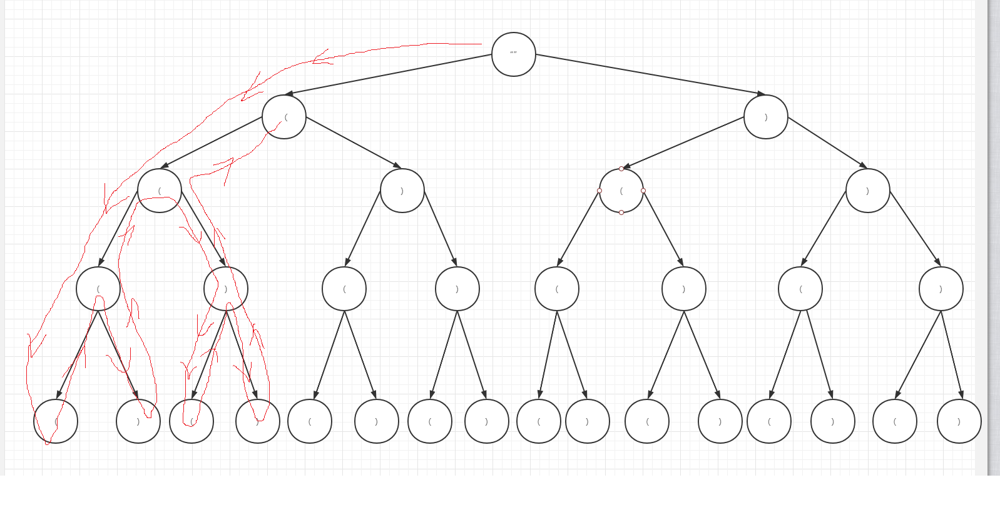

# 题目：括号生成

地址：https://leetcode-cn.com/problems/generate-parentheses/

题目描述：

> 字 n 代表生成括号的对数，请你设计一个函数，用于能够生成所有可能的并且 有效的 括号组合。
>
>  
>
> 示例 1：
>
> 输入：n = 3
> 输出：["((()))","(()())","(())()","()(())","()()()"]
> 示例 2：
>
> 输入：n = 1
> 输出：["()"]
>
>
> 提示：
>
> 1 <= n <= 8


# 解题：

这个题目有点类似于我们前面刷过的 17题 电话号码的字母组合 。将它看做一棵树。每一次都有两种选择。



当n=2的时候，就为上图所示情况，2对共有4个字符，所有的组成情况就是上面 2^4 = 16中可能，但是要满足括号成对出现需要满足下面的条件

1. 左括号出现次数不能超过n的个数
2. 每一次右括号的总个数不能多于左括号 即小于等于 


回溯代码：

从上面的图片我们可以看出整个代码的运行思路是，回溯（参考红线的流转方向），先遍历到最后一步，最后依赖于前面的选择，当最后一步执行完成后，回到上一步，进行其它的选择。

```java
public List<String> generateParenthesis(int n) {
        List<String> ans = new ArrayList<String>();
        backtrack(ans, new StringBuilder(), 0, 0, n);
        return ans;
    }

    public void backtrack(List<String> ans, StringBuilder cur, int open, int close, int max) {
        if (cur.length() == max * 2) {
            ans.add(cur.toString());
            return;
        }
        if (open < max) {//左括号还能出现
            cur.append('(');
            backtrack(ans, cur, open + 1, close, max);
            cur.deleteCharAt(cur.length() - 1);
        }
        if (close < open) {//追加右括号
            cur.append(')');
            backtrack(ans, cur, open, close + 1, max);
            cur.deleteCharAt(cur.length() - 1);
        }
    }
```

同这两次刷题我们发现回溯与二叉树的后续遍历，图的深度优先搜索非常的相似。同时这个题目的运行逻辑同动态规划也有想通的地方。后续依赖前面，这个题目是不是也可以做同样的思考，将每一次循环的所有可能保存起来，边界条件是运行到最后  左括号个数大于n 右括号个数大于左括号。但是我们该如何选择对应的方法呢？